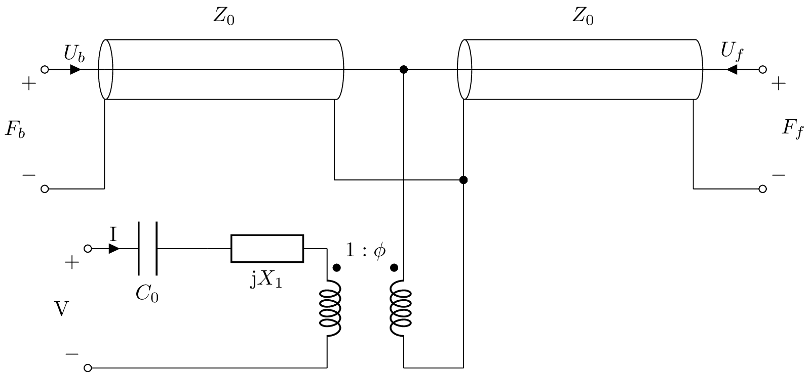
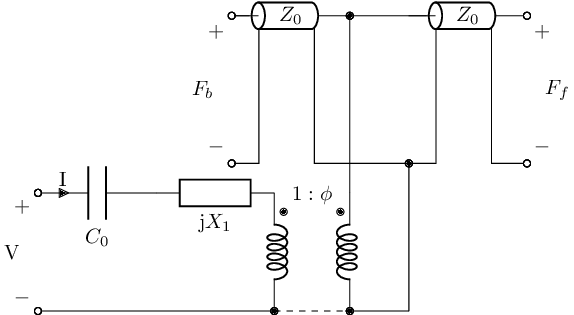
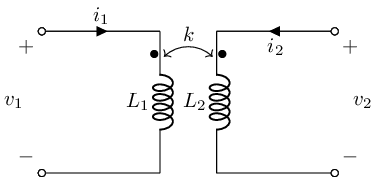
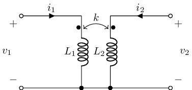
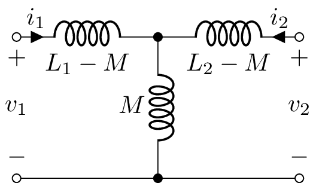
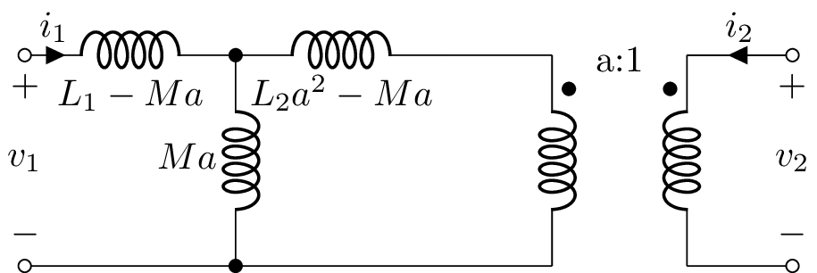
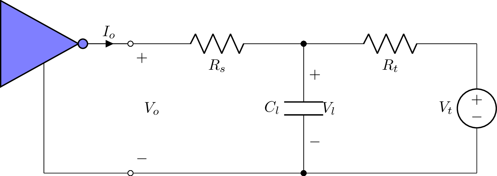

=========================
Advanced circuit analysis
=========================

Transmission lines
==================

A lossless transmission line with characteristic impedance
:math:`Z_0`, speed of propagation :math:`c`, and length :math:`l`
driven by a step voltage :math:`V_s` through a resistance :math:`R_s`,
and loaded with a resistance :math:`R_l` can be defined as:

.. literalinclude:: examples/tutorials/txline/txline1.sch

Lcapy can draw this using:

   >>> from lcapy import Circuit, s, t
   >>> a = Circuit('txline1.sch')
   >>> a.draw()

The driving-point impedance looking into the start of the transmission line is:

   >>> a.P1.dpZ
                      ⎛       ⎛l⋅s⎞          ⎛l⋅s⎞⎞
                Rₛ⋅Z₀⋅⎜Rₗ⋅cosh⎜───⎟ + Z₀⋅sinh⎜───⎟⎟
                      ⎝       ⎝ c ⎠          ⎝ c ⎠⎠
   ───────────────────────────────────────────────────────────────────
             ⎛l⋅s⎞             ⎛l⋅s⎞             ⎛l⋅s⎞     2     ⎛l⋅s⎞
   Rₗ⋅Rₛ⋅sinh⎜───⎟ + Rₗ⋅Z₀⋅cosh⎜───⎟ + Rₛ⋅Z₀⋅cosh⎜───⎟ + Z₀ ⋅sinh⎜───⎟
             ⎝ c ⎠             ⎝ c ⎠             ⎝ c ⎠           ⎝ c ⎠

Similarly, the driving-point impedance looking into the end of the transmission line is:

   >>> a.P2.dpZ
                         ⎛       ⎛l⋅s⎞          ⎛l⋅s⎞⎞
                   Rₗ⋅Z₀⋅⎜Rₛ⋅cosh⎜───⎟ + Z₀⋅sinh⎜───⎟⎟
                         ⎝       ⎝ c ⎠          ⎝ c ⎠⎠
   ───────────────────────────────────────────────────────────────────
             ⎛l⋅s⎞             ⎛l⋅s⎞             ⎛l⋅s⎞     2     ⎛l⋅s⎞
   Rₗ⋅Rₛ⋅sinh⎜───⎟ + Rₗ⋅Z₀⋅cosh⎜───⎟ + Rₛ⋅Z₀⋅cosh⎜───⎟ + Z₀ ⋅sinh⎜───⎟
             ⎝ c ⎠             ⎝ c ⎠             ⎝ c ⎠           ⎝ c ⎠

The Laplace domain voltage across the input of the transmission line is

   >>> a.P1.V(s)
                           ⎛       ⎛l⋅s⎞          ⎛l⋅s⎞⎞
                     Vₛ⋅Z₀⋅⎜Rₗ⋅cosh⎜───⎟ + Z₀⋅sinh⎜───⎟⎟
                           ⎝       ⎝ c ⎠          ⎝ c ⎠⎠
   ───────────────────────────────────────────────────────────────────────
     ⎛          ⎛l⋅s⎞             ⎛l⋅s⎞             ⎛l⋅s⎞     2     ⎛l⋅s⎞⎞
   s⋅⎜Rₗ⋅Rₛ⋅sinh⎜───⎟ + Rₗ⋅Z₀⋅cosh⎜───⎟ + Rₛ⋅Z₀⋅cosh⎜───⎟ + Z₀ ⋅sinh⎜───⎟⎟
     ⎝          ⎝ c ⎠             ⎝ c ⎠             ⎝ c ⎠           ⎝ c ⎠⎠

and the Laplace domain voltage across the output of the transmission line is

   >>> a.P2.V(s)
                                  Rₗ⋅Vₛ⋅Z₀
   ───────────────────────────────────────────────────────────────────────
     ⎛          ⎛l⋅s⎞             ⎛l⋅s⎞             ⎛l⋅s⎞     2     ⎛l⋅s⎞⎞
   s⋅⎜Rₗ⋅Rₛ⋅sinh⎜───⎟ + Rₗ⋅Z₀⋅cosh⎜───⎟ + Rₛ⋅Z₀⋅cosh⎜───⎟ + Z₀ ⋅sinh⎜───⎟⎟
     ⎝          ⎝ c ⎠             ⎝ c ⎠             ⎝ c ⎠           ⎝ c ⎠⎠

Since the transmission line is lossless, the transient response has an infinite number of reflections.  At the end of the transmission line

    >>> a.P2.V(t)
               ∞
             _____
             ╲
              ╲                                 m
               ╲   ⎛                          2⎞
                ╲  ⎜Rₗ⋅Rₛ - Rₗ⋅Z₀ - Rₛ⋅Z₀ + Z₀ ⎟   ⎛    l⋅(2⋅m + 1)⎞
    Rₗ⋅Vₛ⋅Z₀⋅   ╱  ⎜───────────────────────────⎟ ⋅u⎜t - ───────────⎟
               ╱   ⎜                          2⎟   ⎝         c     ⎠
              ╱    ⎝Rₗ⋅Rₛ + Rₗ⋅Z₀ + Rₛ⋅Z₀ + Z₀ ⎠
             ╱
             ‾‾‾‾‾
            m = 0
    ────────────────────────────────────────────────────────────────
                                                2
                      Rₗ⋅Rₛ + Rₗ⋅Z₀ + Rₛ⋅Z₀ + Z₀

The transient response at the start of the transmission line can be found in a similar way but is too long to show here.

If the transmission line is terminated at the load with its characteristic impedance:

   >>> b = a.subs({'Rl':'Z0'})
   >>> b.P1.V(s)
   ⎛ Vₛ⋅Z₀ ⎞
   ⎜───────⎟
   ⎝Rₛ + Z₀⎠
   ─────────
       s
   >>> b.P1.V(t)
   Vₛ⋅Z₀⋅u(t)
   ──────────
    Rₛ + Z₀
   >>> b.P2.V(s)
                                  Vₛ⋅Z₀
   ─────────────────────────────────────────────────────────────
     ⎛       ⎛l⋅s⎞          ⎛l⋅s⎞          ⎛l⋅s⎞          ⎛l⋅s⎞⎞
   s⋅⎜Rₛ⋅sinh⎜───⎟ + Rₛ⋅cosh⎜───⎟ + Z₀⋅sinh⎜───⎟ + Z₀⋅cosh⎜───⎟⎟
     ⎝       ⎝ c ⎠          ⎝ c ⎠          ⎝ c ⎠          ⎝ c ⎠⎠
   >>> b.P2.V(t)
          ⎛    l⎞
   Vₛ⋅Z₀⋅u⎜t - ─⎟
          ⎝    c⎠
   ──────────────
      Rₛ + Z₀

If the transmission line is terminated at the source with its characteristic impedance:

   >>> c = a.subs({'Rs':'Z0'})
   >>> c.P1.V(s)
                     ⎛       ⎛l⋅s⎞          ⎛l⋅s⎞⎞
                  Vₛ⋅⎜Rₗ⋅cosh⎜───⎟ + Z₀⋅sinh⎜───⎟⎟
                     ⎝       ⎝ c ⎠          ⎝ c ⎠⎠
   ─────────────────────────────────────────────────────────────
     ⎛       ⎛l⋅s⎞          ⎛l⋅s⎞          ⎛l⋅s⎞          ⎛l⋅s⎞⎞
   s⋅⎜Rₗ⋅sinh⎜───⎟ + Rₗ⋅cosh⎜───⎟ + Z₀⋅sinh⎜───⎟ + Z₀⋅cosh⎜───⎟⎟
     ⎝       ⎝ c ⎠          ⎝ c ⎠          ⎝ c ⎠          ⎝ c ⎠⎠
   >>> c.P1.V(t)
      ⎛    2     2⎞ ⎛u(t)    ⎛    2⋅l⋅m⎞⎞
   Vₛ⋅⎝- Rₗ  + Z₀ ⎠⋅⎜──── + u⎜t - ─────⎟⎟
                    ⎝ 2      ⎝      c  ⎠⎠
   ──────────────────────────────────────
        -Rₗ⋅(Rₗ + Z₀) + Z₀⋅(Rₗ + Z₀)
   >>> c.P1.V(t).simplify()
      ⎛u(t)    ⎛    2⋅l⋅m⎞⎞
   Vₛ⋅⎜──── + u⎜t - ─────⎟⎟
      ⎝ 2      ⎝      c  ⎠⎠
   >>> c.P2.V(s)
                               Rₗ⋅Vₛ
   ─────────────────────────────────────────────────────────────
     ⎛       ⎛l⋅s⎞          ⎛l⋅s⎞          ⎛l⋅s⎞          ⎛l⋅s⎞⎞
   s⋅⎜Rₗ⋅sinh⎜───⎟ + Rₗ⋅cosh⎜───⎟ + Z₀⋅sinh⎜───⎟ + Z₀⋅cosh⎜───⎟⎟
     ⎝       ⎝ c ⎠          ⎝ c ⎠          ⎝ c ⎠          ⎝ c ⎠⎠
   >>> c.P2.V(t)
          ⎛    l⎞
   Rₗ⋅Vₛ⋅u⎜t - ─⎟
          ⎝    c⎠
   ──────────────
      Rₗ + Z₀

In this case, there is a single reflection.

Piezoelectric transducers
=========================

A piezoelectric transducer can be modelled with the KLM model.  This
can be described with the following netlist:

.. literalinclude:: examples/tutorials/transducers/KLM2.sch

Lcapy can draw this using:

   >>> from lcapy import Circuit, s, t
   >>> a = Circuit('KLM2.sch')
   >>> a.draw()

In the Laplace domain, the transformer coupling ratio is

:math:`\phi = \frac{s Z_0}{2 h} \frac{1}{\sinh\left(\frac{s d}{2 c}\right)}`,

the impedance of `X1` is

:math:`X_1 = \frac{j h^2}{s^2 Z_0} \sinh\left(\frac{s d}{c}\right)`,

and

:math:`C_0 = \frac{\epsilon^{S} A}{d}`,

where :math:`Z_0` is the characteristic impedance of the piezoelectric
crystal, :math:`h` is the pressure constant of the crystal, :math:`d`
is the thickness of the crystal, and :math:`\epsilon^{S}` is the
clamped (zero strain,high frequency) permittivity of the crystal.

The model has three ports: an electrical port, a back mechanical port,
and a front mechanical port.

The above netlist is not suitable for simulation since the
transmission lines are represented with cables; Lcapy treats them as
ideal wires.  Instead transmission line components are required as in
the following netlist:

.. literalinclude:: examples/tutorials/transducers/KLM3.sch

This is drawn as

Let's consider finding the ratio of the force across the front
mechanical port given an applied voltage across the electrical port
with the back mechanical port free.  With the back port free,
there is no force across it.  This can be asserted by applying a
short-circuit across `Pb`.  For example,

   >>> from lcapy import Circuit
   >>> a = Circuit('KLM-demo.sch')
   >>> a.short_circuit('Pb')

The ratio of the mechanical force to an applied voltage can be found
using the `voltage_gain()` method of the circuit:

   >>> H = a.voltage_gain('Pe', 'Pf')
                                                     ⎛d⋅s⎞
                                  -2⋅ⅉ⋅C₀⋅Z₀⋅φ⋅s⋅sinh⎜───⎟
                                                     ⎝2⋅c⎠
   ───────────────────────────────────────────────────────────────────────────────────────
            2       2⎛d⋅s⎞            2       ⎛            ⎛d⋅s⎞      2     2⎛d⋅s⎞      2⎞
   4⋅C₀⋅X₁⋅φ ⋅s⋅sinh ⎜───⎟ + 2⋅C₀⋅X₁⋅φ ⋅s - ⅉ⋅⎜C₀⋅Z₀⋅s⋅sinh⎜───⎟ + 4⋅φ ⋅sinh ⎜───⎟ + 2⋅φ ⎟
                     ⎝2⋅c⎠                    ⎝            ⎝ c ⎠             ⎝2⋅c⎠       ⎠

The frequency response can be found by substituting :math:`j 2 \pi f` for :math:`s`.

Transformers
============

The Lcapy `TF` component represents an ideal transformer.  Indeed it
operates at DC!

To model a real transformer, a pair of magnetically coupled inductors
is required.  The coupling is specified by the `K` component.  This
has three arguments: the names of two inductors and a coupling
coefficient `k`.   The mutual inductance of the two inductors is:

:math:`M = k \sqrt{L_1 L_2}`.

The inductances are related by the number of turns by:

:math:`L = \frac{N}{\mathcal{R}}`

where :math:`\mathcal{R}` is the reluctance.  If both inductors have a similar reluctance:

:math:`\frac{N_1}{N_2} = \sqrt{\frac{L_1}{L_2}}`

Note, this is an approximation and depends on the inductor geometry and the cores.

The equations for a pair of coupled inductors is

:math:`v_1(t) = L_1 \frac{\mathrm{d}}{\mathrm{d} t} i_1(t) + M \frac{\mathrm{d}}{\mathrm{d} t} i_2(t)`

:math:`v_2(t) = M \frac{\mathrm{d}}{\mathrm{d} t} i_1(t) + L_2 \frac{\mathrm{d}}{\mathrm{d} t} i_2(t)`

where :math:`M` is the mutual inductance.  This circuit can be
described in Lcapy with the netlist:

.. literalinclude:: examples/tutorials/transformers/mutualinductances1.sch

However, it cannot be analysed since the secondary has no reference to
the primary.  One approach is to couple the primary and secondary
circuits with a resistor and consider the result in the limit as the
resistor is made infinite.  There is no problem if the primary and
secondary share a common ground as in the figure below:

A transformer with a common ground for the primary and secondary can be
represented by a tee-model without having to use a coupling `K`
component.  In this case, the voltages can be expressed in terms of
the currents using:

:math:`v_1(t) = \left(L_1 - M\right) \frac{\mathrm{d}}{\mathrm{d} t} i_1(t) + M \frac{\mathrm{d}}{\mathrm{d} t} \left(i_1 - i_2(t)\right)`

:math:`v_2(t) = M \frac{\mathrm{d}}{\mathrm{d} t} \left(i_1(t) - i_2(t)\right) + \left(L_2 - M\right) \frac{\mathrm{d}}{\mathrm{d} t} i_2(t)`

Here :math:`L_1` is the primary magnetising inductance, :math:`L_2` is
the secondary magnetising inductance, :math:`L_1 - M` is the primary
leakage inductance, and :math:`L_2 - M` is the secondary leakage
inductance.  These equations correspond to the following circuit:

Sometimes a transformer is modelled around an ideal transformer with turns ratio :math:`a = N_1 / N_2` as per the following circuit:

.. image:: examples/tutorials/transformers/tee-model-transformer2.png
   :width: 12cm

Sometimes the secondary leakage inductance is referred to the primary:

Non-linear analysis using state-space
=====================================

Let's consider the step-response of a CMOS device switching from low
to high.  In the circuit below, the capacitance `Cl` denotes a
capacitive load, say the input of another CMOS device, `Rs` is a
series resistance, say to control the rise-time', and `Vt` and `Rt`
comprise a Thevenin load, say due to a pull-up resistor.

Using an IBIS output model to model the parasitic components, the
equivalent circuit is:

.. image:: examples/tutorials/nonlinear/cmos_ibis_R_series_C_load_thevenin.png
   :width: 14cm

In this model, the CMOS output is modelled as a voltage dependent
current-source, :math:`I_o(V_o)`.   The netlist is:

.. literalinclude:: examples/tutorials/nonlinear/cmos_ibis_R_series_C_load_thevenin.sch

Using this netlist, a state-space model can be created:

   >>> from lcapy import Circuit
   >>> cct = Circuit('cmos_ibis_R_series_C_load_thevenin.sch')
   >>> ss = cct.state_space(node_voltages=(1, 5), branch_currents=())

Here the outputs are the node voltages 1 and 5 corresponding to the
output voltage :math:`V_o` and the load voltage :math:`V_l` across
`Cl`.  The state vector is

   >>> ss.x
   ⎡i_Lpkg(t) ⎤
   ⎢          ⎥
   ⎢v_Ccomp(t)⎥
   ⎢          ⎥
   ⎢v_Cpkg(t) ⎥
   ⎢          ⎥
   ⎣ v_Cl(t)  ⎦

the input vector is

   >>> ss.u
   ⎡Vₜ⎤
   ⎢  ⎥
   ⎣Iₒ⎦

the output vector is

   >>> ss.y
   ⎡v₁(t)⎤
   ⎢     ⎥
   ⎣v₅(t)⎦

and the system matrices are

   >>> ss.A
   ⎡-R_pkg     1      -1                     ⎤
   ⎢───────  ─────   ─────           0       ⎥
   ⎢ L_pkg   L_pkg   L_pkg                   ⎥
   ⎢                                         ⎥
   ⎢ -1                                      ⎥
   ⎢──────     0       0             0       ⎥
   ⎢C_comp                                   ⎥
   ⎢                                         ⎥
   ⎢   1              -1            1        ⎥
   ⎢ ─────     0    ────────     ────────    ⎥
   ⎢ C_pkg          C_pkg⋅Rₛ     C_pkg⋅Rₛ    ⎥
   ⎢                                         ⎥
   ⎢                   1          1       1  ⎥
   ⎢   0       0     ─────    - ───── - ─────⎥
   ⎣                 Cₗ⋅Rₛ      Cₗ⋅Rₜ   Cₗ⋅Rₛ⎦

   >>> ss.B
   ⎡  0      0   ⎤
   ⎢             ⎥
   ⎢         1   ⎥
   ⎢  0    ──────⎥
   ⎢       C_comp⎥
   ⎢             ⎥
   ⎢  0      0   ⎥
   ⎢             ⎥
   ⎢  1          ⎥
   ⎢─────    0   ⎥
   ⎣Cₗ⋅Rₜ        ⎦

   >>> ss.C
   ⎡0  1  0  0⎤
   ⎢          ⎥
   ⎣0  0  0  1⎦

   >>> ss.D
   ⎡0  0⎤
   ⎢    ⎥
   ⎣0  0⎦

Since the CMOS device is non-linear, there is no analytic solution and a numerical solution is required.  This can be achieved using the SciPy `ivp_solve` function.

   >>> A = array(((-Rpkg / Lpkg, 1 / Lpkg, -1 / Lpkg, 0),
                  (-1 / Ccomp, 0, 0, 0),
                  (1 / Cpkg, 0, -1 / (Cpkg * Rs), 1 / (Cpkg * Rs)),
                  (0, 0, 1 / (CL * Rs), -1 / (CL * Rs) - 1 / (CL * Rt))))
   >>> B = array(((0, 0),
                  (0, 1 / Ccomp),
                  (0, 0),
                  (1 / (CL * Rt), 0)))
   >>> C = array(((0, 1, 0, 0),
                  (0, 0, 0, 1)))
   >>> D = array(((0, 0),
                  (0, 0)))
   >>>
   >>> def func(t, x):
   >>>    y = dot(C, x)
   >>>    Vo = y[0]
   >>>    Vl = y[1]
   >>>    Io = lookup_Io(Vo)
   >>>    u = array((Vt, Io))
   >>>    xdot = dot(A, x) + dot(B, u)
   >>>    return xdot
   >>>
   >>> ret = solve_ivp(func, [t[0], t[-1]], [0, 0, 0, 0], t_eval=t)
   >>>
   >>> Vl = ret.y[3].squeeze()

In this snippet of code, the line `lookup_Io(Vo)` determines the output current for a specific output voltage, say by interpolating a lookup table.

Note, `solve_ivp` can choose a poor initial step for this circuit.  A
work-around is to scale the capacitances, inductances, and time.
