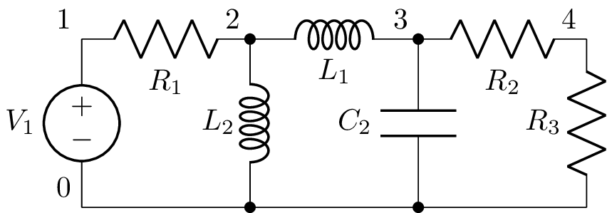
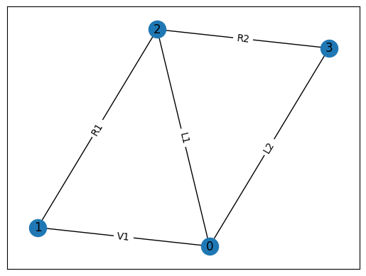
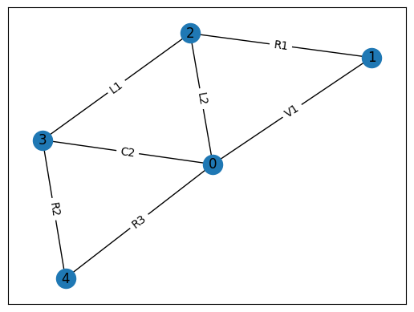
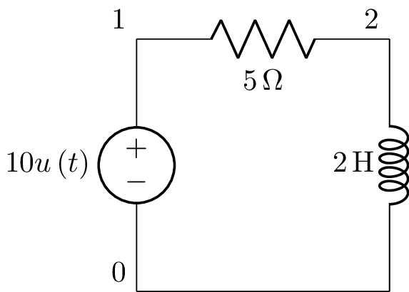
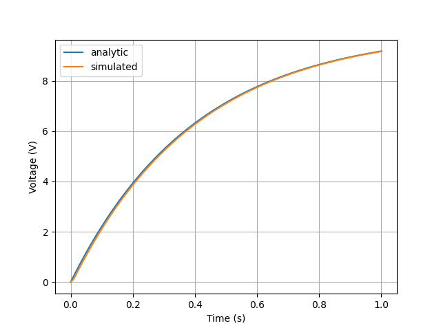

================
Circuit analysis
================

Introduction
============

Lcapy can only analyse linear time invariant (LTI) circuits, this
includes both passive and active circuits.  Time invariance means that
the circuit parameters cannot change with time; i.e., capacitors
cannot change value with time.  It also means that the circuit
configuration cannot change with time, i.e., contain switches
(although switching problems can be analysed, see
:ref:`switching-analysis`).

Linearity means that superposition applies---if you double the voltage
of a source, the current (anywhere in the circuit) due to that source
will also double.  This restriction rules out components such as
diodes and transistors that have a non-linear relationship between
current and voltage (except in circumstances where the relationship
can be approximated as linear around some constant value---small
signal analysis).  Linearity also rules out capacitors where the
capacitance varies with voltage and inductors with hysteresis.

Networks and netlists
=====================

Lcapy circuits can be created using a netlist specification (see
:ref:`netlists`) or by combinations of components (see
:ref:`networks`).  For example, here are two ways to create the same
circuit:

   >>> cct1 = (Vstep(10) + R(1)) | C(2)

   >>> cct2 = Circuit()
   >>> cct2.add('V1 1 0 step 10')
   >>> cct2.add('R1 1 2 1')
   >>> cct2.add('C1 2 0 2')

The two approaches have many attributes and methods in common.  For example,

   >>> cct1.is_causal
   True
   >>> cct2.is_causal
   True
   >>> cct1.is_dc
   False
   >>> cct2.is_dc
   False

However, there are subtle differences.  For example,

   >>> cct1.Voc.laplace()
      5   
   ──────
    2   s
   s  + ─
        2

   >>> cct2.Voc(2, 0).laplace()
      5   
   ──────
    2   s
   s  + ─
        2

Notice, the second example requires specific nodes to determine the
open-circuit voltage across.  The advantage of the netlist approach is
that component names can be used, for example,

   >>> cct2.V1.V.laplace()
      5   
   ──────
    2   s
   s  + ─
        2

Linear circuit analysis
=======================

The voltages and currents in a circuit can be found by applying
Kirchhoff's current and voltage laws in conjunction with the
relationships between voltage and current for resistors, capacitors,
and inductors.  However, this leads to a system of simultaneous
integro-differential equations to solve.  This is not fun!

If the system is linear, superposition can be applied to consider the
effect of each independent current and voltage source in isolation and
summing the results.  Furthermore, differential equations are not
required for DC signals and can be avoided by using transform
techniques (phasor analysis for AC signals and Laplace analysis for
transient signals).  Thus for each domain, the voltages and currents
can be found by solving a system of linear equations.

Lcapy's algorithm for solving a circuit is:

1. If a capacitor or inductor is found to have initial conditions, then the circuit is analysed as an initial value problem using Laplace methods.  In this case, the sources are ignored for :math:`t<0` and the result is only known for :math:`t\ge 0`.
   
2. If there are no capacitors and inductors and if none of the independent sources are specified in the Laplace domain, then time-domain analysis is performed (since no derivatives or integrals are required).
   
3. Finally, Lcapy tries to decompose the sources into DC, AC, transient, and noise components.  The circuit is analysed for each source category using the appropriate transform domain (phasors for AC, Laplace domain for transients) and the results are added.  If there are multiple noise sources, these are considered independently since they are assumed to be uncorrelated.  

The method that Lcapy uses can be found using the `describe()` method.   For example,

   >>> cct = Circuit("""
   ... V1 1 0 {1 + u(t)}
   ... R1 1 2
   ... L1 2 0""")
   >>> cct.describe()
   This is solved using superposition.
   DC analysis is used for source V1.
   Laplace analysis is used for source V1.

   >>> cct = Circuit("""
   ... V1 1 0 {1 + u(t)}
   ... R1 1 2
   ... V2 2 0 ac""")
   >>> cct.describe()
   This is solved using superposition.
   Time-domain analysis is used for source V1.
   Phasor analysis is used for source V2.

   

DC analysis
-----------

The simplest special case is for a DC independent source.  DC is an
idealised concept---it impossible to generate---but is a good
approximation for very slowly changing sources.  With a DC independent
source the dependent sources are also DC and thus no voltages or
currents change.  Thus capacitors can be replaced with open-circuits
and inductors can be replaced with short-circuits.  Note, each node
must have a DC path to ground otherwise the circuit cannot be solved
(for example, when capacitors are in series).

AC (phasor) analysis
--------------------

AC, like DC, is an idealised concept.  It allows circuits to be
analysed using phasors and impedances.  The use of impedances avoids
solving integro-differential equations in the time domain.

Transient (Laplace) analysis
----------------------------

The response due to a transient excitation from an independent source
can be analysed using Laplace analysis.  Since the unilateral
transform is not unique (it ignores the circuit behaviour for :math:`t
< 0`), the response can only be determined for :math:`t \ge 0`.

If the independent sources are known to be causal (a causal signal is
zero for :math:`t < 0` analogous to a causal impulse response) and the
initial conditions (i.e., the voltages across capacitors and currents
through inductors) are zero, then the response is 0 for :math:`t < 0`.
Thus in this case, the response can be specified for all :math:`t`.

The response due to a general non-causal excitation is hard to
determine using Laplace analysis.  One strategy is to use circuit
analysis techniques to determine the response for :math:`t < 0`,
compute the pre-initial conditions, and then use Laplace analysis to
determine the response for :math:`t \ge 0`.  Note, the pre-initial
conditions at :math:`t = 0_{-}` are required.  These differ from the
initial conditions at :math:`t = 0` whenever a Dirac delta (or its
derivative) excitation is considered.  Determining the initial
conditions is not straightforward for arbitrary excitations and at the
moment Lcapy expects you to do this!

The use of pre-initial conditions also allows switching circuits to be
considered (see :ref:`switching-analysis`).  In this case the
independent sources are ignored for :math:`t < 0` and the result is
only known for :math:`t \ge 0`.

Note if any of the pre-initial conditions are non-zero and the
independent sources are causal then either we have an initial value
problem or a mistake has been made.  Lcapy assumes that if any of the
inductors and capacitors have explicit initial conditions, then the
circuit is to be analysed as an initial value problem with the
independent sources ignored for :math:`t \ge 0`.  In this case a DC
source is not DC since it is considered to switch on at :math:`t = 0`.

.. _switching-analysis:

Switching analysis
------------------

Whenever a circuit has a switch it is time variant.  The opening or
closing of the switch changes the circuit and can produce transients.
While a switch violates the time-invariance requirements for linear
circuit analysis, the circuit prior to the switch changing can be
analysed and used to determine the initial conditions for the circuit
after the switched changed.  Lcapy can help automate this with the
`initialize()` method.  For example,
      
   >>> from lcapy import *
   >>> a1 = Circuit("""
   ... V 1 0 dc; down
   ... R 1 2; right
   ... C 2 0_2; down
   ... W 0 0_2; right
   ... """)
   >>> a2 = Circuit("""
   ... V 1 0 step; down
   ... R 1 2; right
   ... C 2 0_2 C; down
   ... W 0 0_2; right
   ... W 2 3; right
   ... L 3 0_3; down
   ... W 0_2 0_3; right
   ... """)
   >>> t1 = expr('t1', positive=True)
   >>> a2i = a2.initialize(a1, t1)
   >>> a2i
   V 1 0 dc; down
   R 1 2; right
   C 2 0_2 C {V*(C*R - C*R*exp(-t1/(C*R)))/(C*R)}; down
   W 0 0_2; right
   W 2 3; right
   L 3 0_3; down
   W 0_2 0_3; right

In this example, the circuit defined as `a1` changes to the circuit
defined as `a2` at the instant `t1`.  The `initialize()` method adds
the initial values for `a2` based on the values from `a1` at `t1`.  In
this case the capacitor `C` is initialized with the corresponding
capacitor voltage for the circuit `a1` at time `t1`.  Note, it is
assumed that `t1` is a valid time for the results of circuit `a1`.

Noise analysis
--------------

Each noise source is assigned a noise identifier (nid), see :ref:`noisesignals`.  Noise
expressions with different nids are assumed to be independent and thus
represent different noise realisations.

Lcapy analyses the circuit for each noise realisation independently
and stores the result for each realisation separately.  For example,

   >>> a = Circuit()
   >>> a.add('Vn1 1 0 noise 3')
   >>> a.add('Vn2 2 1 noise 4')
   >>> a[2].V
   {n1: 3, n2: 4}
   >>> a[1].V
   {n1: 3}
   >>> a[2].V - a[1].V
   {n1: 0, n2: 4}
   >>> a[2].V.n
   5

Notice that the `.n` attribute returns the total noise found by adding
each noise component in quadrature, i.e., :math:`\sqrt{3^2 + 4^2},`
since the noise components have different nids and are thus
independent.

Each resistor in a circuit can be converted into a series combination
of an ideal resistor and a noise voltage source using the
`noise_model` method.

.. _mesh-analysis:

Mesh analysis
-------------

Lcapy can output the mesh equations by applying Kirchhoff's voltage
law around each loop in a circuit.  For example, consider the netlist:

   >>> cct = Circuit("""
   ...V1 1 0; down
   ...R1 1 2; right
   ...L1 2 3; right
   ...R2 3 4; right
   ...L2 2 0_2; down
   ...C2 3 0_3; down
   ...R3 4 0_4; down
   ...W 0 0_2; right
   ...W 0_2 0_3; right
   ...W 0_3 0_4; right""")
   >>> cct.draw()

           
The mesh equations are found using::           
   
   >>> l = LoopAnalysis(cct)
   >>> l.mesh_equations()
   ⎧                                              t                                                                                 
   ⎪                                              ⌠                                                                                 
   ⎪                                              ⎮  (-i₁(τ) + i₃(τ)) dτ                                                            
   ⎨                                              ⌡                                                                                 
   ⎪          d               d                   -∞                                   
   ⎪i₁(t): L₁⋅──(-i₁(t)) + L₂⋅──(i₁(t) - i₂(t)) + ────────────────────── = 0,
   ⎩          dt              dt                            C₂               
              d
    i₂(t): L₂⋅──(i₁(t) - i₂(t)) - R₁⋅i₂(t) + v₁(t) = 0,
              dt
                                   t                                                                                 
                                  ⌠                         ⎪
                                  ⎮  (-i₁(τ) + i₃(τ)) dτ    ⎪
                                  ⌡                         ⎬
                                  -∞                        ⎪
    i₃(t): -R₂⋅i₃(t) - R₃⋅i₃(t) + ────────────────────── = 0⎪
                                      C₂                    ⎭

Note, the dictionary is keyed by the mesh current.

The mesh equations can be formulated in the s-domain using:

   >>> l = LoopAnalysis(cct.laplace())
   >>> l.mesh_equations()
   ⎧                              I₁(s) - I₂(s)                                                  I₁(s) - I₂(s)                                               1    ⎫
   ⎨I₁(s): -R₂⋅I₁(s) - R₃⋅I₁(s) + ───────────── = 0, I₂(s): -L₁⋅s⋅I₂(s) + L₂⋅s⋅(I₂(s) - I₃(s)) + ───────────── = 0, I₃(s): L₂⋅s⋅(I₂(s) - I₃(s)) - R₁⋅I₃(s) + ─ = 0⎬
   ⎩                                   C₂⋅s                                                           C₂⋅s                                                   s    ⎭

The system of equations can be formulated in matrix form as :math:`\mathbf{A} \mathbf{y} = \mathbf{b}` using::

   >>> l.matrix_equations(form='A y = b')
   ⎡      R₁                                     ⎤             
   ⎢-L₂ - ──          0                 L₂       ⎥             
   ⎢      s                                      ⎥             
   ⎢                                             ⎥        ⎡-1 ⎤
   ⎢            R₂   R₃     1          -1        ⎥ ⎡I₁⎤   ⎢───⎥
   ⎢   0      - ── - ── + ─────       ─────      ⎥ ⎢  ⎥   ⎢ s ⎥
   ⎢            s    s        2           2      ⎥⋅⎢I₂⎥ = ⎢   ⎥
   ⎢                      C₂⋅s        C₂⋅s       ⎥ ⎢  ⎥   ⎢ 0 ⎥
   ⎢                                             ⎥ ⎣I₃⎦   ⎢   ⎥
   ⎢                  1                       1  ⎥        ⎣ 0 ⎦
   ⎢  -L₂           ─────        -L₁ + L₂ - ─────⎥             
   ⎢                    2                       2⎥             
   ⎣                C₂⋅s                    C₂⋅s ⎦   

There are a number of forms that the system of equations can be shown: `y = Ainv b`, `Ainv b = y`, `A y = b`, and `b = A y`.  The `invert` argument calculates the inverse of the `A` matrix.
   
The matrix is returned by the `A` attribute, the vector of unknowns by the `y` attribute, and the result vector by the `b` attribute.   

.. _nodal-analysis:

Nodal analysis
--------------

Lcapy can output the nodal equations by applying Kirchhoff's current
law at each node in a circuit.  For example, consider the netlist:

   >>> cct = Circuit("""
   ...V1 1 0 {u(t)}; down
   ...R1 1 2; right
   ...L1 2 3; right
   ...R2 3 4; right
   ...L2 2 0_2; down
   ...C2 3 0_3; down
   ...R3 4 0_4; down
   ...W 0 0_2; right
   ...W 0_2 0_3; right
   ...W 0_3 0_4; right""")
   >>> cct.draw()

           
The nodal equations are found using::           
   
   >>> n = NodalAnalysis(cct)
   >>> n.nodal_equations()
   ⎧                    
   ⎪                   
   ⎪                   
   ⎨                   
   ⎪                   
   ⎪ 1: v₁(t) = u(t), 
   ⎩                   
                             t              t
                            ⌠              ⌠
                            ⎮  v₂(τ) dτ    ⎮  (v₂(τ) - v₃(τ)) dτ
                            ⌡              ⌡
         -v₁(t) + v₂(t)   -∞             -∞
     2: ──────────────── + ──────────── + ─────────────────────── = 0,
                R₁               L₂                   L₁
   
                                           t     
                                          ⌠
                                          ⎮  (-v₂(τ) + v₃(τ)) dτ     
                                          ⌡
           d            v₃(t) - v₄(t)   -∞
     3: C₂⋅──(v₃(t)) + ─────────────── + ──────────────────────── = 0, 
           dt                  R₂                  L₁                  
                        
                                      ⎫
                                      ⎪
                                      ⎪
                                      ⎬
         v₄(t)   -v₃(t) + v₄(t)       ⎪
     4: ────── + ──────────────── = 0 ⎪
          R₃            R₂            ⎭
        

Note, these are keyed by the node names.  The `node_prefix` argument
can be used with `NodalAnalysis` to resolve ambiguities with component
voltages and node voltages.

The nodal equations can be formulated in the s-domain using::

   >>> na = NodalAnalysis(cct.laplace())
   >>> na.nodal_equations()
   ⎧           1  
   ⎨1: V₁(s) = ─,
   ⎩           s
       -V₁(s) + V₂(s)   V₂(s)   V₂(s) - V₃(s)
    2: ────────────── + ───── + ───────────── = 0,
             R₁          L₂⋅s        L₁⋅s    
                    V₃(s) - V₄(s)   -V₂(s) + V₃(s)
    3: C₂⋅s⋅V₃(s) + ───────────── + ────────────── = 0,
                          R₂             L₁⋅s          
       V₄(s)   -V₃(s) + V₄(s)    ⎫
    4: ───── + ────────────── = 0⎬
         R₃          R₂          ⎭

         
The system of equations can be formulated in matrix form as :math:`\mathbf{A} \mathbf{y} = \mathbf{b}` using::

   >>> l.matrix_equations(form='A y = b')
   ⎡ 1             0                    0               0     ⎤           
   ⎢                                                          ⎥           
   ⎢-1     1       1       1           -1                     ⎥           
   ⎢────  ──── + ───── + ─────        ─────             0     ⎥        ⎡1⎤
   ⎢R₁⋅s  R₁⋅s       2       2            2                   ⎥ ⎡V₁⎤   ⎢─⎥
   ⎢             L₂⋅s    L₁⋅s         L₁⋅s                    ⎥ ⎢  ⎥   ⎢s⎥
   ⎢                                                          ⎥ ⎢V₂⎥   ⎢ ⎥
   ⎢              -1                  1       1       -1      ⎥⋅⎢  ⎥ = ⎢0⎥
   ⎢ 0           ─────          C₂ + ──── + ─────     ────    ⎥ ⎢V₃⎥   ⎢ ⎥
   ⎢                 2               R₂⋅s       2     R₂⋅s    ⎥ ⎢  ⎥   ⎢0⎥
   ⎢             L₁⋅s                       L₁⋅s              ⎥ ⎣V₄⎦   ⎢ ⎥
   ⎢                                                          ⎥        ⎣0⎦
   ⎢                                  -1            1      1  ⎥           
   ⎢ 0             0                  ────         ──── + ────⎥           
   ⎣                                  R₂⋅s         R₃⋅s   R₂⋅s⎦           

There are a number of forms that the system of equations can be shown: `y = Ainv b`, `Ainv b = y`, `A y = b`, and `b = A y`.  The `invert` argument calculates the inverse of the `A` matrix.

The matrix is returned by the `A` attribute, the vector of unknowns by the `y` attribute, and the result vector by the `b` attribute.      

.. _modified-nodal-analysis:

Modified nodal analysis
-----------------------

Here's an example with an independent source (V1) that has a DC
component and an unknown component that is considered a transient:

   >>> from lcapy import Circuit
   >>> a = Circuit("""
   ... V1 1 0 {10 + v(t)}; down
   ... R1 1 2; right
   ... L1 2 3; right=1.5, i={i_L}
   ... R2 3 0_3; down=1.5, i={i_{R2}}, v={v_{R2}}
   ... W 0 0_3; right
   ... W 3 3_a; right
   ... C1 3_a 0_4; down, i={i_C}, v={v_C}
   ... W 0_3 0_4; right""")

The corresponding circuit for DC analysis can be found using the `dc()` method:

   >>> a.dc()
   V1 1 0 dc {10}; down
   R1 1 2; right
   L1 2 3 L1; right=1.5, i={i_L}
   R2 3 0_3; i={i_{R2}}, down=1.5, v={v_{R2}}
   W 0 0_3; right
   W 3 3_a; right
   C1 3_a 0_4 C1; i={i_C}, down, v={v_C}
   W 0_3 0_4; right

The equations used to solve this can be found with the `matrix_equations()` method:

   >>> ac.dc().matrix_equations()
                                   -1     
            ⎛⎡1    -1            ⎤⎞       
            ⎜⎢──   ───  0   1  0 ⎥⎟       
            ⎜⎢R₁    R₁           ⎥⎟       
   ⎡V₁  ⎤   ⎜⎢                   ⎥⎟   ⎡0 ⎤
   ⎢    ⎥   ⎜⎢-1   1             ⎥⎟   ⎢  ⎥
   ⎢V₂  ⎥   ⎜⎢───  ──   0   0  1 ⎥⎟   ⎢0 ⎥
   ⎢    ⎥   ⎜⎢ R₁  R₁            ⎥⎟   ⎢  ⎥
   ⎢V₃  ⎥ = ⎜⎢                   ⎥⎟  ⋅⎢0 ⎥
   ⎢    ⎥   ⎜⎢          1        ⎥⎟   ⎢  ⎥
   ⎢I_V1⎥   ⎜⎢ 0    0   ──  0  -1⎥⎟   ⎢10⎥
   ⎢    ⎥   ⎜⎢          R₂       ⎥⎟   ⎢  ⎥
   ⎣I_L1⎦   ⎜⎢                   ⎥⎟   ⎣0 ⎦
            ⎜⎢ 1    0   0   0  0 ⎥⎟       
            ⎜⎢                   ⎥⎟       
            ⎝⎣ 0    1   -1  0  0 ⎦⎠       

Here `V1`, `V2`, and `V3` are the unknown node voltages for nodes 1, 2, and 3.  `I_V1` is the current through V1 and `I_L1` is the current through L1.

The equations are similar for the transient response:

   >>> a.transient().matrix_equations()
                                                -1       
               ⎛⎡1    -1                      ⎤⎞         
               ⎜⎢──   ───      0      1    0  ⎥⎟         
               ⎜⎢R₁    R₁                     ⎥⎟         
   ⎡V₁(s)  ⎤   ⎜⎢                             ⎥⎟   ⎡ 0  ⎤
   ⎢       ⎥   ⎜⎢-1   1                       ⎥⎟   ⎢    ⎥
   ⎢V₂(s)  ⎥   ⎜⎢───  ──       0      0    1  ⎥⎟   ⎢ 0  ⎥
   ⎢       ⎥   ⎜⎢ R₁  R₁                      ⎥⎟   ⎢    ⎥
   ⎢V₃(s)  ⎥ = ⎜⎢                             ⎥⎟  ⋅⎢ 0  ⎥
   ⎢       ⎥   ⎜⎢                 1           ⎥⎟   ⎢    ⎥
   ⎢I_V1(s)⎥   ⎜⎢ 0    0   C₁⋅s + ──  0   -1  ⎥⎟   ⎢V(s)⎥
   ⎢       ⎥   ⎜⎢                 R₂          ⎥⎟   ⎢    ⎥
   ⎣I_L1(s)⎦   ⎜⎢                             ⎥⎟   ⎣ 0  ⎦
               ⎜⎢ 1    0       0      0    0  ⎥⎟         
               ⎜⎢                             ⎥⎟         
               ⎝⎣ 0    1      -1      0  -L₁⋅s⎦⎠         

.. _state-space-analysis:

State-space analysis
--------------------

Lcapy can identify state variables and generate the state and output
equations for state-space analysis.  The state-space analysis is
performed using the `ss` method of a circuit, e.g.,

   >>> from lcapy import Circuit
   >>> a = Circuit("""
   ... V 1 0 {v(t)}; down
   ... R1 1 2; right
   ... L 2 3; right=1.5, i={i_L}
   ... R2 3 0_3; down=1.5, i={i_{R2}}, v={v_{R2}}
   ... W 0 0_3; right
   ... W 3 3_a; right
   ... C 3_a 0_4; down, i={i_C}, v={v_C}
   ... W 0_3 0_4; right""")
   >>> ss = a.ss

.. image:: examples/netlists/ss1.png
   :width: 8cm

This circuit has two reactive components and thus there are two state
variables; the current through `L` and the voltage across `C`.

The state variable vector is shown using the `x` attribute:

   >>> ss.x
   ⎡i_L(t)⎤
   ⎢      ⎥
   ⎣v_C(t)⎦

The initial values of the state variable vector are shown using the `x0` attribute:

   >>> ss.x0
   ⎡0⎤
   ⎢ ⎥
   ⎣0⎦   
   
The independent source vector is shown using the `u` attribute.  In this example,
there is a single independent source:

   >>> ss.u
   [v(t)]

The output vector can either be the nodal voltages, the branch
currents, or both.  By default the nodal voltages are chosen.  This
vector is shown using the `y` attribute:

   >>> ss.y
   ⎡v₁(t)⎤
   ⎢     ⎥
   ⎢v₂(t)⎥
   ⎢     ⎥
   ⎣v₃(t)⎦

The state equations are shown using the `state_equations()` method:

   >>> ss.state_equations()
   ⎡d         ⎤   ⎡-R₁  -1  ⎤                      
   ⎢──(i_L(t))⎥   ⎢───  ─── ⎥            ⎡1⎤       
   ⎢dt        ⎥   ⎢ L    L  ⎥ ⎡i_L(t)⎤   ⎢─⎥       
   ⎢          ⎥ = ⎢         ⎥⋅⎢      ⎥ + ⎢L⎥⋅[v(t)]
   ⎢d         ⎥   ⎢-1   -1  ⎥ ⎣v_C(t)⎦   ⎢ ⎥       
   ⎢──(v_C(t))⎥   ⎢───  ────⎥            ⎣0⎦       
   ⎣dt        ⎦   ⎣ C   C⋅R₂⎦                      

The output equations are shown using the `output_equations()` method:

   >>> ss.output_equations()
   ⎡v₁(t)⎤   ⎡0    0⎤            ⎡1⎤       
   ⎢     ⎥   ⎢      ⎥ ⎡i_L(t)⎤   ⎢ ⎥       
   ⎢v₂(t)⎥ = ⎢-R₁  0⎥⋅⎢      ⎥ + ⎢1⎥⋅[v(t)]
   ⎢     ⎥   ⎢      ⎥ ⎣v_C(t)⎦   ⎢ ⎥       
   ⎣v₃(t)⎦   ⎣0    1⎦            ⎣0⎦       

The `A`, `B`, `C`, and `D` matrices are obtained using the attributes
of the same name.  For example,

   >>> ss.A
   ⎡-R₁   -1  ⎤
   ⎢───   ─── ⎥
   ⎢ L     L  ⎥
   ⎢          ⎥
   ⎢ 1    -1  ⎥
   ⎢───   ────⎥
   ⎣ C    C⋅R₂⎦

   >>> ss.B
   ⎡1⎤
   ⎢─⎥
   ⎢L⎥
   ⎢ ⎥
   ⎣0⎦

   >>> ss.C
   ⎡0    0⎤
   ⎢      ⎥
   ⎢-R₁  0⎥
   ⎢      ⎥
   ⎣0    1⎦

   >>> ss.D
   ⎡1⎤
   ⎢ ⎥
   ⎢1⎥
   ⎢ ⎥
   ⎣0⎦

The Laplace transforms of the state variable vector, the independent
source vector, and the output vector are accessed using the `X`, `U`,
and `Y` attributes.  For example,

   >>> ss.X
   ⎡I_L(s)⎤
   ⎢      ⎥
   ⎣V_C(s)⎦

The s-domain state-transition matrix is given by the `Phi` attribute
and the time-domain state-transition matrix is given by the `phi`
attribute.  For example,

   >>> ss.Phi
   ⎡                  1                                                   ⎤
   ⎢             s + ────                                                 ⎥
   ⎢                 C⋅R₂                              -1                 ⎥
   ⎢  ──────────────────────────────    ──────────────────────────────────⎥
   ⎢   2   s⋅(C⋅R₁⋅R₂ + L)   R₁ + R₂      ⎛ 2   s⋅(C⋅R₁⋅R₂ + L)   R₁ + R₂⎞⎥
   ⎢  s  + ─────────────── + ───────    L⋅⎜s  + ─────────────── + ───────⎟⎥
   ⎢            C⋅L⋅R₂        C⋅L⋅R₂      ⎝          C⋅L⋅R₂        C⋅L⋅R₂⎠⎥
   ⎢                                                                      ⎥
   ⎢                                                      R₁              ⎥
   ⎢                                                  s + ──              ⎥
   ⎢                1                                     L               ⎥
   ⎢──────────────────────────────────    ──────────────────────────────  ⎥
   ⎢  ⎛ 2   s⋅(C⋅R₁⋅R₂ + L)   R₁ + R₂⎞     2   s⋅(C⋅R₁⋅R₂ + L)   R₁ + R₂  ⎥
   ⎢C⋅⎜s  + ─────────────── + ───────⎟    s  + ─────────────── + ───────  ⎥
   ⎣  ⎝          C⋅L⋅R₂        C⋅L⋅R₂⎠              C⋅L⋅R₂        C⋅L⋅R₂  ⎦

The system transfer functions are given by the `G` attribute and the
impulse responses are given by the `g` attributes, for example:

   >>> ss.G
   ⎡                 1                  ⎤
   ⎢                                    ⎥
   ⎢           2    s      1            ⎥
   ⎢          s  + ──── + ───           ⎥
   ⎢               C⋅R₂   C⋅L           ⎥
   ⎢   ──────────────────────────────   ⎥
   ⎢    2   s⋅(C⋅R₁⋅R₂ + L)   R₁ + R₂   ⎥
   ⎢   s  + ─────────────── + ───────   ⎥
   ⎢             C⋅L⋅R₂        C⋅L⋅R₂   ⎥
   ⎢                                    ⎥
   ⎢                 1                  ⎥
   ⎢────────────────────────────────────⎥
   ⎢    ⎛ 2   s⋅(C⋅R₁⋅R₂ + L)   R₁ + R₂⎞⎥
   ⎢C⋅L⋅⎜s  + ─────────────── + ───────⎟⎥
   ⎣    ⎝          C⋅L⋅R₂        C⋅L⋅R₂⎠⎦

The characteristic polynomial (system polynomial) is given by the `P`
attribute, for example,

   >>> ss.P
    2   s⋅(C⋅R₁⋅R₂ + L)   R₁ + R₂
   s  + ─────────────── + ────────
             C⋅L⋅R₂        C⋅L⋅R₂ 

The roots of this polynomial are the eigenvalues of the system.  These
are given by the `eigenvalues` attribute.  The corresponding
eigenvectors are the columns of the modal matrix given by the `M`
attribute.  A diagonal matrix of the eigenvalues is returned by the
`Lambda` attribute.

CircuitGraph
============

Both `NodalAnalysis` and `LoopAnalysis` use `CircuitGraph` to represent a netlist as a graph.  This can be interrogated to find loops, etc.   For example, consider the netlist:

   >>> cct = Circuit("""
   ...V1 1 0; down
   ...R1 1 2; right
   ...L1 2 0_2; down
   ...R2 1 3; right
   ...L2 3 0_3; down
   ...W 0 0_2; right
   ...W 0_2 0_3; right""")
   >>> cct.draw()

.. image:: examples/netlists/graph1.png
   :width: 7cm

The graph is:

   >>> G = CircuitGraph(cct)
   >>> G.loops()                                                              
   [['0', '1', '3'], ['0', '1', '2']]
   >>> G.draw()

           

Here's another example:           

   >>> cct = Circuit("""
   ...V1 1 0; down
   ...R1 1 2; right
   ...L1 2 3; right
   ...R2 3 4; right
   ...L2 2 0_2; down
   ...C2 3 0_3; down
   ...R3 4 0_4; down
   ...W 0 0_2; right
   ...W 0_2 0_3; right
   ...W 0_3 0_4; right""")
   >>> cct.draw()

   

The graph is:           

   >>> G = CircuitGraph(cct)
   >>> G.loops()
   [['0', '3', '4'], ['0', '2', '3'], ['0', '1', '2']]
   >>> G.draw()

   

`CircuitGraph` inserts dummy nodes and wires to avoid parallel edges.           
   
.. _simulation:

Numerical simulation
====================

Lcapy can perform time-stepping numerical simulation of a circuit
using numerical integration.  Currently, only linear circuit elements
can be simulated although this could be extended to non-linear
components such as diodes and transistors.  If you need to model a
non-linear circuit numerically using Python, see PySpice
(https://pypi.org/project/PySpice/).

Here's an example that compares the analytic and numerical results for
an R-L circuit:

   >>> from lcapy import Circuit
   >>> from numpy import linspace
   >>> from matplotlib.pyplot import savefig
   >>> 
   >>> cct = Circuit("""
   >>> V1 1 0 step 10; down
   >>> R1 1 2 5; right
   >>> L1 2 0_2 2; down
   >>> W 0 0_2; right""")
   >>> 
   >>> tv = linspace(0, 1, 100)
   >>> 
   >>> results = cct.sim(tv)
   >>> 
   >>> ax = cct.R1.v.plot(tv, label='analytic')
   >>> ax.plot(tv, results.R1.v, label='simulated')
   >>> ax.legend()
   >>> 
   >>> savefig('sim1.png')

   

   

Integration methods
-------------------

Currently the only supported numerical integration methods are
trapezoidal and backward-Euler (others would be trivial to add).  The
trapezoidal method is the default since it is accurate but it can be
unstable producing some oscillations.  Unfortunately, there is no
ideal numerical integration method and there is always a tradeoff
between accuracy and stability.

Here's an example of using the backward-Euler integration method:

   >>> results = cct.sim(tv, integrator='backward-euler')

