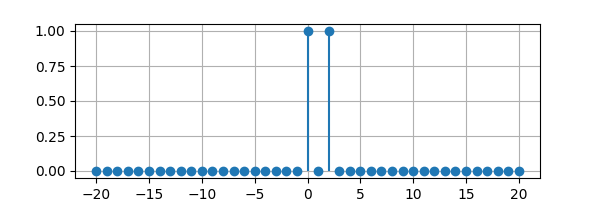
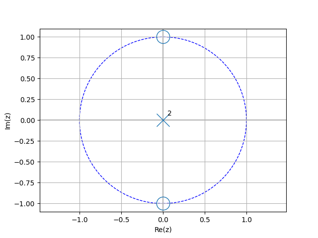
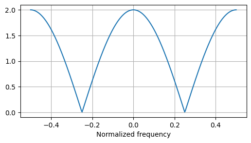

.. _discrete_time:

=====================
Discrete-time signals
=====================

There are three domain variables for discrete-time signals:

  - `n` for discrete-time signals, for example, `3 * u(n - 2)`
  - `k` for discrete-frequency spectra
  - `z` for z-transforms, for example, `Y(z)`

The `n`, `k`, and `z` variables share many of the attributes and methods of their continuous-time equivalents, `t`, `f`, and `s`, :ref:`expressions`.
    
The discrete-time signal can be plotted using the `plot()` method.
For example:

.. literalinclude:: examples/discretetime/dt1-plot1.py

Functions
=========

There are two special discrete functions:

 - `delta(n)` the discrete unit impulse.  This is one when `n=0` and zero otherwise.
 - `u(n)` the discrete unit step.   This is one when `n>=0` and zero otherwise.
   

Sequences
=========

   >>> x = delta(n) + 2 * delta(n - 2)
   >>> seq = x.seq((-5, 5))
   >>> seq
       {0, 0, 0, 0, 0, _1, 0, 2, 0, 0, 0}

Note, the underscore marks the item in the sequence where `n = 0`.
       
The extent of the sequence is given by the `extent()` method.   

   >>> seq.extent()
   >>> 3

Sequences can be convolved together, for example::

   >>> seq((1, 2, 3)).convolve(seq((1, 1))
   {_1, 3, 5, 3}

Sequences can be converted to n-domain or k-domain expressions, for example::
   
   >>> seq((1, 2))(n)
   δ[n] + 2⋅δ[n - 2]

   >>> seq((1, 2))(k)
   δ[k] + 2⋅δ[k - 2]   

   
Discrete-time (n-domain) expressions
====================================

Lcapy refers to Discrete-time expressions as n-domain expressions.  They are of class `DiscreteTimeDomainExpression` and can be created explicitly using the n-domain variable `n`.  For example::

   >>> 2 * u(n) + delta(n - 1)
   2⋅u[n] + δ[n - 1]

In this expression `u(n)` denotes the unit step and `delta(n)` denotes
the unit impulse.  Square brackets are used in printing to reduce confusion with the Heaviside function and Dirac delta.

Discrete-time expressions can be converted to sequences using the `seq()` method.  For example::

   >>> (delta(n) + 2 * delta(n - 1) + 3 * delta(n - 3)).seq()
   {_1, 2, 0, 3}

The `seq` method has an argument to specify the extent of the sequence.  This is required if the sequences have infinite extent.  For example::

   >>> (2 * u(n) + delta(n - 1)).seq((-10, 10))
   {_2, 3, 2, 2, 2, 2, 2, 2, 2, 2}

In this example the zero samples have been removed but the sequence has been truncated.

The z-transform of a discrete-time expression can be found with the `ZT()` method:

   >>> (delta(n) + 2 * delta(n - 2)).ZT()
       2 
   1 + ──
        2
       z 

A more compact notation is to pass `z` as an argument:       

   >>> (delta(n) + 2 * delta(n - 2))(z)
       2 
   1 + ──
        2
       z

The discrete-time Fourier transform (DTFT) of a discrete-time expression can be found with the `DTFT()` method:

   >>> (delta(n) + 2 * delta(n - 2)).DTFT()
          -4⋅ⅉ⋅π⋅Δₜ⋅f
   1 + 2⋅ℯ           

A more compact notation is to pass `f` as an argument:       

   >>> (delta(n) + 2 * delta(n - 2))(f)
          -4⋅ⅉ⋅π⋅Δₜ⋅f
   1 + 2⋅ℯ           

The discrete Fourier transform (DFT) converts a discrete-time expression to a discrete-frequency expression.  This is performed using the `DFT()` method or using a `k` argument.  For example::

   >>> (delta(n) + 2 * delta(n - 2))(k)
   N - 1                                 
    ____                                 
    ╲                                    
     ╲                        -2⋅ⅉ⋅π⋅k⋅n 
      ╲                       ───────────
      ╱                            N     
     ╱   (δ[n] + 2⋅δ[n - 2])⋅ℯ           
    ╱                                    
    ‾‾‾‾                                 
   n = 0   

Note, SymPy does not simplifies this since it does not know that `N>1`.  However, if `N` is known, it can be specified as an argument.  For example::

   >>> (delta(n) + 2 * delta(n - 2))(k, N=4)
          -ⅉ⋅π⋅k
   1 + 2⋅ℯ      
   
Evaluation of the DFT can be prevented by setting `evaluate=False`,

   >>> (delta(n) + 2 * delta(n - 2))(k, N=4, evaluate=False)
     N                                   
    ____                                 
    ╲                                    
     ╲                        -2⋅ⅉ⋅π⋅k⋅n 
      ╲                       ───────────
      ╱                            N     
     ╱   (δ[n] + 2⋅δ[n - 2])⋅ℯ           
    ╱                                    
    ‾‾‾‾                                 
   n = 0              
   

Discrete-frequency (k-domain) expressions
=========================================

Lcapy refers to discrete-frequency expressions as k-domain expressions.  They are of class `DiscreteFourierDomainExpression` and can be created explicitly using the k-domain variable `n`.  For example::

   >>> 2 * u(k) + delta(k - 1)
   2⋅u[k] + δ[k - 1]

Discrete-frequency expressions can be converted to sequences using the `seq()` method.  For example::

   >>> (delta(k) + 2 * delta(k - 1) + 3 * delta(k - 3)).seq()
   {_1, 2, 0, 3}   

   

Z-domain expressions
====================

Z-domain expressions can be constructed using the z-domain variable `z`, for example::

   >>> 1 + 1 / z
       1
   1 + ─
       z

Alternatively, they can be generated using a z-transform of a discrete-time signal. 

Z-domain expressions are objects of the `ZDomainExpression` class.  They are functions of the complex variable `z` and are similar to `sExpr` objects.   The general form of a z-domain expression is a rational function so all the s-domain formatting methods are applicable (see :ref:`expressionsprinting`).

The poles and zeros of a z-domain expression can be plotted using the `plot()` method.  For example:

.. literalinclude:: examples/discretetime/dt1-pole-zero-plot1.py

Transforms
==========

Lcapy implements a number of transforms for converting between different domains.
   

Z-transform
-----------

Lcapy uses the unilateral z-transform, defined as:

.. math::

   X(z) = \sum_{n=0}^{\infty} x(n) z^{-n}

The z-transform is performed explicitly with the `ZT` method:

   >>> x = delta(n) + 2 * delta(n - 2)
   >>> x.ZT()
   >>>      2 
       1 + ──
            2
           z

It is also performed implicitly with `z` as an argument:
      
   >>> x(z)
   >>>     2 
      1 + ──
           2
          z

Inverse z-transform
-------------------
          
The inverse unilateral z-transform is not unique and is only defined for :math:`n \ge 0`.  For example::

   >>> H = z / (z - 'a')
   >>> H(n)
   ⎧ n           
   ⎨a   for n ≥ 0
   ⎩             

   
If the result is known to be causal, then use:

   >>> H(n, causal=True)
    n     
   a ⋅u(n)

Discrete time Fourier transform (DTFT)
--------------------------------------

The DTFT converts an n-domain or z-domain expression into the f-domain (continuous Fourier domain).  Note, unlike the Fourier transform, this is periodic with period :math:`1/\Delta t`.  It is defined by

.. math::

   X_{\frac{1}{\Delta t}}(f) = \sum_{n=0}^{\infty} x(n) e^{-2 \mathrm{j} \pi n \Delta t f}

If the signal :math:`x(n)` is causal, the DTFT can be found by substituting :math:`z = \exp(-2 \mathrm{j} \pi \Delta t f)` into the z-transform of :math:`x(n)`.

Here's an example of the DTFT:

.. literalinclude:: examples/discretetime/dt1-DTFT-plot1.py

Discrete Fourier transform (DFT)
--------------------------------

The DFT converts an n-domain expression to a k-domain expression.  The definition used by Lcapy is:

.. math::

   X(k) = \sum_{k=0}^{N - 1} x(n) e^{\frac{-\mathrm{j} 2\pi k n}{N}}
           

Inverse discrete Fourier transform (IDFT)
-----------------------------------------

The IDFT converts a k-domain expression to an n-domain expression.  The definition used by Lcapy is:

.. math::

   x[n] = \frac{1}{N} \sum_{k=0}^{N - 1} X(k) e^{\frac{\mathrm{j} 2 \pi k n}{N}}

           

Bilinear transform
------------------

The bilinear transform can be used to approximate an s-domain expression with a z-domain expression using :math:`s \approx \frac{2}{\Delta t} \frac{1 - z^{-1}}{1 + z^{-1}}`.   This is performed by the `bilinear_transform()` method of s-domain objects, for example::

   >>> H = s / (s - 'a')
   >>> Hz = H.bilinear_transform().simplify()
   >>> Hz
         2⋅(1 - z)       
   ──────────────────────
   Δₜ⋅a⋅(z + 1) - 2⋅z + 2

Here's another example, an RC low-pass filter.

   >>> from lcapy import Circuit, s, t
   >>> net = Circuit("""
   R 1 2; right
   W 0 0_2; right
   C 2 0_2; down
   W 2 3; right=0.5
   W 0_2 0_3; right=0.5""")

This has a transfer function:

   >>> H = net.transfer(1, 0, 3, 0)
   >>> H
         1      
   ─────────────
       ⎛     1 ⎞
   C⋅R⋅⎜s + ───⎟
       ⎝    C⋅R⎠

and an impulse response:

   >>> H(t)
    -t      
    ───     
    C⋅R     
   e   ⋅u(t)
   ─────────
      C⋅R   

Using the bilinear transform, the discrete-time transfer function is

   >>> H.bilinear_transform().canonical()                                      
             Δₜ⋅(z + 1)          
   ──────────────────────────────
   ⎛    -2⋅C⋅R + Δₜ⎞             
   ⎜z + ───────────⎟⋅(2⋅C⋅R + Δₜ)
   ⎝     2⋅C⋅R + Δₜ⎠             

with a discrete-time impulse response
   
   >>> from lcapy.discretetime import n
   >>> H.bilinear_transform()(n).simplify()                                   
      ⎛                  n                         ⎞
      ⎜      ⎛2⋅C⋅R - Δₜ⎞                          ⎟
   Δₜ⋅⎜4⋅C⋅R⋅⎜──────────⎟ ⋅u(n) - (2⋅C⋅R + Δₜ)⋅δ[n]⎟
      ⎝      ⎝2⋅C⋅R + Δₜ⎠                          ⎠
   ─────────────────────────────────────────────────
               (2⋅C⋅R - Δₜ)⋅(2⋅C⋅R + Δₜ)     
               
