.. _expressions:

===========
Expressions
===========

Lcapy expressions are similar to SymPy expressions except they have a
specific domain depending on the predefined domain variables `t`, `s`, `f`, `F`
`omega` (`w`), `Omega` (`W`), `jf`, and `jomega` (`jw`).   They have associated quantities, domains, and units.

Introduction
============

Lcapy expressions are comprised of numbers, pre-defined constant symbols, domain variables, user-defined symbols, and functions.

.. _numbers:

Numbers
-------

Lcapy approximates real numbers as rationals.  This ensures expected simplifications of expressions.   However, some floating-point numbers produce unwieldy rationals (see :ref:`floating-point`) and so it is best to avoid floating-point numbers.  For example, use::

   >>> expr('2 / 3')

or

   >>> expr(one * 2 / 3)

rather than

   >>> expr(2 / 3)

The floating-point approximation can be found using `fval` attribute for a Python float or `cval` for a Python complex number::

  >>> expr(2 / 3).fval
  0.166666666666667

  >>> expr(2 / 3).cval
  (0.16666666666666666+0j)

Rational numbers in Lcapy expressions can be converted to SymPy floating-point numbers using the `evalf()` method, with a specified number of decimal places.   For example::

  >>> expr('1 / 3 + a').evalf(5)
  a + 0.33333

If you prefer floating-point numbers use the `ratfloat()` method.  For example::

  >>> expr('0.1 * a')
  a
  ──
  10
  >>> expr('0.1 * a').ratfloat()
  0.1⋅a

The companion method `floatrat()` converts floating-point numbers to
rational numbers.

Constants
---------

- `pi` 3.141592653589793...

- `j`  :math:`\sqrt{-1}`

- `oo` infinity

- `zoo` complex infinity

- `one` 1

.. _domainvariables:

Domain variables
----------------

Lcapy has eight predefined domain variables for continuous time signals:

- `t` -- time domain

- `f` -- Fourier (frequency) domain

- `F` -- normalized Fourier (frequency) domain (:math:`F = f \Delta t`)

- `s` -- Laplace (complex frequency) domain

- `omega` (or `w`) -- angular Fourier domain (:math:`\omega = 2 \pi f`)

- `Omega` (or `W`) -- normalized angular Fourier domain (:math:`\Omega = \omega \Delta t`)

- `jf` -- frequency response domain

- `jomega` (or `jw`) -- angular frequency response domain

A time-domain expression is produced using the `t` variable, for example::

   >>> e = exp(-3 * t) * u(t)

Similarly, a Laplace-domain expression is produced using the `s`
variable, for example::

   >>> V = s / (s**2 + 2 * s + 3)

There are an additional three domain variables for discrete-time signals (see :ref:`discrete_time`):

- `n` -- discrete-time domain

- `k` -- discrete-frequency domain

- `z` -- z-domain

For example::

    >>> V = delta(n) + 2 * delta(n - 1) + 3 * delta(n - 3)

All Lcapy expressions have a domain (Laplace, Fourier, etc.) and a quantity (voltage, current, undefined) etc.   For example::

   >>> V = voltage(5 * t)
   >>> V.domain
   'time'
   >>> V.quantity
   'voltage'

A voltage expression can also be created by multiplying an expression
by a voltage unit.  For example::

   >>> V = 5 * t * volts
   >>> V.domain
   'time'
   >>> V.quantity
   'voltage'

This applies to the units: volts, amperes, ohms, siemens, and watts.
Note, this is experimental and may be deprecated since the resultant units might be too confusing.

User-defined symbols
--------------------

Symbols can also be created with Lcapy's `symbol` function.  For
example::

   >>> tau = symbol('tau', real=True)
   >>> N = symbol('N', even=True)

They are also implicitly created from strings using the `expr()`
function.  For example::

   >>> v = expr('exp(-t / tau) * u(t)')

or

   >>> v = voltage('exp(-t / tau) * u(t)')

Notes:

1. Lcapy maintains a registry of symbols, created both explicitly and
   implicitly.  This includes special symbols such as `j` and `pi`,
   domain symbols such as `s` and `t` (associated with the domain
   variables), and user-defined symbols.

2. By default, symbols are assumed to be positive, unless explicitly
   specified not to be.  For example:

   >>> a = symbol('a', negative=True)

3. Symbols created with the `symbol()` or `symbols()` function are printed
   verbatim.  For example:

   >>> xest = symbol('\hat{x}')
   \hat{x}

4. Symbols created with `expr()` are printed in a canonical form.  For
   example, R1 is printed as R_1, even though it is stored as R1.

5. Some symbols are previously defined by SymPy.  These can be
   redefined using `symbol` or `symbols` but not with `expr` unless
   the `override` argument is True.  For example::

   >>> mypi = symbol('pi')

   or

   >>> e = expr('pi / 4', override=True)

   In both cases, the special number symbol `pi` becomes an arbitrary
   symbol.

6. Domain symbols (`t`, `f`, etc.) can only be redefined with
   `force=True`.  Caveat emptor!  This can cause confusion.  For
   example:

   >>> n = symbol('n', force=True, real=True)

.. _expressionsfunctions:

Mathematical functions
----------------------

Lcapy has the following built-in functions: `sin`, `cos`, `tan`,
`cot`, `asin`, `acos`, `atan`, `atan2`, `acot`, `sinh`, `cosh`,
`tanh`, `asinh`, `acosh`, `atanh`, `gcd`, `exp`, `sqrt`, `log`,
`log10`, `sign`, `conjugate`, `rect`, `dtrect`, `sinc`, `sincn`,
`sincu`, `tri`, `trap`, `Heaviside`, `H`, `u`, `DiracDelta`, `delta`,
`unitimpulse`, `unitstep`, `Piecewise`, `Derivative`, `Integral`,
`integrate`, `diff`, `Min`, and `Max` among others.

Other SymPy functions can be converted to Lcapy functions using the
`Function` class, for example:

   >>> import sympy as sym
   >>> gamma = Function(sym.gamma)
   >>> gamma(4)
   6

For additional details on some of these functions see :ref:`special-functions`.

.. _domains:

Domains
=======

Lcapy uses a variety of domains to represent signals.  This helps with
circuit analysis since time-domain convolutions simplify to
multiplications in the Fourier, Laplace, and phasor domains.  Lcapy
uses the following transform domains for circuit analysis:

- Constant domain for DC signals

- Phasor domain for AC signals

- Laplace domain (s-domain) for transient signals

- Fourier domain (and angular Fourier domain) for noise signals

The domain of an expression is usually determined from the pre-defined
domain variables (see :ref:`domainvariables`).  For example::

   >>> Z = impedance(3 * s)
   >>> Z.domain
   'laplace'

However, this is not possible for constants.  One approach is to use::

   >>> Z = impedance(0 * s + 5)
   >>> Z.domain
   'laplace'

Alternatively, there are a number of functions for setting the domain:

- `cexpr()` set constant domain

- `fexpr()` set Fourier domain

- `Fexpr()` set normalized Fourier domain

- `omegaexpr()` set angular Fourier domain

- `Omegaexpr()` set normalized angular Fourier domain

- `sexpr()` set Laplace domain

- `texpr()` set time domain

- `phasor()` set phasor domain

For example::

   >>> Z = impedance(sexpr(5))
   >>> Z.domain
   'laplace'

There are restrictions on how expressions can be combined.  In
general, both expressions must be of the same domain and have
compatible quantities.  For example, you cannot do::

   >>> 5 * t + 4 * s
   ValueError: Cannot determine TimeDomainExpression(5*t) + LaplaceDomainExpression(4*s) since the domains are incompatible

Expressions can be transformed to different domains, see :ref:`transformation`.

.. _domainattributes:

Domain attributes
-----------------

- `is_undefined_domain`
- `is_constant_domain`
- `is_time_domain`
- `is_laplace_domain`
- `is_fourier_domain`
- `is_angular_fourier_domain`
- `is_norm_fourier_domain`
- `is_norm_angular_fourier_domain`
- `is_frequency_response_domain`
- `is_angular_frequency_response_domain`
- `is_phasor_domain`
- `is_phasor_ratio_domain`
- `is_discrete_time_domain`
- `is_discrete_fourier_domain`
- `is_Z_domain`
- `is_transform_domain`

Domain classes
--------------

Lcapy has many expression classes, one for each combination of domain
(time, Fourier, Laplace, etc) and expression type (voltage, current,
impedance, admittance, transfer function).  For example, to represent
Laplace domain entities there are the following classes:

`LaplaceDomainExpression` is a generic s-domain expression.

`LaplaceDomainVoltage` is a s-domain voltage.

`LaplaceDomainCurrent` is a s-domain current.

`LaplaceDomainTransferFunction` is a s-domain transfer function.

`LaplaceDomainAdmittance` is a s-domain admittance.

`LaplaceDomainImpedance` is a s-domain impedance.

These classes should not be explicitly used.  Instead use the factory functions
`expr`, `voltage`, `current`, `transfer`, `admittance`, and `impedance`.

.. _phasors:

Phasors
-------

Phasors represent signals of the form :math:`v(t) = A \cos(\omega t +
\phi)` as a complex amplitude :math:`X = A \exp(\mathrm{j} \phi)`
where :math:`A` is the amplitude, :math:`\phi` is the phase, and the
angular frequency, :math:`\omega`, is implied.  The signal
corresponding to the phasor :math:`A \exp(\mathrm{j} \phi)` is found
from:

.. math::
    x(t) = \mathrm{Re}\left\{ A \exp(\mathrm{j} \phi) \exp(\mathrm{j} \omega t)\right\}

Thus, the signal :math:`v(t) = A \sin(\omega t)` has a phase :math:`\phi=-\pi/2`.

Phasors can be created in Lcapy with the `phasor()` factory function::

   >>> P = phasor(2)
   >>> P.time()
   2⋅cos(ω⋅t)

   >>> P = phasor(-2 * j)
   >>> P.time()
   2⋅sin(ω⋅t)

The default angular frequency is `omega` but this can be specified::

   >>> phasor(-j, omega=1)
   sin(t)

Phasors can also be inferred from an AC signal::

   >>> P = phasor(2 * sin(3 * t))
   >>> P
   -2⋅ⅉ
   >>> P.omega
   3

Phasor voltages and currents can be created using the `voltage()` and `current()` functions.  For example::

   >>> V = voltage(phasor(1))
   >>> V.quantity
   'voltage'

They can also be created from an AC time-domain signal using the `as_phasor()` method.  For example::

   >>> v = voltage(2 * sin(7 * t))
   >>> V = v.as_phasor()
   >>> V
   -2⋅ⅉ

Like all Lcapy expressions, the magnitude and phase of the phasor can
be found from the `magnitude` and `phase` attributes.  For example::

    >>> V = voltage(phasor(2 * sin(7 * t)))
    >>> V.magnitude
    2
    >>> V.phase
    -π
    ───
     2

The root-mean-square value of the phasor is found with the `rms()` method.  For example::

   >>> V = voltage(phasor(2))
   >>> V.rms()
   √2

Phasors can be plotted on a polar diagram using the `plot()` method, for example::

  >>> I = current(phasor(1 + j))
  >>> I.plot()

Phasor ratios
-------------

The ratio of two phasors is a phasor ratio; it is not a phasor.  For example::

   >>> V = voltage(phasor(4))
   >>> I = current(phasor(2))
   >>> Z = V / I
   >>> Z.domain
   phasor ratio
   >>> Z.omega
   ω

.. _noisesignals:

Noise signals
-------------

Lcapy can represent wide-sense stationary, zero-mean, Gaussian random
processes.  They are represented in terms of their one-sided,
amplitude spectral density (ASD); this is the square root of the power
spectral density (PSD), assuming a one ohm load.

With the wide-sense stationary assumption, random process can be
described by their power spectral (or amplitude spectral) density or
by their time-invariant autocorrelation function.

Lcapy assumes each noise source is independent and assigns a unique
noise identifier (nid) to each noise expression produced from a noise
source.  A scaled noise expression shares the noise identifier since
the noise is perfectly correlated.

Consider the sum of two noise processes:

.. math::
   Z(t) = X(t) + Y(t).

With the wide-sense stationarity and independence assumptions, the
resulting-power spectral density is given by

.. math::
  S_Z(f) = S_X(f) + S_Y(f),

and the amplitude spectral density is

.. math::
  \mathcal{A}_Z(f) = \sqrt{\mathcal{A}_X^2(f) + \mathcal{A}_Y^2(f)}.

Furthermore, the resultant autocorrelation is

.. math::
  R_Z(\tau) =  R_X(\tau) + R_Y(\tau).

Noise signals can be created using the `noisevoltage()` and
`noisecurrent()` methods.  For example, a white-noise signal can be
created using::

   >>> X = noisevoltage(3)
   >>> X.units
   'V/sqrt(Hz)'
   >>> X.domain
   'fourier noise'
   >>> X.nid
   1

When another white-noise signal is created, it is is assigned a
different noise identifier since the noise signals are assumed to be
independent::

   >>> Y = noisevoltage(4)
   >>> Y.nid
   2

Since the noise signals are independent and wide-sense stationary, the
ASD of the result is found from the square root of the sum of the
squared ASDs::

   >>> Z = X + Y
   >>> Z
   5

Care must be taken when manipulating noise signals.  For example, consider::

   >>> X + Y - X
   √34
   >>> X + Y - Y
   √41

The error arises since it is assumed that `X + Y` is independent of
`X` which is not the case.  A work-around is to create a
`VoltageSuperposition` object until someone comes up with a better idea.
This stores each independent noise component separately (as used by
Lcapy when performing circuit analysis).  For example::

   >>> from lcapy.superpositionvoltage import SuperpositionVoltage
   >>> X = noisevoltage(3)
   >>> Y = noisevoltage(4)
   >>> Z = SuperpositionVoltage(X) + SuperpositionVoltage(Y)
   {n1: 3, n2: 4}
   >>> Z = SuperpositionVoltage(X) + SuperpositionVoltage(Y) - SuperpositionVoltage(X)
   {n2: 4}

.. _quantities:

Quantities
==========

Each expression has a quantity (voltage, current, undefined, etc.).  When combining expressions, the quantity of the result is determined for the most common combination of electrical quantities.  For example::

   >>> V = current(1 / s) * impedance(2)
   >>> V.quantity
   'voltage'

However, there are restrictions on how expressions can be combined.  For example, you cannot do::

   >>> voltage(3) + current(4)
   ValueError: Cannot determine ConstantVoltage(3) + ConstantCurrent(4) since the units of the result are unsupported.
   As a workaround use x.as_expr() + y.as_expr()

There are a number of methods for changing the quantity of an expression:

- `as_expr()` removes the quantity  (it is set to 'undefined')
- `as_voltage()` converts to voltage
- `as_current()` converts to current
- `as_impedance()` converts to impedance
- `as_admittance()` converts to admittance
- `as_transfer()` converts to transfer function
- `as_power()` converts to power

There are similar functions for setting the quantity of an expression:

- `expr()` removes the quantity
- `voltage()` converts to voltage
- `current()` converts to current
- `impedance()` converts to impedance
- `admittance()` converts to admittance
- `transfer()` converts to transfer function

An Lcapy quantity is not a strict quantity but a collection of related
quantities, For example, both voltage (with units V) and voltage spectral
density (with units V/Hz) are considered voltage quantities.  However, they have different units.

.. _quantityattributes:

Quantity attributes
-------------------

Expressions have the following attributes to identify the quantity:

- `is_voltage`
- `is_current`
- `is_impedance`
- `is_admittance`
- `is_transfer`
- `is_immitance`
- `is_voltagesquared`
- `is_currentsquared`
- `is_impedancesquared`
- `is_admittancesquared`
- `is_power`

.. _immittances:

Immittances
-----------

Immittances (impedances and admittances) are a frequency domain
generalization of resistance and conductance.  In Lcapy they are
represented using the `Impedance` and `Admittance` classes for each of
the domains.  The appropriate class is created using the `impedance`
and `admittance` factory functions.  For example::

   >>> Z1 = impedance(5 * s)
   >>> Z2 = impedance(5 * j * omega)
   >>> Z3 = admittance(s * 'C')

The impedance can be converted to a specific domain using a domain variable
as an argument.  For example::

   >>> Z1(omega)
   5⋅ⅉ⋅ω
   >>> Z2(s)
   5⋅s
   >>> Z1(f)
   10⋅ⅉ⋅π⋅f

The time-domain representation of the immittance is the inverse Laplace
transform of the s-domain immittance, for example::

   >>> impedance(1 / s)(t)
   Heaviside(t)
   >>> impedance(1)(t)
   δ(t)
   >>> impedance(s)(t)
    (1)
   δ   (t)

Here :math:`\delta^{(1)}(t)` denotes the time-derivative of the Dirac
delta, :math:`\delta(t)`.

An `Admittance` or `Impedance` object can be created with the `Y` or
`Z` attribute of a `Oneport` component, for example::

   >>> C(3).Z
   -ⅉ
   ───
   3⋅ω

   >>> C(3).Z(s)
    1
   ───
   3⋅s
   >>> C(3).Y(s)
   3⋅s

Netlist components have similar attributes.  For example::

   >>> from lcapy import Circuit
   >>> a = Circuit("""
   ... C 1 2""")
   >>> a.C.Z
    1
   ───
   C⋅s

Immittance attributes
---------------------

- `B` susceptance

- `G` conductance

- `R` resistance

- `X` reactance

- `Y` admittance

- `Z` impedance

- `is_lossy` has a non zero resistance component

Impedance is related to resistance and reactance by

:math:`Z = R + \mathrm{j} X`

Admittance is related to conductance and susceptance by

:math:`Y = G + \mathrm{j} B`

Since admittance is the reciprocal of impedance,

:math:`Y = \frac{1}{Z} = \frac{R}{R^2 + X^2} - \mathrm{j} \frac{X}{R^2 + X^2}`

Thus

:math:`G = \frac{R}{R^2 + X^2}`

and

:math:`B = \frac{-X}{R^2 + X^2}`

Note, at DC, when :math:`X = 0`, then :math:`G = 1 / R` and is
infinite for :math:`R= 0`.  However, if Z is purely imaginary, i.e,
:math:`R = 0` then :math:`G = 0`, not infinity as might be expected.

Immittance methods
------------------

- `oneport()` returns a `Oneport` object corresponding to the immittance.  This may be a `R`, `C`, `L`, `G`, `Y`, or `Z` object.

Voltages and currents
---------------------

Voltages and currents are created with the `voltage()` and `current()`
factory functions.   For example::

  >>> v = voltage(5 * u(t))
  >>> I = current(5 * s)

The domain is inferred from the domain variable in the expression (see :ref:`domains`).

The results from circuit analysis are represented by a superposition of different domains.

.. _superpositions:

Voltage and current superpositions
----------------------------------

Superpositions of voltages and/or current are represented using the `SuperpositionVoltage` and `SuperpositionCurrent` classes.  These classes have similar behaviour; they represent an arbitrary voltage or current signal as a superposition of DC, AC (phasor), transient, and noise signals.

For example, the following expression is a superposition of a DC
component, an AC component, and a transient component::

   >>> V1 = SuperpositionVoltage('1 + 2 * cos(2 * pi * 3 * t) + 3 * u(t)')
   >>> V1
   ⎧          3        ⎫
   ⎨dc: 1, s: ─, 6⋅π: 2⎬
   ⎩          s        ⎭

This shows that there is 1 V DC component, a transient component with
a Laplace transform :math:`3 / s`, and an AC component (phasor) with
amplitude 2 V and angular frequency :math:`6 \pi` rad/s.

Pure DC components are not shown as a superposition.  For example::

   >>> V2 = SuperpositionVoltage(42)
   >>> V2
   42

Similarly, pure transient components are not shown as a superposition
if they depend on `s`.  For example::

   >>> V3 = SuperpositionVoltage(3 * u(t))
   >>> V3
   3
   ─
   s

However, consider the following::

   >>> V4 = SuperpositionVoltage(4 * DiracDelta(t))
   >>> V4
   {s: 4}

This is not shown as 4 to avoid confusion with a 4 V DC component.  Maybe it should be written :math:`0 s + 4`?

A pure AC component (phasor) has `magnitude`, `phase`, and `omega` attributes.  The latter is the angular frequency.  For example::

   >>> V5 = SuperpositionVoltage(3 * sin(7 * t) + 4 * cos(7 * t))
   >>> V5
   {7: 4 - 3⋅ⅉ}
   >>> V5.magnitude
   5

If the signal is a superposition of AC signals, each phasor can be extracted using its angular frequency as the index.  For example::

   >>> V6 = SuperpositionVoltage(3 * sin(7 * t) + 2 * cos(14 * t))
   >>> V6[7]
   -3⋅ⅉ
   >>> V6[14]
   2

The signal can be converted to another domain using a domain variable
as an argument:

- `V1(t)` returns the time domain expression
- `V1(f)` returns the Fourier domain expression with linear frequency
- `V1(s)` returns the Laplace domain expression
- `V1(omega)`or `V1(w)` returns the angular Fourier domain expression
- `V1(jomega)` or `V1(jw)` returns the angular frequency domain expression

Here are some examples::

   >>> V1(t)
   2⋅cos(6⋅π⋅t) + 3⋅u(t) + 1
   >>> V1(s)
     ⎛ 2       2⎞
   6⋅⎝s  + 24⋅π ⎠
   ──────────────
     ⎛ 2       2⎞
   s⋅⎝s  + 36⋅π ⎠
   >>> V1(jomega)
        ⎛   2       2⎞
   -6⋅ⅉ⋅⎝- ω  + 24⋅π ⎠
   ────────────────────
       ⎛   2       2⎞
     ω⋅⎝- ω  + 36⋅π ⎠

Voltage and current attributes
------------------------------

- `dc` returns the DC component
- `ac` returns a dictionary of the AC components, keyed by the frequency
- `transient` returns the time-domain transient component
- `is_dc` returns True if a pure DC signal
- `is_ac` returns True if a pure AC signal
- `is_transient` returns True if a pure transient signal
- `has_dc` returns True if has a DC signal
- `has_ac` returns True if has an AC signal
- `has_transient` returns True if has a transient signal
- `domain` returns the domain as a string
- `quantity` returns the quantity (voltage or current) as a string
- `is_voltage` returns True if a voltage expression
- `is_current` returns True if a current expression

In addition, there are domain attributes, such as `is_time_domain`,
`is_laplace_domain`, etc. (see :ref:`domainattributes`).

Voltage and current methods
---------------------------

- `oneport()` returns a `Oneport` object corresponding to the immittance.  This may be a `V` or `I` object.

.. _units:

Units
=====

Expressions have an attribute `units` that reflect the quantity and domain.  For example::

   >>> voltage(7).units
   V
   >>> voltage(7 * f).units
   V
   ──
   Hz
   >>> voltage(7 / s).units
   V
   ──
   Hz
   >>> voltage(7 * s).units
   V
   ──
   Hz
   >>> s.units
   rad
   ───
    s

The units are a SymPy Expression and thus can be formatted as a
string, LaTeX, etc.  They can be automatically printed, for example::

   >>> state.show_units = True
   >>> voltage(7)
   7⋅V

Abbreviated units are employed by default, however, this can be disabled.  For example::

   >>> state.show_units = True
   >>> state.abbreviate_units = False
   >>> voltage(7)
   7⋅volt

By default, units are printed in the form they are created.  However,
they can be printed in a simplified canonical form::

   >>> state.show_units = True
   >>> current(7) * impedance(2)
   14⋅A⋅ohm
   >>> state.canonical_units = True
   >>> current(7) * impedance(2)
   14⋅V

Alternatively, the units can be simplified using the `simplify_units()` method::

   >>> state.show_units = True
   >>> V = current(7) * impedance(2)
   >>> V
   14⋅A⋅ohm
   >>> V.simplify_units()
   14⋅V

The units are chosen as a function of quantity and domain when an
Lcapy expression is created and are modified by multiplications, divisions, and transformations, such as a Fourier transform.  Here are the default values::

    +-------------------+-----+-------+--------+------+--------+-----+--------+-----+-----+-----+-----------+
    | Quantity/Domain   | dc  | t     | s      | f    | omega  | jf  | jomega | n   | k   | z   | noise f   |
    +-------------------+-----+-------+--------+------+--------+--------+-----+-----+-----+-----+-----------+
    | Voltage           | V   | V     | V/Hz   | V/Hz | V/Hz   | V   | V      | V   | V   | V   | V/sqrt(Hz)|
    +-------------------+-----+-------+--------+------+--------+-----+--------+-----+-----+-----+-----------+
    | Current           | A   | A     | A/Hz   | A/Hz | A/Hz   | A   | A      | A   | A   | A   | A/sqrt(Hz)|
    +-------------------+-----+-------+--------+------+--------+-----+--------+-----+-----+-----+-----------+
    | Impedance         | ohm | ohm/s | ohm    | ohm  | ohm    | ohm | ohm    | ohm | ohm | ohm |           |
    +-------------------+-----+-------+--------+------+--------+-----+--------+-----+-----+-----+-----------+
    | Admittance        | S   | S/s   | S      | S    | S      | S   | S      | S   | S   | S   |           |
    +-------------------+-----+-------+--------+------+--------+-----+--------+-----+-----+-----+-----------+
    | Transfer function | 1   | 1/s   | 1      | 1    | 1      | 1   | 1      | 1   | 1   | 1   |           |
    +-------------------+-----+-------+--------+------+--------+-----+--------+-----+-----+-----+-----------+

Note, the transfer functions are assumed to be voltage or current ratios in the Laplace and Fourier domains.  Voltage and current ratios are represented by impedances and admittances.

Unit determination goes awry when some mathematical functions are used.  For example::

   >>> log(voltage(7)).units
   V

.. _unitattributes:

Unit attributes
---------------

Expressions have the following attributes for units:

- `units` returns the units as a SymPy expression

- `canonical_units` returns the units as a SymPy expression in canonical form (`volt * ampere` is converted to watts, `1 / s` is converted to `Hz`, etc.)

- `expr_with_units` returns a SymPy expression multiplied by the units

Containers
==========

Lists
-----

Lcapy uses its own list type `ExprList` that wraps each element as an Lcapy `Expr` object.  For example,

    >>> a = expr([t, t**2, '3 * t'])
    >>> a
    ⎡    2     ⎤
    ⎣t, t , 3⋅t⎦

An `ExprList` can be converted to a list suitable for sympy using the
`sympy` attribute:

    >>> a.sympy
    ⎡    2     ⎤
    ⎣t, t , 3⋅t⎦

 `ExprList` objects have many similar printing methods to `Expr` objects such as `pprint()` and `latex()`.  Other methods include:

 - `subs(symbol, value)` substitutes `symbol` with `value`.

 - `subs(defs)` substitutes symbols where `defs` is a dictionary of values keyed by symbol name

 - `solve()` solves a system of equations, for example,

   >>> v = expr('v(t)')
   >>> vR = expr('vR(t)')
   >>> vL = expr('vL(t)')
   >>> i = expr('i(t)')
   >>> R = symbol('R')
   >>> L = symbol('L')
   >>> system = expr([Eq(v, vR + vL), Eq(vR, i * R), Eq(vL, Derivative(i, t) * L)])
   >>> unknowns = expr((vR, vL, i))
   >>> # Solve in Laplace domain
   >>> solutions = system(s).solve(unknowns(s))
   >>> solutions
   ⎧        V(s)           L⋅s⋅V(s)           R⋅V(s)⎫
   ⎨I(s): ───────, V_L(s): ────────, V_R(s): ───────⎬
   ⎩      L⋅s + R          L⋅s + R           L⋅s + R⎭

 - `fval()` evaluates each expression in the list and return a list of Python float values

 - `cval()` evaluates each expression in the list and return a list of Python complex values

Tuples
------

Lcapy uses its own tuple type `ExprTuple` that wraps each element as an Lcapy `Expr` object.  For example,

    >>> a = expr((t, t**2, '3 * t'))
    >>> a
    ⎛    2     ⎞
    ⎝t, t , 3⋅t⎠

`ExprTuple` objects have the same methods and attributes as `ExprList` objects.

Dicts
-----

Lcapy uses its own dict type `ExprDict` that wraps each element and key as an Lcapy `Expr` object.  For example,

   >>> expr({1:t, 't':2 * t, 4 * t:2 * t})
   {t: 2⋅t, 1: t, 4⋅t: 2⋅t}

`ExprDict` objects share the printing methods of `ExprTuple` and `ExprList` objects.

Matrices
--------

Matrix objects are created with the `Matrix` class.  Currently, there are different flavours of Matrix class for the different domains, for example, `LaplaceDomainMatrix` and `TimeDomainMatrix`.   These are likely to be replaced with a generic `Matrix` class in the future.  Here's an example of usage::

   >>> Matrix(((1, t), (3, '4')))
   ⎡1  t⎤
   ⎢    ⎥
   ⎣3  4⎦

Note, currently, the quantity associated with each matrix element is lost.   The `Matrix` class subclasses the SymPy `Matrix` class and thus all the SymPy `Matrix` methods are supported, such as `inv()` to invert a matrix and `det()` to calculate the determinant.

Vectors
-------

Vector objects are created with the `Vector` class.  These are a
subclass of the `Matrix` class.

Signals and transfer functions
==============================

Lcapy expressions represent signals or the behaviour of a system.

Signals are voltage or current quantities (or their products such as
instantaneous power).  The signals are either driving functions
(excitation functions) or responses (such as the voltage across a
component or the current through a component).  Signals can be
constant (DC), AC, transient, or a combination of AC, DC, and
transient.  A causal signal is zero for :math:`t < 0`.

The behaviour of a system is described in a transform domain (Laplace,
Fourier, or phasor) by a transfer function.  This is the ratio of two
transformed signals, for example, :math:`H(s) = V_2(s) / V_1(s)`.
Impedances, :math:`Z(s) = V(s) / I(s)`, and admittances, :math:`Y(s) =
I(s) / V(s)`, are a special kind of transfer function.

The time domain representation of a transfer function, :math:`H(s)`, is called the impulse response, :math:`h(t)`.  For a causal system, :math:`h(t) = 0` for :math:`t < 0`.

.. _expressionsrationalfunctions:

Rational functions
------------------

Linear time-invariant systems have transfer functions that are rational functions; the ratio of two polynomials:

.. math::
   H(s) = \frac{N(s)}{D(s)},

The numerator can be found using the `N` attribute and denominator can
be found using the `D` attribute.   For example::

  >>> Z = impedance((5 * s) / (s**2 + 5 * s + 6))
         5⋅s
   ────────────
    2
   s  + 5⋅s + 6
   >>> Z.N
   5⋅s
   >>> Z.D
    2
   s  + 5⋅s + 6

.. _expressionsresponses:

Responses
---------

Usually, s-domain responses are rational functions but if there is a time delay there is an additional exponential factor.  So, in general, Lcapy tries to interpret responses as

.. math::
   V(s) = \sum_{i} \frac{N_i(s)}{D(s)} \exp(-s \tau_i),

where :math:`\tau_i` are time delays.   This representation is returned by the `as_sum()` method.  Note, these expressions cannot be represented in :ref:`ZPK`.  The `D` attribute returns :math:`D(s)` and the `N` attribute returns

.. math::
   N(s) = \sum_{i} N_i(s) \exp(-s \tau_i).

.. _expressionsattributes:

Expression attributes
=====================

All Lcapy expressions have the following attributes (see :ref:`expressionsrationalfunctions` and :ref:`expressionsresponses` for definitions of numerator and denominator):

- `abs` returns absolute value

- `angle` returns phase angle (radians)

- `cartesian` returns expression in form `real + j * imag`

- `conj` returns complex conjugate (equivalent to `conjugate()` method)

- `cval` returns complex floating-point number (as Python complex) if expression can be evaluated (see also `val`, `fval`, and `evalf()`)

- `dB` returns magnitude in decibels: `20 * log10(magnitude)`

- `D` returns denominator

- `Ddegree` returns degree of denominator

- `denominator` returns denominator

- `degree` returns degree (order) of rational function (maximum of numerator and denominator degrees)

- `domain` returns a string identifying the domain (laplace, fourier, etc.)

- `domain_label` returns string describing domain of expression

- `expr` returns the underlying SymPy expression

- `fval` returns floating-point number (as Python float) if expression can be evaluated (see also `val`, `cval`, and `evalf()`)

- `imag` returns imaginary part

- `is_ac` returns True if AC signal

- `is_causal` returns True if signal is causal, i.e, is 0 for :math:`t < 0`

- `is_conditional` returns True if expression is conditional, e.g., :math:`\exp(-t)\;\; t \ge 0`

- `is_constant` returns True if expression is constant (it must have no free symbols, compare with `is_unchanging`), e.g., 3 is constant but 3 * x is not

- `is_dc` returns True if DC signal

- `is_marginally_stable` returns True if the Laplace transform of the expression has all its poles in the LH plane or on the boundary

- `is_number` returns True if expression is a number

- `is_rational_function` returns True if expression is a rational function

- `is_realizable` returns True if the Laplace transform of the expression is 0 in the limit as :math:`s` tends to infinity.  This is equivalent to the Laplace transform of the expression being strictly proper (the degree of the numerator being greater than the degree of the numerator).  Note, by this definition `cos(t)` is considered realizable

- `is_stable` returns True if the Laplace transform of the expression has all its poles in the LH plane

- `is_strictly_proper` returns True if degree of denominator greater than degree of numerator

- `is_unchanging` returns True if expression does not have a domain variable (compare with `is_constant`), e.g., `3 * x` is unchanging but `3 * t` is not

- `label` returns string describing expression to use as a plot label

- `magnitude` returns absolute value

- `N` returns numerator

- `Ndegree` returns degree of numerator

- `numerator` returns numerator

- `phase` returns phase (radians)

- `phase_degrees` returns phase (degrees)

- `polar` returns expression in form `mag * exp(j * phase)`

- `quantity` returns a string identifying the quantity (voltage, current, undefined, etc.)

- `real` returns real part

- `real_imag` returns expression in form `real + j * imag`

- `sign` returns sign of expression

- `symbols` returns dictionary of symbols used in the expression keyed by their names

- `val` returns floating-point number (as Lcapy expression) if expression can be evaluated (see also `fval`, `cval`, and `evalf()`)

- `var` returns the underlying SymPy symbol representing the domain

In addition, each expression has domain, quantity, and unit attributes, see
:ref:`domainattributes`, :ref:`quantityattributes`, and :ref:`unitattributes`.

.. _expressionsmethods:

Expression methods
==================

Poles and zeros
---------------

- `coeffs()` returns list of coefficients if the expression is a polynomial; the highest powers come first.  If the expression is a rational function use `.N.coeffs` or `.D.coeffs` for the numerator or denominator coefficients.

- `normcoeffs()` returns list of coefficients if the expression is a polynomial; the highest powers come first.  The coefficients are normalized so the highest order coefficient is 1.  If the expression is a rational function use `.N.coeffs` or `.D.coeffs` for the numerator or denominator coefficients.

- `poles(aslist)` returns poles of expression as a dictionary or a list if the `aslist` argument is True.  Note, this does not always find all the poles (see `roots()`).

- `roots(aslist)` returns roots of expression as a dictionary or a list if the `aslist` argument is True.  Note, this does not always find all the roots, for example, if the degree is five or more (https://en.wikipedia.org/wiki/Abel%E2%80%93Ruffini_theorem).  In this case, if the polynomial coefficients are constants, the roots are calculated numerically.

- `zeros(aslist)` returns zeros of expression as a dictionary or a list if the `aslist` argument is True.  Note, this does not always find all the zeros (see `roots()`).

Transforms
----------

- `FT()` Fourier transform, see :ref:`fourier_transforms`

- `IFT()` Inverse Fourier transform, see :ref:`inverse_fourier_transforms`

- `LT()` Laplace transform, see :ref:`laplace_transforms`

- `ILT()` Inverse Laplace transform, see :ref:`inverse_laplace_transforms`

Miscellaneous
-------------

- `as_sum()` rewrites expression as a sum of terms where the denominator of each term has a common polynomial expression (see :ref:`expressionsresponses`).

- `convolve(x)` convolves expressions (see :ref:`convolution`).

    The result is an unevaluated integral.  It can be evaluated using
    the `doit()` method.

    Note, this method not simplify the convolution integral if one of
    the functions contains a Dirac delta.  This can be done using the
    `simplify_dirac_delta()` method.

- `differentiate()` differentiates expression.

- `discretize(method='bilinear')` converts the expression to a discrete-time approximation, see :ref:`discrete-time-approximation`.

- `divide_top_and_bottom(expr)` divides numerator and denominator by `expr`.

- `dlti_filter(method='bilinear')` creates a DLTI filter (see
  :ref:`DLTIfilter`) by approximating the discrete-time impulse
  response (see :ref:`discrete-time-approximation`).  For example,

   >>> H = transfer(1 / (s + 'a'))
   >>> fil = H.dlti_filter()
   >>> fil.a
   ⎛   Δₜ⋅a - 2⎞
   ⎜1, ────────⎟
   ⎝   Δₜ⋅a + 2⎠
   >>> fil.b
   ⎛   Δₜ        Δₜ   ⎞
   ⎜────────, ────────⎟
   ⎝Δₜ⋅a + 2  Δₜ⋅a + 2⎠
   >>> fil.difference_equation()
          Δₜ⋅x(n)    Δₜ⋅x(n - 1)   (Δₜ⋅a - 2)⋅y(n - 1)
   y(n) = ──────── + ─────────── - ───────────────────
          Δₜ⋅a + 2     Δₜ⋅a + 2          Δₜ⋅a + 2

- `evalf(n)` returns floating-point number to `n` decimal places (as Lcapy expression) if expression can be evaluated (see also `val`, `fval`, and `cval` attributes)

- `evaluate(arg)` returns floating-point number (Python float or complex type) if expression can be evaluated.  If passed a tuple, list, or NumPy array, an array of NumPy float or complex types is returned.  For example::

   >>> (t**2 + 4).evaluate(1)
   5
   >>> (t**2 + 4).evaluate((1, 2))
   array([5., 8.])

- `initial_value()` returns result at :math:`t = 0`.

- `integrate(arg, **kwargs)` integrates expression.  For example::

   >>> exp(-3 * t).integrate((t, 0, oo))
   1 / 3

- `factor_const()` factors expression into constant part and the rest.

- `final_value()` returns result at :math:`t = \infty`.

- `force_causal()` removes the piecewise condition and multiplies expression by Heaviside unit step (only for time-domain expression), for example::

   >>> (1/s)(t)
   1  for t ≥ 0
   >>> (1/s)(t).force_causal()
   u(t)

- `limit()` computes a limit.

- `multiply_top_and_bottom(expr)` multiplies numerator and denominator by `expr`.

- `nsolve(x0, **kwargs)` returns numerical solution with `x0` as the starting point close to the solution.  See sympy.solvers.solvers.nsolve for details.

- `parameterize()` parameterizes first, second, and third order rational functions into common forms.   For example::

   >>> H, defs = (1 / (5 * s**2 + 10 * s + 20)).parameterize()
   >>> H
            K
   ───────────────────
     2               2
   ω₀  + 2⋅ω₀⋅s⋅ζ + s
   >>> defs
   {K: 1/5, omega_0: 2, zeta: 1/2}
   H, defs = (1 / (5 * s**2 + 10 * s + 20)).parameterize(zeta=False)
   >>> H
              K
   ───────────────────────
     2    2              2
   ω₁  + s  + 2⋅s⋅σ₁ + σ₁
   >>> defs
   {K: 1/5, omega_1: √3, sigma_1: 1}

- `parameterize_ZPK()` parameterizes rational functions into zero-pole-gain (ZPK) form.  For example::

   >>> H, defs = (1 / (5 * s**2 + 10 * s + 20)).parameterize_ZPK()
   >>> H
              1
   K⋅───────────────────
     (-p₁ + s)⋅(-p₂ + s)
   >>> defs
   {K: 1/5, p1: -1 - √3⋅ⅉ, p2: -1 + √3⋅ⅉ}

- `post_initial_value()` returns result at :math:`t = 0^{+}` (only for time-domain and Laplace-domain expression).

- `pre_initial_value()` returns result at :math:`t = 0^{-}` (only for time-domain expression).

- `rationalize_denominator()` multiplies numerator and denominator by complex conjugate of denominator to ensure the new denominator is purely real.

- `remove_condition()` removes the piecewise condition (only for time-domain expression), for example::

   >>> (1/s)(t)
   1  for t ≥ 0
   >>> (1/s)(t).remove_condition()
   1

- `replace(query, value)` replaces `query` with `value`.

- `response(xvector, tvector, method='bilinear')` determines the discrete time-domain response given an input vector `xvector` at the instants specified by `tvector`.

- `rewrite(args, hints)` rewrites expression in terms of the `args`.  For example, `exp(j*a*t).rewrite(cos)` gives  `ⅉ⋅sin(4⋅t) + cos(4⋅t)`.  Similarly, `cos(2 * t).rewrite(exp)` will expand the cosine as two complex exponentials.

- `solve(symbols, flags)` returns list of solutions.  For example::

   >>> (s**2 - 4).solve()
   [-2, 2]

- `term_const()` splits expression into constant part and the rest.

.. _convolution:

Convolution
-----------

The `convolution()` method has two different forms::

    >>> expr('i(t)').convolve(expr('z(t)'))
    ∞
    ⌠
    ⎮  i(t - τ)⋅z(τ) dτ
    ⌡
    -∞
    >>> expr('i(t)').convolve(expr('z(t)'), commutate=True)
    ∞
    ⌠
    ⎮  i(τ)⋅z(t - τ) dτ
    ⌡
    -∞

The infinite limits of the convolution integral are constrained if either of the functions is known to be causal.  For example::

    >>> expr('i(t)').convolve(expr('z(t)', causal=True))
    ∞
    ⌠
    ⎮  i(t - τ)⋅z(τ) dτ
    ⌡
    0
    >>> expr('i(t)', causal=True).convolve(expr('z(t)'))
    t
    ⌠
    ⎮  i(t - τ)⋅z(τ) dτ
    ⌡
    -∞
    >>> expr('i(t)', causal=True).convolve(expr('z(t)', causal=True))
    t
    ⌠
    ⎮  i(t - τ)⋅z(τ) dτ
    ⌡
    0

The `convolve()` method does not simplify the convolution integral, for example::

    >>> expr('i(t)').convolve(expr('u(t)'))
    ∞
    ⌠
    ⎮  i(t - τ)⋅u(τ) dτ
    ⌡
    0
    >>> expr('i(t)').convolve(expr('u(t)')).simplify()
    ∞
    ⌠
    ⎮  i(t - τ) dτ
    ⌡
    0

.. _expressionsprinting:

Formatting methods
==================

Lcapy expressions can be displayed in many forms.  For example, consider the s-domain rational-function::

   >>> H = 5 * (s**2 + 1) / (s**2 + 5*s + 4)

Canonical form
--------------

The canonical form has a unity coefficient for the highest power in the denominator.  It is sometimes called polynomial form.

   >>> H.canonical()
     ⎛   2    ⎞
     ⎝5⋅s  + 5⎠
   ────────────
    2
   s  + 5⋅s + 4

There is a variation of the canonical form which has a unity coefficient for the highest power in the denominator and with constants factored in the numerator.   It is sometimes called gain-polynomial form.

   >>> H.canonical(factor_const=True)
      ⎛ 2    ⎞
    5⋅⎝s  + 1⎠
   ────────────
    2
   s  + 5⋅s + 4

Expanded canonical form
-----------------------

The expanded canonical form expresses the rational function into the sum of rational functions where the numerator of each term contains a unique monomial.

   >>> H.expandcanonical()
          2
       5⋅s             5
   ──────────── + ────────────
    2              2
   s  + 5⋅s + 4   s  + 5⋅s + 4

General form
------------

The general form of a rational function is shown as the ratio of two polynomials.   Unlike the canonical form, the coefficient for the highest power in the denominator may not be unity.

   >>> H.general()
        2
     5⋅s  + 5
   ────────────
    2
   s  + 5⋅s + 4

.. _ZPK:

Factored (ZPK) form
-------------------

The factored form shows both the numerator and denominator polynomials  factored.  It is an alias for `ZPK` (zero-pole-gain) form.

   >>> H.factored()
   5⋅(s - ⅉ)⋅(s + ⅉ)
   ─────────────────
    (s + 1)⋅(s + 4)

Complex conjugate pairs are combined when the `pairs` argument is True to create a product of biquad sections.

   >>> H.factored(pairs=True)
          2
       5⋅s  + 5
   ───────────────
   (s + 1)⋅(s + 4)

Partial fraction form
---------------------

The partial fraction form has terms that are strictly proper.

   >>> H.partfrac()
           85          10
   5 - ───────── + ─────────
       3⋅(s + 4)   3⋅(s + 1)

The `recippartfrac()` method generates a partial fraction expansion using the reciprocal of the variable:

   >>> H.recipartfrac()
   5       10          85
   ─ - ───────── + ──────────
   4     ⎛    1⎞      ⎛1   1⎞
       3⋅⎜1 + ─⎟   48⋅⎜─ + ─⎟
         ⎝    s⎠      ⎝4   s⎠

The `partfrac()` and `recippartfrac()` methods have a `pairs` argument.  If this is True, a sum of biquad sections is created.  For example::

   >>> H = 5 / (s * (s**2 + 1))
   >>> H.partfrac()
         5           5       5
   - ───────── - ───────── + ─
     2⋅(s + ⅉ)   2⋅(s - ⅉ)   s
   >>> H.partfrac(pairs=True)
         5⋅s     5
      - ────── + ─
         2       s
        s  + 1

Standard form
-------------

The standard form expresses the rational function as the sum of a polynomial and a strictly proper rational function.

   >>> H.standard()
      25⋅s + 15
   - ──────────── + 5
      2
     s  + 5⋅s + 4

Time constant form
------------------

The time constant form factors the rational function into gain-time-constant form.

   >>> H.timeconst()
   5⋅(-ⅉ⋅s + 1)⋅(ⅉ⋅s + 1)
   ──────────────────────
       ⎛s    ⎞
     4⋅⎜─ + 1⎟⋅(s + 1)
       ⎝4    ⎠

Printing methods
----------------

- `pprint()` pretty print an expression

- `latex()`  convert an expression to LaTeX string representation

- `pretty()` convert an expression to a string with a prettified form

- `plot()` plot the expression, provided there are no free symbols (see :ref:`plotting`)

There are a number of global printing options, controlled by attributes of the `state` object.

- `state.show_units` (default False) prints the units after an expression

- `state.canonical_units` (default True) converts units to canonical form, e.g., V / A is shown as ohms.

- `state.printing.abbreviate_units` (default True) prints V rather than volts

- `state.printing.order` (default None) controls the order that symbols in an expression are printed.  When `order =None`, SymPy orders the printed arguments and produces output like `-p + s`.  When `order='none'`, SymPy does not order the printed arguments.  However, when creating an expression, SymPy sorts the argument order for commutative operators (such as add) and does not honour how the expression was created.

SymPy methods
-------------

If Lcapy does not have a method defined but the underlying SymPy
expression does, the SymPy method is used.  For example:

- `diff()`

- `expand()`

Utility functions
=================

- `symbol()` creates a symbol

- `expr()` creates an expression.  This can also create lists, tuples, and dictionaries of expressions.

Note, SymPy does not allow symbol names that are Python keywords.  For example, `expr('is(t)')` fails.  A workaround is to use an underscore in the name, for example, `expr('i_s(t)')`.

.. _transformation:

Domain transformation
=====================

Expressions can be transformed to a different domain (see :ref:`domains` and :ref:`transformation`), for example.  This can be done with an explicit method, for example, the Fourier transform can be determined with::

   >>> cos(4 * pi * t).FT(f)
    δ(f - 2)   δ(f + 2)
   ──────── + ────────
      2          2

   >>>  x.FT(omega)
   π⋅(δ(ω - 4⋅π) + δ(ω + 4⋅π))

Alternatively, the call notation can be used to choose the new domain::

- `V(t)` returns the time domain transformation

- `V(f)` returns the Fourier domain transformation

- `V(F)` returns the normalized Fourier domain transformation

- `V(s)` returns the Laplace domain (s-domain) transformation

- `V(omega)` returns the angular Fourier domain transformation

- `V(Omega)` returns the normalized angular Fourier domain transformation

- `V(jf)` returns the frequency response domain transformation

- `V(jomega)` or `V(jw)` returns the angular frequency response domain transformation

- `V(n)` returns the discrete-time domain transformation (by default the bilinear-transform is used)

- `V(k)` returns the discrete-frequency domain transformation (by default the bilinear-transform is used)

- `V(z)` returns the Z-domain transformation (by default the bilinear-transform is used)

For example::

   >>> from lcapy import *
   >>> V1 = voltage('3 * exp(-2 * t)')
   >>> V1(t)
      -2⋅t
   3⋅e
   >>> V1(s)
     3
   ─────
   s + 2

Transformation and substitution use a similar syntax `V(arg)`.  If
`arg` is a domain variable `t`, `f`, `s`, `omega`, `w`, `jf`, `jomega`,
`jw`, `n`, `k`, or `z` or is an expression of a domain variable,
transformation is performed, otherwise substitution is performed.
This behaviour can be explicitly controlled using the `subs()` and
`transform()` methods, for example::

   >>> from lcapy import *
   >>> V1 = voltage('3 * exp(-2 * t)')
   >>> V1.transform(s)
     3
   ─────
   s + 2
   >>> V1.transform(t)
      -2⋅t
   3⋅e
   >>> V1.subs(2)
      -4
   3⋅e
   >>> V1.subs(2).evaluate()
   0.054946916666202536

Here's another example::

   >>> Hf = 1e6 / (j * f / 10 + 1)
   1000000
   ───────
   ⅉ⋅f
   ─── + 1
    10
   >>> Hs = Hf.subs(f, s / (j * 2 * pi)).canonical()
   20000000⋅π
   ──────────
    s + 20⋅π

.. _frequency_response_domain:

Frequency response and Fourier domains (jomega or omega)
--------------------------------------------------------

The transformation `V(omega)` produces a result in the angular Fourier
domain, however, the transformation `V(jomega)` produces a result in
the angular frequency response domain.  In most cases, `V(omega)`
produces the same result as `V(jomega)` but not always.  Here's an
example where the two domains produce the same expression::

    >>> Y = admittance(s)
    >>> Y(omega)
    ⅉ⋅ω
    >>> Y(jomega)
    ⅉ⋅ω

While they look the same, they have different domains:

    >>> Y(omega).domain
    'angular fourier'
    >>> Y(jomega).domain
    'angular frequency response'

Here's an example, showing a subtle difference between the angular Fourier and angular frequency response domains for the impedance of a 1 F capacitor::

   >>> Z = impedance(1 / s)
   >>> Z(omega)
     ⎛ ω ⎞
    δ⎜───⎟
     ⎝2⋅π⎠   ⅉ
    ────── - ─
      2      ω
   >>> Z(jomega)
    -ⅉ
    ───
     ω

In this case, substitution of `s` with `jomega` is not valid to obtain
the Fourier transform.  This is because the poles of `Z` are not in
the RH plane (they are on the imaginary axis and thus the system is
marginally stable) and thus the evaluation of `Z(s)` at `s = jomega`
is outside the region of convergence of the Laplace transform.

The following diagram demonstrates transformations between the domains.
Note, the unilateral Laplace transform denoted by :math:`\mathcal{L}\{.\}` is not reversible without some prior information (the region of convergence).
In general, the result is only known for :math:`t\ge 0` since the result for :math:`t < 0` is not unique.   The Fourier transform, denoted by :math:`\mathcal{F}\{.\},` and the angular Fourier transform, denoted by :math:`\mathcal{F}_{\omega}\{.\}`, are reversible.  If :math:`h(t)` is an AC signal, it is possible to go between the time and phasor domains.  If :math:`H(s)` represents the transfer function of a causal system with all its poles in the LH plane, then it is possible to go between the Laplace and angular Fourier domains via the phasor ratio domain.   Note, the capitalized expressions denote a transform domain and are not equivalent.

.. image:: examples/schematics/domains.png
   :width: 25cm

.. _fourier_transforms:

Fourier transforms
------------------

Lcapy uses the following definition of the forward Fourier transform:

.. math::

    V(f) = \mathcal{F}\{v(t)\} = \int_{-\infty}^{\infty} v(t) \exp(-\mathrm{j} 2\pi f t) \mathrm{d}t

The Fourier transform can be performed with the explicit `FT()` method::

  >>> f0 = symbol('f0')
  >>> cos(2 * pi * f0 * t).FT()
    δ(f - f₀)   δ(f + f₀)
   ───────── + ─────────
       2           2

Alternatively it can be performed using call notation::

  >>> f0 = symbol('f0')
  >>> cos(2 * pi * f0 * t)(f)
    δ(f - f₀)   δ(f + f₀)
   ───────── + ─────────
       2           2

  >>> (rect(t) * cos(2 * pi * f0 * t))(f)
   sinc(f - 1)   sinc(f + 1)
   ─────────── + ───────────
        2             2

.. _inverse_fourier_transforms:

Inverse Fourier transforms
--------------------------

Lcapy uses the following definition of the inverse Fourier transform:
.. math::

    v(t) = \mathcal{F}^{-1}\{V(f)\} = \int_{-\infty}^{\infty} V(f) \exp(\mathrm{j} 2\pi f t) \mathrm{d}f

The inverse Fourier transform can be performed with the explicit
`IFT()` method::

  >>> DiracDelta(f - 4).IFT()
    8⋅ⅉ⋅π⋅t
   ℯ

Alternatively it can be performed using call notation::

  >>> DiracDelta(f - 4)(t)
    8⋅ⅉ⋅π⋅t
   ℯ

.. _angular_fourier_transforms:

Angular Fourier transforms
--------------------------

Lcapy uses the following definition of the forward angular Fourier transform:

.. math::

    V(\omega) = \mathcal{F}_{\omega}\{v(t)\} = \int_{-\infty}^{\infty} v(t) \exp(-\mathrm{j} \omega t) \mathrm{d}t

and the following definition of the inverse angular Fourier transform:

.. math::

    v(t) = \mathcal{F}_{\omega}^{-1}\{V(\omega)\} = \frac{1}{2\pi}\int_{-\infty}^{\infty} V(\omega) \exp(\mathrm{j} \omega t) \mathrm{d}\omega

The angular Fourier transform can be performed with the explicit
`FT()` method with `omega` or `w` as an argument::

  >>> f0 = symbol('f0')
  >>> cos(2 * pi * f0 * t).FT(omega)
   π⋅(δ(2⋅π⋅f₀ - ω) + δ(2⋅π⋅f₀ + ω))

Alternatively::

  >>> rect(t)(w)
       ⎛ ω ⎞
   sinc⎜───⎟
       ⎝2⋅π⎠

.. _laplace_transforms:

Laplace transforms
------------------

There are three variants of the unilateral Laplace transform used in
circuit theory texts.  Lcapy uses the :math:`\mathcal{L}_{-}` form where:

.. math::

    \mathcal{L}_{-}\{v(t)\} = \int_{0^{-}}^{\infty} v(t) \exp(-s t) \mathrm{d}t

SymPy uses the :math:`\mathcal{L}` form where:

.. math::

    \mathcal{L}\{v(t)\} = \int_{0}^{\infty} v(t) \exp(-s t) \mathrm{d}t

The third form is :math:`\mathcal{L}_{+}` where:

.. math::

    \mathcal{L}_{+}\{v(t)\} = \int_{0^{+}}^{\infty} v(t) \exp(-s t) \mathrm{d}t

The choice of lower limit is most important for the Dirac delta
distribution (and its derivatives):
:math:`\mathcal{L}_{-}\{\delta(t)\} = 1` but
:math:`\mathcal{L}\{\delta(t)\} = 0.5` and
:math:`\mathcal{L}_{+}\{\delta(t)\} = 0`.

The :math:`\mathcal{L}_{-}` form is advocated for circuit analysis in
the paper *Initial conditions, generalized functions, and the Laplace
transform: Troubles at the origin*
by K. Lundberg, H. Miller, R. Haynes, and D. Trumper in IEEE Control
Systems Magazine, Vol 27, No 1, pp. 22--35, 2007,  http://dedekind.mit.edu/~hrm/papers/lmt.pdf

The time-derivative rule for the :math:`\mathcal{L}_{-}` Laplace transform is:

.. math::

   \mathcal{L}_{-}\{v'(t)\} = s V(s) - v(0^{-}),

where :math:`v(0^{-})` is the pre-initial value of :math:`v`.

Laplace transforms are performed with the `LT()` method::

  >>> f0 = symbol('f0')
  >>> cos(2 * pi * f0 * t).LT()
         s
   ─────────────
      2   2    2
   4⋅π ⋅f₀  + s

Alternatively, using call notation::

  >>> f0 = symbol('f0')
  >>> cos(2 * pi * f0 * t)(s)
         s
   ─────────────
      2   2    2
   4⋅π ⋅f₀  + s

Derivatives of generic functions produce results with initial conditions.  For example::

   >>> Derivative('v(t)')(s)
   s⋅V(s) - v(0)

   >>> Derivative('v(t)', t, 2)(s)
    2                 ⎛d       ⎞│
   s ⋅V(s) - s⋅v(0) - ⎜──(v(t))⎟│
                      ⎝dt      ⎠│t=0

If the initial conditions are zero::

   >>> Derivative('v(t)')(s, zero_initial_conditions=True)
   s⋅V(s)

Alternatively, the initial conditions can be removed by the `zero_initial_conditions()` method::

   >>> Derivative('v(t)')(s).zero_initial_conditions()
   s⋅V(s)

Versions of Lcapy prior to 1.5.3 assumed zero initial conditions.
This behaviour can be restored using::

  >>> from lcapy import state
  >>> state.zero_initial_conditions = True

.. _inverse_laplace_transforms:

Inverse Laplace transforms
--------------------------

Inverse Laplace transforms are performed with the `ILT()` method::

  >>> (1 / (s + 4)).ILT()
    -4⋅t
   ℯ      for t ≥ 0

Alternatively, using call notation::

  >>> (1 / (s + 4))(t)
    -4⋅t
   ℯ      for t ≥ 0

If the result is known to be causal, use the `causal` argument::

  >>> (1 / (s + 4))(t, causal=True)
    -4⋅t
   ℯ     u(t)

Alternatively, the condition can be removed by the `remove_condition()` method::

  >>> (1 / (s + 4))(t).remove_condition()
    -4⋅t
   ℯ

or the expression can be forced to be causal using the `force_causal()` method::

  >>> (1 / (s + 4))(t).force_causal()
    -4⋅t
   ℯ     u(t)

Inverse Laplace transforms of a generic function multiplied by a power
of `s` produces a result with initial conditions::

   >>> (s * 'V(s)')(t)
               d
   v(0)⋅δ(t) + ──(v(t))
               dt

If the initial conditions are known to be zero use::

   >>> (s * 'V(s)')(t, zero_initial_conditions=True)
   d
   ──(v(t))
   dt

Alternatively, the initial conditions can be removed by the `zero_initial_conditions()` method::

   >>> (s * 'V(s)')(t).zero_initial_conditions()
   d
   ──(v(t))
   dt

Versions of Lcapy prior to 1.5.3 assumed zero initial conditions.
This behaviour can be restored using::

  >>> from lcapy import state
  >>> state.zero_initial_conditions = True

With second order systems, the form of the result can be modified using the `damping` argument.  This can be `'under'`, `'over'`, or '`critical`', for example::

   >>> expr('1/(s**2 + a*s + b)')(t, damping='under', causal=True)
   ⎛         ⎛               ____________⎞        ⎛               ____________⎞⎞
   ⎜         ⎜  a           ╱    2       ⎟        ⎜  a           ╱    2       ⎟⎟
   ⎜       t⋅⎜- ─ - 0.5⋅ⅉ⋅╲╱  - a  + 4⋅b ⎟      t⋅⎜- ─ + 0.5⋅ⅉ⋅╲╱  - a  + 4⋅b  ⎟⎟
   ⎜         ⎝  2                        ⎠        ⎝  2                        ⎠⎟
   ⎜1.0⋅ⅉ⋅ℯ                                  ⅉ⋅ℯ                                ⎟
   ⎜────────────────────────────────────── - ──────────────────────────────────⎟⋅ u(t)
   ⎜              ____________                           ____________          ⎟
   ⎜             ╱    2                                 ╱    2                 ⎟
   ⎝           ╲╱  - a  + 4⋅b                         ╲╱  - a  + 4⋅b           ⎠

Compare this with::

   >>> expr('1/(s**2 + a*s + b)')(t, damping='over', causal=True)
   ⎛     ⎛         __________⎞      ⎛         __________⎞⎞
   ⎜     ⎜        ╱  2       ⎟      ⎜        ╱  2       ⎟⎟
   ⎜     ⎜  a   ╲╱  a  - 4⋅b ⎟      ⎜  a   ╲╱  a  - 4⋅b ⎟⎟
   ⎜   t⋅⎜- ─ - ─────────────⎟    t⋅⎜- ─ + ─────────────⎟⎟
   ⎜     ⎝  2         2      ⎠      ⎝  2         2      ⎠⎟
   ⎜  ℯ                          ℯ                       ⎟
   ⎜- ──────────────────────── + ────────────────────────⎟⋅u(t)
   ⎜          __________                 __________      ⎟
   ⎜         ╱  2                       ╱  2             ⎟
   ⎝       ╲╱  a  - 4⋅b               ╲╱  a  - 4⋅b       ⎠

Expression manipulation
=======================

.. _substitution:

Substitution
------------

Substitution replaces sub-expressions with new sub-expressions in an
expression.  It is most commonly used to replace the underlying
variable with a constant, for example::

   >>> a = 3 * s
   >>> b = a.subs(2)
   >>> b
   6

Since the replacement expression is a constant, the substitution can also be performed using the call notation::

   >>> b = a(2)
   >>> b
   6

With two arguments, `subs()` replaces a symbol with an expression.  For example,

   >>> a = expr('a * t + b')
   >>> a.subs('a', 2)
   b + 2⋅t

With one iterable argument of new/old pairs, `subs()` iterates over each pair.  For example::

   >>> a = expr('a * t + b')
   >>> a.subs((('a', 4), ('b', 2))
   4⋅t + 2

The substitution method can also have a dictionary argument, keyed by symbol name, to replace symbols in an expression with constants.  For example::

   >>> a = expr('a * t + b')
   >>> a.subs({'a': 4, 'b': 2})
   4⋅t + 2

If you know what you are doing you can coerce the domain of the result
with the domain argument, for example::

   >>> H.subs(f, w / (2 * pi)).subs(jw, s, domain=s)

.. _evaluation:

Evaluation
----------

Evaluation is similar to substitution but requires all symbols in an
expression to be substituted with values.  The result is a numerical
answer, for example::

   >>> a = expr('t**2 + 2 * t + 1')
   >>> a.evaluate(0)
   1.0

The argument to `evaluate` can be a scalar, a tuple, a list, or a
NumPy array.  For example::

   >>> a = expr('t**2 + 2 * t + 1')
   >>> tv = np.linspace(0, 1, 5)
   >>> a.evaluate(tv)
   array([1.    , 1.5625, 2.25  , 3.0625, 4.    ])

If the argument is a scalar the returned result is a Python float or complex type; otherwise it is a NumPy array.  The evaluation method is useful for plotting results, (see :ref:`plotting`).

.. _simplification:

Simplification
--------------

Lcapy has the following simplification methods:

- `doit()` evaluates a summation or integral, for example::

   >>> Sum(n, (n, 0, 4)).doit()
   10

- `simplify()`  augments the SymPy simplification function by also simplifying expressions containing Dirac deltas and Heaviside steps.

- `simplify_conjugates()` combines complex conjugate terms, for example::

   >>> (exp(j * 3) + exp(-j * 3) + 1).simplify_conjugates()
   2⋅cos(3) + 1

- `simplify_dirac_delta()` simplifies Dirac deltas.

- `simplify_heaviside()` simplifies Heaviside unit steps, for example::

   >>> (u(t) * u(t)).simplify_heaviside()
   u(t)

- `simplify_factors()`  simplifies each factor separately.

- `simplify_rect()` simplifies expressions with rectangle functions, for example::

   >>> (rect(t) * rect(t)).simplify_rect()
   rect(t)

- `simplify_sin_cos()`  rewrites sums of sines and cosines in terms of a single phase-shifted-sine or cosine, for example::

   >>> (3 * sin(omega0 * t) + 4 * cos(omega0 * t)).simplify_sin_cos()
   5⋅cos(ω₀⋅t - atan(3/4))

- `simplify_terms()`  simplifies each term separately.

- `simplify_units()` simplifies the units of an expression, for example, `V/A` becomes `ohms`.

- `simplify_unit_impulse()` simplifies unit impulses.

- `expand_hyperbolic_trig` converts sinh, cosh, tanh into sum of exponentials.   For example::

   >>> (sinh(s) + cosh(s)).expand_hyperbolic_trig()
      s
   2⋅ℯ

- `expand_functions` converts functions into simpler forms.  For example::

   >>> rect(t).expand_functions()
   -u(t - 1/2) + u(t + 1/2)

.. _approximation:

Approximation
-------------

Lcapy has the following approximation methods:

- `approximate_dominant(defs, threshold)` approximates expression
    using ball-park numerical values for the symbols to decide which terms in a
    sum dominate the sum.  For example,

  >>> expr('1/(A * B + A * A + C)').approximate_dominant('A':100,'B':1,'C':20}, 0.005)
        1
   ────────
    2
   A  + A⋅B

  >>> expr('1/(A*B + A*A + C)').approximate_dominant('A':100,'B':1,'C':20}, 0.01)
    1
   ───
    2
   A

- `approximate_exp(method, order, numer_order)` approximates exponential function with a rational function.  If `numer_order` is specified, this is used as the order for the numerator while `order` is used for the order of the denominator; otherwise `order` is used for the order of the numerator and denominator.  For example,

   >>> exp(-s*'T').approximate_exp(order=2)
    2  2
   T ⋅s  - 6⋅T⋅s + 12
   ──────────────────
    2  2
   T ⋅s  + 6⋅T⋅s + 12

   >>> exp(-s*'T').approximate_exp(order=3, numer_order=2)
          2  2
       3⋅T ⋅s  - 24⋅T⋅s + 60
   ─────────────────────────────
    3  3      2  2
   T ⋅s  + 9⋅T ⋅s  + 36⋅T⋅s + 60

Note, some higher order approximations can be unstable.  For example, the step-response of `exp(-s)` using a bilinear transformation is unstable for order 3 Pade approximation as in the following figure.

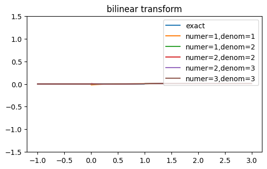

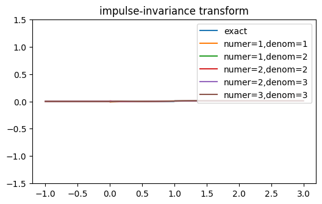

- `approximate_hyperbolic_trig(method, order, numer_order)` approximates hyperbolic trig. functions with rational functions.  This expands hyperbolic trig. functions using `expand_hyperbolic_trig` and then uses `approximate_exp`.  For example::

   >>> cosh(s).approximate_hyperbolic_trig(order=1)
   2 - s   s + 2
   ───── + ─────
   s + 2   2 - s

- `approximate_fractional_power(method, order)` approximates `s**a` where `a` is fractional with a rational function.

- `approximate_numer_order(order)` approximate expression by reducing order
    of numerator to specified order

- `approximate_denom_order(order)` approximate expression by reducing order
    of denominator to specified order

- `approximate_order(order)` approximate expression by reducing order to specified order

- `approximate(method, order, numer_order)` applies many of the approximations.

- `prune_HOT(degree)` prunes higher order terms if expression is a polynomial so that resultant approximate expression has the desired degree.

The default approximation method, and the only supported method at
present, is a Pade approximant.

.. _parameter_estimation:

Parameter estimation
--------------------

Expression parameters can be estimated using non-linear least squares
optimization.  This is performed by the `estimate()` method.  For example:

    >>> from numpy import arange
    >>> from numpy.random import randn
    >>> e = expr('a * exp(-t  / tau) * u(t)')
    >>> tv = arange(1, 100)
    >>> vv = e.subs({'a': 1, 'tau': 10}).evaluate(tv) + randn(len(tv)) * 0.05
    >>> results = e.estimate(tv, vv, ranges={'a': (0, 10), 'tau': (1, 20)})
    >>> results.params
    {'a': 1.0295857498103738, 'tau': 9.617626581003838}
    >>> results.rmse
    0.0022484512868559342

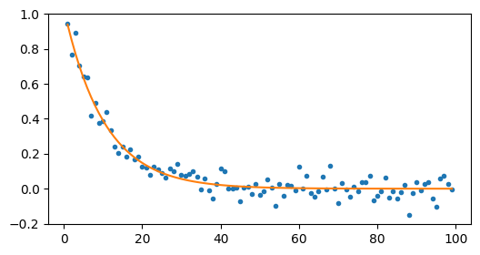

Here's another example using the frequency domain:

    >>> e = expr('a * exp(-t  / tau) * u(t)')
    >>> E = e(f)
    >>> fv = arange(100)
    >>> Vv = E.subs({'a': 1, 'tau': 10}).evaluate(fv)
    >>> results = E.estimate(fv, Vv, ranges={'a': (0, 10), 'tau': (1, 20)})
    >>> results.params
    {'a': 0.999999482934574, 'tau': 10.000006318373696}
    >>> results.rmse
    1.3283205831942986e-14

The first argument to the `estimate()` method is a NumPy array of values
for the dependent variable and the second argument is a NumPy array of
values for the independent variable.

The `ranges` argument is a dictionary of search ranges (specified as a
tuple) for each unknown parameter in the expression.  For the curve
fitting methods, the average of each search range is used as the
initial guess.

`estimate()` has a `method` argument.  This can be `brute`, `lm`,
`dogbox`, `Nelder-Mead`, `Powell`, `trf` (default), and many others.
See SciPy `scipy.optimize.curve_fit`, `scipy.optimize.brute`, and
`scipy.optimize.minimize` for other methods and parameters.  Note, the
`brute` method is good for finding a global optimum but its execution
time is exponential in the number of parameters.

A typical application is finding the model parameters given measured
impedance data.  For example, consider a series R, L, C network model
with impedance measurements stored in an array `Zv` evaluated at
frequencies specified by a frequency array `fv`.  The model parameters
can be estimated using:

   >>> (R('R') + L('L') + C('C')).Z.estimate(fv, Zv,
   ... {'R': (10, 100), 'C': (1e-9, 1e-6), 'L': (1e-6, 100e-6)}).params

The dictionary argument specifies the search ranges for each parameter.

The `estimate()` method also has an `iterations` argument.  If this is
greater than 1, then it controls the number of iterations to perform
while trying to remove outliers from the data.  For example:

   >>> q = expr('x * 3 + a', var='x')
   >>> xv = arange(10)
   >>> yv = q.subs('a', 4).evaluate(xv)
   >>> y[5] = -100
   >>> a = q.estimate(xv, yv)
   >>> a.params
   {'a': -7.899999937589999}
   >>> a = q.estimate(xv, yv, iterations=5)
   >>> a.params
   {'a': 3.999999999999999}

Assumptions
===========

SymPy relies on assumptions to help simplify expressions.  In
addition, Lcapy requires assumptions to help determine inverse Laplace
transforms.

There are several attributes for determining assumptions:

- `is_dc` -- constant

- `is_ac` -- sinusoidal

- `is_causal` -- zero for :math:`t < 0`

- `is_unknown` -- unknown for :math:`t < 0`

- `is_real` -- real

- `is_complex` -- complex

- `is_positive` -- positive

- `is_integer` -- integer

For example:

   >>> t.is_complex
   False
   >>> s.is_complex
   True

The `ac`, `dc`, `causal`, and `unknown` assumptions are lazily
determined.  If unspecified, they are inferred prior to a Laplace
transform.

Assumptions for symbols
-----------------------

The more specific the assumptions are, the easier it is for SymPy to solve
an expression.  For example::

   >>> C_1 = symbol('C_1', positive=True)

is more appropriate for a capacitor value than::

   >>> C_1 = symbol('C_1', complex=True)

Notes:

   1. By default, the `symbol` and `expr` functions assume `positive=True` unless `real=True` or `positive=False` are specified.
   2. SymPy considers variables of the same name but different assumptions to be different.  This can cause much confusion since the variables look identical when printed.  To avoid this problem, Lcapy creates a symbol cache for each circuit.  The assumptions associated with the symbol are from when it was created.

The list of explicit assumptions for an expression can be found from
the `assumptions` attribute.  For example::

   >>> a = 2 * t + 3
   >>> a.assumptions
   {'real': True}

The `assumptions0` attribute shows all the assumptions assumed by SymPy.

Assumptions for inverse Laplace transform
-----------------------------------------

Lcapy uses the :math:`\mathcal{L}_{-}` unilateral Laplace transform
(see :ref:`laplace_transforms`).  This ignores the function for
:math:`t <0` and thus the unilateral inverse Laplace transform cannot
determine the result for :math:`t <0` unless it has additional
information.  This is provided using assumptions:

-  `unknown` says the signal is unknown for :math:`t < 0`.  This is the default.

-  `causal` says the signal is zero for :math:`t < 0`.

-  `damped_sin` says to write response of a second-order system as a damped sinusoid.

For example::

   >>> H = 1 / (s + 2)
   >>> H(t)
    -2⋅t
   e      for t ≥ 0

   >>> H(t, causal=True)
    -2⋅t
   e    ⋅Heaviside(t)

   >>> h = cos(6 * pi * t)
   >>> H = h(s)
   >>> H
       s
   ──────────
    2       2
   s  + 36⋅π
   >>> H(t)
   {cos(6⋅π⋅t)  for t ≥ 0

.. _discrete-time-approximation:

Discrete-time approximation
===========================

A continuous-time signal can be approximated by a discrete-time signal
using the `discretize()` method.  There are many methods but no
universally best method since there is a trade-off between accuracy
and stability.

The simplest method samples the continuous-time signal:

.. math::

   v[n] = v(n \Delta t).

However, this method does not work if the continuous-time signal has
Dirac deltas.  An example is the impulse response of a transfer
function that is a pure delay or is not-strictly proper.

Other methods instead approximate the Laplace transform of the
continuous-time signal in the Z-domain, and inverse Z-transform the
result.  These methods use different approximations for :math:`s =
\ln(z) / \Delta t`. For example, the bilinear transform uses:

.. math::

   s = \frac{2}{\Delta t} \frac{1 - z^{-1}}{1 + z^{-1}}.

With an impulse response, it is common to scale the discrete-time
approximation by :math:`\Delta t`, i.e.,

.. math::

   h[n] = \Delta t \; h(n \Delta t).

This corrects the scaling when approximating a continuous-time
convolution integral by a discrete-time convolution sum.  Lcapy makes
this scaling decision on the basis of the expression quantity.  If the
expression is an admittance, impedance, or transfer function, the time
signal is treated as an impulse response and so the :math:`\Delta t`
scaling is applied.

The default discretization method is 'bilinear'.  Other methods are:

- 'impulse-invariance' samples the impulse response (using :math:`t = n \Delta t`) and then converts to the Z-domain.  It does not work with transfer functions that are not strictly proper (high-pass, band-pass) since these have impulse responses with Dirac deltas that cannot be be sampled.  It requires the sampling frequency to be many times the system bandwidth to avoid aliasing.

- 'bilinear', 'tustin', 'trapezoidal' uses :math:`s = \frac{2}{\Delta t}  (1 - z^{-1}) / (1 + z^{-1})`.  This is equivalent to trapezoidal integration.   The overall result is divided by :math:`\Delta t`.

- 'generalized-bilinear', 'gbf' uses :math:`s = \frac{1}{\Delta t}
  \frac{1 - z^{-1}}{\alpha + (1 - \alpha) z^{-1})}` (:math:`\alpha = 0`
  corresponds to forward Euler, :math:`\alpha = 0.5` corresponds to bilinear,
  and :math:`\alpha = 1` corresponds to backward Euler).  The overall result is divided by :math:`\Delta t`.

- 'euler', 'forward-diff', 'forward-euler' uses :math:`s = \frac{1}{\Delta t}  (1 - z^{-1}) / z^{-1}`.  The overall result is divided by :math:`\Delta t`.

- 'backward-diff', 'backward-euler' uses :math:`s = \frac{1}{\Delta t}  (1 - z^{-1}).`  The overall result is divided by :math:`\Delta t`.

- 'simpson' uses :math:`s = \frac{3}{\Delta t} (z^2 - 1) / (z^2 + 4
  z + 1)`.  This is equivalent to integration with Simpsons's rule.
  The overall result is divided by :math:`\Delta t`.  Note, this method
  can be more accurate but doubles the order and can lead to
  instability.

- 'matched-Z', 'zero-pole-matching' matches poles and zeros where
  :math:`s + \alpha = (1 - \exp(-\alpha \Delta t) / z)`.  The overall
  result is divided by :math:`\Delta t`.  When the expression has no
  zeros, the matched-Z and impulse invariance methods are equivalent.

The following figure compares the impulse responses computed using
some of these methods for a continuous-time impulse response
:math:`\exp(-t) u(t)`.  The matched-Z method gives the same answer as
the impulse-invariance method since the Laplace transform of the
impulse response has no zeros.  For this example, the bilinear and impulse-invariance methods give the same response for :math:`n > 0`.

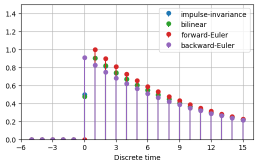

.. _plotting:

Plotting
========

Lcapy can generate many types of plot, including Bode plots, Nyquist plots, pole-zero plots, and lollipop (stem) plots.  Labels are automatically generated but can be changed.

Expressions have a `plot()` method.  Each domain has different behaviour.   Here's an example:

   >>> cos(2 * t).plot()

.. image:: examples/plotting/cos1.png
   :width: 12cm

You can control the range for the time values using a tuple::

   >>> cos(2 * t).plot((-5, 5))

.. image:: examples/plotting/cos2.png
   :width: 12cm

Alternatively, a NumPy array can be used::

   >>> from numpy import linspace
   >>> vt = linspace(-5, 5, 200)
   >>> cos(2 * t).plot(vt)

.. image:: examples/plotting/cos3.png
   :width: 12cm

The returned value from the `plot()` method is a Matplotlib axes
object (or a tuple if more than one set of axes are used, say for a
magnitude/phase plot).  This is useful to overlay plots, for example::

   >>> from numpy import linspace
   >>> vt = linspace(-5, 5, 200)
   >>> axes = cos(2 * t).plot(vt, label='cos')
   >>> sin(2 * t).plot(vt, label='sin', axes=axes)
   >>> axes.legend()

.. image:: examples/plotting/sincos1.png
   :width: 12cm

You can create your own Matplotlib axes and use this for plotting::

   >>> from matplotlib.pyplot import subplots
   >>> from numpy import linspace
   >>> vt = linspace(-5, 5, 200)
   >>> figs, axes = subplots(1)
   >>> cos(2 * t).plot(vt, axes=axes, label='cos')
   >>> sin(2 * t).plot(vt, axes=axes, label='sin')
   >>> axes.legend()

Finally, you can manage all the plotting yourself, for example::

   >>> from matplotlib.pyplot import subplots
   >>> from numpy import linspace
   >>> vt = linspace(-5, 5, 200)
   >>> figs, axes = subplots(1)
   >>> axes.plot(vt, cos(2 * t).evaluate(vt), label='cos')
   >>> axes.plot(vt, sin(2 * t).evaluate(vt), label='sin')
   >>> axes.legend()

Pole-zero plots
---------------

The `plot()` method for Laplace-domain expressions generates a pole-zero plot, for example:

.. literalinclude:: examples/netlists/tf1-pole-zero-plot.py

.. image:: examples/netlists/tf1-pole-zero-plot.png
   :width: 12cm

Frequency-domain plots
----------------------

Here's an example of the `plot()` method for Fourier-domain expressions:

.. literalinclude:: examples/netlists/tf1-bode-plot.py

.. image:: examples/netlists/tf1-bode-plot.png
   :width: 12cm

The type of plot for complex frequency-domain expressions is
controlled by the `plot_type` argument.  By default this is `dB-phase`
for complex expressions which plots both the magnitude as dB and the
phase.  Other choices are `real`, `imag`, `magnitude`, `phase`,
`real-imag`, `magnitude-phase`, `dB`, `degrees`, and `radians`.

Frequencies are shown on a linear scale by default.  A logarithmic
scale is used if `log_frequency=True` is specified.

Magnitudes are shown on a linear scale by default.  A logarithmic
scale is used if `log_magnitude=True` is specified.

Phases are wrapped unless `unwrap=True` is specified to avoid
discontinuities of math:`\pi`.

The frequency domain `plot()` method returns the axes used in the plot.
If there are two sets of axes, such as for a magnitude/phase or
real/imaginary plot, these are returned as a tuple.  For example::

  >>> A = 1 / (j * 2 * pi * f)
  >>> axm, axp = A.plot()

  >>> A = 1 / (j * 2 * pi * f)
  >>> ax = abs(A).plot()

Bode plots
----------

Bode plots are similar to frequency domain plots but plot both the magnitude (in dB) and the phase (in radians) as a function of logarithmic frequency.  The phase is unwrapped by default to avoid discontinuities of :math:`\pi`.

.. literalinclude:: examples/plotting/bode1.py

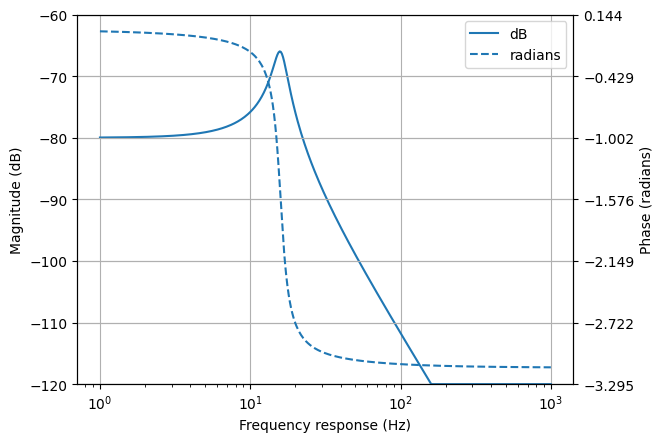

By default, a Bode plot of a Laplace domain expression is shown with
linear frequencies (in hertz).  This can be changed to angular
frequencies (in radians) using the `var=omega` argument to the
`bode_plot()` method.

The frequency response of Laplace domain expressions is calculated
using the substitution :math:`s = j \omega`.  Note, this does not
correctly calculate the DC component for expressions that have an
unstable impulse response.

Nyquist plots
-------------

Nyquist plots plot the imaginary part of a frequency response expression against the real part.

.. literalinclude:: examples/plotting/nyquist1.py

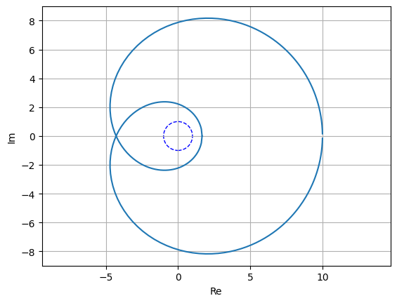

By default, the points on the plot are geometrically spaced; this can be disabled with `log_frequency=False`.

The unit circle is shown by default.  This can be disabled with `unitcircle=False`.

Nichols plots
-------------

Nichols plots plot the magnitude of the frequency response in dB versus the phase of the frequency response in radians.

.. literalinclude:: examples/plotting/nichols1.py

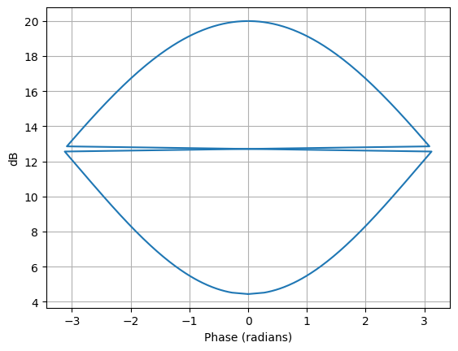

By default, the points on the plot are geometrically spaced; this can be disabled with `log_frequency=False`.

Phasor plots
------------

Phasors are plotted on a polar graph, for example::

   >>> phasor(1 + j).plot()

.. image:: examples/plotting/phasor1.png
   :width: 8cm

Discrete-time plots
-------------------

Discrete-time signals are plotted as stem (lollipop) plots, for example::

   >>> cos(2 * n * 0.2).plot()

.. image:: examples/plotting/lollipop1.png
   :width: 12cm

Complex discrete-time signals can also be plotted in polar format, for example::

   >>> x = 0.9**n * exp(j * n * 0.5)
   >>> x.plot((1, 10), polar=True)

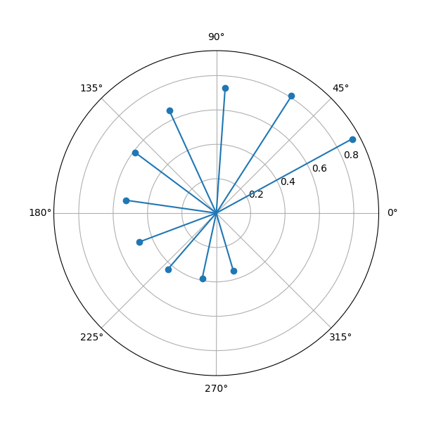

Dirac deltas
------------

Dirac deltas in a time domain or discrete-time domain expression are plotted as arrows.  For example:

.. literalinclude:: examples/plotting/deltas.py

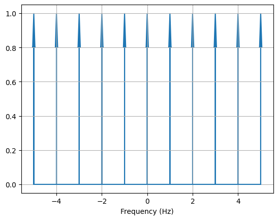

Plot customisation
------------------

The `plot()` method has a number of generic keyword arguments to customise the plots.   These include:

- `xlabel` sets the xlabel string

- `ylabel` sets the ylabel string

- `title` sets the title string

For example::

   >>> H = s / (s + 2)
   >>> H.plot(xlabel=r'$\sigma$', ylabel=r'$\omega$', title='Pole zero plot')

Alternatively, this can be achieved using::

   >>> H = s / (s + 2)
   >>> ax = H.plot()
   >>> ax.set_xlabel(r'$\sigma`)
   >>> ax.set_ylabel(r'$\omega`)
   >>> ax.set_title('Pole zero plot')

Other keyword arguments are passed to the matplotlib plot routines.  For example::

   >>> H = s / (s + 2)
   >>> H.plot(markersize=20)

The best way to customise plots is to create a matplotlib style file.  For example,

   >>> from matplotlib.pyplot import style
   >>> style.use('polezero.mplstyle')
   >>> H = s / (s + 2)
   >>> H.plot()

where polezero.mplstyle might contain

   ``lines.markersize = 20``

   ``font.size = 14``

Matplotlib has many pre-defined styles, see https://matplotlib.org/stable/gallery/style_sheets/style_sheets_reference.html .

.. _parameterization:

Parameterization
================

Lcapy can parameterize an expression into zero-pole-gain (ZPK) form with the `parameterize_ZPK()` method.  For example::

   >>> H = (5*s**2 + 5) / (s**2 + 5*s + 4)
   >>> H1, defs = H.parameterize_ZPK()
   >>> H1
      (s - z₁)⋅(s - z₂)
   K⋅───────────────────
     (-p₁ + s)⋅(-p₂ + s)
   >>> defs
   {K: 5, p1: -1, p2: -4, z1: -ⅉ, z2: ⅉ}

Note, SymPy likes to print `p` before `s` and hence `-p1 + s` rather than `s - p1`.

`defs` is a dictionary of definitions; it can be substituted into the parameterized expression to obtain the original expression::

   >>> H1.subs(defs)
        3
   ────────────
    2
   z  + 5⋅z + 4

Lcapy can parameterize a number of first order, second order, and third order s-domain expressions into common forms.  For example::

   >>> H1 = 3 / (s + 2)
   >>> H1p, defs = H1.parameterize()
   >>> H1p
     K
   ─────
   α + s
   >>> defs
   {K: 3, alpha: 2}

Here `defs` is a dictionary of the parameter definitions.

The original expression can be obtained by substituting the parameter definitions into the parameterized expression:

   >>> H1p.subs(defs)
     3
   ─────
   s + 2

Here's a second order example:

   >>> H2 = 3 / (s**2 + 2*s + 4)
   >>> H2p, defs = H2.parameterize()
   >>> H2p
              K
   ───────────────────
     2               2
   ω₀  + 2⋅ω₀⋅s⋅ζ + s

   >>> defs
   {K: 3, omega_0: 2, zeta: 1/2}

Second order systems can be parameterized in many ways.  Here's another example:

   >>> H2p, defs = H2.parameterize(zeta=False)
   >>> H2p
               K
   ───────────────────────
     2    2              2
   ω₁  + s  + 2⋅s⋅σ₁ + σ₁

   >>> defs
   {K: 3, omega_1: √3, sigma_1: 1}

.. _network-synthesis:

Network synthesis
=================

Lcapy has experimental support for a number of network synthesis.
This produces a network model from an s-domain impedance or admittance
expression.  There are many methods, some specifically for simple
network such as R-L networks, and more general methods including
Foster and Cauer synthesis.

    >>> Z = impedance((4*s**2 + 3 * s + one / 6) / (s**2 + 2 * s / 3))
    >>> n = Z.network('cauerI')
    >>> n
    ((C(1) + R(2)) | C(3)) + R(4)
    >>> n.Z(s).canonical()

    :math:`\frac{4 s^{2} + 3 s + \frac{1}{6}}{s^{2} + \frac{2 s}{3}}`

    >>> n.draw(form='ladder')

Note, in this example `one` is used to avoid generating a floating-point number `1 / 6`.
An alternative approach to use quotes around the expression (see :ref:`floating-point`)::

    >>> Z = impedance('(4*s**2 + 3 * s + 1 / 6) / (s**2 + 2 * s / 3)')

.. _special-functions:

Special functions
=================

Heaviside unit step H(t)
------------------------

The Heaviside unit step is defined as

.. math::

   \mathop{\mathrm{sign}}(t) =
   \begin{cases}
   0   & t < 0 \\
   0.5 & t = 0 \\
   1   & t > 0
   \end{cases}

Note, the definition `H(0) = 0.5` is consistent with `sign(0) = 0` (as
used with SymPy and NumPy) using the relation:

.. math::

   H(t) = \frac{1}{2}(1 + \mathop{\mathrm{sign}}(t))

Note, there is also a related discrete-time function called `unitstep`.

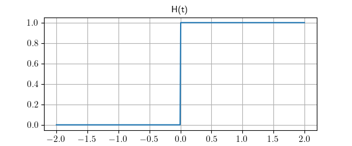

Signum function sign(t)
-----------------------

The signum function `sign(t)` is defined in terms of the Heaviside function as:

.. math::

   \mathop{\mathrm{sign}}(t) = 2 \mathop{\mathrm{H}}(t) - 1

and thus:

.. math::

   \mathop{\mathrm{sign}}(t) =
   \begin{cases}
   -1 & t < 0 \\
   0  & t = 0 \\
   1  & t > 0
   \end{cases}

Note, there is also a related discrete-time signum function.

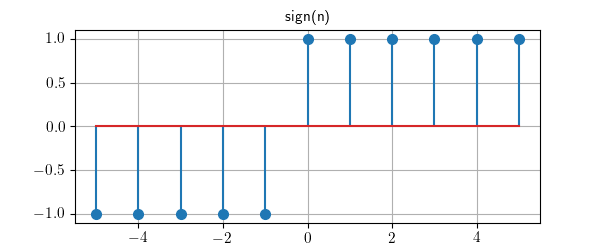

Ramp function ramp(t)
---------------------

The rectangle function `ramp(t)` is defined in terms of the Heaviside step as

.. math::

   \mathop{\mathrm{ramp}}(t) = t H(t)

In other words

.. math::

   \mathop{\mathrm{ramp}}(t) =
   \begin{cases}
   0 & t < 0 \\
   t & t > 0
   \end{cases}

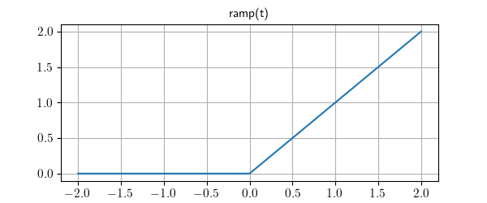

Rampstep function rampstep(t)
-----------------------------

The rectangle function `rampstep(t)` is defined in terms of the
ramp function as

.. math::

   \mathop{\mathrm{rampstep}}(t) = \mathop{\mathrm{ramp}}(t) - \mathop{\mathrm{ramp}}(t - 1)

or in terms of the Heaviside's step as

.. math::

   \mathop{\mathrm{rampstep}}(t) = t H(t) - (t - 1) H(t - 1)

In other words

.. math::

   \mathop{\mathrm{rampstep}}(t) =
   \begin{cases}
   0 & t < 0 \\
   t & 0 \le t \le 1 \\
   1 & t > 1
   \end{cases}

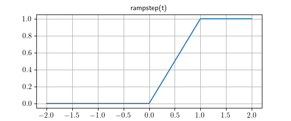

Rectangle function rect(t)
--------------------------

The rectangle function `rect(t)` is defined in terms of the Heaviside step as

.. math::

   \mathop{\mathrm{rect}}(t) = H(t + 1 / 2) - H(t - 1 / 2)

With the assumption `H(0) = 0` then `rect(0.5) = 0.5`.  In other words

.. math::

   \mathop{\mathrm{rect}}(t) =
   \begin{cases}
   0 & t < -0.5 \\
   -0.5 & t = 0.5 \\
   1  & -0.5 \lt t \lt  0.5 \\
   0.5 & t = 0.5 \\
   0  & t > 0.5
   \end{cases}

Note, there is also a related discrete-time rectangle `dtrect` defined
in terms of the discrete-time unit step function.

.. image:: examples/functions/rect.png
   :width: 12cm

A casual rect function can be created by a shift of 0.5.

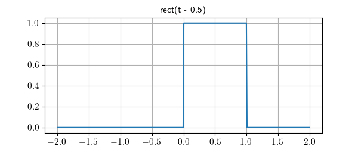

Triangle function tri(t)
------------------------

The triangle function `tri(t)` is the convolution of `rect(t)` and `rect(t)`.

It can be described in terms of the ramp function as

.. math::

   \mathop{\mathrm{tri}}(t) = \mathop{\mathrm{ramp}}(t + 1) - 2 \mathop{\mathrm{ramp}}(t) + \mathop{\mathrm{ramp}}(t - 1)

or in terms of Heaviside's step as

.. math::

   \mathop{\mathrm{tri}}(t) = (t + 1) H(t + 1) - 2 t H(t) + (t - 1) H(t - 1)

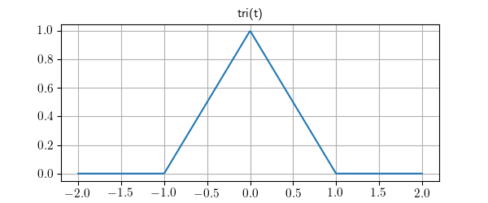

A casual triangle function can be created by a shift of 1.

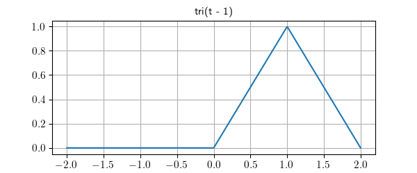

Trapezoid function trap(t, alpha)
---------------------------------

The trapezoid function `trap(t, alpha)` is the convolution of `rect(t
/ alpha)` and `rect(t)`. The parameter `alpha` is the normalized
rise/fall time.  When `alpha = 0` it is equivalent to `rect(t)` and
when `alpha = 1` it is equivalent to `tri(t)`.

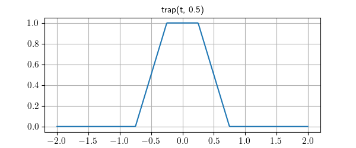

A casual trap function can be created by a shift of `(1 + alpha) / 2`.

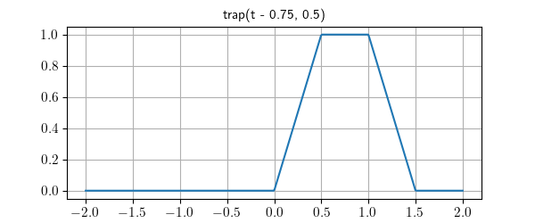

Cardinal sine function sinc(t)
------------------------------

Lcapy uses the normalized form of the `sinc` function (cardinal sine),

.. math::

    \mathop{\mathrm{sinc}}(t) = \mathop{\mathrm{sincn}}(t) = \frac{\sin(\pi t)}{\pi t}.

This definition is the same as NumPy but SymPy uses the unnormalized form

.. math::

    \mathop{\mathrm{sinc}}(t) = \mathop{\mathrm{sincu}}(t) = \frac{\sin(t)}{t}.

Note, Lcapy prints `sinc` as `sincn` due to a bug in SymPy.  This is likely to change in the future.

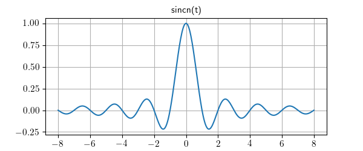

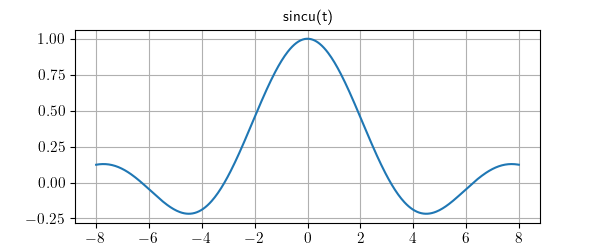

Periodic sinc function psinc(M, t)
----------------------------------

The periodic sinc `psinc` function is defined as

.. math::

    \mathop{\mathrm{psinc}}(M, t) = \frac{\sin(M \pi t)}{M \sin(\pi t)}

It is sometimes called the aliased sinc function and is similar to the Dirichlet function, usually defined as

.. math::

    D_M(t) = \frac{\sin(M t / 2)}{M \sin(t / 2)}

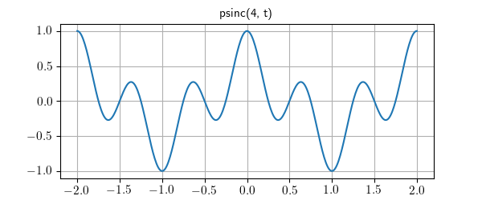

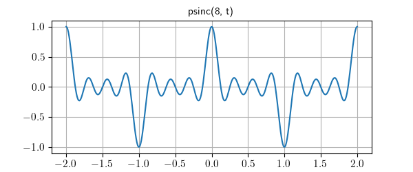

Note, `psinc(2, t)` is equivalent to `cos(pi * t)`.

Discrete-time unit step u[n]
----------------------------

The discrete-time unit step is defined as

.. math::

   \mathop{\mathrm{u}}[n] =
   \begin{cases}
   0 & n < 0 \\
   1  & n \gt 0
   \end{cases}

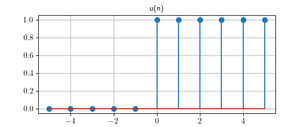

Discrete-time unit impulse delta[n]
-----------------------------------

The discrete-time unit impulse is defined as

.. math::

   \mathop{\delta}[n] =
   \begin{cases}
   0  & n < 0 \\
   1  & n = 0 \\
   0  & n > 0
   \end{cases}

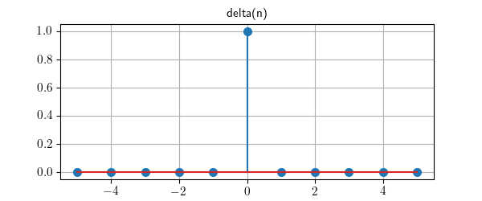

Discrete-time rectangle function rect[n]
----------------------------------------

The discrete-time rectangle function `rect[n]` is defined in terms of
the discrete-time unit step function as:

.. math::

   \mathop{\mathrm{rect}}[n] = \mathop{\mathrm{u}}[n + 1 / 2] - \mathop{\mathrm{u}}[n - 1 / 2]

With this definition:

.. math::

   \mathop{\mathrm{rect}}[n] =
   \begin{cases}
   0 & n < -0.5 \\
   1  & -0.5 \le n \lt  0.5 \\
   0  & n > 0.5
   \end{cases}

Notes:

- Lcapy converts `rect(n)` to `dtrect(n)` for discrete-time signals and prints it as `rect[n]`.

- `dtrect(n/N)` produces a symmetrical result when `N` is odd.  When `N` is even, there is one more non-zero value for negative `n` compared to positive `n`.

- The internal name `dtrect` may change when I can think of something better.

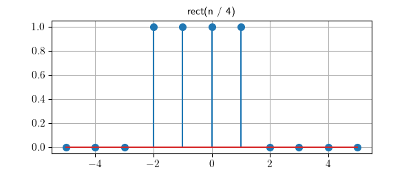

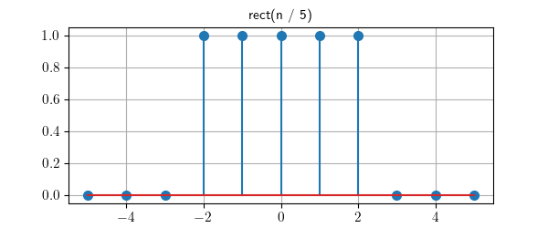

Discrete-time signum function sign[n]
-------------------------------------

The discrete-time signum function `sign[n]` is defined in terms of the
discrete-time unit step function as:

.. math::

   \mathop{\mathrm{sign}}[n] = 2 \mathop{\mathrm{u}}[n] - 1

and thus:

.. math::

   \mathop{\mathrm{sign}}[n] =
   \begin{cases}
   -1 & n < 0 \\
   1  & n \ge 0
   \end{cases}

Notes:

- Lcapy converts `sign(n)` to `dtsign(n)` for discrete-time signals and prints it as `sign[n]`.

- The internal name `dtsign` may change when I can think of something better.

Expression manipulation tips
============================

SymPy expressions
-----------------

Lcapy does not support all the SymPy functions.  However, the
underlying SymPy expression can be obtained using the `sympy`
attribute of an Lcapy expression.  For example::

   >>> a = 2 * t + 3
   >>> a.sympy
   2⋅t + 3

The result can then be converted back to an Lcapy expression using the
`expr()` function.

Functions
---------

Lcapy functions are a wrapper around a SymPy function that converts
Lcapy expression arguments into SymPy expressions and converts the
result into an Lcapy expression.

Lcapy does not explicitly support all the SymPy functions.  However, a
SymPy function can be made into an Lcapy function using the `Function`
class, for example::

   >>> import sympy
   >>> from lcapy import Function
   >>> gamma = Function(sympy.Gamma)

The `Integral` and `Derivative` functions are not evaluated unlike the
corresponding `integrate` and `diff` functions.  The evaluation can be
performed using the `doit()` method.

Undefined functions can be created by passing a string name to `Function`::

   >>> from lcapy import Function
   >>> g = Function('g')
   >>> g
   g
   >>> g(t)
   g(t)
   >>> g(t)(s)
   G(s)

Assumptions
-----------

Correct assumptions are required for Lcapy (and SymPy) to simplify
expressions.  Note, there are two sets of assumptions.  Firstly there
are assumptions that Lcapy maintains for an Lcapy expression.  These
can be found with the `assumptions` attribute.  Secondly, there are
assumptions that SymPy uses for a symbol.  These can be found with the
`assumptions0` attribute.  For example::

   >>> t.assumptions
   {'real': True}

   >>> t.assumptions0
   {'real': True,
   'complex': True,
   'infinite': False,
   'hermitian': True,
   'commutative': True,
   'finite': True,
   'imaginary': False,
   'extended_real': True}

   >>> x = symbol('x', positive=True, integer=True)
   >>> x.assumptions0
   {'positive': True,
   'complex': True,
   'nonpositive': False,
   'infinite': False,
   'nonzero': True,
   'hermitian': True,
   'extended_nonzero': True,
   'zero': False,
   'real': True,
   'commutative': True,
   'extended_negative': False,
   'negative': False,
   'extended_nonnegative': True,
   'extended_nonpositive': False,
   'finite': True,
   'imaginary': False,
   'nonnegative': True,
   'extended_real': True,
   'extended_positive': True,
   'integer': True,
   'algebraic': True,
   'rational': True,
   'irrational': False,
   'noninteger': False,
   'transcendental': False}

Note, the symbol `x` has `positive`, `integer`, `real`, and `complex`
attributes since it is represents a positive integer value, integers
are in the set of reals, and the reals are within the set of complex
numbers.  However, it is not a complex value::

  >>>  x.is_complex
  False

Parameterization
----------------

Symbolic expressions can get unwieldy.  One approach is to
parameterize an expression using the `parameterize()` method, perform
manipulations, and then substitute for the parameter definitions.
