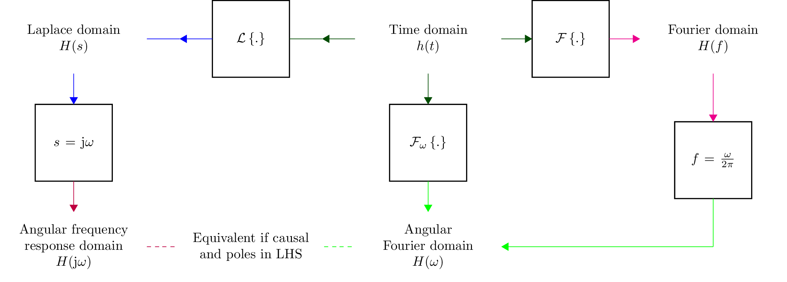
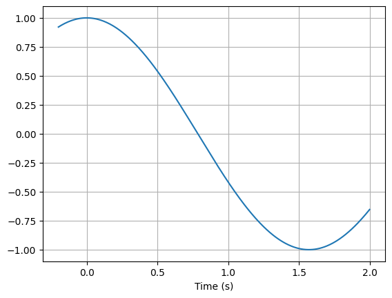
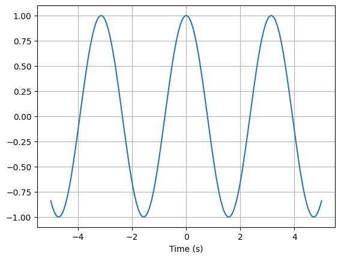
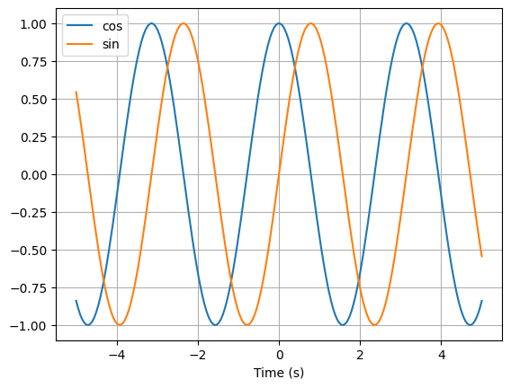
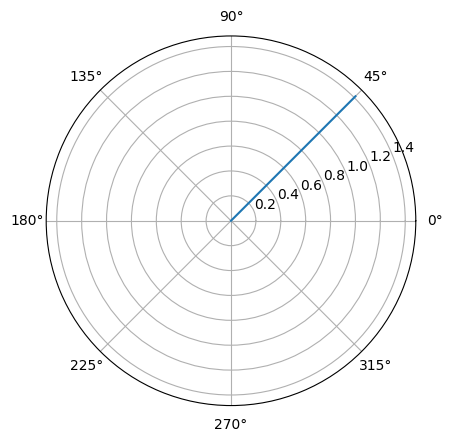
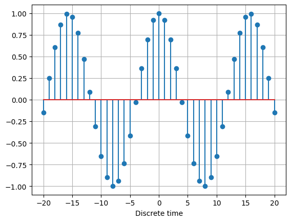

.. _expressions:

===========
Expressions
===========

Lcapy expressions are similar to SymPy expressions except they have a
specific domain depending on the predefined domain variables `t`, `s`, `f`,
`omega` (`w`), and `jomega` (`jw`).   They can also have associated quantities and units.

Symbols
=======

Lcapy has a number of pre-defined constants, variables, and functions.

Constants
---------

- `pi` 3.141592653589793...

- `j`  :math:`\sqrt{-1}`

- `oo` infinity

- `zoo` complex infinity

- `one` 1  

  
Numbers
-------
  
Lcapy approximates real numbers as rationals.  This ensures expected simplifications of expressions.   However, some floating point numbers produce unwieldy rationals (see :ref:`floating-point`) and so it is best to avoid floating point numbers.  For example, use::

   >>> expr('2 / 3')

or

   >>> expr(one * 2 / 3)

rather than

   >>> expr(2 / 3)

The floating point approximation can be found using `fval` attribute for a Python float or `cval` for a Python complex number::

  >>> expr(2 / 3).fval
  0.166666666666667

  >>> expr(2 / 3).cval
  (0.16666666666666666+0j)

Rational numbers in Lcapy expressions can be converted to SymPy floating point numbers using the `evalf()` method, with a specified number of decimal places.   For example::

  >>>expr('1 / 3 + a').evalf(5)
  a + 0.33333

   
.. _domainvariables:

Domain variables
----------------

Lcapy has five predefined domain variables for continuous time signals:

- `t` -- time domain

- `f` -- Fourier (frequency) domain

- `s` -- Laplace (complex frequency) domain

- `omega` (or `w`) -- angular Fourier domain

- `jomega` (or `jw`) -- phasor domain
  

A time-domain expression is produced using the `t` variable, for example::
  
   >>> e = exp(-3 * t) * u(t)

Similarly, a Laplace-domain expression is produced using the `s`
variable, for example::
  
   >>> V = s / (s**2 + 2 * s + 3)

There are an additional three domain variables for discrete-time signals (see :ref:`discrete_time`):
   
- `n` -- discrete-time domain

- `k` -- discrete-frequency domain

- `z` -- z-domain  

For example::

    >>> V = delta(n) + 2 * delta(n - 1) + 3 * delta(n - 3)
  

All Lcapy expressions have a domain (Laplace, Fourier, etc.) and a quantity (voltage, current, undefined) etc.   For example::

   >>> V = voltage(5 * t)
   >>> V.domain
   'time'
   >>> V.quantity
   'voltage'

   
User defined symbols
--------------------

Symbols can also be created with Lcapy's `symbol` function:

   >>> tau = symbol('tau', real=True)

They are also implicitly created from strings.  For example::
   
   >>> v = expr('exp(-t / tau) * u(t)')

or

   >>> v = voltage('exp(-t / tau) * u(t)')
   

Notes:

1. By default, symbols are assumed to be positive, unless explicitly specified not to be.

2. Redefining a symbol does not change the assumptions.  Instead, the symbol needs to be deleted with `symbol_delete` before being redefined.

3. There are restrictions on symbol names that can be used.  Currently, this excludes names that are Python keywords.  For example, `Is` is not allowed but `I_s` is valid.

4. Symbols created with the `symbol` or `symbols` function are printed
verbatim.  Otherwise, they are printed in a canonical form.  For
example, R1 is printed as R_1, even though it is stored as R1.  Lcapy
maintains a table of symbols that are not to be printed in canonical form.

5. Some symbols are previously defined by SymPy.  These are
   overwritten using `symbol` or `symbols` but not with `expr` unless
   the `override` argument is True.  For example::

   >>> mypi = symbol('pi')

   or

   >>> e = expr('pi / 4', override=True)

   In both cases, the special number symbol `pi` becomes an arbitrary
   symbol.

.. _expressionsfunctions:
   
Mathematical functions
----------------------

Lcapy has the following built-in functions: `sin`, `cos`, `tan`, `cot`,
`asin`, `acos`, `atan`, `atan2`, `acot`, `sinh`, `cosh`, `tanh`, `asinh`,
`acosh`, `atanh`, `gcd`, `exp`, `sqrt`, `log`, `log10`, `sign`,
`conjugate`, `rect`, `sinc`, `sincn`, `sincu`, `tri`, `trap`, `Heaviside`, `H`, `u`, `DiracDelta`, `delta`, `unitimpulse`, and `unitstep`.

Other SymPy functions can be converted to Lcapy functions using the
`Function` class, for example:

   >>> import sympy as sym
   >>> gamma = Function(sym.gamma)   
   >>> gamma(4)
   6

The trapezoid function `trap(t, alpha)` is the convolution of `rect(t
/ alpha)` and `rect(t)`. The parameter `alpha` is the normalised
rise/fall time.  When `alpha = 0` it is equivalent to `rect(t)` and
when `alpha = 1` it is equivalent to `tri(t)`.

Lcapy uses the normalised form of the `sinc` function (cardinal sine),
:math:`sin(\pi x) / (\pi x)`.  This is the same as NumPy but SymPy
uses the unnormalised form :math:`sin(x) / x`.  Lcapy uses `sincu` for
the latter and the alias `sincn` for `sinc`.  Note, Lcapy prints
`sinc` as `sincn` due to a bug in SymPy.  This is likely to change in
the future.

The periodic sinc `psinc` function is defined as :math:`sin(M \pi x) / (M sin(\pi x))`.

.. _domains:   

Domains
=======

Lcapy uses a variety of domains to represent signals.  This helps with
circuit analysis since time-domain convolutions simplify to
multiplications in the Fourier, Laplace, and phasor domains.  Lcapy
uses the following transform domains for circuit analysis:

- Constant domain for DC signals

- Phasor domain for AC signals

- Laplace domain (s-domain) for transient signals

- Fourier domain (and angular Fourier domain) for noise signals
  

The domain of an expression is usually determined from the pre-defined
domain variables (see :ref:`domainvariables`).  For example::

   >>> Z = impedance(3 * s)
   >>> Z.domain
   'laplace'  

However, this is not possible for constants.  One approach is to use::

   >>> Z = impedance(0 * s + 5)
   >>> Z.domain
   'laplace'

Alternatively, there are a number of functions for setting the domain:

- `cexpr()` set constant domain

- `fexpr()` set Fourier domain

- `omegaexpr()` set angular Fourier domain  
  
- `sexpr()` set Laplace domain

- `texpr()` set time domain

- `phasor()` set phasor domain  

For example::

   >>> Z = impedance(sexpr(5))
   >>> Z.domain
   'laplace'
  
There are restrictions on how expressions can be combined.  In
general, both expressions must be of the same domain and have
compatible quantities.  For example, you cannot do::

   >>> 5 * t + 4 * s
   ValueError: Cannot determine TimeDomainExpression(5*t) + LaplaceDomainExpression(4*s) since the domains are incompatible

Expressions can be transformed to different domains, see :ref:`transformation`.

.. _domainattributes:      

Domain attributes
-----------------

- `is_undefined_domain`
- `is_constant_domain`
- `is_time_domain`
- `is_laplace_domain`
- `is_fourier_domain`
- `is_angular_fourier_domain`
- `is_phasor_domain`
- `is_phasor_time_domain`
- `is_phasor_frequency_domain`    
- `is_discrete_time_domain`
- `is_discrete_fourier_domain`
- `is_Z_domain`
- `is_transform_domain`          

.. _quantities:

Quantities
==========

Each expression has a quantity (voltage, current, undefined, etc.).  When combining expressions, the quantity of the result is determined for the most common combination of electrical quantities.  For example::

   >>> V = current(1 / s) * impedance(2)
   >>> V.quantity
   'voltage'

However, there are restrictions on how expressions can be combined.  For example, you cannot do::

   >>> voltage(3) + current(4)
   ValueError: Cannot determine ConstantVoltage(3) + ConstantCurrent(4) since the units of the result are unsupported.
   As a workaround use x.as_expr() + y.as_expr()

There are a number of methods for changing the quantity of an expression:

- `as_expr()` removes the quantity  (it is set to 'undefined')
- `as_voltage()` converts to voltage
- `as_current()` converts to current
- `as_impedance()` converts to impedance
- `as_admittance()` converts to admittance
- `as_transfer()` converts to transfer function
- `as_power()` converts to power

There are similar functions for setting the quantity of an expression:
  
- `expr()` removes the quantity
- `voltage()` converts to voltage
- `current()` converts to current
- `impedance()` converts to impedance
- `admittance()` converts to admittance
- `transfer()` converts to transfer function  

An Lcapy quantity is not a strict quantity but a collection of related
quantities, For example, both voltage (with units V) and voltage spectral
density (with units V/Hz) are considered voltage quantities.  However, they have different units.

.. _quantityattributes:        

Quantity attributes
-------------------

Expressions have the following attributes to identify the quantity:

- `is_voltage`
- `is_current`
- `is_impedance`
- `is_admittance`
- `is_transfer`
- `is_immitance`
- `is_voltagesquared`
- `is_currentsquared`
- `is_impedancesquared`
- `is_admittancesquared`
- `is_power`

  
.. _units:

Units
=====

Expressions have an attribute `units` that reflect the quantity and domain.  For example::

   >>> voltage(7).units
   V
   >>> voltage(7 * f).units
   V 
   ──
   Hz
   >>> voltage(7 / s).units
   V
   ──
   Hz
   >>> voltage(7 * s).units
   V
   ──
   Hz
   >>> s.units
   rad
   ───
    s 

The units are a SymPy Expression and thus can be formatted as a
string, LaTeX, etc.  They can be automatically printed, for example::

   >>> state.show_units = True
   >>> voltage(7)
   7⋅V

Abbreviated units are employed by default, however, this can be disabled.  For example::

   >>> state.show_units = True
   >>> state.abbreviate_units = False
   >>> voltage(7)
   7⋅volt

By default, units are printed in the form they are created.  However,
they can be printed in a simplified canonical form::

   >>> state.show_units = True
   >>> current(7) * impedance(2)
   14⋅A⋅ohm
   >>> state.canonical_units = True
   >>> current(7) * impedance(2)
   14⋅V

Alternatively, the units can be simplified using the `simplify_units()` method::

   >>> state.show_units = True
   >>> V = current(7) * impedance(2)
   >>> V
   14⋅A⋅ohm   
   >>> V.simplify_units()
   14⋅V
   
The units are chosen as a function of quantity and domain when an
Lcapy expression is created and are modified by multiplications, divisions, and transformations, such as a Fourier transform.  Here are the default values::

    +-------------------+-----+-------+--------+------+--------+--------+-----+-----+-----+-----------+
    | Quantity/Domain   | dc  | t     | s      | f    | omega  | jomega | n   | k   | z   | noise f   |
    +-------------------+-----+-------+--------+------+--------+--------+-----+-----+-----+-----------+
    | Voltage           | V   | V     | V/Hz   | V/Hz | V/Hz   | V      | V   | V   | V   | V/sqrt(Hz)|
    +-------------------+-----+-------+--------+------+--------+--------+-----+-----+-----+-----------+
    | Current           | A   | A     | A/Hz   | A/Hz | A/Hz   | A      | A   | A   | A   | A/sqrt(Hz)|
    +-------------------+-----+-------+--------+------+--------+--------+-----+-----+-----+-----------+
    | Impedance         | ohm | ohm/s | ohm    | ohm  | ohm    | ohm    | ohm | ohm | ohm |           |
    +-------------------+-----+-------+--------+------+--------+--------+-----+-----+-----+-----------+
    | Admittance        | S   | S/s   | S      | S    | S      | S      | S   | S   | S   |           |
    +-------------------+-----+-------+--------+------+--------+--------+-----+-----+-----+-----------+
    | Transfer function | 1   | 1/s   | 1      | 1    | 1      | 1      | 1   | 1   | 1   |           |
    +-------------------+-----+-------+--------+------+--------+--------+-----+-----+-----+-----------+

Note, the transfer functions are assumed to be voltage or current ratios in the Laplace and Fourier domains.  Voltage and current ratios are represented by impedances and admittances.    

Unit determination goes awry when some mathematical functions are used.  For example::

   >>> log(voltage(7)).units
   V

.. _unitattributes:      

Unit attributes
---------------

Expressions have the following attributes for units:

- `units` returns the units as a SymPy expression

- `canonical_units` returns the units as a SymPy expression in canonical form (`volt * ampere` is converted to watts, `1 / s` is converted to `Hz`, etc.)

- `expr_with_units` returns a SymPy expression multiplied by the units

Signals and transfer functions
==============================

Lcapy expressions represent signals or the behaviour of a system.

Signals are voltage or current quantities (or their products such as
instantaneous power).  The signals are either driving functions
(excitation functions) or responses (such as the voltage across a
component or the current through a component).  Signals can be
constant (DC), AC, transient, or a combination of AC, DC, and
transient.  A causal signal is zero for :math:`t < 0`.

The behaviour of a system is described in a transfom domain (Laplace,
Fourier, or phasor) by a transfer function.  This is the ratio of two
transformed signals, for example, :math:`H(s) = V_2(s) / V_1(s)`.
Impedances, :math:`Z(s) = V(s) / I(s)`, and admittances, :math:`Y(s) =
I(s) / V(s)`, are a special kind of transfer function.

The time domain representation of a transfer function, :math:`H(s)`, is called the impulse response, :math:`h(t)`.  For a causal system, :math:`h(t) = 0` for :math:`t < 0`.

.. _expressionsrationalfunctions:
   
Rational functions
------------------

Linear time-invariant systems have transfer functions that are rational functions; the ratio of two polynomials:

.. math::
   H(s) = \frac{N(s)}{D(s)},

The numerator can be found using the `N` attribute and denominator can
be found using the `D` attribute.   For example::

  >>> Z = impedance((5 * s) / (s**2 + 5 * s + 6))
         5⋅s     
   ────────────
    2          
   s  + 5⋅s + 6
   >>> Z.N
   5⋅s
   >>> Z.D
    2          
   s  + 5⋅s + 6

.. _expressionsresponses:
   
Responses
---------

Usually, s-domain responses are rational functions but if there is a time delay there is an additional exponential factor.  So, in general, Lcapy tries to interpret responses as

.. math::
   V(s) = \sum_{i} \frac{N_i(s)}{D(s)} \exp(-s \tau_i),

where :math:`\tau_i` are time delays.   This representation is returned by the `as_sum()` method.  Note, these expressions cannot be represented in :ref:`ZPK`.  The `D` attribute returns :math:`D(s)` and the `N` attribute returns

.. math::
   N(s) = \sum_{i} N_i(s) \exp(-s \tau_i).

.. _expressionsattributes:     

Attributes
==========

All Lcapy expressions have the following attributes (see :ref:`expressionsrationalfunctions` and :ref:`expressionsresponses` for definitions of numerator and denominator):

- `abs` returns absolute value

- `angle` returns phase angle (radians)
  
- `cartesian` returns expression in form `real + j * imag`

- `conjugate` returns complex conjugate

- `cval` returns complex floating point number (as Python complex) if expression can be evaluated (see also `val`, `fval`, and `evalf()`)  

- `dB` returns magnitude in decibels: `20 * log10(magnitude)`

- `D` returns denominator

- `Ddegree` returns degree of denominator

- `denominator` returns denominator

- `degree` returns degree (order) of rational function (maximum of numerator and denominator degrees)

- `domain` returns a string identifying the domain (laplace, fourier, etc.)
  
- `domain_label` returns string describing domain of expression

- `expr` returns the underlying SymPy expression

- `fval` returns floating point number (as Python float) if expression can be evaluated (see also `val`, `cval`, and `evalf()`)
  
- `imag` returns imaginary part

- `is_ac` returns True if AC signal

- `is_causal` returns True if signal is causal, i.e, is 0 for :math:`t < 0`

- `is_conditional` returns True if expression is conditional, e.g., :math:`\exp(-t)\;\; t \ge 0`

- `is_constant` returns True if expression is constant (it must have no free symbols, compare with `is_unchanging`), e.g., 3 is constant but 3 * x is not

- `is_dc` returns True if DC signal    

- `is_number` returns True if expression is a number

- `is_rational_function` returns True if expression is a rational function

- `is_strictly_proper` returns True if degree of denominator greater than degree of numerator

- `is_unchanging` returns True if expression does not have a domain variable (compare with `is_constant`), e.g., 3 * x is unchanging but 3 * t is not
  
- `label` returns string describing expression to use as a plot label

- `magnitude` returns absolute value  

- `N` returns numerator

- `Ndegree` returns degree of numerator    

- `numerator` returns numerator

- `phase` returns phase (radians)

- `phase_degrees` returns phase (degrees)    

- `polar` returns expression in form `mag * exp(j * phase)`

- `quantity` returns a string identifying the quantity (voltage, current, undefined, etc.)  

- `real` returns real part  

- `real_imag` returns expression in form `real + j * imag`

- `sign` returns sign

- `symbols` returns dictionary of symbols used in the expression keyed by their names

- `val` returns floating point number (as Lcapy expression) if expression can be evaluated (see also `fval`, `cval`, and `evalf()`)

- `var` returns the underlying SymPy symbol representing the domain
    

In addition, each expression has domain, quantity, and unit attributes, see
:ref:`domainattributes`, :ref:`quantityattributes`, and :ref:`unitattributes`.
  
.. _expressionsmethods:  

Methods
=======

Poles and zeros
---------------

- `coeffs()` returns list of coefficients if expression is a polynomial; the highest powers come first.  If the expression is a rational function use `.N.coeffs` or `.D.coeffs` for the numerator or denominator coefficients.

- `normcoeffs()` returns list of coefficients if expression is a polynomial; the highest powers come first.  The coefficients are normalised so the highest order coefficient is 1.  If the expression is a rational function use `.N.coeffs` or `.D.coeffs` for the numerator or denominator coefficients.

- `poles()` returns poles of expression as a dictionary or a list if the `aslist` argument is True.  Note, this does not always find all the poles.   

- `roots(s)` returns roots of expression as a dictionary or a list if the `aslist` argument is True.  Note, this does not always find all the roots.

- `zeros()` returns zeros of expression as a dictionary or a list if the `aslist` argument is True.  Note, this does not always find all the zeros.   
  

Miscellaneous
-------------

- `as_sum()` rewrite expression as a sum of terms where the denominator of each term has a common polynomial expression (see :ref:`expressionsresponses`).

- `convolve(x)` convolves expressions.  For example::

    >>> current('i(t)').convolve(impedance('z(t)'))
    ∞                  
    ⌠                  
    ⎮  i(t - τ)⋅z(τ) dτ
    ⌡                  
    -∞
    >>> current('i(t)').convolve(impedance('z(t)'), commutate=True)
    ∞                  
    ⌠                  
    ⎮  i(τ)⋅z(t - τ) dτ
    ⌡                  
    -∞    

- `divide_top_and_bottom(expr)` divides numerator and denominator by `expr`.

- `evalf(n)` returns floating point number to `n` decimal places (as Lcapy expression) if expression can be evaluated (see also `val`, `fval`, and `cval` attributes)

- `evaluate(arg)` returns floating point number (Python float or complex type) if expression can be evaluated.  If passed an NumPy array, an array of NumPy float or complex types is returned.
    
- `initial_value()` returns result at :math:`t = 0`.

- `factor_const()` factor into constant part and the rest.

- `factor_term()` split into constant part and the rest.    
  
- `final_value()` returns result at :math:`t = \infty`.

- `multiply_top_and_bottom(expr)` multiplies numerator and denominator by `expr`.

- `rationalize_denominator()` multiplies numerator and denominator by complex conjugate of denominator.

- `replace(query, value)` replace `query` with `value`.

  
.. _expressionsprinting:  
  
Formatting methods
==================

Lcapy expressions can be displayed in many forms.  For example, consider the s-domain rational-function::

   >>> H = 5 * (s**2 + 1) / (s**2 + 5*s + 4)     

Canonical form
--------------
   
The canonical form has a unity coefficient for the highest power in the denominator.  It is sometimes called polynomial form.
   
   >>> H.canonical()
     ⎛   2    ⎞ 
     ⎝5⋅s  + 5⎠   
   ────────────
    2          
   s  + 5⋅s + 4

There is a variation of the canonical form which has a unity coefficient for the highest power in the denominator and with constants factored in the numerator.   It is sometimes called gain-polynomial form.
   
   >>> H.canonical(factor_const=True)
      ⎛ 2    ⎞ 
    5⋅⎝s  + 1⎠ 
   ────────────
    2          
   s  + 5⋅s + 4

   
Expanded canonical form
-----------------------
       
The expanded canonical form expresses the rational function into the sum of rational functions where the numerator of each term contains a unique monomial.
       
   >>> H.expandcanonical()  
          2                   
       5⋅s             5      
   ──────────── + ────────────
    2              2          
   s  + 5⋅s + 4   s  + 5⋅s + 4

General form
------------
   
The general form of a rational function is shown as the ratio of two polynomials.   Unlike the canonical form, the coefficient for the highest power in the denominator may not be unity.
   
   >>> H.general()
        2      
     5⋅s  + 5  
   ────────────
    2          
   s  + 5⋅s + 4

.. _ZPK:     

Factored (ZPK) form
-------------------
   
The factored form shows both the numerator and denominator polynomials  factored.  It is an alias for `ZPK` (zero-pole-gain) form.
   
   
   >>> H.factored()
   5⋅(s - ⅉ)⋅(s + ⅉ)
   ─────────────────
    (s + 1)⋅(s + 4) 

    
Partial fraction form
---------------------
    
The partial fraction form has terms that are strictly proper.
    
   >>> H.partfrac()
           85          10   
   5 - ───────── + ─────────
       3⋅(s + 4)   3⋅(s + 1)

The `recippartfrac()` method generates a partial fraction expansion using the reciprocal of the variable:

   >>> H.recipartfrac()
   5       10          85    
   ─ - ───────── + ──────────
   4     ⎛    1⎞      ⎛1   1⎞
       3⋅⎜1 + ─⎟   48⋅⎜─ + ─⎟
         ⎝    s⎠      ⎝4   s⎠

The `partfrac()` and `recippartfrac()` methods have a `combine_conjugates` argument.  If this is True, quadratic factors will not be split into two terms.  For example::

   >>> H = 5 / (s * (s**2 + 1))
   >>> H.partfrac()
         5           5       5
   - ───────── - ───────── + ─
     2⋅(s + ⅉ)   2⋅(s - ⅉ)   s
   >>> H.partfrac(combine_conjugates=True)
         5⋅s     5
      - ────── + ─
         2       s
        s  + 1    

         
Standard form
-------------
         
The standard form expresses the rational function as the sum of a polynomial and a strictly proper rational function.
       
   >>> H.standard()
      25⋅s + 15      
   - ──────────── + 5
      2              
     s  + 5⋅s + 4    

     
Time constant form
------------------
     
The time constant form factors the rational function into gain-time-constant form.
   
   >>> H.timeconst()
   5⋅(-ⅉ⋅s + 1)⋅(ⅉ⋅s + 1)
   ──────────────────────
       ⎛s    ⎞           
     4⋅⎜─ + 1⎟⋅(s + 1)   
       ⎝4    ⎠           
  

Printing methods
----------------

- `pprint()` pretty print an expression

- `latex()`  convert an expression to LaTeX string representation

- `pretty()` convert an expression to a string with a prettified form

- `plot()` plot the expression, provided there are no free symbols (see :ref:`plotting`)
  

SymPy methods
-------------

If Lcapy does not have a method defined but the underlying SymPy
expression does, the SymPy method is used.  For example:

- `diff()`

- `simplify()`
  
   
Utility functions
=================

- `symbol()`  create a symbol

- `expr()` create an expression.  This can also create lists, tuples, and dictionaries of expressions.

Note, SymPy does not allow symbol names that are Python keywords.  For example, `expr('is(t)')` fails.  A workaround is to use an underscore in the name, for example, `expr('i_s(t)')`.

- `simplify_terms()` expand expression into terms and simplify each term.

- `simplify_factor()` factor expression and simplify each factor.

- `limit()` compute a limit.  

Domain transformation and substitution
======================================

Substitution and transformation use a similar syntax `V(arg)`.  If
`arg` is a domain variable `t`, `f`, `s`, `omega`, `w`, `jomega` or `jw`,
transformation is performed, otherwise substitution is performed.
This behaviour can be explicitly controlled using the `subs` and
`transform` methods, for example::

   >>> from lcapy import *
   >>> V1 = voltage('3 * exp(-2 * t)')
   >>> V1.transform(s)
     3  
   ─────
   s + 2
   >>> V1.transform(t)
      -2⋅t
   3⋅e    
   >>> V1.subs(2)
      -4
   3⋅e
   >>> V1.subs(2).evaluate()   
   0.054946916666202536

.. _transformation:
   
Domain transformation
---------------------

Expressions can be transformed to a different domain (see :ref:`domains` and :ref:`transformation`), for example:

- `V(t)` returns the time domain transformation

- `V(f)` returns the Fourier domain transformation      

- `V(s)` returns the Laplace domain (s-domain) transformation

- `V(omega)` returns the angular Fourier domain transformation

- `V(jomega)` returns the phasor domain transformation

For example::

   >>> from lcapy import *
   >>> V1 = voltage('3 * exp(-2 * t)')
   >>> V1(t)
      -2⋅t
   3⋅e    
   >>> V1(s)    
     3  
   ─────
   s + 2

In many cases `V(omega)` produces the same result as `V(jomega)` but not always.  Here's an example where
the two domains produce the same result::

    >>> Y = admittance(s)
    >>> Y(omega)
    ⅉ⋅ω
    >>> Y(jomega)
    ⅉ⋅ω

While they look the same, they have different domains:
  
    >>> Y(omega).domain
    'angular fourier'
    >>> Y(jomega).domain
    'phasor'

Here's an example, showing a subtle difference between the angular Fourier and phasor domains for the impedance of a 1 F capacitor::

   >>> Z = impedance(1 / s)
   >>> Z(omega)
     ⎛ ω ⎞    
    δ⎜───⎟    
     ⎝2⋅π⎠   ⅉ
    ────── - ─
      2      ω
   >>> Z(jomega)
    -ⅉ 
    ───
     ω 

In this case, substitution of `s` with `j omega` is not valid.
However, when dealing with phasors, there is no DC component and thus
the same result is obtained using the phasor or angular Fourier
domains.

If you have a cunning idea of how to resolve this notational
gnarliness, or make it less confusing, please report an issue.  Note,
you can use the `subs` method to replace `s` with `j * omega` if you
know what you are doing.  The result is in the angular Fourier
domain::

    >>> Y.subs(jomega)
    ⅉ⋅ω
    >>> Y.subs(jomega).domain
    'angular fourier'

The following diagram demonstrates transformations between the domains.
Note, the unilateral Laplace transform denoted by :math:`\mathcal{L}\{.\}` is not reversible without some prior information (such as known to represent an AC signal or a causal signal).   In general, the result is only known for :math:`t\ge 0` since the result for :math:`t < 0` is not unique.   The Fourier transform, denoted by :math:`\mathcal{F}\{.\},` and the angular Fourier transform, denoted by :math:`\mathcal{F}_{\omega}\{.\}`, are reversible.  If :math:`h(t)` is an AC signal, it is possible to go between the time and phasor domains.  If :math:`H(s)` represents the transfer function of a causal and lossy system, then it is possible to go between the Laplace and angular Fourier domains via the phasor domain.   Note, the capitalized expressions denote a transform domain and are not equivalent.

.. _fourier_transforms:

Fourier transforms
------------------

Lcapy uses the following definition of the forward Fourier transform:

.. math::

    V(f) = \mathcal{F}\{v(t)\} = \int_{-\infty}^{\infty} v(t) \exp(-\mathrm{j} 2\pi f t) \mathrm{d}t

and the following definition of the inverse Fourier transform:

.. math::

    v(t) = \mathcal{F}^{-1}\{V(f)\} = \int_{-\infty}^{\infty} V(f) \exp(\mathrm{j} 2\pi f t) \mathrm{d}f

Here's an example of use::

  >>> f0 = symbol('f0')
  >>> cos(2 * pi * f0 * t)(f)
    δ(f - f₀)   δ(f + f₀)
   ───────── + ─────────
       2           2

  >>> (rect(t) * cos(2 * pi * f0 * t))(f)
   sinc(f - 1)   sinc(f + 1)
   ─────────── + ───────────
        2             2

.. _fourier_transforms:

Angular Fourier transforms
--------------------------

Lcapy uses the following definition of the forward angular Fourier transform:

.. math::

    V(\omega) = \mathcal{F}_{\omega}\{v(t)\} = \int_{-\infty}^{\infty} v(t) \exp(-\mathrm{j} \omega t) \mathrm{d}t

and the following definition of the inverse angular Fourier transform:

.. math::

    v(t) = \mathcal{F}_{\omega}^{-1}\{V(\omega)\} = \frac{1}{2\pi}\int_{-\infty}^{\infty} V(\omega) \exp(\mathrm{j} \omega t) \mathrm{d}\omega    

Here's an example of use::

  >>> rect(t)(w)
       ⎛ ω ⎞
   sinc⎜───⎟
       ⎝2⋅π⎠
        
.. _laplace_transforms:

Laplace transforms
------------------

There are three variants of the unilateral Laplace transform used in
circuit theory texts.  Lcapy uses the :math:`\mathcal{L}_{-}` form where:

.. math::

    \mathcal{L}_{-}\{v(t)\} = \int_{0^{-}}^{\infty} v(t) \exp(-s t) \mathrm{d}t

SymPy uses the :math:`\mathcal{L}` form where:

.. math::

    \mathcal{L}\{v(t)\} = \int_{0}^{\infty} v(t) \exp(-s t) \mathrm{d}t

The third form is :math:`\mathcal{L}_{+}` where:

.. math::

    \mathcal{L}_{+}\{v(t)\} = \int_{0^{+}}^{\infty} v(t) \exp(-s t) \mathrm{d}t

The choice of lower limit is most important for the Dirac delta
distribution (and its derivatives):
:math:`\mathcal{L}_{-}\{\delta(t)\} = 1` but
:math:`\mathcal{L}\{\delta(t)\} = 0.5` and
:math:`\mathcal{L}_{+}\{\delta(t)\} = 0`.

      
The :math:`\mathcal{L}_{-}` form is advocated for circuit analysis in
the paper *Initial conditions, generalized functions, and the Laplace
transform: Troubles at the origin*
by K. Lundberg, H. Miller, R. Haynes, and D. Trumper in IEEE Control
Systems Magazine, Vol 27, No 1, pp. 22--35, 2007,  http://dedekind.mit.edu/~hrm/papers/lmt.pdf

The time-derivative rule for the :math:`\mathcal{L}_{-}` Laplace transform is:

.. math::

   \mathcal{L}_{-}\{v'(t)\} = s V(s) - v(0^{-}),

where :math:`v(0^{-})` is the pre-initial value of :math:`v`.

Here's an example of use::

  >>> f0 = symbol('f0')
  >>> cos(2 * pi * f0 * t)(s)
         s      
   ─────────────
      2   2    2
   4⋅π ⋅f₀  + s 

.. _substitution:
    
Substitution
------------

Substitution replaces sub-expressions with new sub-expressions in an
expression.  It is most commonly used to replace the underlying
variable with a constant, for example::

   >>> a = 3 * s
   >>> b = a.subs(2)
   >>> b
   6   

Since the replacement expression is a constant, the substitution can also be performed using the call notation::
   
   >>> b = a(2)
   >>> b
   6

The substitution method can also have a dictionary argument, keyed by symbol name, to replace symbols in an expression with constants.  For example::   

   >>> a = expr('a * t + b')
   >>> defs = {'a': 4, 'b': 2}
   >>> a2 = a.subs(defs)
   >>> a2
   4⋅t + 2

Evaluation
----------
    
Evaluation is similar to substitution but requires all symbols in an
expression to be substituted with values.  The result is a numerical
answer, for example::

   >>> a = expr('t**2 + 2 * t + 1')
   >>> a.evaluate(0)
   1.0

The argument to `evaluate` can be a scalar, a tuple, a list, or a
NumPy array.  For example::

   >>> a = expr('t**2 + 2 * t + 1')
   >>> tv = np.linspace(0, 1, 5)
   >>> a.evaluate(tv)
   array([1.    , 1.5625, 2.25  , 3.0625, 4.    ])

If the argument is a scalar the returned result is a Python float or complex type; otherwise it is a NumPy array.  The evaluation method is useful for plotting results, (see :ref:`plotting`).

   
Phasors
=======

Phasors represent signals of the form :math:`v(t) = A \cos(\omega t +
\phi)` as a complex amplitude :math:`X = A \exp(\mathrm{j} \phi)`
where :math:`A` is the amplitude, :math:`\phi` is the phase, and the
angular frequency, :math:`\omega`, is implied.  The signal
corresponding to the phasor :math:`A \exp(\mathrm{j} \phi)` is found
from:

.. math::
    x(t) = \mathrm{Re}\left\{ A \exp(\mathrm{j} \phi) \exp(\mathrm{j} \omega t)\right\}

Thus, the signal :math:`v(t) = A \sin(\omega t)` has a phase :math:`\phi=-\pi/2`.

Phasors can be created in Lcapy with the `phasor()` factory function::

   >>> c = phasor(2)
   >>> c.time()
   2⋅cos(ω⋅t)

   >>> s = phasor(-2 * j)
   >>> s.time()
   2⋅sin(ω⋅t)   

   >>> p = phasor(-j, omega=1)
   sin(t)

They can also be inferred from an AC signal::
   
   >>> q = phasor(2 * sin(3 * t))
   >>> q
   -2⋅ⅉ
   >>> q.omega
   3

Phasor voltages and currents can be created using the `voltage()` and `current()` functions.  For example::

   >>> v = voltage(phasor(1))
   >>> v.quantity
   'voltage'

They can also be created from an AC time-domain signal using the `as_phasor()` method.  For example::

   >>> v = voltage(2 * sin(7 * t))
   >>> v.as_phasor()
   -2⋅ⅉ

Like all Lcapy expressions, the magnitude and phase of the phasor can
be found from the `magnitude` and `phase` attributes.  For example::

    >>> v = voltage(phasor(2 * sin(7 * t)))
    >>> v.magnitude
    2
    >>> v.phase
    -π 
    ───
     2 
  
The root-mean-square value of the phasor is found with the `rms()` method.  For example::

   >>> v = voltage(phasor(2))
   >>> v.rms()
   √2

   
Phasors can be plotted on a polar diagram using the `plot()` method, for example::

  >>> i = current(phasor(1 + j))
  >>> i.plot()

.. _immittances:
      
Immittances
===========

Immittances (impedances and admittances) are a frequency domain
generalization of resistance and conductance.  In Lcapy they are
represented using the `Impedance` and `Admittance` classes for each of
the domains.  The appropriate class is created using the `impedance`
and `admittance` factory functions.  For example::

   >>> Z1 = impedance(5 * s)
   >>> Z2 = impedance(5 * j * omega)
   >>> Z3 = admittance(s * 'C')

The impedance can be converted to a specific domain using a domain variable
as an argument.  For example::

   >>> Z1(omega)
   5⋅ⅉ⋅ω
   >>> Z2(s)
   5⋅s
   >>> Z1(f)
   10⋅ⅉ⋅π⋅f

The time-domain representation of the immittance is the inverse Laplace
transform of the s-domain immittance, for example::

   >>> impedance(1 / s)(t)
   Heaviside(t)
   >>> impedance(1)(t)
   δ(t)
   >>> impedance(s)(t)
    (1)    
   δ   (t)

Here :math:`\delta^{(1)}(t)` denotes the time-derivative of the Dirac
delta, :math:`\delta(t)`.

An `Admittance` or `Impedance` object can be created with the `Y` or
`Z` attribute of a `Oneport` component, for example::

   >>> C(3).Z
   -ⅉ 
   ───
   3⋅ω

   >>> C(3).Z(s)
    1 
   ───
   3⋅s
   >>> C(3).Y(s)
   3⋅s

Netlist components have similar attributes.  For example::

   >>> from lcapy import Circuit
   >>> a = Circuit(""" 
   ... C 1 2""")
   >>> a.C.Z
    1 
   ───
   C⋅s
   

Immittance attributes
---------------------

- `B` susceptance

- `G` conductance    
  
- `R` resistance

- `X` reactance
  
- `Y` admittance

- `Z` impedance

- `is_lossy` has a non zero resistance component

Impedance is related to resistance and reactance by
  
:math:`Z = R + \mathrm{j} X`

Admittance is related to conductance and susceptance by      

:math:`Y = G + \mathrm{j} B`
        
Since admittance is the reciprocal of impedance,

:math:`Y = \frac{1}{Z} = \frac{R}{R^2 + X^2} - \mathrm{j} \frac{X}{R^2 + X^2}`

Thus

:math:`G = \frac{R}{R^2 + X^2}`

and

:math:`B = \frac{-X}{R^2 + X^2}`      
      
      
Note, at DC, when :math:`X = 0`, then :math:`G = 1 / R` and is
infinite for :math:`R= 0`.  However, if Z is purely imaginary, i.e,
:math:`R = 0` then :math:`G = 0`, not infinity as might be expected.
  

Immittance methods
------------------
  
- `oneport()` returns a `Oneport` object corresponding to the immittance.  This may be a `R`, `C`, `L`, `G`, `Y`, or `Z` object.

Voltages and currents
=====================

Voltages and currents are created with the `voltage()` and `current()`
factory functions.   For example::

  >>> v = voltage(5 * u(t))
  >>> I = current(5 * s)

The domain is inferred from the domain variable in the expression (see :ref:`domains`).  

The results from circuit analysis are represented by a superposition of different domains.

Voltage and current superpositions
----------------------------------

Superpositions of voltages and/or current are represented using the `SuperpositionVoltage` and `SuperpositionCurrent` classes.  These classes have similar behaviour; they
represent an arbitrary voltage or current signal as a superposition of
DC, AC, transient, and noise signals.

For example, the following expression is a superposition of a DC
component, an AC component, and a transient component::

   >>> V1 = SuperpositionVoltage('1 + 2 * cos(2 * pi * 3 * t) + 3 * u(t)')
   >>> V1
   ⎧          3        ⎫
   ⎨dc: 1, s: ─, 6⋅π: 2⎬
   ⎩          s        ⎭

This shows that there is 1 V DC component, a transient component with
a Laplace transform :math:`3 / s`, and an AC component (phasor) with
amplitude 2 V and angular frequency :math:`6 \pi` rad/s.
   
Pure DC components are not shown as a superposition.  For example::

   >>> V2 = SuperpositionVoltage(42)
   >>> V2
   42

Similarly, pure transient components are not shown as a superposition
if they depend on `s`.  For example::

   >>> V3 = SuperpositionVoltage(3 * u(t))
   >>> V3
   3
   ─
   s

However, consider the following::   

   >>> V4 = SuperpositionVoltage(4 * DiracDelta(t))
   >>> V4
   {s: 4}

This is not shown as 4 to avoid confusion with a 4 V DC component.  Maybe it should be written :math:`0 s + 4`?

A pure AC component (phasor) has `magnitude`, `phase`, and `omega` attributes.  The latter is the angular frequency.  For example::

   >>> V5 = SuperpositionVoltage(3 * sin(7 * t) + 4 * cos(7 * t))
   >>> V5
   {7: 4 - 3⋅ⅉ}
   >>> V5.magnitude
   5

If the signal is a superposition of AC signals, each phasor can be extracted using its angular frequency as the index.  For example::

   >>> V6 = SuperpositionVoltage(3 * sin(7 * t) + 2 * cos(14 * t))
   >>> V6[7]
   -3⋅ⅉ
   >>> V6[14]
   2

The signal can be converted to another domain using a domain variable
as an argument:

- `V1(t)` returns the time domain expression
- `V1(f)` returns the Fourier domain expression with linear frequency
- `V1(s)` returns the Laplace domain expression
- `V1(omega)`or `V1(w)` returns the Fourier domain expression with angular frequency
- `V1(jomega)` or `V1(jw)` returns the Fourier domain expression with angular frequency    

Here are some examples::

   >>> V1(t)
   2⋅cos(6⋅π⋅t) + 3⋅u(t) + 1
   >>> V1(s)
     ⎛ 2       2⎞
   6⋅⎝s  + 24⋅π ⎠
   ──────────────
     ⎛ 2       2⎞
   s⋅⎝s  + 36⋅π ⎠
   >>> V1(jomega)
        ⎛   2       2⎞ 
   -6⋅ⅉ⋅⎝- ω  + 24⋅π ⎠ 
   ────────────────────
       ⎛   2       2⎞  
     ω⋅⎝- ω  + 36⋅π ⎠  

Voltage and current attributes
------------------------------

- `dc` returns the DC component
- `ac` returns a dictionary of the AC components, keyed by the frequency
- `transient` returns the time-domain transient component
- `is_dc` returns True if a pure DC signal
- `is_ac` returns True if a pure AC signal
- `is_transient` returns True if a pure transient signal
- `has_dc` returns True if has a DC signal
- `has_ac` returns True if has an AC signal
- `has_transient` returns True if has a transient signal
- `domain` returns the domain as a string
- `quantity` returns the quantity (voltage or current) as a string
- `is_voltage` returns True if a voltage expression
- `is_current` returns True if a current expression

In addition, there are domain attributes, such as `is_time_domain`,
`is_laplace_domain`, etc. (see :ref:`domainattributes`).

Voltage and current methods
---------------------------

- `oneport()` returns a `Oneport` object corresponding to the immittance.  This may be a `V` or `I` object.

Simplification
==============

Lcapy has the following simplification methods:

- `simplify()`  This augments the SymPy simplification function by also simplifying expressions containting Dirac deltas and Heaviside steps.

- `simplify_sin_cos()`  This rewrites sums of sines and cosines in terms of a single phase-shifted-sine or cosine.
  
- `simplify_terms()`  Each term is simplified individually.
  
- `simplify_factors()`  Each factor is simplified individually.
  
- `simplify_units()` The units are simplified.
  
  
Assumptions
===========

SymPy relies on assumptions to help simplify expressions.  In
addition, Lcapy requires assumptions to help determine inverse Laplace
transforms.

There are several attributes for determining assumptions:

- `is_dc` -- constant

- `is_ac` -- sinusoidal

- `is_causal` -- zero for :math:`t < 0`

- `is_unknown` -- unknown for :math:`t < 0`  

- `is_real` -- real

- `is_complex` -- complex

- `is_positive` -- positive

- `is_integer` -- integer
    
For example:
  
   >>> t.is_complex  
   False
   >>> s.is_complex
   True

The `ac`, `dc`, `causal`, and `unknown` assumptions are lazily
determined.  If unspecified, they are inferred prior to a Laplace
transform.
   

Assumptions for symbols
-----------------------

The more specific assumptions are, the easier it is for SymPy to solve
an expression.  For example::

   >>> C_1 = symbol('C_1', positive=True)

is more appropriate for a capacitor value than::

   >>> C_1 = symbol('C_1', complex=True)

Notes:

   1. By default, the `symbol` and `expr` functions assume `positive=True` unless `real=True` or `positive=False` are specified.
   2. SymPy considers variables of the same name but different assumptions to be different.  This can cause much confusion since the variables look identical when printed.  To avoid this problem, Lcapy creates a symbol cache for each circuit.  The assumptions associated with the symbol are from when it is created.

The list of explicit assumptions for an expression can be found from
the `assumptions` attribute.  For example::

   >>> a = 2 * t + 3
   >>> a.assumptions
   {'real': True}

The `assumptions0` attribute shows all the assumptions assumed by SymPy.   

      
Assumptions for inverse Laplace transform
-----------------------------------------

Lcapy uses the :math:`\mathcal{L}_{-}` unilateral Laplace transform
(see :ref:`laplace_transforms`).  This ignores the function for
:math:`t <0` and thus the unilateral inverse Laplace transform thus
cannot determine the result for :math:`t <0` unless it has additional
information.  This is provided using assumptions:

-  `unknown` says the signal is unknown for :math:`t < 0`.  This is the default.

-  `causal` says the signal is zero for :math:`t < 0`.

-  `ac` says the signal is sinusoidal.

-  `dc` says the signal is constant.

-  `damped_sin` says to write response of a second-order system as a damped sinusoid.
   
For example::

   >>> H = 1 / (s + 2)
   >>> H(t)
    -2⋅t           
   e      for t ≥ 0
                   
   >>> H(t, causal=True)
    -2⋅t             
   e    ⋅Heaviside(t)

   >>> h = cos(6 * pi * t)
   >>> H = h(s)
   >>> H
       s     
   ──────────
    2       2
   s  + 36⋅π 
   >>> H(t)
   {cos(6⋅π⋅t)  for t ≥ 0
   >>> H(t, ac=True)
   cos(6⋅π⋅t)

Domain classes
==============

Lcapy has many expression classes, one for each combination of domain
(time, Fourier, Laplace, etc) and expression type (voltage, current,
impedance, admittance, transfer function).  For example, to represent
Laplace domain entities there are the following classes:

`LaplaceDomainExpression` is a generic s-domain expression.

`LaplaceDomainVoltage` is a s-domain voltage.

`LaplaceDomainCurrent` is a s-domain current.

`LaplaceDomainTransferFunction` is a s-domain transfer function.

`LaplaceDomainAdmittance` is a s-domain admittance.

`LaplaceDomainImpedance` is a s-domain impedance.

These classes should not be explicitly used.  Instead use the factory functions
`expr`, `voltage`, `current`, `transfer`, `admittance`, and `impedance`.

.. _noisesignals:

Noise signals
=============

Lcapy can represent wide-sense stationary, zero-mean, Gaussian random
processes.  They are represented in terms of their one-sided,
amplitude spectral density (ASD); this is the square root of the power
spectral density (PSD), assuming a one ohm load.

With the wide-sense stationary assumption, random process can be
described by their power spectral (or amplitude spectral) density or
by their time-invariant autocorrelation function.

Lcapy assumes each noise source is independent and assigns a unique
noise identifier (nid) to each noise expression produced from a noise
source.  A scaled noise expression shares the noise identifier since
the noise is perfectly correlated.

Consider the sum of two noise processes:

.. math::
   Z(t) = X(t) + Y(t).

With the wide-sense stationarity and independence assumptions, the
resulting power spectral density is given by

.. math::
  S_Z(f) = S_X(f) + S_Y(f),

and the amplitude spectral density is
  
.. math::
  \mathcal{A}_Z(f) = \sqrt{\mathcal{A}_X^2(f) + \mathcal{A}_Y^2(f)}.

Furthermore, the resultant autocorrelation is
  
.. math::
  R_Z(\tau) =  R_X(\tau) + R_Y(\tau).

  
Noise signals can be created using the `noisevoltage()` and
`noisecurrent()` methods.  For example, a white-noise signal can be
created using::

   >>> X = noisevoltage(3)
   >>> X.units
   'V/sqrt(Hz)'
   >>> X.domain
   'fourier noise'
   >>> X.nid
   1
   

When another white-noise signal is created, it is is assigned a
different noise identifier since the noise signals are assumed to be
independent::
  
   >>> Y = noisevoltage(4)     
   >>> Y.nid
   2
   
Since the noise signals are independent and wide-sense stationary, the
ASD of the result is found from the square root of the sum of the
squared ASDs::

   >>> Z = X + Y
   >>> Z
   5

Care must be taken when manipulating noise signals.  For example, consider::

   >>> X + Y - X
   √34
   >>> X + Y - Y
   √41

The error arises since it is assumed that `X + Y` is independent of
`X` which is not the case.  A work-around is to create a
`VoltageSuperposition` object until someone comes up with a better idea.
This stores each independent noise component separately (as used by
Lcapy when performing circuit analysis).  For example::

   >>> from lcapy.superpositionvoltage import SuperpositionVoltage
   >>> X = noisevoltage(3)
   >>> Y = noisevoltage(4)     
   >>> Z = SuperpositionVoltage(X) + SuperpositionVoltage(Y)
   {n1: 3, n2: 4}
   >>> Z = SuperpositionVoltage(X) + SuperpositionVoltage(Y) - SuperpositionVoltage(X)
   {n2: 4}   

.. _plotting:   
Plotting
========

Expressions have a `plot()` method.  Each domain has different behaviour.   Here's an example:

   >>> cos(2 * t).plot()

You can control the range for the time values using a tuple::

   >>> cos(2 * t).plot((-5, 5))

Alternatively, a NumPy array can be used::

   >>> from numpy import linspace 
   >>> vt = linspace(-5, 5, 200)
   >>> cos(2 * t).plot(vt)

The returned value from the `plot()` method is a Matplotlib axes
object (or a tuple if more than one set of axes are used, say for a
magnitude/phase plot).  This is useful to overlay plots, for example::

   >>> from numpy import linspace 
   >>> vt = linspace(-5, 5, 200)
   >>> axes = cos(2 * t).plot(vt, label='cos')
   >>> sin(2 * t).plot(vt, label='sin', axes=axes)
   >>> axes.legend()
           

You can create your own Matplotlib axes and use this for plotting::

   >>> from matplotlib.pyplot import subplots
   >>> from numpy import linspace 
   >>> vt = linspace(-5, 5, 200)   
   >>> figs, axes = subplots(1)
   >>> cos(2 * t).plot(vt, axes=axes, label='cos')
   >>> sin(2 * t).plot(vt, axes=axes, label='sin')
   >>> axes.legend()

Finally, you can manage all the plotting yourself, for example::

   >>> from matplotlib.pyplot import subplots
   >>> from numpy import linspace 
   >>> vt = linspace(-5, 5, 200)   
   >>> figs, axes = subplots(1)
   >>> axes.plot(vt, cos(2 * t).evaluate(vt), label='cos')
   >>> axes.plot(vt, sin(2 * t).evaluate(vt), label='sin')
   >>> axes.legend()  
   
   
Pole-zero plots
---------------

The `plot()` method for Laplace-domain expressions generates a pole-zero plot, for example:

.. literalinclude:: examples/netlists/tf1-pole-zero-plot.py

.. image:: examples/netlists/tf1-pole-zero-plot.png
   :width: 12cm

Frequency-domain plots
----------------------

Here's an example of the `plot()` method for Fourier-domain expressions:

.. literalinclude:: examples/netlists/tf1-bode-plot.py

.. image:: examples/netlists/tf1-bode-plot.png
   :width: 12cm

The type of plot for complex frequency-domain expressions is
controlled by the `plot_type` argument.  By default this is
`dB-phase` which plots both the magnitude as dB and the phase.
Other choices are `real`, `imag`, `magnitude`, `phase`, `real-imag`,
`magnitude-phase`, `dB`.
           
Frequencies are shown on a linear scale by default.  A logarithmic
scale is used if `log_frequency=True` is specified.

Magnitudes are shown on a linear scale by default.  A logarithmic
scale is used if `log_magnitude=True` is specified.

The frequency domain plot method returns the axes used in the plot.
If there are two sets of axes, such as for a magnitude/phase or
real/imaginary plot, these are returned as a tuple.  For example::

  >>> A = 1 / (j * 2 * pi * f)
  >>> axm, axp = A.plot()

  >>> A = 1 / (j * 2 * pi * f)
  >>> ax = abs(A).plot()

Phasor plots
------------

Phasors are plotted on a polar graph, for example::

   >>> phasor(1 + j).plot()

Discrete-time plots
-------------------

Discrete-time signals are plotted as stem (lollipop plots), for example::

   >>> cos(2 * n * 0.2).plot()
  

Plot customisation
------------------

The `plot()` method has a number of generic keyword arguments to customise the plots.   These include:

- `xlabel` sets the xlabel string
  
- `ylabel` sets the ylabel string

- `title` sets the title string    

For example::

   >>> H = s / (s + 2)
   >>> H.plot(xlabel=r'$\sigma$', ylabel=r'$\omega$', title='Pole zero plot')

Alternatively, this can be achieved using::

   >>> H = s / (s + 2)
   >>> ax = H.plot()
   >>> ax.set_xlabel(r'$\sigma`)
   >>> ax.set_ylabel(r'$\omega`)
   >>> ax.set_title('Pole zero plot')

Other keyword arguments are passed to the matplotlib plot routines.  For example::

   >>> H = s / (s + 2)
   >>> H.plot(markersize=20)

The best way to customise plots is to create a matplotlib style file.  For example,

   >>> from matplotlib.pyplot import style
   >>> style.use('polezero.mplstyle')
   >>> H = s / (s + 2)
   >>> H.plot()     

where polezero.mplstyle might contain

   ``lines.markersize = 20``
   
   ``font.size = 14``

Matplotlib has many pre-defined styles, see https://matplotlib.org/stable/gallery/style_sheets/style_sheets_reference.html .

   
.. _parameterization:

Parameterization
================

Lcapy can parameterize a number of first order, second order, and third order s-domain expressions.  For example::

   >>> H1 = 3 / (s + 2)
   >>> H1p, defs = H1.parameterize()
   >>> H1p
     K  
   ─────
   α + s
   >>> defs                                                                    
   {K: 3, alpha: 2}

Here `defs` is a dictionary of the parameter definitions.
   
The original expression can be obtained by substituting the parameter definitions into the parameterized expression:

   >>> H1p.subs(defs)                                                           
     3  
   ─────
   s + 2

Here's a second order example:

   >>> H2 = 3 / (s**2 + 2*s + 4)
   >>> H2p, defs = H2.parameterize()
   >>> H2p
              K         
   ───────────────────
     2               2
   ω₀  + 2⋅ω₀⋅s⋅ζ + s 
 
   >>> defs
   {K: 3, omega_0: 2, zeta: 1/2}

Second order systems can be parameterized in many ways.  Here's another example:

   >>> H2p, defs = H2.parameterize(zeta=False)
   >>> H2p
               K           
   ───────────────────────
     2    2              2
   ω₁  + s  + 2⋅s⋅σ₁ + σ₁ 

   >>> defs
   {K: 3, omega_1: √3, sigma_1: 1}

.. _network-synthesis:
   
Network synthesis
=================

Lcapy has experimental support for a number of network synthesis.
This produces a network model from an s-domain impedance or admittance
expression.  There are many methods, some specifically for simple
network such as R-L networks, and more general methods including
Foster and Cauer synthesis.

    >>> Z = impedance((4*s**2 + 3 * s + one / 6) / (s**2 + 2 * s / 3))
    >>> n = Z.network('cauerI')
    >>> n
    ((C(1) + R(2)) | C(3)) + R(4)
    >>> n.Z(s).canonical()
    
    :math:`\frac{4 s^{2} + 3 s + \frac{1}{6}}{s^{2} + \frac{2 s}{3}}`

    >>> n.draw(form='ladder')
          
Note, in this example `one` is used to avoid generating a floating point number `1 / 6`.
An alternative approach to use quotes around the expression (see :ref:`floating-point`)::

    >>> Z = impedance('(4*s**2 + 3 * s + one / 6) / (s**2 + 2 * s / 3)')

    
  
SymPy
=====

The underlying SymPy expression can be obtained using the `expr`
attribute of an Lcapy expression.  For example::

   >>> a = 2 * t + 3
   >>> a.expr
   2⋅t + 3

The methods of the SymPy expression can be accessed from the Lcapy expression, for example::

   >>> a.as_ordered_terms()
   [2⋅t, 3]

Another example is accessing the SymPy symbol assumptions::

   >>> t.assumptions0
   {'commutative': True,
    'complex': True,
    'hermitian': True,
    'imaginary': False,
    'real': True}
   
