.. _schematic gallery:

==================
Schematic gallery
==================

The images in this section are bit-mapped PNG images with DPI=300.  Higher quality images can be generated using PDF or PGF formats.

Circuits
========

`E1.sch <https://github.com/mph-/lcapy/tree/master/doc/examples/schematics/E1.sch>`_

.. literalinclude:: examples/schematics/E1.sch

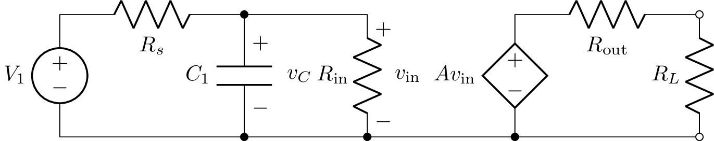
        

`F1.sch <https://github.com/mph-/lcapy/tree/master/doc/examples/schematics/F1.sch>`_

.. literalinclude:: examples/schematics/F1.sch

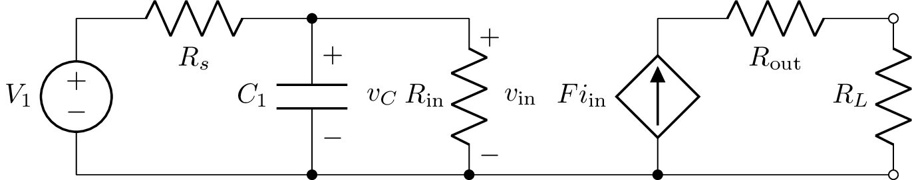
        

`G1.sch <https://github.com/mph-/lcapy/tree/master/doc/examples/schematics/G1.sch>`_

.. literalinclude:: examples/schematics/G1.sch

        

`H1.sch <https://github.com/mph-/lcapy/tree/master/doc/examples/schematics/H1.sch>`_

.. literalinclude:: examples/schematics/H1.sch

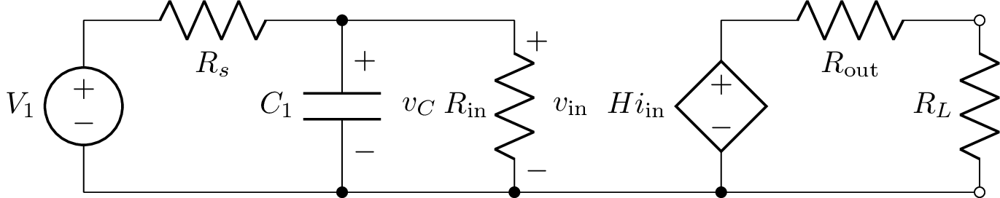
        

`K2.sch <https://github.com/mph-/lcapy/tree/master/doc/examples/schematics/K2.sch>`_

.. literalinclude:: examples/schematics/K2.sch

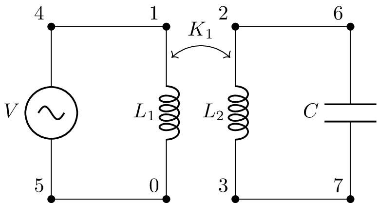
        

`VRL2.sch <https://github.com/mph-/lcapy/tree/master/doc/examples/schematics/VRL2.sch>`_

.. literalinclude:: examples/schematics/VRL2.sch

.. image:: examples/schematics/VRL2.png
   :width: 9.6cm
        

`VRmesh1.sch <https://github.com/mph-/lcapy/tree/master/doc/examples/schematics/VRmesh1.sch>`_

.. literalinclude:: examples/schematics/VRmesh1.sch

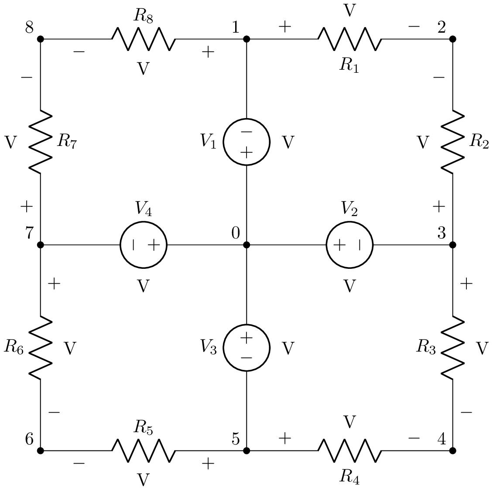
        

`cmos-esd-damage.sch <https://github.com/mph-/lcapy/tree/master/doc/examples/schematics/cmos-esd-damage.sch>`_

.. literalinclude:: examples/schematics/cmos-esd-damage.sch

.. image:: examples/schematics/cmos-esd-damage.png
   :width: 9.0cm
        

`cmos-input-model1.sch <https://github.com/mph-/lcapy/tree/master/doc/examples/schematics/cmos-input-model1.sch>`_

.. literalinclude:: examples/schematics/cmos-input-model1.sch

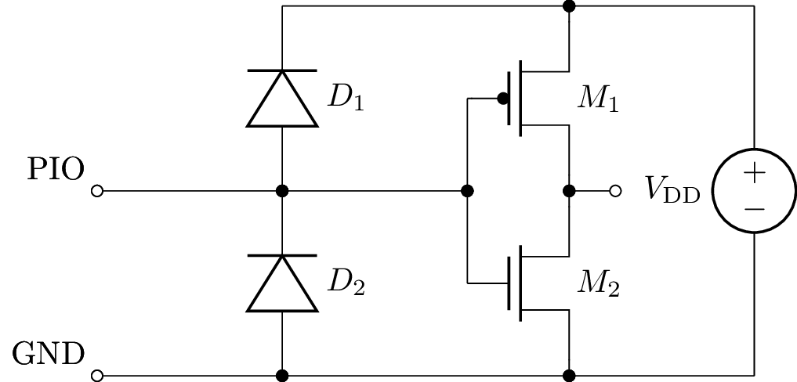
        

`cmos-led1.sch <https://github.com/mph-/lcapy/tree/master/doc/examples/schematics/cmos-led1.sch>`_

.. literalinclude:: examples/schematics/cmos-led1.sch

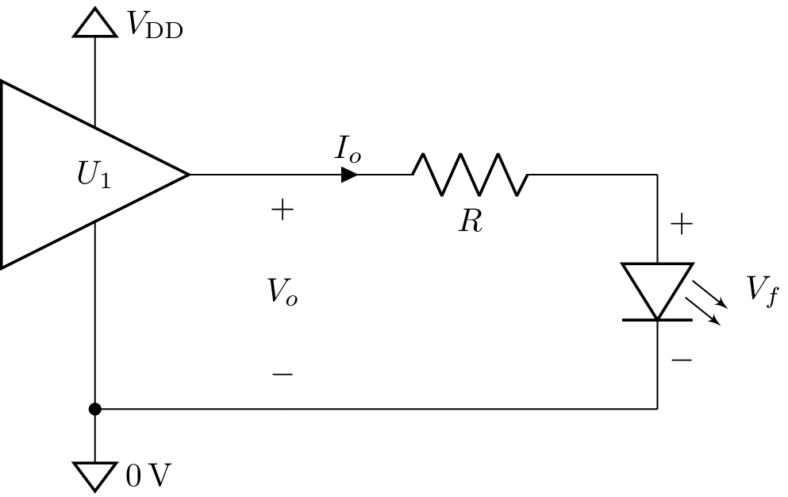
        

`cmos-open-drain.sch <https://github.com/mph-/lcapy/tree/master/doc/examples/schematics/cmos-open-drain.sch>`_

.. literalinclude:: examples/schematics/cmos-open-drain.sch

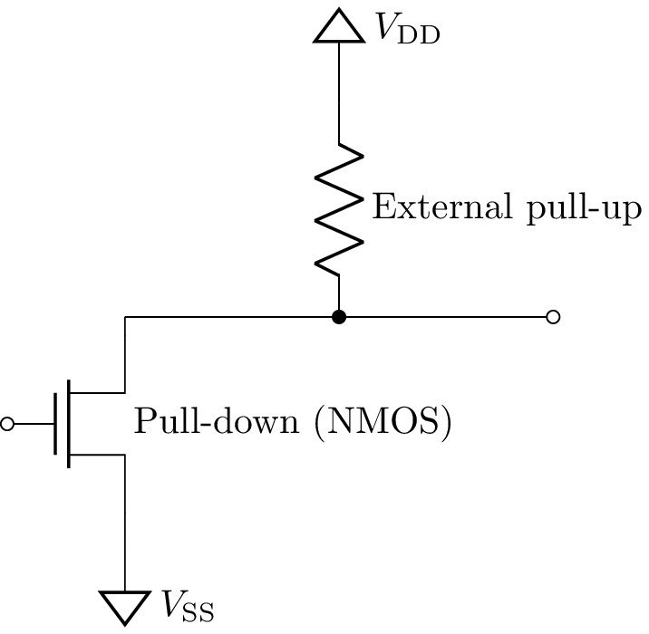
        

`cmos-protection1.sch <https://github.com/mph-/lcapy/tree/master/doc/examples/schematics/cmos-protection1.sch>`_

.. literalinclude:: examples/schematics/cmos-protection1.sch

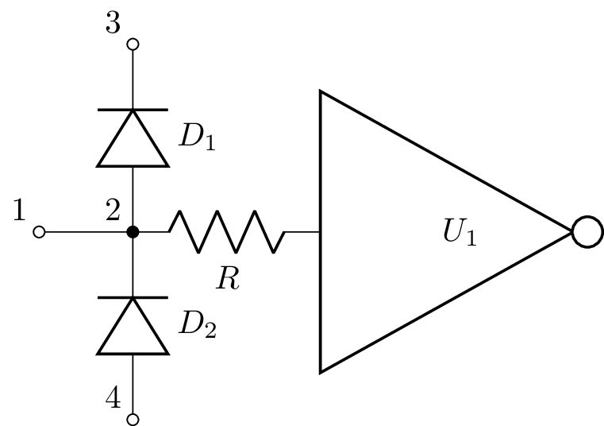
        

`cmos-totem2.sch <https://github.com/mph-/lcapy/tree/master/doc/examples/schematics/cmos-totem2.sch>`_

.. literalinclude:: examples/schematics/cmos-totem2.sch

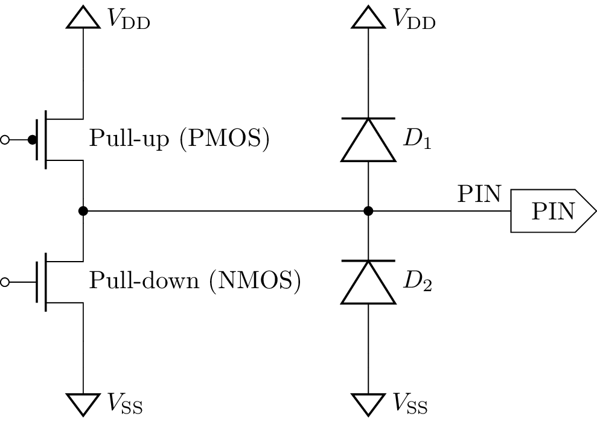
        

`cmos_C_load_thevenin.sch <https://github.com/mph-/lcapy/tree/master/doc/examples/tutorials/nonlinear/cmos_C_load_thevenin.sch>`_

.. literalinclude:: examples/tutorials/nonlinear/cmos_C_load_thevenin.sch

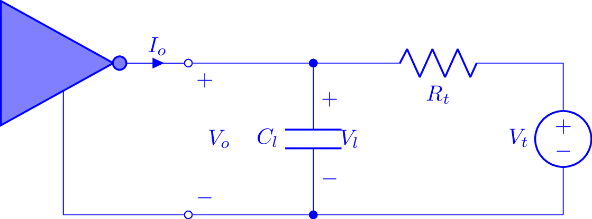
        

`cmos_R_series_C_load_thevenin.sch <https://github.com/mph-/lcapy/tree/master/doc/examples/tutorials/nonlinear/cmos_R_series_C_load_thevenin.sch>`_

.. literalinclude:: examples/tutorials/nonlinear/cmos_R_series_C_load_thevenin.sch

.. image:: examples/tutorials/nonlinear/cmos_R_series_C_load_thevenin.png
   :width: 11.3cm
        

`common-base.sch <https://github.com/mph-/lcapy/tree/master/doc/examples/schematics/common-base.sch>`_

.. literalinclude:: examples/schematics/common-base.sch

.. image:: examples/schematics/common-base.png
   :width: 6.5cm
        

`ferrite-choke1.sch <https://github.com/mph-/lcapy/tree/master/doc/examples/schematics/ferrite-choke1.sch>`_

.. literalinclude:: examples/schematics/ferrite-choke1.sch

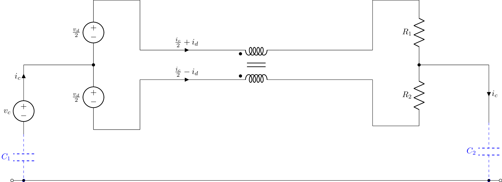
        

`filter1.sch <https://github.com/mph-/lcapy/tree/master/doc/examples/tutorials/discretetime/filter1.sch>`_

.. literalinclude:: examples/tutorials/discretetime/filter1.sch

.. image:: examples/tutorials/discretetime/filter1.png
   :width: 7.0cm
        

`filter2.sch <https://github.com/mph-/lcapy/tree/master/doc/examples/tutorials/discretetime/filter2.sch>`_

.. literalinclude:: examples/tutorials/discretetime/filter2.sch

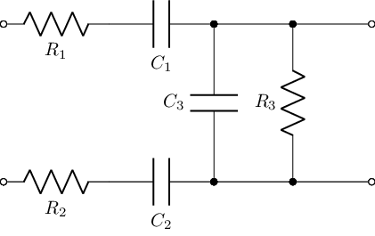
        

`fit3.sch <https://github.com/mph-/lcapy/tree/master/doc/examples/schematics/fit3.sch>`_

.. literalinclude:: examples/schematics/fit3.sch

.. image:: examples/schematics/fit3.png
   :width: 11.1cm
        

`non-ideal-transformer-primary.sch <https://github.com/mph-/lcapy/tree/master/doc/examples/tutorials/transformers/non-ideal-transformer-primary.sch>`_

.. literalinclude:: examples/tutorials/transformers/non-ideal-transformer-primary.sch

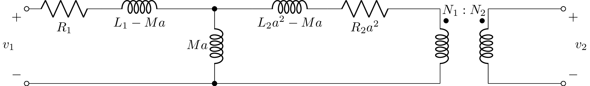
        

`non-ideal-transformer.sch <https://github.com/mph-/lcapy/tree/master/doc/examples/tutorials/transformers/non-ideal-transformer.sch>`_

.. literalinclude:: examples/tutorials/transformers/non-ideal-transformer.sch

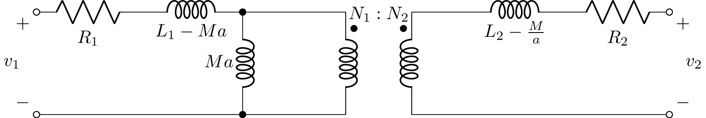
        
Block diagrams
==============

`LTFT.sch <https://github.com/mph-/lcapy/tree/master/doc/examples/schematics/LTFT.sch>`_

.. literalinclude:: examples/schematics/LTFT.sch

.. image:: examples/schematics/LTFT.png
   :width: 11.1cm
        

`domains.sch <https://github.com/mph-/lcapy/tree/master/doc/examples/schematics/domains.sch>`_

.. literalinclude:: examples/schematics/domains.sch

.. image:: examples/schematics/domains.png
   :width: 20.1cm
        

`fir5.sch <https://github.com/mph-/lcapy/tree/master/doc/examples/schematics/fir5.sch>`_

.. literalinclude:: examples/schematics/fir5.sch

.. image:: examples/schematics/fir5.png
   :width: 6.8cm
        

`negative-feedback2.sch <https://github.com/mph-/lcapy/tree/master/doc/examples/schematics/negative-feedback2.sch>`_

.. literalinclude:: examples/schematics/negative-feedback2.sch

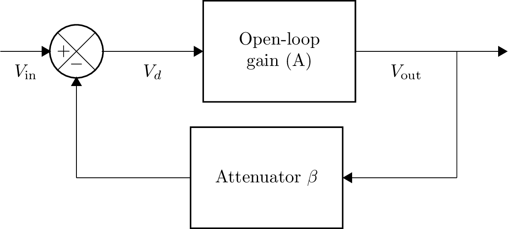
        

`transforms.sch <https://github.com/mph-/lcapy/tree/master/doc/examples/schematics/transforms.sch>`_

.. literalinclude:: examples/schematics/transforms.sch

.. image:: examples/schematics/transforms.png
   :width: 12.8cm
        
Two port networks
=================

`TPA.sch <https://github.com/mph-/lcapy/tree/master/doc/examples/schematics/TPA.sch>`_

.. literalinclude:: examples/schematics/TPA.sch

.. image:: examples/schematics/TPA.png
   :width: 8.4cm
        

`TPB.sch <https://github.com/mph-/lcapy/tree/master/doc/examples/schematics/TPB.sch>`_

.. literalinclude:: examples/schematics/TPB.sch

.. image:: examples/schematics/TPB.png
   :width: 8.4cm
        

`TPG.sch <https://github.com/mph-/lcapy/tree/master/doc/examples/schematics/TPG.sch>`_

.. literalinclude:: examples/schematics/TPG.sch

.. image:: examples/schematics/TPG.png
   :width: 8.9cm
        

`TPH.sch <https://github.com/mph-/lcapy/tree/master/doc/examples/schematics/TPH.sch>`_

.. literalinclude:: examples/schematics/TPH.sch

.. image:: examples/schematics/TPH.png
   :width: 8.9cm
        

`TPY.sch <https://github.com/mph-/lcapy/tree/master/doc/examples/schematics/TPY.sch>`_

.. literalinclude:: examples/schematics/TPY.sch

.. image:: examples/schematics/TPY.png
   :width: 7.4cm
        

`TPZ.sch <https://github.com/mph-/lcapy/tree/master/doc/examples/schematics/TPZ.sch>`_

.. literalinclude:: examples/schematics/TPZ.sch

.. image:: examples/schematics/TPZ.png
   :width: 9.3cm
        

`series.sch <https://github.com/mph-/lcapy/tree/master/doc/examples/schematics/series.sch>`_

.. literalinclude:: examples/schematics/series.sch

.. image:: examples/schematics/series.png
   :width: 4.4cm
        

`shunt.sch <https://github.com/mph-/lcapy/tree/master/doc/examples/schematics/shunt.sch>`_

.. literalinclude:: examples/schematics/shunt.sch

.. image:: examples/schematics/shunt.png
   :width: 4.4cm
        

`pisection.sch <https://github.com/mph-/lcapy/tree/master/doc/examples/schematics/pisection.sch>`_

.. literalinclude:: examples/schematics/pisection.sch

.. image:: examples/schematics/pisection.png
   :width: 5.4cm
        

`tsection.sch <https://github.com/mph-/lcapy/tree/master/doc/examples/schematics/tsection.sch>`_

.. literalinclude:: examples/schematics/tsection.sch

.. image:: examples/schematics/tsection.png
   :width: 6.4cm
        
Components
==========

`ADC1.sch <https://github.com/mph-/lcapy/tree/master/doc/examples/schematics/ADC1.sch>`_

.. literalinclude:: examples/schematics/ADC1.sch

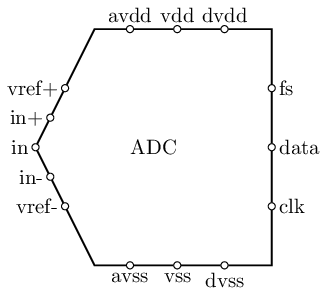
        

`arrows.sch <https://github.com/mph-/lcapy/tree/master/doc/examples/schematics/arrows.sch>`_

.. literalinclude:: examples/schematics/arrows.sch

.. image:: examples/schematics/arrows.png
   :width: 9.8cm
        

`antennas.sch <https://github.com/mph-/lcapy/tree/master/doc/examples/schematics/antennas.sch>`_

.. literalinclude:: examples/schematics/antennas.sch

.. image:: examples/schematics/antennas.png
   :width: 6.0cm
        

`batteries.sch <https://github.com/mph-/lcapy/tree/master/doc/examples/schematics/batteries.sch>`_

.. literalinclude:: examples/schematics/batteries.sch

.. image:: examples/schematics/batteries.png
   :width: 4.1cm
        

`buffers.sch <https://github.com/mph-/lcapy/tree/master/doc/examples/schematics/buffers.sch>`_

.. literalinclude:: examples/schematics/buffers.sch

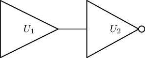
        

`cable-coax.sch <https://github.com/mph-/lcapy/tree/master/doc/examples/schematics/cable-coax.sch>`_

.. literalinclude:: examples/schematics/cable-coax.sch

.. image:: examples/schematics/cable-coax.png
   :width: 6.4cm
        

`cable-tp.sch <https://github.com/mph-/lcapy/tree/master/doc/examples/schematics/cable-tp.sch>`_

.. literalinclude:: examples/schematics/cable-tp.sch

.. image:: examples/schematics/cable-tp.png
   :width: 6.7cm
        

`cable-twinax.sch <https://github.com/mph-/lcapy/tree/master/doc/examples/schematics/cable-twinax.sch>`_

.. literalinclude:: examples/schematics/cable-twinax.sch

.. image:: examples/schematics/cable-twinax.png
   :width: 6.7cm
        

`cable-utp.sch <https://github.com/mph-/lcapy/tree/master/doc/examples/schematics/cable-utp.sch>`_

.. literalinclude:: examples/schematics/cable-utp.sch

.. image:: examples/schematics/cable-utp.png
   :width: 6.7cm
        

`capacitors.sch <https://github.com/mph-/lcapy/tree/master/doc/examples/schematics/capacitors.sch>`_

.. literalinclude:: examples/schematics/capacitors.sch

.. image:: examples/schematics/capacitors.png
   :width: 13.9cm
        

`connections1.sch <https://github.com/mph-/lcapy/tree/master/doc/examples/schematics/connections1.sch>`_

.. literalinclude:: examples/schematics/connections1.sch

.. image:: examples/schematics/connections1.png
   :width: 7.5cm
        

`connections2.sch <https://github.com/mph-/lcapy/tree/master/doc/examples/schematics/connections2.sch>`_

.. literalinclude:: examples/schematics/connections2.sch

.. image:: examples/schematics/connections2.png
   :width: 10.8cm
        

`CPE1.sch <https://github.com/mph-/lcapy/tree/master/doc/examples/schematics/CPE1.sch>`_

.. literalinclude:: examples/schematics/CPE1.sch

.. image:: examples/schematics/CPE1.png
   :width: 2.4cm
        

`DAC3.sch <https://github.com/mph-/lcapy/tree/master/doc/examples/schematics/DAC3.sch>`_

.. literalinclude:: examples/schematics/DAC3.sch

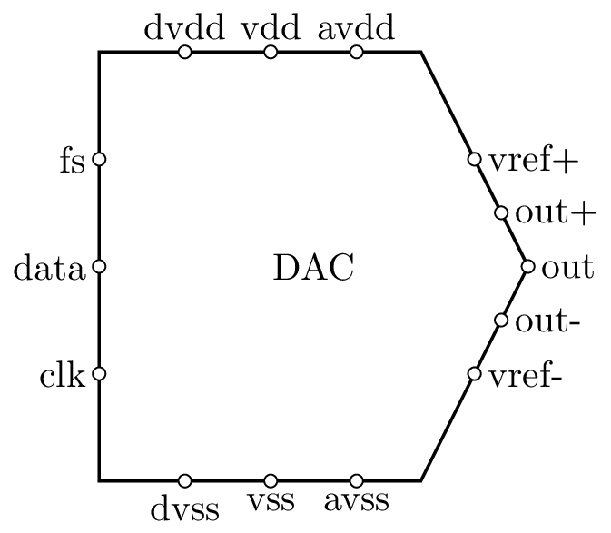
        

`diodes.sch <https://github.com/mph-/lcapy/tree/master/doc/examples/schematics/diodes.sch>`_

.. literalinclude:: examples/schematics/diodes.sch

.. image:: examples/schematics/diodes.png
   :width: 21.7cm
        

`diodes2.sch <https://github.com/mph-/lcapy/tree/master/doc/examples/schematics/diodes2.sch>`_

.. literalinclude:: examples/schematics/diodes2.sch

.. image:: examples/schematics/diodes2.png
   :width: 5.9cm
        

`FB1.sch <https://github.com/mph-/lcapy/tree/master/doc/examples/schematics/FB1.sch>`_

.. literalinclude:: examples/schematics/FB1.sch

.. image:: examples/schematics/FB1.png
   :width: 2.4cm
        

`fdopamps.sch <https://github.com/mph-/lcapy/tree/master/doc/examples/schematics/fdopamps.sch>`_

.. literalinclude:: examples/schematics/fdopamps.sch

.. image:: examples/schematics/fdopamps.png
   :width: 11.8cm
        

`flipflops.sch <https://github.com/mph-/lcapy/tree/master/doc/examples/schematics/flipflops.sch>`_

.. literalinclude:: examples/schematics/flipflops.sch

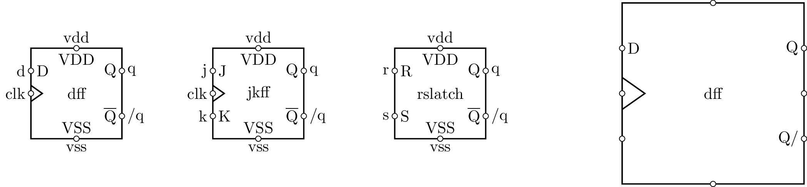
        

`grounds.sch <https://github.com/mph-/lcapy/tree/master/doc/examples/schematics/grounds.sch>`_

.. literalinclude:: examples/schematics/grounds.sch

.. image:: examples/schematics/grounds.png
   :width: 12.9cm
        

`GY1.sch <https://github.com/mph-/lcapy/tree/master/doc/examples/schematics/GY1.sch>`_

.. literalinclude:: examples/schematics/GY1.sch

.. image:: examples/schematics/GY1.png
   :width: 2.5cm
        

`hsources.sch <https://github.com/mph-/lcapy/tree/master/doc/examples/schematics/hsources.sch>`_

.. literalinclude:: examples/schematics/hsources.sch

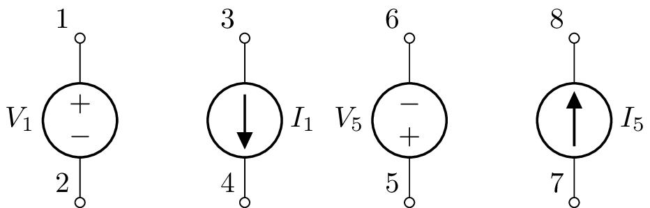
        

`massspringdamper1.sch <https://github.com/mph-/lcapy/tree/master/doc/examples/schematics/massspringdamper1.sch>`_

.. literalinclude:: examples/schematics/massspringdamper1.sch

.. image:: examples/schematics/massspringdamper1.png
   :width: 6.4cm
        

`meters1.sch <https://github.com/mph-/lcapy/tree/master/doc/examples/schematics/meters1.sch>`_

.. literalinclude:: examples/schematics/meters1.sch

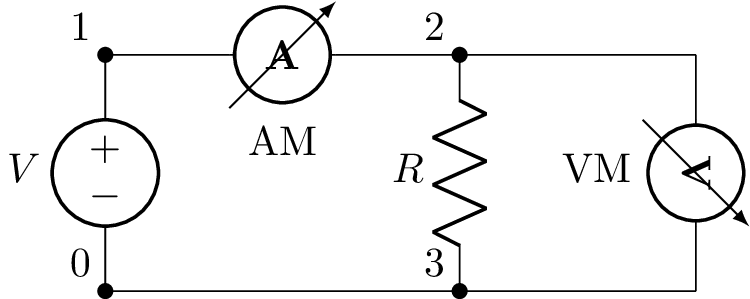
        

`misc.sch <https://github.com/mph-/lcapy/tree/master/doc/examples/schematics/misc.sch>`_

.. literalinclude:: examples/schematics/misc.sch

.. image:: examples/schematics/misc.png
   :width: 4.4cm
        

`multiplexers.sch <https://github.com/mph-/lcapy/tree/master/doc/examples/schematics/multiplexers.sch>`_

.. literalinclude:: examples/schematics/multiplexers.sch

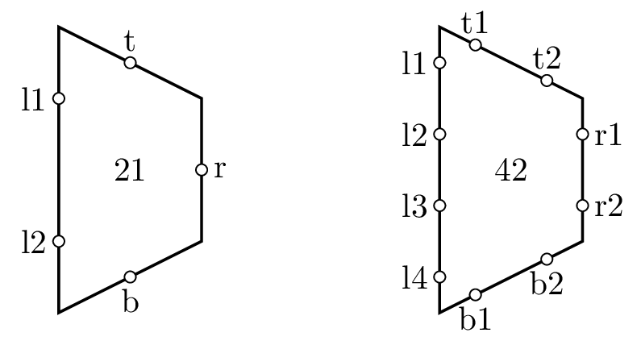
        

`opamps.sch <https://github.com/mph-/lcapy/tree/master/doc/examples/schematics/opamps.sch>`_

.. literalinclude:: examples/schematics/opamps.sch

.. image:: examples/schematics/opamps.png
   :width: 11.0cm
        

`resistors1.sch <https://github.com/mph-/lcapy/tree/master/doc/examples/schematics/resistors1.sch>`_

.. literalinclude:: examples/schematics/resistors1.sch

.. image:: examples/schematics/resistors1.png
   :width: 13.8cm
        

`resistors2.sch <https://github.com/mph-/lcapy/tree/master/doc/examples/schematics/resistors2.sch>`_

.. literalinclude:: examples/schematics/resistors2.sch

.. image:: examples/schematics/resistors2.png
   :width: 10.3cm
        

`resistors3.sch <https://github.com/mph-/lcapy/tree/master/doc/examples/schematics/resistors3.sch>`_

.. literalinclude:: examples/schematics/resistors3.sch

.. image:: examples/schematics/resistors3.png
   :width: 13.8cm
        

`resistors4.sch <https://github.com/mph-/lcapy/tree/master/doc/examples/schematics/resistors4.sch>`_

.. literalinclude:: examples/schematics/resistors4.sch

.. image:: examples/schematics/resistors4.png
   :width: 6.9cm
        

`resistors5.sch <https://github.com/mph-/lcapy/tree/master/doc/examples/schematics/resistors5.sch>`_

.. literalinclude:: examples/schematics/resistors5.sch

.. image:: examples/schematics/resistors5.png
   :width: 6.9cm
        

`resistors6.sch <https://github.com/mph-/lcapy/tree/master/doc/examples/schematics/resistors6.sch>`_

.. literalinclude:: examples/schematics/resistors6.sch

.. image:: examples/schematics/resistors6.png
   :width: 13.8cm
        

`resistors7.sch <https://github.com/mph-/lcapy/tree/master/doc/examples/schematics/resistors7.sch>`_

.. literalinclude:: examples/schematics/resistors7.sch

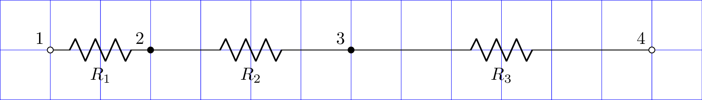
        

`switches.sch <https://github.com/mph-/lcapy/tree/master/doc/examples/schematics/switches.sch>`_

.. literalinclude:: examples/schematics/switches.sch

.. image:: examples/schematics/switches.png
   :width: 7.6cm
        

`switches2.sch <https://github.com/mph-/lcapy/tree/master/doc/examples/schematics/switches2.sch>`_

.. literalinclude:: examples/schematics/switches2.sch

.. image:: examples/schematics/switches2.png
   :width: 8.3cm
        

`transformers.sch <https://github.com/mph-/lcapy/tree/master/doc/examples/schematics/transformers.sch>`_

.. literalinclude:: examples/schematics/transformers.sch

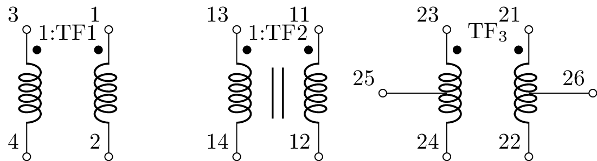
        

`transistors.sch <https://github.com/mph-/lcapy/tree/master/doc/examples/schematics/transistors.sch>`_

.. literalinclude:: examples/schematics/transistors.sch

.. image:: examples/schematics/transistors.png
   :width: 19.8cm
        

`transistors2.sch <https://github.com/mph-/lcapy/tree/master/doc/examples/schematics/transistors2.sch>`_

.. literalinclude:: examples/schematics/transistors2.sch

.. image:: examples/schematics/transistors2.png
   :width: 8.6cm
        

`Uinamp.sch <https://github.com/mph-/lcapy/tree/master/doc/examples/schematics/Uinamp.sch>`_

.. literalinclude:: examples/schematics/Uinamp.sch

.. image:: examples/schematics/Uinamp.png
   :width: 4.9cm
        

`Uisoamp.sch <https://github.com/mph-/lcapy/tree/master/doc/examples/schematics/Uisoamp.sch>`_

.. literalinclude:: examples/schematics/Uisoamp.sch

.. image:: examples/schematics/Uisoamp.png
   :width: 4.9cm
        

`Ufdopamp.sch <https://github.com/mph-/lcapy/tree/master/doc/examples/schematics/Ufdopamp.sch>`_

.. literalinclude:: examples/schematics/Ufdopamp.sch

.. image:: examples/schematics/Ufdopamp.png
   :width: 4.0cm
        

`Uopamp.sch <https://github.com/mph-/lcapy/tree/master/doc/examples/schematics/Uopamp.sch>`_

.. literalinclude:: examples/schematics/Uopamp.sch

.. image:: examples/schematics/Uopamp.png
   :width: 4.9cm
        

`variable1.sch <https://github.com/mph-/lcapy/tree/master/doc/examples/schematics/variable1.sch>`_

.. literalinclude:: examples/schematics/variable1.sch

.. image:: examples/schematics/variable1.png
   :width: 6.3cm
        

`vsources.sch <https://github.com/mph-/lcapy/tree/master/doc/examples/schematics/vsources.sch>`_

.. literalinclude:: examples/schematics/vsources.sch

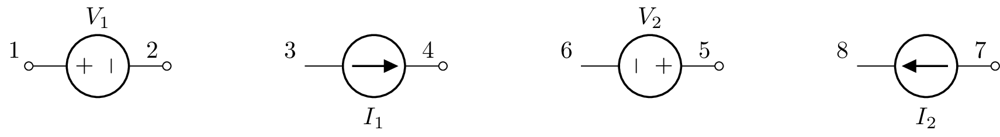
        

`wirestyles.sch <https://github.com/mph-/lcapy/tree/master/doc/examples/schematics/wirestyles.sch>`_

.. literalinclude:: examples/schematics/wirestyles.sch

.. image:: examples/schematics/wirestyles.png
   :width: 15.8cm
        

`XT1.sch <https://github.com/mph-/lcapy/tree/master/doc/examples/schematics/XT1.sch>`_

.. literalinclude:: examples/schematics/XT1.sch

.. image:: examples/schematics/XT1.png
   :width: 2.4cm
        
Chips
=====

`chips.sch <https://github.com/mph-/lcapy/tree/master/doc/examples/schematics/chips.sch>`_

.. literalinclude:: examples/schematics/chips.sch

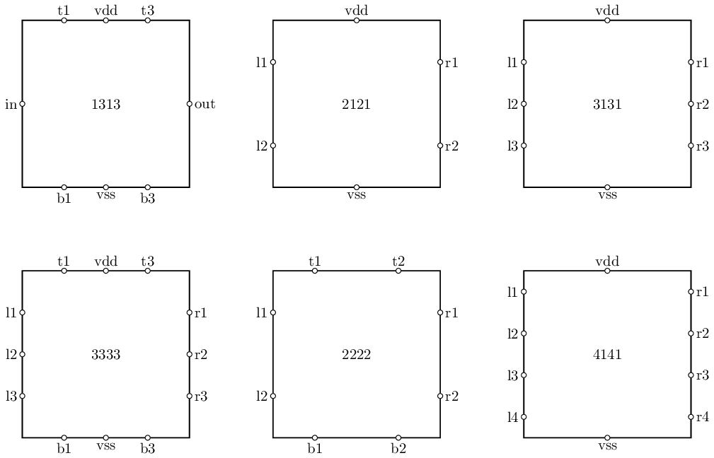
        

`chips2.sch <https://github.com/mph-/lcapy/tree/master/doc/examples/schematics/chips2.sch>`_

.. literalinclude:: examples/schematics/chips2.sch

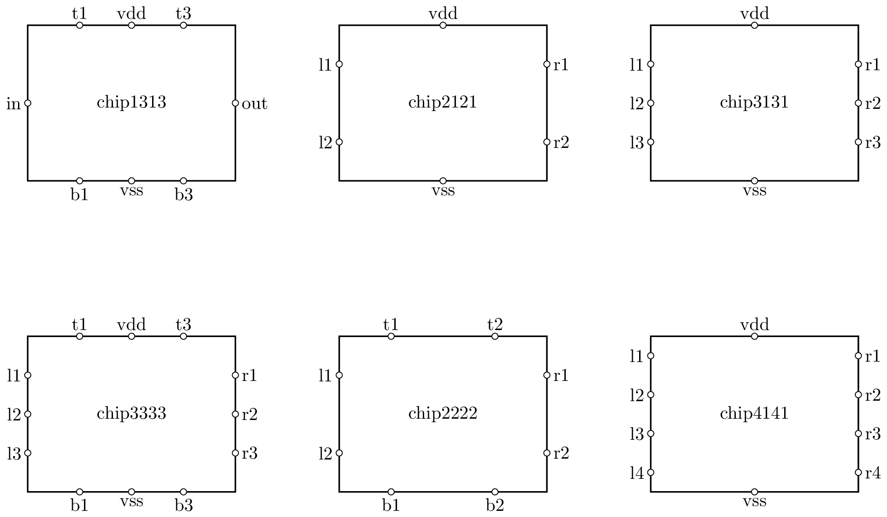
        

`chips3.sch <https://github.com/mph-/lcapy/tree/master/doc/examples/schematics/chips3.sch>`_

.. literalinclude:: examples/schematics/chips3.sch

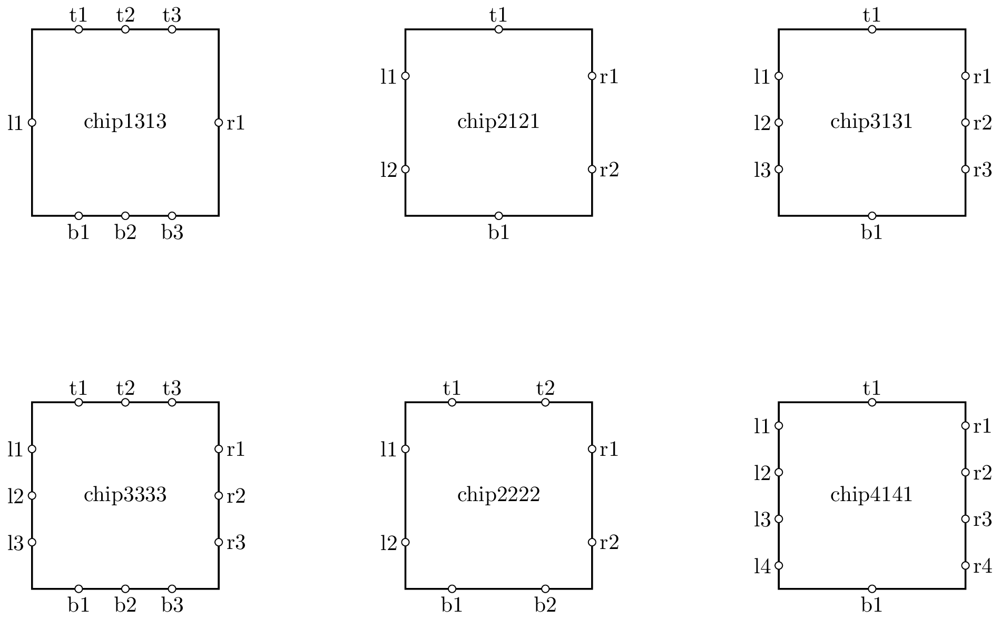
        
Shapes
======

`Striangle2.sch <https://github.com/mph-/lcapy/tree/master/doc/examples/schematics/Striangle2.sch>`_

.. literalinclude:: examples/schematics/Striangle2.sch

.. image:: examples/schematics/Striangle2.png
   :width: 5.9cm
        

`Sbox1.sch <https://github.com/mph-/lcapy/tree/master/doc/examples/schematics/Sbox1.sch>`_

.. literalinclude:: examples/schematics/Sbox1.sch

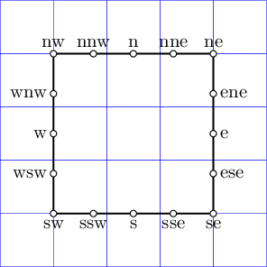
        

`Scircle2.sch <https://github.com/mph-/lcapy/tree/master/doc/examples/schematics/Scircle2.sch>`_

.. literalinclude:: examples/schematics/Scircle2.sch

.. image:: examples/schematics/Scircle2.png
   :width: 5.9cm
        

`circles.sch <https://github.com/mph-/lcapy/tree/master/doc/examples/schematics/circles.sch>`_

.. literalinclude:: examples/schematics/circles.sch

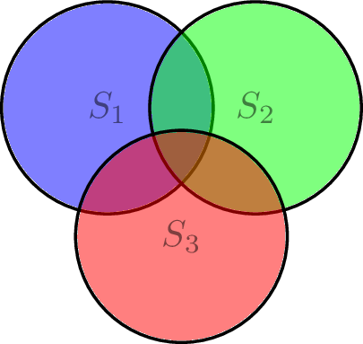
        
Labels
======

`annotate1.sch <https://github.com/mph-/lcapy/tree/master/doc/examples/schematics/annotate1.sch>`_

.. literalinclude:: examples/schematics/annotate1.sch

.. image:: examples/schematics/annotate1.png
   :width: 3.5cm
        

`current_labels1.sch <https://github.com/mph-/lcapy/tree/master/doc/examples/schematics/current_labels1.sch>`_

.. literalinclude:: examples/schematics/current_labels1.sch

.. image:: examples/schematics/current_labels1.png
   :width: 26.6cm
        

`current_labels2.sch <https://github.com/mph-/lcapy/tree/master/doc/examples/schematics/current_labels2.sch>`_

.. literalinclude:: examples/schematics/current_labels2.sch

.. image:: examples/schematics/current_labels2.png
   :width: 26.6cm
        

`flow_labels1.sch <https://github.com/mph-/lcapy/tree/master/doc/examples/schematics/flow_labels1.sch>`_

.. literalinclude:: examples/schematics/flow_labels1.sch

.. image:: examples/schematics/flow_labels1.png
   :width: 26.6cm
        

`labels1.sch <https://github.com/mph-/lcapy/tree/master/doc/examples/schematics/labels1.sch>`_

.. literalinclude:: examples/schematics/labels1.sch

.. image:: examples/schematics/labels1.png
   :width: 8.9cm
        

`voltage_labels1.sch <https://github.com/mph-/lcapy/tree/master/doc/examples/schematics/voltage_labels1.sch>`_

.. literalinclude:: examples/schematics/voltage_labels1.sch

.. image:: examples/schematics/voltage_labels1.png
   :width: 8.9cm
        

`Rlabels.sch <https://github.com/mph-/lcapy/tree/master/doc/examples/schematics/Rlabels.sch>`_

.. literalinclude:: examples/schematics/Rlabels.sch

.. image:: examples/schematics/Rlabels.png
   :width: 8.9cm
        
Digital circuits
================

`PIO1.sch <https://github.com/mph-/lcapy/tree/master/doc/examples/schematics/digital/PIO1.sch>`_

.. literalinclude:: examples/schematics/digital/PIO1.sch

.. image:: examples/schematics/digital/PIO1.png
   :width: 7.2cm
        

`PIO-input2.sch <https://github.com/mph-/lcapy/tree/master/doc/examples/schematics/digital/PIO-input2.sch>`_

.. literalinclude:: examples/schematics/digital/PIO-input2.sch

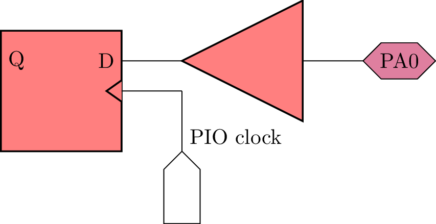
        

`PIO-input3.sch <https://github.com/mph-/lcapy/tree/master/doc/examples/schematics/digital/PIO-input3.sch>`_

.. literalinclude:: examples/schematics/digital/PIO-input3.sch

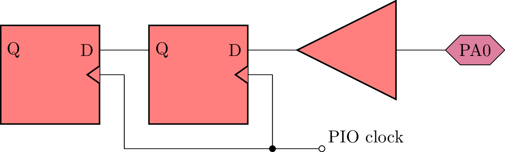
        

`PIO-output2.sch <https://github.com/mph-/lcapy/tree/master/doc/examples/schematics/digital/PIO-output2.sch>`_

.. literalinclude:: examples/schematics/digital/PIO-output2.sch

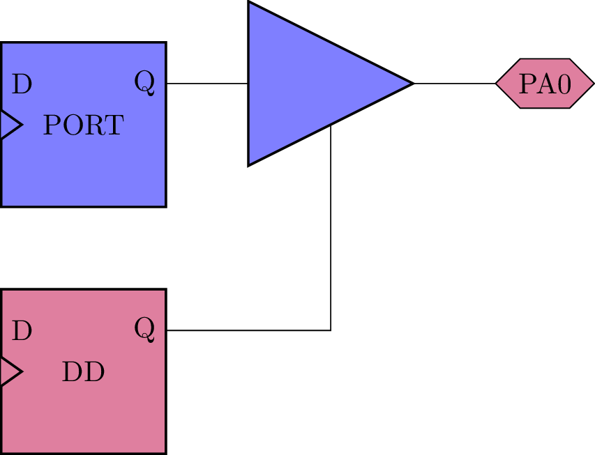
        

`PIO-pullup2.sch <https://github.com/mph-/lcapy/tree/master/doc/examples/schematics/digital/PIO-pullup2.sch>`_

.. literalinclude:: examples/schematics/digital/PIO-pullup2.sch

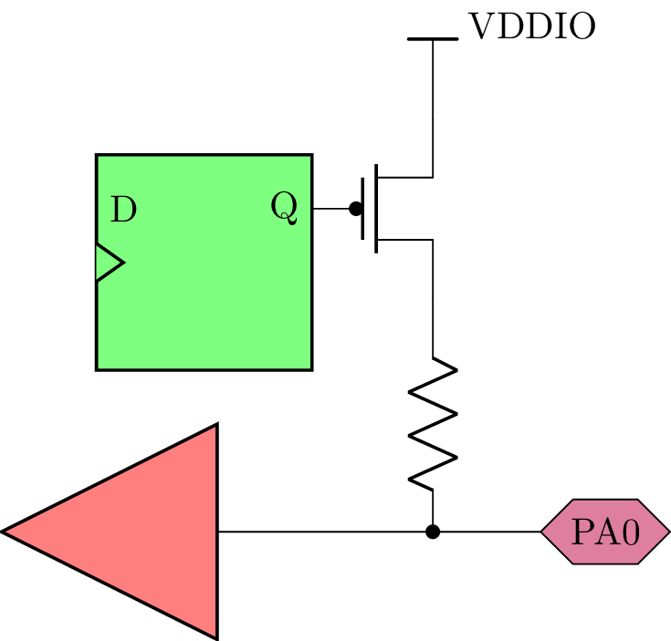
        

`mcu-bt.sch <https://github.com/mph-/lcapy/tree/master/doc/examples/schematics/mcu-bt.sch>`_

.. literalinclude:: examples/schematics/mcu-bt.sch

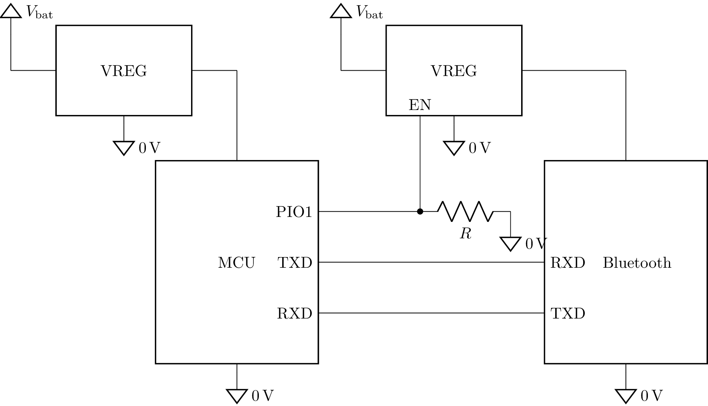
        

`cmos-backdrive1.sch <https://github.com/mph-/lcapy/tree/master/doc/examples/schematics/cmos-backdrive1.sch>`_

.. literalinclude:: examples/schematics/cmos-backdrive1.sch

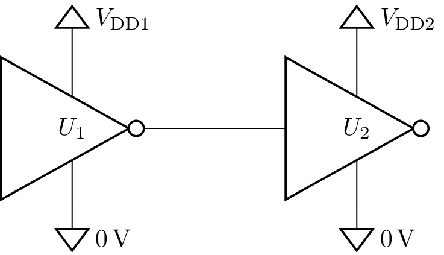
        

`cmos-backdrive2.sch <https://github.com/mph-/lcapy/tree/master/doc/examples/schematics/cmos-backdrive2.sch>`_

.. literalinclude:: examples/schematics/cmos-backdrive2.sch

.. image:: examples/schematics/cmos-backdrive2.png
   :width: 9.9cm
        

`I2C2.sch <https://github.com/mph-/lcapy/tree/master/doc/examples/schematics/I2C2.sch>`_

.. literalinclude:: examples/schematics/I2C2.sch

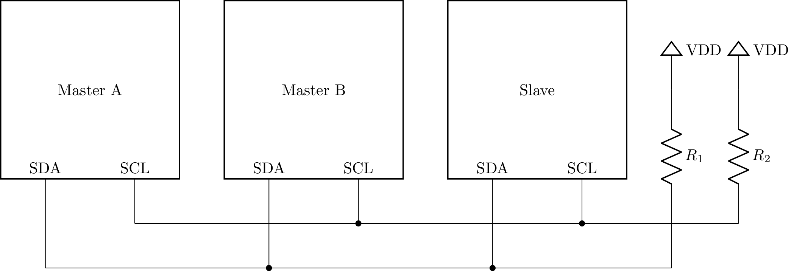
        

`ic1.sch <https://github.com/mph-/lcapy/tree/master/doc/examples/schematics/ic1.sch>`_

.. literalinclude:: examples/schematics/ic1.sch

.. image:: examples/schematics/ic1.png
   :width: 8.8cm
        

`stepup.sch <https://github.com/mph-/lcapy/tree/master/doc/examples/schematics/stepup.sch>`_

.. literalinclude:: examples/schematics/stepup.sch

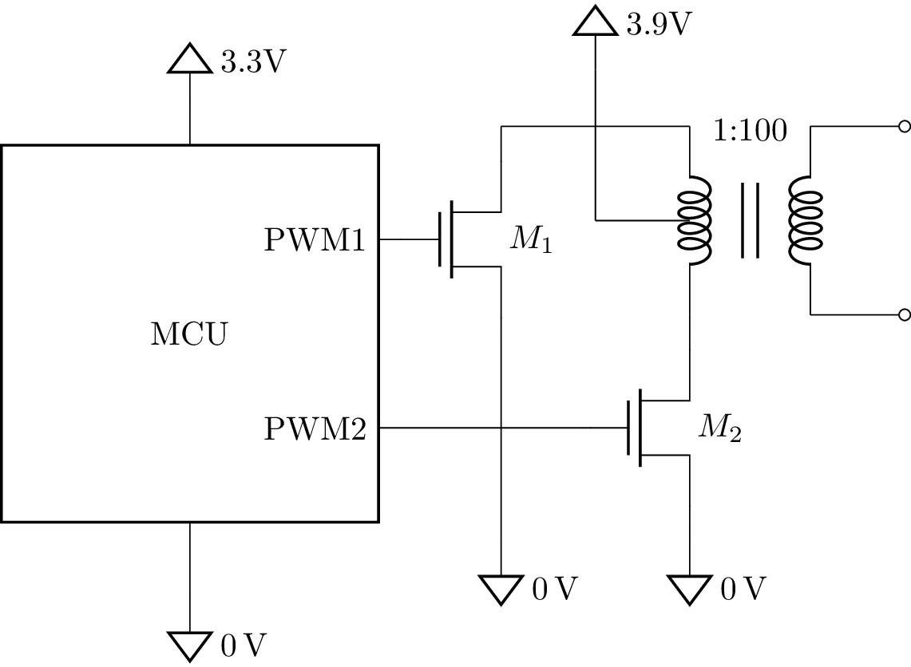
        
Transistor circuits
===================

`nmosfet_simple_amplifier.sch <https://github.com/mph-/lcapy/tree/master/doc/examples/schematics/analogue/nmosfet_simple_amplifier.sch>`_

.. literalinclude:: examples/schematics/analogue/nmosfet_simple_amplifier.sch

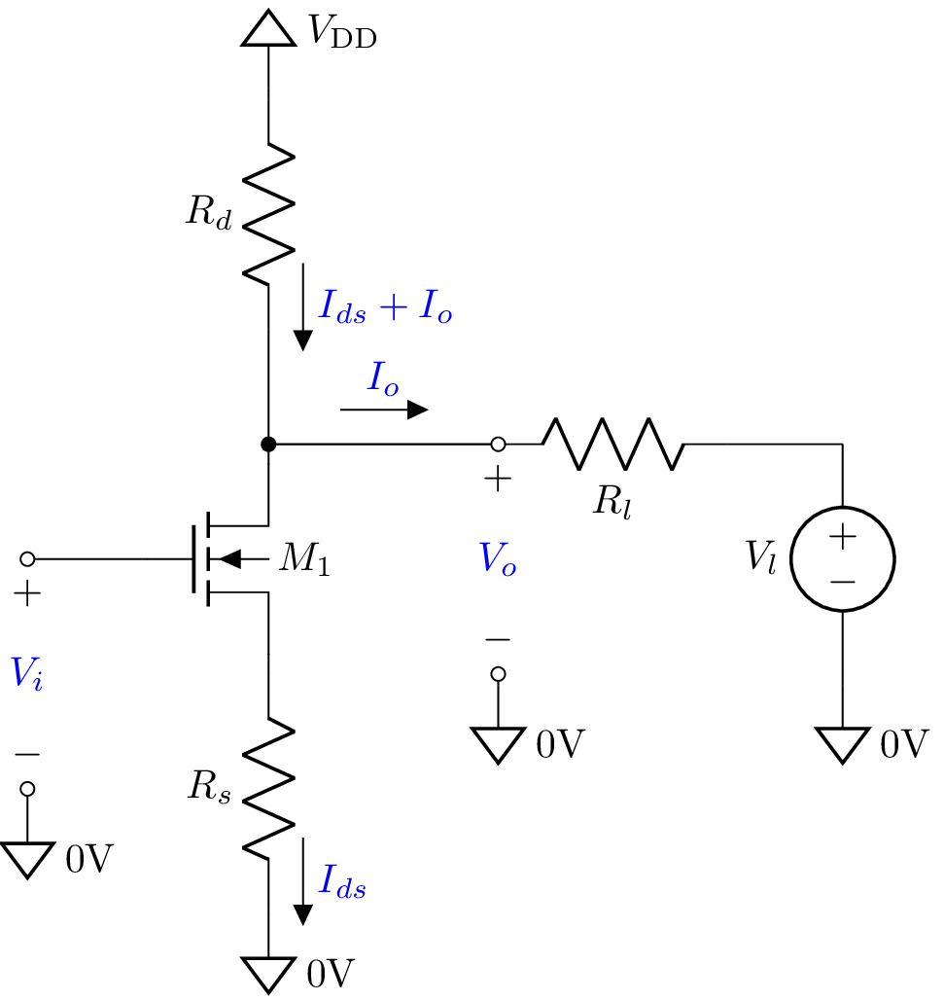
        

`mosfet_push_pull_load.sch <https://github.com/mph-/lcapy/tree/master/doc/examples/schematics/analogue/mosfet_push_pull_load.sch>`_

.. literalinclude:: examples/schematics/analogue/mosfet_push_pull_load.sch

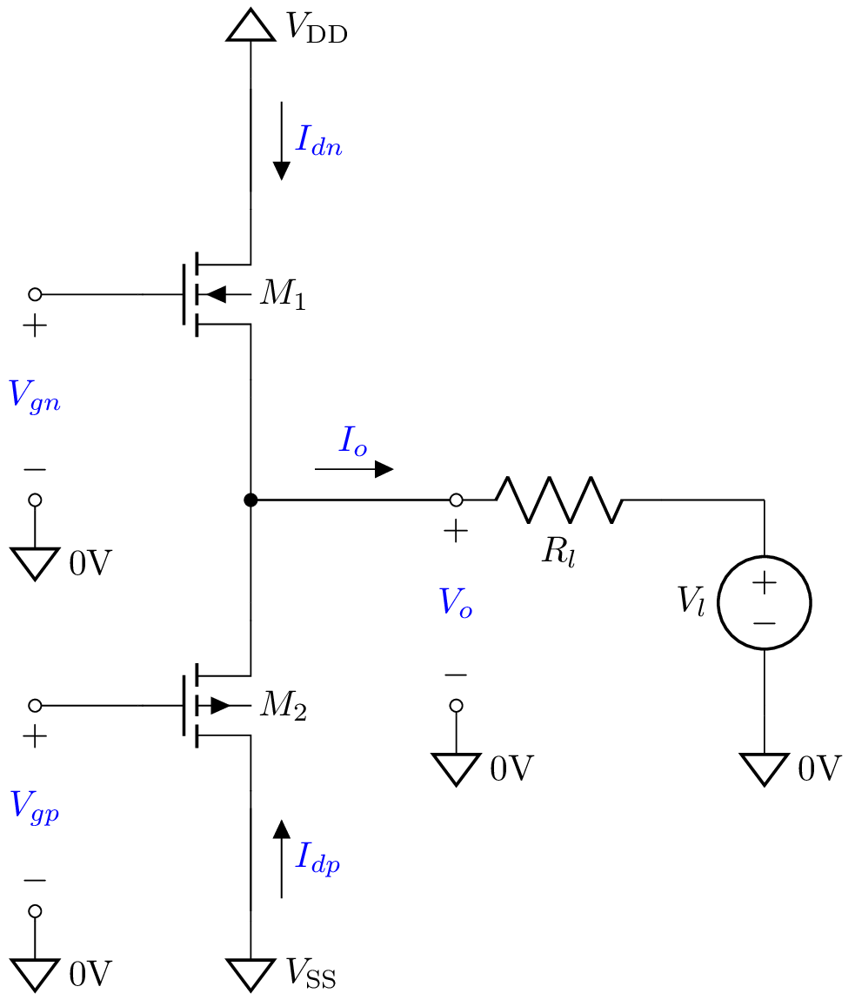
        

`BH-mag.sch <https://github.com/mph-/lcapy/tree/master/doc/examples/schematics/BH-mag.sch>`_

.. literalinclude:: examples/schematics/BH-mag.sch

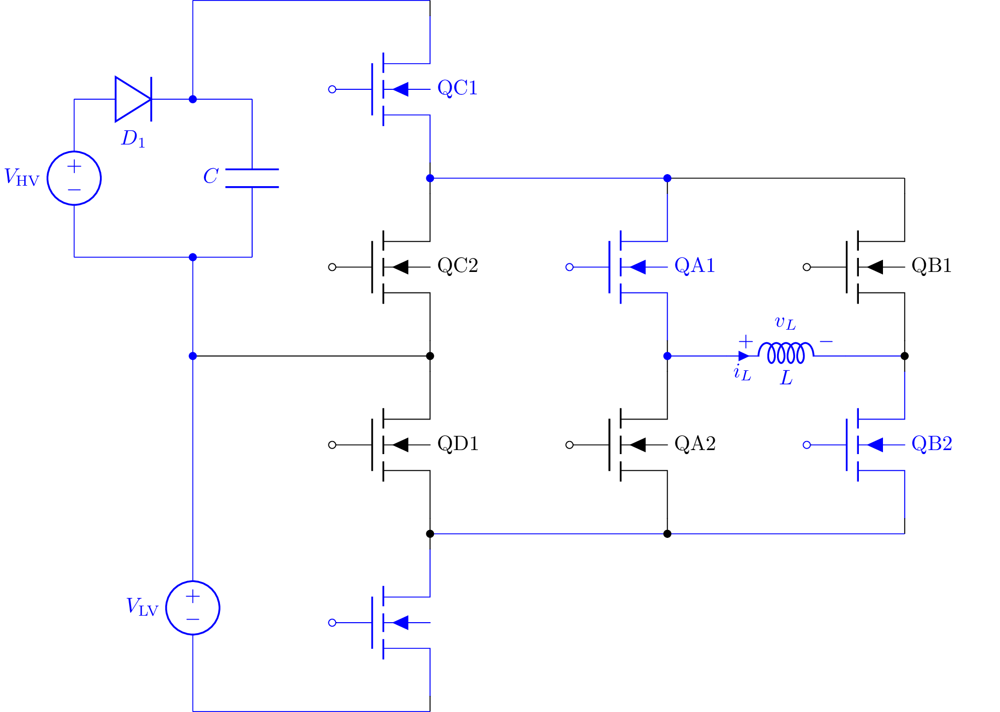
        
Opamp circuits
==============

`opamp-differential-amplifier1.sch <https://github.com/mph-/lcapy/tree/master/doc/examples/schematics/opamp-differential-amplifier1.sch>`_

.. literalinclude:: examples/schematics/opamp-differential-amplifier1.sch

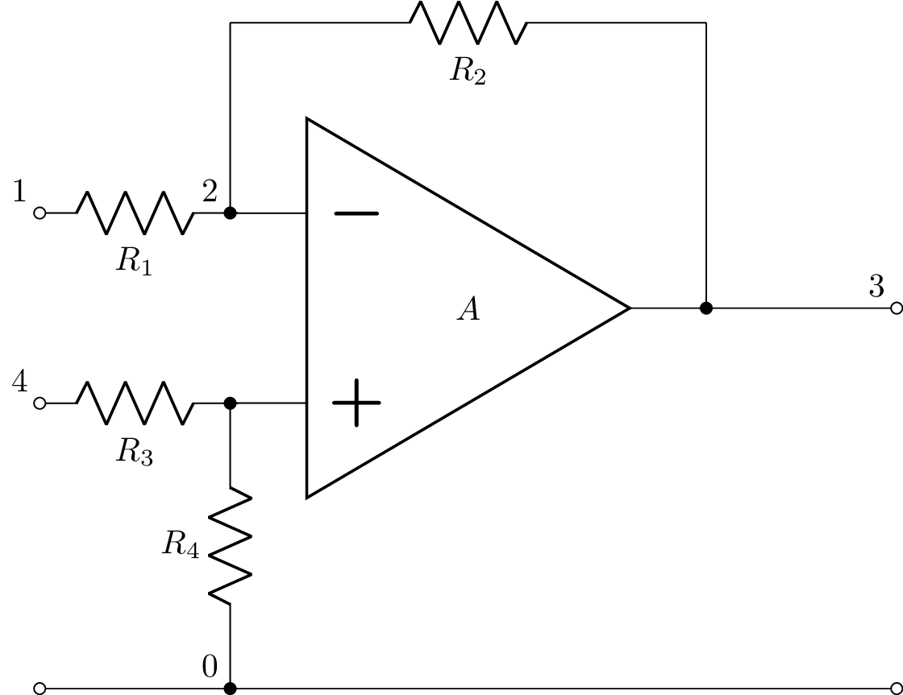
        

`opamp-inverting-amplifier1.sch <https://github.com/mph-/lcapy/tree/master/doc/examples/tutorials/opamps/opamp-inverting-amplifier1.sch>`_

.. literalinclude:: examples/tutorials/opamps/opamp-inverting-amplifier1.sch

.. image:: examples/tutorials/opamps/opamp-inverting-amplifier1.png
   :width: 9.9cm
        

`opamp-inverting-integrator.sch <https://github.com/mph-/lcapy/tree/master/doc/examples/schematics/opamp-inverting-integrator.sch>`_

.. literalinclude:: examples/schematics/opamp-inverting-integrator.sch

.. image:: examples/schematics/opamp-inverting-integrator.png
   :width: 9.3cm
        

`opamp-transimpedance-amplifier1.sch <https://github.com/mph-/lcapy/tree/master/doc/examples/tutorials/opamps/opamp-transimpedance-amplifier1.sch>`_

.. literalinclude:: examples/tutorials/opamps/opamp-transimpedance-amplifier1.sch

.. image:: examples/tutorials/opamps/opamp-transimpedance-amplifier1.png
   :width: 9.8cm
        

`opamp-transimpedance-amplifier2.sch <https://github.com/mph-/lcapy/tree/master/doc/examples/tutorials/opamps/opamp-transimpedance-amplifier2.sch>`_

.. literalinclude:: examples/tutorials/opamps/opamp-transimpedance-amplifier2.sch

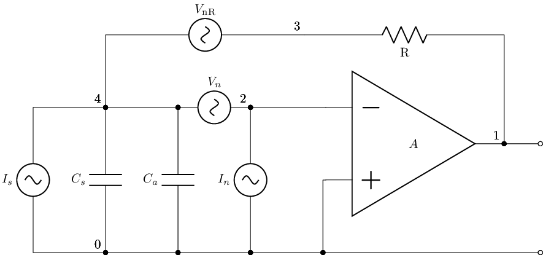
        

`inamp-amplifier1.sch <https://github.com/mph-/lcapy/tree/master/doc/examples/tutorials/opamps/inamp-amplifier1.sch>`_

.. literalinclude:: examples/tutorials/opamps/inamp-amplifier1.sch

.. image:: examples/tutorials/opamps/inamp-amplifier1.png
   :width: 8.0cm
        

`fdopamp-amplifier1.sch <https://github.com/mph-/lcapy/tree/master/doc/examples/tutorials/opamps/fdopamp-amplifier1.sch>`_

.. literalinclude:: examples/tutorials/opamps/fdopamp-amplifier1.sch

.. image:: examples/tutorials/opamps/fdopamp-amplifier1.png
   :width: 11.2cm
        

`opamp-displacement-current-sensor-noise-model1.sch <https://github.com/mph-/lcapy/tree/master/doc/examples/tutorials/opamps/opamp-displacement-current-sensor-noise-model1.sch>`_

.. literalinclude:: examples/tutorials/opamps/opamp-displacement-current-sensor-noise-model1.sch

.. image:: examples/tutorials/opamps/opamp-displacement-current-sensor-noise-model1.png
   :width: 14.8cm
        

`opamp-displacement-current-sensor1.sch <https://github.com/mph-/lcapy/tree/master/doc/examples/tutorials/opamps/opamp-displacement-current-sensor1.sch>`_

.. literalinclude:: examples/tutorials/opamps/opamp-displacement-current-sensor1.sch

.. image:: examples/tutorials/opamps/opamp-displacement-current-sensor1.png
   :width: 11.0cm
        

`opamp-noninverting-amplifier-noisy.sch <https://github.com/mph-/lcapy/tree/master/doc/examples/tutorials/opampnoise/opamp-noninverting-amplifier-noisy.sch>`_

.. literalinclude:: examples/tutorials/opampnoise/opamp-noninverting-amplifier-noisy.sch

.. image:: examples/tutorials/opampnoise/opamp-noninverting-amplifier-noisy.png
   :width: 16.5cm
        

`opamp-piezo-amplifier1.sch <https://github.com/mph-/lcapy/tree/master/doc/examples/tutorials/opamps/opamp-piezo-amplifier1.sch>`_

.. literalinclude:: examples/tutorials/opamps/opamp-piezo-amplifier1.sch

.. image:: examples/tutorials/opamps/opamp-piezo-amplifier1.png
   :width: 16.0cm
        

`opamp-transimpedance-amplifier-with-voltage-gain1.sch <https://github.com/mph-/lcapy/tree/master/doc/examples/tutorials/opamps/opamp-transimpedance-amplifier-with-voltage-gain1.sch>`_

.. literalinclude:: examples/tutorials/opamps/opamp-transimpedance-amplifier-with-voltage-gain1.sch

.. image:: examples/tutorials/opamps/opamp-transimpedance-amplifier-with-voltage-gain1.png
   :width: 9.0cm
        

`pierce-oscillator.sch <https://github.com/mph-/lcapy/tree/master/doc/examples/schematics/pierce-oscillator.sch>`_

.. literalinclude:: examples/schematics/pierce-oscillator.sch

.. image:: examples/schematics/pierce-oscillator.png
   :width: 6.2cm
        

`sallen-key-lpf1.sch <https://github.com/mph-/lcapy/tree/master/doc/examples/schematics/sallen-key-lpf1.sch>`_

.. literalinclude:: examples/schematics/sallen-key-lpf1.sch

.. image:: examples/schematics/sallen-key-lpf1.png
   :width: 10.6cm
        

`multiple-feedback-lpf.sch <https://github.com/mph-/lcapy/tree/master/doc/examples/tutorials/opamps/multiple-feedback-lpf.sch>`_

.. literalinclude:: examples/tutorials/opamps/multiple-feedback-lpf.sch

.. image:: examples/tutorials/opamps/multiple-feedback-lpf.png
   :width: 8.8cm
        

`guard1.sch <https://github.com/mph-/lcapy/tree/master/doc/examples/schematics/guard1.sch>`_

.. literalinclude:: examples/schematics/guard1.sch

.. image:: examples/schematics/guard1.png
   :width: 14.1cm
        

`shield-ground.sch <https://github.com/mph-/lcapy/tree/master/doc/examples/tutorials/shield-guard/shield-ground.sch>`_

.. literalinclude:: examples/tutorials/shield-guard/shield-ground.sch

.. image:: examples/tutorials/shield-guard/shield-ground.png
   :width: 19.2cm
        

`shield-guard.sch <https://github.com/mph-/lcapy/tree/master/doc/examples/tutorials/shield-guard/shield-guard.sch>`_

.. literalinclude:: examples/tutorials/shield-guard/shield-guard.sch

.. image:: examples/tutorials/shield-guard/shield-guard.png
   :width: 22.5cm
        

`opamp-displacement-current-sensor-noise-model1.sch <https://github.com/mph-/lcapy/tree/master/doc/examples/tutorials/opamps/opamp-displacement-current-sensor-noise-model1.sch>`_

.. literalinclude:: examples/tutorials/opamps/opamp-displacement-current-sensor-noise-model1.sch

.. image:: examples/tutorials/opamps/opamp-displacement-current-sensor-noise-model1.png
   :width: 14.8cm
        

`opamp-displacement-current-sensor1.sch <https://github.com/mph-/lcapy/tree/master/doc/examples/tutorials/opamps/opamp-displacement-current-sensor1.sch>`_

.. literalinclude:: examples/tutorials/opamps/opamp-displacement-current-sensor1.sch

.. image:: examples/tutorials/opamps/opamp-displacement-current-sensor1.png
   :width: 11.0cm
        

`opamp-noninverting-amplifier-noisy.sch <https://github.com/mph-/lcapy/tree/master/doc/examples/tutorials/opampnoise/opamp-noninverting-amplifier-noisy.sch>`_

.. literalinclude:: examples/tutorials/opampnoise/opamp-noninverting-amplifier-noisy.sch

.. image:: examples/tutorials/opampnoise/opamp-noninverting-amplifier-noisy.png
   :width: 16.5cm
        
Transducers
===========

`KLM2.sch <https://github.com/mph-/lcapy/tree/master/doc/examples/tutorials/transducers/KLM2.sch>`_

.. literalinclude:: examples/tutorials/transducers/KLM2.sch

.. image:: examples/tutorials/transducers/KLM2.png
   :width: 13.3cm
        

`KLM3.sch <https://github.com/mph-/lcapy/tree/master/doc/examples/tutorials/transducers/KLM3.sch>`_

.. literalinclude:: examples/tutorials/transducers/KLM3.sch

.. image:: examples/tutorials/transducers/KLM3.png
   :width: 9.6cm
        

`accelerometer1.sch <https://github.com/mph-/lcapy/tree/master/doc/examples/schematics/accelerometer1.sch>`_

.. literalinclude:: examples/schematics/accelerometer1.sch

.. image:: examples/schematics/accelerometer1.png
   :width: 12.3cm
        
Miscellaneous
=============

`colors1.sch <https://github.com/mph-/lcapy/tree/master/doc/examples/schematics/colors1.sch>`_

.. literalinclude:: examples/schematics/colors1.sch

.. image:: examples/schematics/colors1.png
   :width: 19.2cm
        
