.. _schematic gallery:

==================
Schematic gallery
==================

`ADC1.sch <https://github.com/mph-/lcapy/tree/master/doc/examples/schematics/ADC1.sch>`_
========================================================================================

.. literalinclude:: examples/schematics/ADC1.sch

.. image:: examples/schematics/ADC1.png
   :width: 5.4cm
        

`ADC2.sch <https://github.com/mph-/lcapy/tree/master/doc/examples/schematics/ADC2.sch>`_
========================================================================================

.. literalinclude:: examples/schematics/ADC2.sch

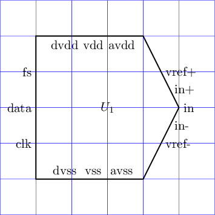
        

`ADC3.sch <https://github.com/mph-/lcapy/tree/master/doc/examples/schematics/ADC3.sch>`_
========================================================================================

.. literalinclude:: examples/schematics/ADC3.sch

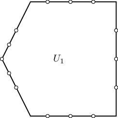
        

`Btwoport1.sch <https://github.com/mph-/lcapy/tree/master/doc/examples/schematics/Btwoport1.sch>`_
==================================================================================================

.. literalinclude:: examples/schematics/Btwoport1.sch

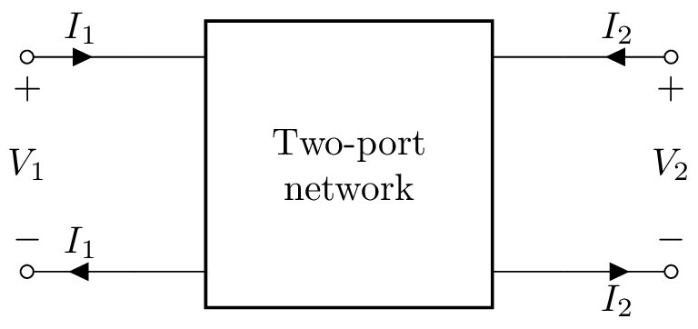
        

`CPE1.sch <https://github.com/mph-/lcapy/tree/master/doc/examples/schematics/CPE1.sch>`_
========================================================================================

.. literalinclude:: examples/schematics/CPE1.sch

.. image:: examples/schematics/CPE1.png
   :width: 2.4cm
        

`D1.sch <https://github.com/mph-/lcapy/tree/master/doc/examples/schematics/D1.sch>`_
====================================================================================

.. literalinclude:: examples/schematics/D1.sch

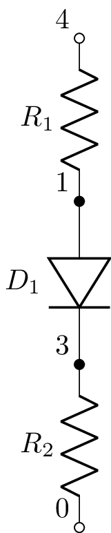
        

`D2.sch <https://github.com/mph-/lcapy/tree/master/doc/examples/schematics/D2.sch>`_
====================================================================================

.. literalinclude:: examples/schematics/D2.sch

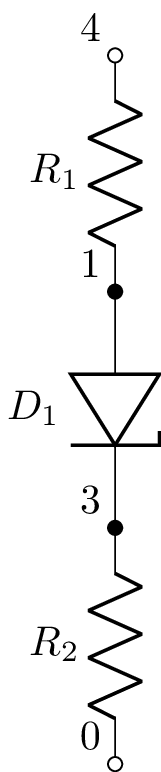
        

`D3.sch <https://github.com/mph-/lcapy/tree/master/doc/examples/schematics/D3.sch>`_
====================================================================================

.. literalinclude:: examples/schematics/D3.sch

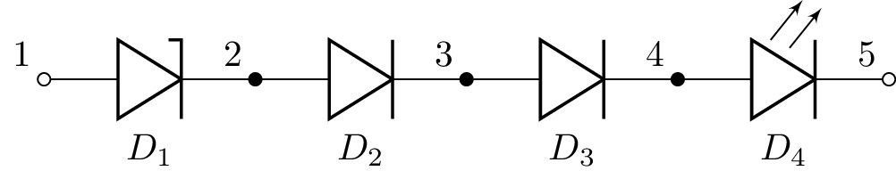
        

`D4.sch <https://github.com/mph-/lcapy/tree/master/doc/examples/schematics/D4.sch>`_
====================================================================================

.. literalinclude:: examples/schematics/D4.sch

.. image:: examples/schematics/D4.png
   :width: 3.8cm
        

`D5.sch <https://github.com/mph-/lcapy/tree/master/doc/examples/schematics/D5.sch>`_
====================================================================================

.. literalinclude:: examples/schematics/D5.sch

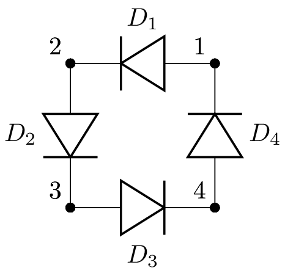
        

`DAC1.sch <https://github.com/mph-/lcapy/tree/master/doc/examples/schematics/DAC1.sch>`_
========================================================================================

.. literalinclude:: examples/schematics/DAC1.sch

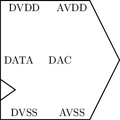
        

`DAC3.sch <https://github.com/mph-/lcapy/tree/master/doc/examples/schematics/DAC3.sch>`_
========================================================================================

.. literalinclude:: examples/schematics/DAC3.sch

.. image:: examples/schematics/DAC3.png
   :width: 5.6cm
        

`DFF1.sch <https://github.com/mph-/lcapy/tree/master/doc/examples/schematics/DFF1.sch>`_
========================================================================================

.. literalinclude:: examples/schematics/DFF1.sch

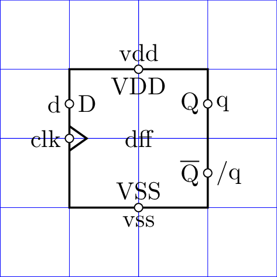
        

`DFF1b.sch <https://github.com/mph-/lcapy/tree/master/doc/examples/schematics/DFF1b.sch>`_
==========================================================================================

.. literalinclude:: examples/schematics/DFF1b.sch

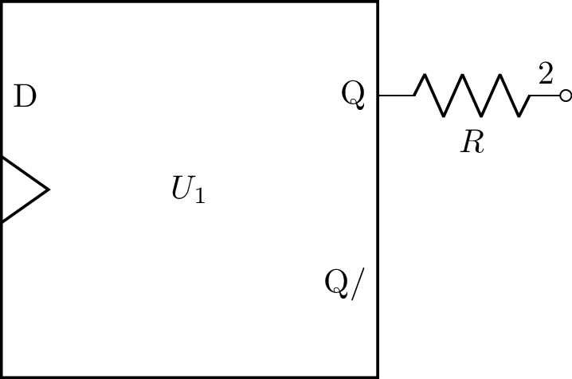
        

`DFF2.sch <https://github.com/mph-/lcapy/tree/master/doc/examples/schematics/DFF2.sch>`_
========================================================================================

.. literalinclude:: examples/schematics/DFF2.sch

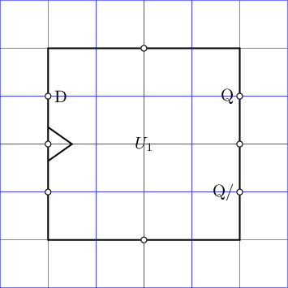
        

`Dbridge.sch <https://github.com/mph-/lcapy/tree/master/doc/examples/schematics/Dbridge.sch>`_
==============================================================================================

.. literalinclude:: examples/schematics/Dbridge.sch

.. image:: examples/schematics/Dbridge.png
   :width: 4.7cm
        

`Ddown.sch <https://github.com/mph-/lcapy/tree/master/doc/examples/schematics/Ddown.sch>`_
==========================================================================================

.. literalinclude:: examples/schematics/Ddown.sch

.. image:: examples/schematics/Ddown.png
   :width: 1.3cm
        

`Dleft.sch <https://github.com/mph-/lcapy/tree/master/doc/examples/schematics/Dleft.sch>`_
==========================================================================================

.. literalinclude:: examples/schematics/Dleft.sch

.. image:: examples/schematics/Dleft.png
   :width: 2.4cm
        

`Dright.sch <https://github.com/mph-/lcapy/tree/master/doc/examples/schematics/Dright.sch>`_
============================================================================================

.. literalinclude:: examples/schematics/Dright.sch

.. image:: examples/schematics/Dright.png
   :width: 2.4cm
        

`Dup.sch <https://github.com/mph-/lcapy/tree/master/doc/examples/schematics/Dup.sch>`_
======================================================================================

.. literalinclude:: examples/schematics/Dup.sch

.. image:: examples/schematics/Dup.png
   :width: 1.4cm
        

`E1.sch <https://github.com/mph-/lcapy/tree/master/doc/examples/schematics/E1.sch>`_
====================================================================================

.. literalinclude:: examples/schematics/E1.sch

.. image:: examples/schematics/E1.png
   :width: 11.4cm
        

`Eopamp_Uopamp.sch <https://github.com/mph-/lcapy/tree/master/doc/examples/schematics/Eopamp_Uopamp.sch>`_
==========================================================================================================

.. literalinclude:: examples/schematics/Eopamp_Uopamp.sch

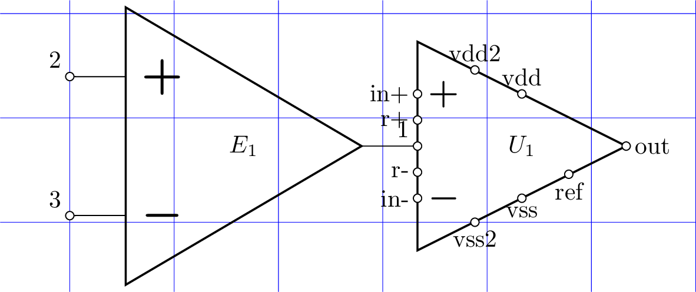
        

`Eopamp_mirror.sch <https://github.com/mph-/lcapy/tree/master/doc/examples/schematics/Eopamp_mirror.sch>`_
==========================================================================================================

.. literalinclude:: examples/schematics/Eopamp_mirror.sch

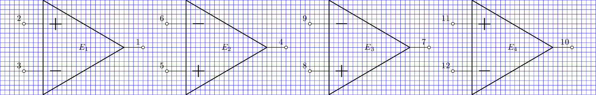
        

`F1.sch <https://github.com/mph-/lcapy/tree/master/doc/examples/schematics/F1.sch>`_
====================================================================================

.. literalinclude:: examples/schematics/F1.sch

.. image:: examples/schematics/F1.png
   :width: 11.4cm
        

`FB1.sch <https://github.com/mph-/lcapy/tree/master/doc/examples/schematics/FB1.sch>`_
======================================================================================

.. literalinclude:: examples/schematics/FB1.sch

.. image:: examples/schematics/FB1.png
   :width: 2.4cm
        

`FB2.sch <https://github.com/mph-/lcapy/tree/master/doc/examples/schematics/FB2.sch>`_
======================================================================================

.. literalinclude:: examples/schematics/FB2.sch

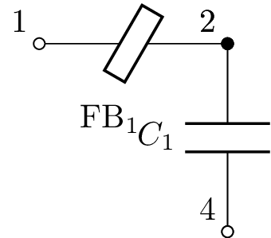
        

`G1.sch <https://github.com/mph-/lcapy/tree/master/doc/examples/schematics/G1.sch>`_
====================================================================================

.. literalinclude:: examples/schematics/G1.sch

.. image:: examples/schematics/G1.png
   :width: 11.4cm
        

`GY1.sch <https://github.com/mph-/lcapy/tree/master/doc/examples/schematics/GY1.sch>`_
======================================================================================

.. literalinclude:: examples/schematics/GY1.sch

.. image:: examples/schematics/GY1.png
   :width: 2.5cm
        

`H1.sch <https://github.com/mph-/lcapy/tree/master/doc/examples/schematics/H1.sch>`_
====================================================================================

.. literalinclude:: examples/schematics/H1.sch

.. image:: examples/schematics/H1.png
   :width: 11.4cm
        

`I2C2.sch <https://github.com/mph-/lcapy/tree/master/doc/examples/schematics/I2C2.sch>`_
========================================================================================

.. literalinclude:: examples/schematics/I2C2.sch

.. image:: examples/schematics/I2C2.png
   :width: 17.3cm
        

`J1.sch <https://github.com/mph-/lcapy/tree/master/doc/examples/schematics/J1.sch>`_
====================================================================================

.. literalinclude:: examples/schematics/J1.sch

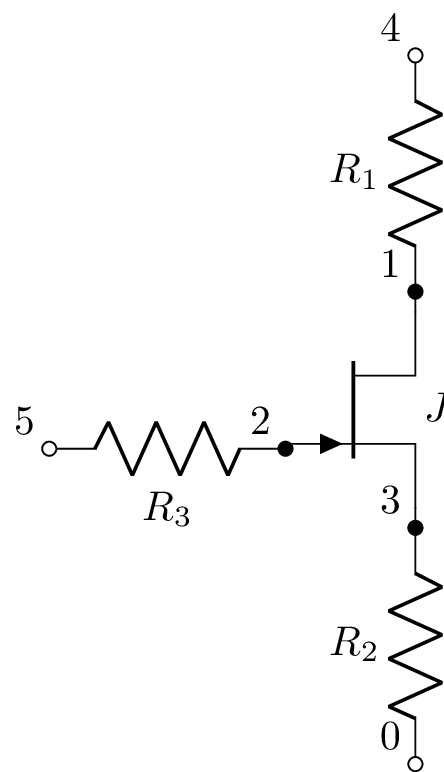
        

`J2.sch <https://github.com/mph-/lcapy/tree/master/doc/examples/schematics/J2.sch>`_
====================================================================================

.. literalinclude:: examples/schematics/J2.sch

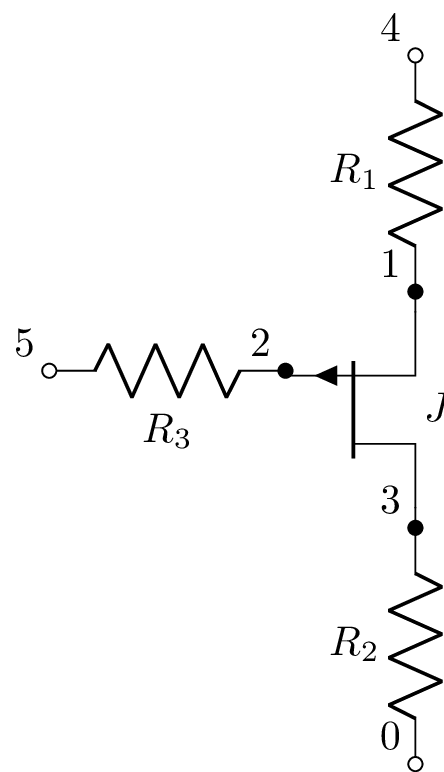
        

`J3.sch <https://github.com/mph-/lcapy/tree/master/doc/examples/schematics/J3.sch>`_
====================================================================================

.. literalinclude:: examples/schematics/J3.sch

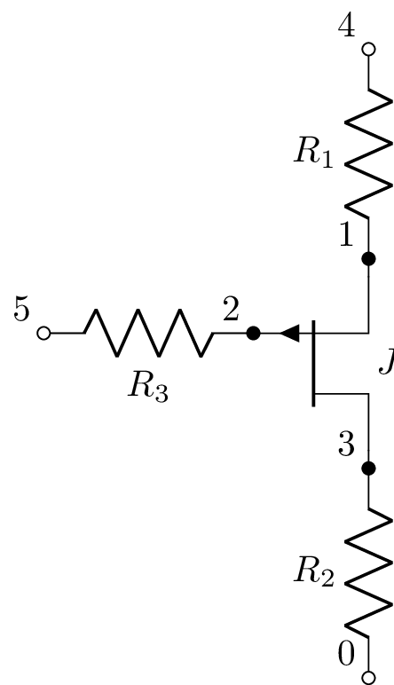
        

`K1.sch <https://github.com/mph-/lcapy/tree/master/doc/examples/schematics/K1.sch>`_
====================================================================================

.. literalinclude:: examples/schematics/K1.sch

.. image:: examples/schematics/K1.png
   :width: 2.4cm
        

`K2.sch <https://github.com/mph-/lcapy/tree/master/doc/examples/schematics/K2.sch>`_
====================================================================================

.. literalinclude:: examples/schematics/K2.sch

.. image:: examples/schematics/K2.png
   :width: 6.5cm
        

`KLM2.sch <https://github.com/mph-/lcapy/tree/master/doc/examples/tutorials/transducers/KLM2.sch>`_
===================================================================================================

.. literalinclude:: examples/tutorials/transducers/KLM2.sch

.. image:: examples/tutorials/transducers/KLM2.png
   :width: 13.3cm
        

`KLM3.sch <https://github.com/mph-/lcapy/tree/master/doc/examples/tutorials/transducers/KLM3.sch>`_
===================================================================================================

.. literalinclude:: examples/tutorials/transducers/KLM3.sch

.. image:: examples/tutorials/transducers/KLM3.png
   :width: 9.6cm
        

`L1.sch <https://github.com/mph-/lcapy/tree/master/doc/examples/schematics/L1.sch>`_
====================================================================================

.. literalinclude:: examples/schematics/L1.sch

.. image:: examples/schematics/L1.png
   :width: 4.4cm
        

`LC1.sch <https://github.com/mph-/lcapy/tree/master/doc/examples/schematics/LC1.sch>`_
======================================================================================

.. literalinclude:: examples/schematics/LC1.sch

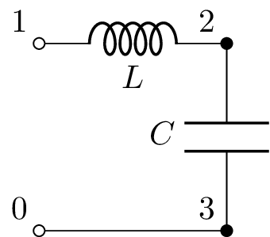
        

`LTFT.sch <https://github.com/mph-/lcapy/tree/master/doc/examples/schematics/LTFT.sch>`_
========================================================================================

.. literalinclude:: examples/schematics/LTFT.sch

.. image:: examples/schematics/LTFT.png
   :width: 11.1cm
        

`M1.sch <https://github.com/mph-/lcapy/tree/master/doc/examples/schematics/M1.sch>`_
====================================================================================

.. literalinclude:: examples/schematics/M1.sch

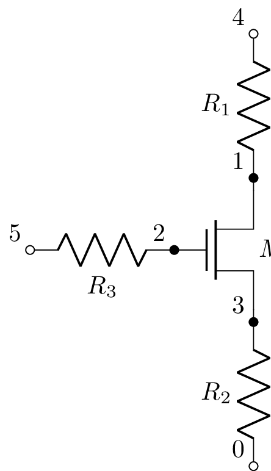
        

`M1b.sch <https://github.com/mph-/lcapy/tree/master/doc/examples/schematics/M1b.sch>`_
======================================================================================

.. literalinclude:: examples/schematics/M1b.sch

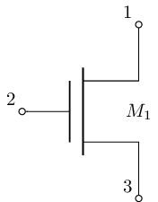
        

`M1c.sch <https://github.com/mph-/lcapy/tree/master/doc/examples/schematics/M1c.sch>`_
======================================================================================

.. literalinclude:: examples/schematics/M1c.sch

.. image:: examples/schematics/M1c.png
   :width: 1.9cm
        

`M2.sch <https://github.com/mph-/lcapy/tree/master/doc/examples/schematics/M2.sch>`_
====================================================================================

.. literalinclude:: examples/schematics/M2.sch

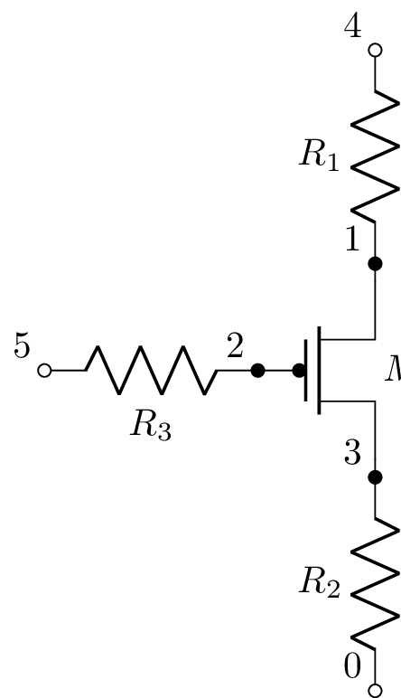
        

`M3.sch <https://github.com/mph-/lcapy/tree/master/doc/examples/schematics/M3.sch>`_
====================================================================================

.. literalinclude:: examples/schematics/M3.sch

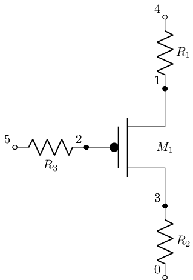
        

`M6.sch <https://github.com/mph-/lcapy/tree/master/doc/examples/schematics/M6.sch>`_
====================================================================================

.. literalinclude:: examples/schematics/M6.sch

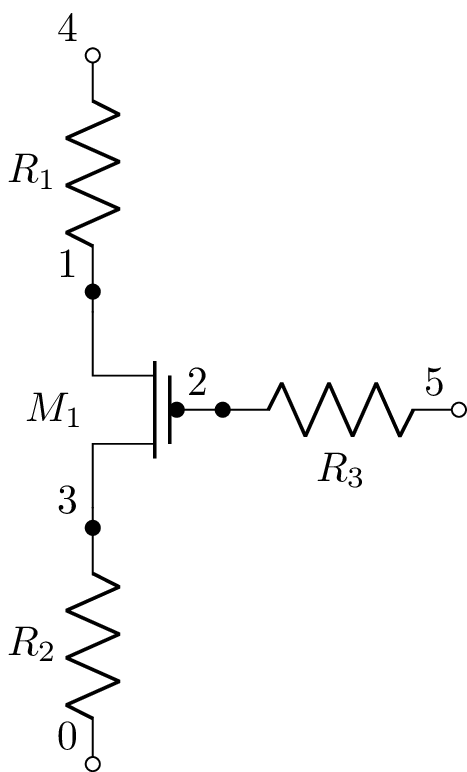
        

`MX1.sch <https://github.com/mph-/lcapy/tree/master/doc/examples/schematics/MX1.sch>`_
======================================================================================

.. literalinclude:: examples/schematics/MX1.sch

.. image:: examples/schematics/MX1.png
   :width: 3.4cm
        

`Q1.sch <https://github.com/mph-/lcapy/tree/master/doc/examples/schematics/Q1.sch>`_
====================================================================================

.. literalinclude:: examples/schematics/Q1.sch

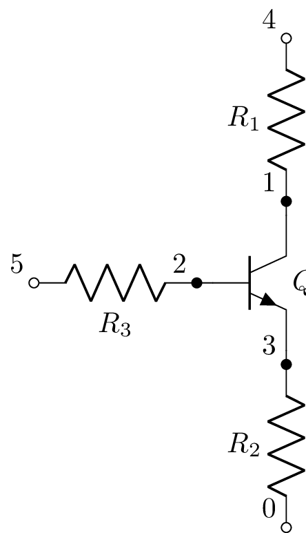
        

`Q1b.sch <https://github.com/mph-/lcapy/tree/master/doc/examples/schematics/Q1b.sch>`_
======================================================================================

.. literalinclude:: examples/schematics/Q1b.sch

.. image:: examples/schematics/Q1b.png
   :width: 1.9cm
        

`Q1c.sch <https://github.com/mph-/lcapy/tree/master/doc/examples/schematics/Q1c.sch>`_
======================================================================================

.. literalinclude:: examples/schematics/Q1c.sch

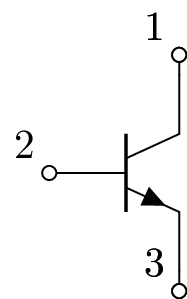
        

`Q2.sch <https://github.com/mph-/lcapy/tree/master/doc/examples/schematics/Q2.sch>`_
====================================================================================

.. literalinclude:: examples/schematics/Q2.sch

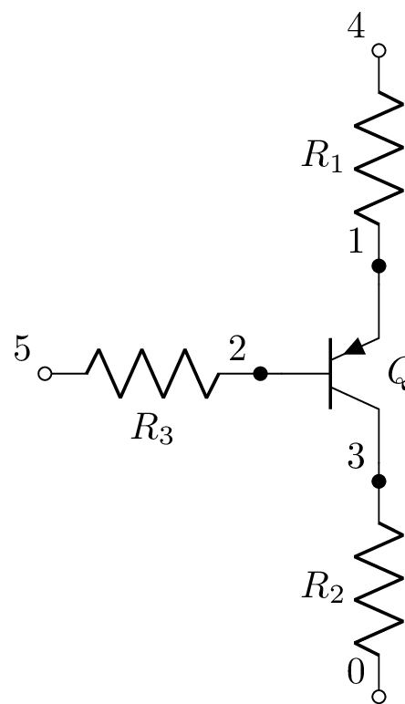
        

`Q3.sch <https://github.com/mph-/lcapy/tree/master/doc/examples/schematics/Q3.sch>`_
====================================================================================

.. literalinclude:: examples/schematics/Q3.sch

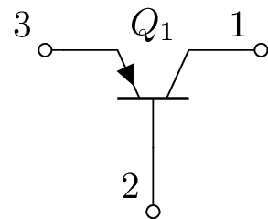
        

`Qnpndown.sch <https://github.com/mph-/lcapy/tree/master/doc/examples/schematics/Qnpndown.sch>`_
================================================================================================

.. literalinclude:: examples/schematics/Qnpndown.sch

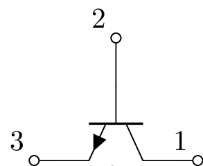
        

`Qnpnleft.sch <https://github.com/mph-/lcapy/tree/master/doc/examples/schematics/Qnpnleft.sch>`_
================================================================================================

.. literalinclude:: examples/schematics/Qnpnleft.sch

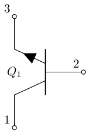
        

`Qnpnright.sch <https://github.com/mph-/lcapy/tree/master/doc/examples/schematics/Qnpnright.sch>`_
==================================================================================================

.. literalinclude:: examples/schematics/Qnpnright.sch

.. image:: examples/schematics/Qnpnright.png
   :width: 1.9cm
        

`Qnpnrot45.sch <https://github.com/mph-/lcapy/tree/master/doc/examples/schematics/Qnpnrot45.sch>`_
==================================================================================================

.. literalinclude:: examples/schematics/Qnpnrot45.sch

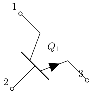
        

`Qnpnup.sch <https://github.com/mph-/lcapy/tree/master/doc/examples/schematics/Qnpnup.sch>`_
============================================================================================

.. literalinclude:: examples/schematics/Qnpnup.sch

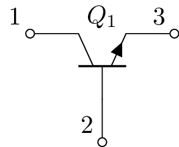
        

`Qnpright.sch <https://github.com/mph-/lcapy/tree/master/doc/examples/schematics/Qnpright.sch>`_
================================================================================================

.. literalinclude:: examples/schematics/Qnpright.sch

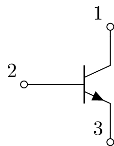
        

`Qpnpdown.sch <https://github.com/mph-/lcapy/tree/master/doc/examples/schematics/Qpnpdown.sch>`_
================================================================================================

.. literalinclude:: examples/schematics/Qpnpdown.sch

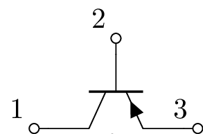
        

`Qpnpleft.sch <https://github.com/mph-/lcapy/tree/master/doc/examples/schematics/Qpnpleft.sch>`_
================================================================================================

.. literalinclude:: examples/schematics/Qpnpleft.sch

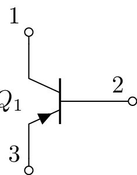
        

`Qpnpright.sch <https://github.com/mph-/lcapy/tree/master/doc/examples/schematics/Qpnpright.sch>`_
==================================================================================================

.. literalinclude:: examples/schematics/Qpnpright.sch

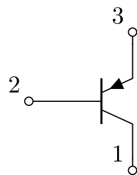
        

`Qpnpup.sch <https://github.com/mph-/lcapy/tree/master/doc/examples/schematics/Qpnpup.sch>`_
============================================================================================

.. literalinclude:: examples/schematics/Qpnpup.sch

.. image:: examples/schematics/Qpnpup.png
   :width: 2.4cm
        

`RC1.sch <https://github.com/mph-/lcapy/tree/master/doc/examples/schematics/RC1.sch>`_
======================================================================================

.. literalinclude:: examples/schematics/RC1.sch

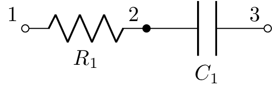
        

`RC2.sch <https://github.com/mph-/lcapy/tree/master/doc/examples/schematics/RC2.sch>`_
======================================================================================

.. literalinclude:: examples/schematics/RC2.sch

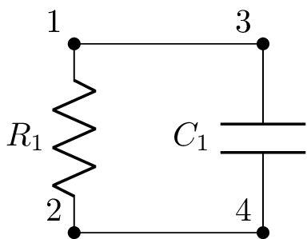
        

`RCparallel1.sch <https://github.com/mph-/lcapy/tree/master/doc/examples/tutorials/RCnoise/RCparallel1.sch>`_
=============================================================================================================

.. literalinclude:: examples/tutorials/RCnoise/RCparallel1.sch

.. image:: examples/tutorials/RCnoise/RCparallel1.png
   :width: 3.0cm
        

`RCparallel1noisy.sch <https://github.com/mph-/lcapy/tree/master/doc/examples/tutorials/RCnoise/RCparallel1noisy.sch>`_
=======================================================================================================================

.. literalinclude:: examples/tutorials/RCnoise/RCparallel1noisy.sch

.. image:: examples/tutorials/RCnoise/RCparallel1noisy.png
   :width: 5.8cm
        

`RV1.sch <https://github.com/mph-/lcapy/tree/master/doc/examples/schematics/RV1.sch>`_
======================================================================================

.. literalinclude:: examples/schematics/RV1.sch

.. image:: examples/schematics/RV1.png
   :width: 2.4cm
        

`RV2.sch <https://github.com/mph-/lcapy/tree/master/doc/examples/schematics/RV2.sch>`_
======================================================================================

.. literalinclude:: examples/schematics/RV2.sch

.. image:: examples/schematics/RV2.png
   :width: 2.4cm
        

`Rlabels.sch <https://github.com/mph-/lcapy/tree/master/doc/examples/schematics/Rlabels.sch>`_
==============================================================================================

.. literalinclude:: examples/schematics/Rlabels.sch

.. image:: examples/schematics/Rlabels.png
   :width: 8.9cm
        

`Rright.sch <https://github.com/mph-/lcapy/tree/master/doc/examples/schematics/Rright.sch>`_
============================================================================================

.. literalinclude:: examples/schematics/Rright.sch

.. image:: examples/schematics/Rright.png
   :width: 2.4cm
        

`Rright2.sch <https://github.com/mph-/lcapy/tree/master/doc/examples/schematics/Rright2.sch>`_
==============================================================================================

.. literalinclude:: examples/schematics/Rright2.sch

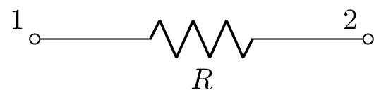
        

`SP1.sch <https://github.com/mph-/lcapy/tree/master/doc/examples/schematics/SP1.sch>`_
======================================================================================

.. literalinclude:: examples/schematics/SP1.sch

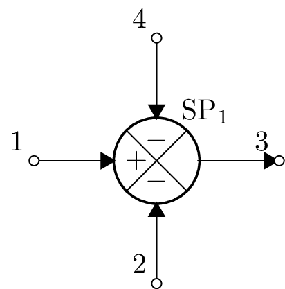
        

`SP2.sch <https://github.com/mph-/lcapy/tree/master/doc/examples/schematics/SP2.sch>`_
======================================================================================

.. literalinclude:: examples/schematics/SP2.sch

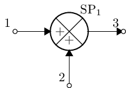
        

`SP3.sch <https://github.com/mph-/lcapy/tree/master/doc/examples/schematics/SP3.sch>`_
======================================================================================

.. literalinclude:: examples/schematics/SP3.sch

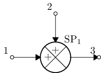
        

`SP4.sch <https://github.com/mph-/lcapy/tree/master/doc/examples/schematics/SP4.sch>`_
======================================================================================

.. literalinclude:: examples/schematics/SP4.sch

.. image:: examples/schematics/SP4.png
   :width: 2.9cm
        

`SP5.sch <https://github.com/mph-/lcapy/tree/master/doc/examples/schematics/SP5.sch>`_
======================================================================================

.. literalinclude:: examples/schematics/SP5.sch

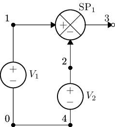
        

`Sbox1.sch <https://github.com/mph-/lcapy/tree/master/doc/examples/schematics/Sbox1.sch>`_
==========================================================================================

.. literalinclude:: examples/schematics/Sbox1.sch

.. image:: examples/schematics/Sbox1.png
   :width: 4.9cm
        

`Sbox2.sch <https://github.com/mph-/lcapy/tree/master/doc/examples/schematics/Sbox2.sch>`_
==========================================================================================

.. literalinclude:: examples/schematics/Sbox2.sch

.. image:: examples/schematics/Sbox2.png
   :width: 5.9cm
        

`Sbox3.sch <https://github.com/mph-/lcapy/tree/master/doc/examples/schematics/Sbox3.sch>`_
==========================================================================================

.. literalinclude:: examples/schematics/Sbox3.sch

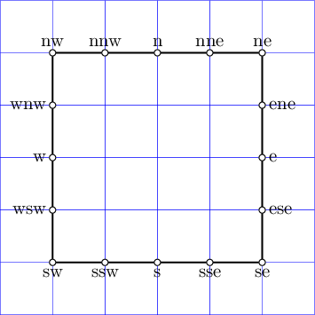
        

`Scircle1.sch <https://github.com/mph-/lcapy/tree/master/doc/examples/schematics/Scircle1.sch>`_
================================================================================================

.. literalinclude:: examples/schematics/Scircle1.sch

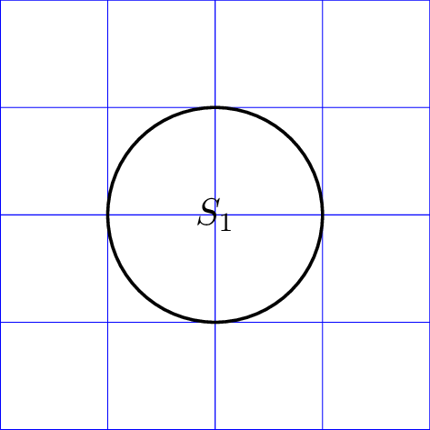
        

`Scircle2.sch <https://github.com/mph-/lcapy/tree/master/doc/examples/schematics/Scircle2.sch>`_
================================================================================================

.. literalinclude:: examples/schematics/Scircle2.sch

.. image:: examples/schematics/Scircle2.png
   :width: 5.9cm
        

`Striangle2.sch <https://github.com/mph-/lcapy/tree/master/doc/examples/schematics/Striangle2.sch>`_
====================================================================================================

.. literalinclude:: examples/schematics/Striangle2.sch

.. image:: examples/schematics/Striangle2.png
   :width: 5.9cm
        

`Striangle3.sch <https://github.com/mph-/lcapy/tree/master/doc/examples/schematics/Striangle3.sch>`_
====================================================================================================

.. literalinclude:: examples/schematics/Striangle3.sch

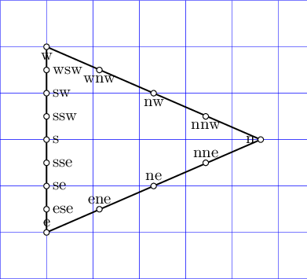
        

`Striangle4.sch <https://github.com/mph-/lcapy/tree/master/doc/examples/schematics/Striangle4.sch>`_
====================================================================================================

.. literalinclude:: examples/schematics/Striangle4.sch

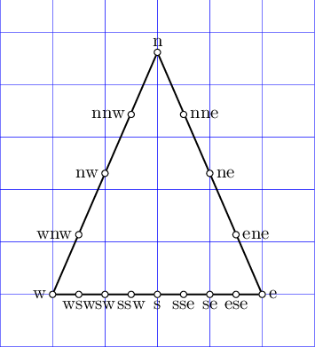
        

`TF1.sch <https://github.com/mph-/lcapy/tree/master/doc/examples/schematics/TF1.sch>`_
======================================================================================

.. literalinclude:: examples/schematics/TF1.sch

.. image:: examples/schematics/TF1.png
   :width: 1.8cm
        

`TF2.sch <https://github.com/mph-/lcapy/tree/master/doc/examples/schematics/TF2.sch>`_
======================================================================================

.. literalinclude:: examples/schematics/TF2.sch

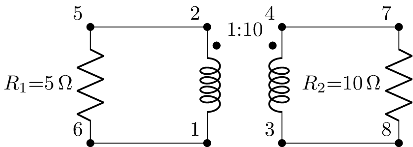
        

`TF3.sch <https://github.com/mph-/lcapy/tree/master/doc/examples/schematics/TF3.sch>`_
======================================================================================

.. literalinclude:: examples/schematics/TF3.sch

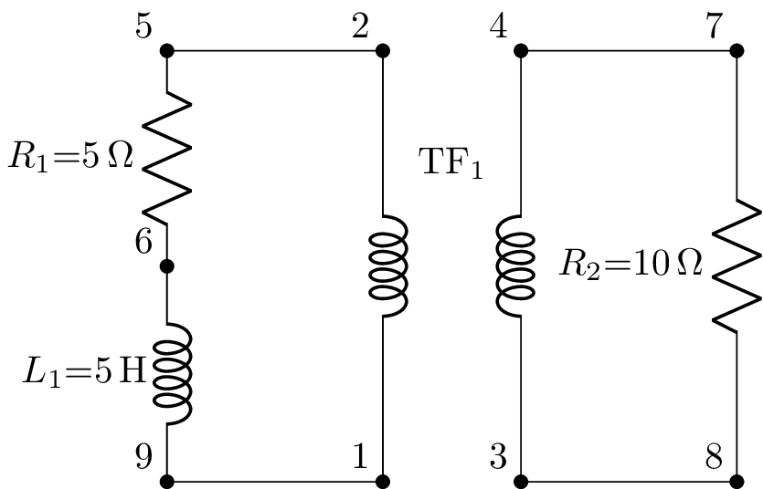
        

`TFcore1.sch <https://github.com/mph-/lcapy/tree/master/doc/examples/schematics/TFcore1.sch>`_
==============================================================================================

.. literalinclude:: examples/schematics/TFcore1.sch

.. image:: examples/schematics/TFcore1.png
   :width: 1.8cm
        

`TFcore2.sch <https://github.com/mph-/lcapy/tree/master/doc/examples/schematics/TFcore2.sch>`_
==============================================================================================

.. literalinclude:: examples/schematics/TFcore2.sch

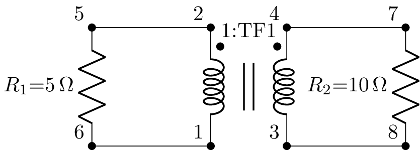
        

`TFtap1.sch <https://github.com/mph-/lcapy/tree/master/doc/examples/schematics/TFtap1.sch>`_
============================================================================================

.. literalinclude:: examples/schematics/TFtap1.sch

.. image:: examples/schematics/TFtap1.png
   :width: 3.7cm
        

`TFtapcore1.sch <https://github.com/mph-/lcapy/tree/master/doc/examples/schematics/TFtapcore1.sch>`_
====================================================================================================

.. literalinclude:: examples/schematics/TFtapcore1.sch

.. image:: examples/schematics/TFtapcore1.png
   :width: 3.7cm
        

`TFup.sch <https://github.com/mph-/lcapy/tree/master/doc/examples/schematics/TFup.sch>`_
========================================================================================

.. literalinclude:: examples/schematics/TFup.sch

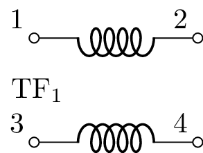
        

`TP1.sch <https://github.com/mph-/lcapy/tree/master/doc/examples/schematics/TP1.sch>`_
======================================================================================

.. literalinclude:: examples/schematics/TP1.sch

        

`TPA.sch <https://github.com/mph-/lcapy/tree/master/doc/examples/schematics/TPA.sch>`_
======================================================================================

.. literalinclude:: examples/schematics/TPA.sch

.. image:: examples/schematics/TPA.png
   :width: 9.3cm
        

`TPB.sch <https://github.com/mph-/lcapy/tree/master/doc/examples/schematics/TPB.sch>`_
======================================================================================

.. literalinclude:: examples/schematics/TPB.sch

.. image:: examples/schematics/TPB.png
   :width: 9.3cm
        

`TPG.sch <https://github.com/mph-/lcapy/tree/master/doc/examples/schematics/TPG.sch>`_
======================================================================================

.. literalinclude:: examples/schematics/TPG.sch

.. image:: examples/schematics/TPG.png
   :width: 9.8cm
        

`TPH.sch <https://github.com/mph-/lcapy/tree/master/doc/examples/schematics/TPH.sch>`_
======================================================================================

.. literalinclude:: examples/schematics/TPH.sch

.. image:: examples/schematics/TPH.png
   :width: 9.8cm
        

`TPY.sch <https://github.com/mph-/lcapy/tree/master/doc/examples/schematics/TPY.sch>`_
======================================================================================

.. literalinclude:: examples/schematics/TPY.sch

.. image:: examples/schematics/TPY.png
   :width: 8.3cm
        

`TPZ.sch <https://github.com/mph-/lcapy/tree/master/doc/examples/schematics/TPZ.sch>`_
======================================================================================

.. literalinclude:: examples/schematics/TPZ.sch

.. image:: examples/schematics/TPZ.png
   :width: 10.3cm
        

`TR1.sch <https://github.com/mph-/lcapy/tree/master/doc/examples/schematics/TR1.sch>`_
======================================================================================

.. literalinclude:: examples/schematics/TR1.sch

        

`Uadc.sch <https://github.com/mph-/lcapy/tree/master/doc/examples/schematics/Uadc.sch>`_
========================================================================================

.. literalinclude:: examples/schematics/Uadc.sch

.. image:: examples/schematics/Uadc.png
   :width: 5.9cm
        

`Ubuffer.sch <https://github.com/mph-/lcapy/tree/master/doc/examples/schematics/Ubuffer.sch>`_
==============================================================================================

.. literalinclude:: examples/schematics/Ubuffer.sch

.. image:: examples/schematics/Ubuffer.png
   :width: 3.9cm
        

`Ubuffer1.sch <https://github.com/mph-/lcapy/tree/master/doc/examples/schematics/Ubuffer1.sch>`_
================================================================================================

.. literalinclude:: examples/schematics/Ubuffer1.sch

        

`Ubuffer2.sch <https://github.com/mph-/lcapy/tree/master/doc/examples/schematics/Ubuffer2.sch>`_
================================================================================================

.. literalinclude:: examples/schematics/Ubuffer2.sch

        

`Uchip1313.sch <https://github.com/mph-/lcapy/tree/master/doc/examples/schematics/Uchip1313.sch>`_
==================================================================================================

.. literalinclude:: examples/schematics/Uchip1313.sch

.. image:: examples/schematics/Uchip1313.png
   :width: 5.9cm
        

`Uchip2121.sch <https://github.com/mph-/lcapy/tree/master/doc/examples/schematics/Uchip2121.sch>`_
==================================================================================================

.. literalinclude:: examples/schematics/Uchip2121.sch

.. image:: examples/schematics/Uchip2121.png
   :width: 5.9cm
        

`Uchip2222.sch <https://github.com/mph-/lcapy/tree/master/doc/examples/schematics/Uchip2222.sch>`_
==================================================================================================

.. literalinclude:: examples/schematics/Uchip2222.sch

.. image:: examples/schematics/Uchip2222.png
   :width: 5.9cm
        

`Uchip3131.sch <https://github.com/mph-/lcapy/tree/master/doc/examples/schematics/Uchip3131.sch>`_
==================================================================================================

.. literalinclude:: examples/schematics/Uchip3131.sch

.. image:: examples/schematics/Uchip3131.png
   :width: 5.9cm
        

`Uchip3333.sch <https://github.com/mph-/lcapy/tree/master/doc/examples/schematics/Uchip3333.sch>`_
==================================================================================================

.. literalinclude:: examples/schematics/Uchip3333.sch

.. image:: examples/schematics/Uchip3333.png
   :width: 5.9cm
        

`Uchip4141.sch <https://github.com/mph-/lcapy/tree/master/doc/examples/schematics/Uchip4141.sch>`_
==================================================================================================

.. literalinclude:: examples/schematics/Uchip4141.sch

.. image:: examples/schematics/Uchip4141.png
   :width: 5.9cm
        

`Udac.sch <https://github.com/mph-/lcapy/tree/master/doc/examples/schematics/Udac.sch>`_
========================================================================================

.. literalinclude:: examples/schematics/Udac.sch

.. image:: examples/schematics/Udac.png
   :width: 5.9cm
        

`Udff.sch <https://github.com/mph-/lcapy/tree/master/doc/examples/schematics/Udff.sch>`_
========================================================================================

.. literalinclude:: examples/schematics/Udff.sch

.. image:: examples/schematics/Udff.png
   :width: 3.9cm
        

`Ufdopamp.sch <https://github.com/mph-/lcapy/tree/master/doc/examples/schematics/Ufdopamp.sch>`_
================================================================================================

.. literalinclude:: examples/schematics/Ufdopamp.sch

.. image:: examples/schematics/Ufdopamp.png
   :width: 4.9cm
        

`Ufdopamps.sch <https://github.com/mph-/lcapy/tree/master/doc/examples/schematics/Ufdopamps.sch>`_
==================================================================================================

.. literalinclude:: examples/schematics/Ufdopamps.sch

.. image:: examples/schematics/Ufdopamps.png
   :width: 9.7cm
        

`Uinamp.sch <https://github.com/mph-/lcapy/tree/master/doc/examples/schematics/Uinamp.sch>`_
============================================================================================

.. literalinclude:: examples/schematics/Uinamp.sch

.. image:: examples/schematics/Uinamp.png
   :width: 4.9cm
        

`Uinverter.sch <https://github.com/mph-/lcapy/tree/master/doc/examples/schematics/Uinverter.sch>`_
==================================================================================================

.. literalinclude:: examples/schematics/Uinverter.sch

.. image:: examples/schematics/Uinverter.png
   :width: 3.9cm
        

`Uinverter1.sch <https://github.com/mph-/lcapy/tree/master/doc/examples/schematics/Uinverter1.sch>`_
====================================================================================================

.. literalinclude:: examples/schematics/Uinverter1.sch

        

`Uinverter2.sch <https://github.com/mph-/lcapy/tree/master/doc/examples/schematics/Uinverter2.sch>`_
====================================================================================================

.. literalinclude:: examples/schematics/Uinverter2.sch

        

`Uisoamp.sch <https://github.com/mph-/lcapy/tree/master/doc/examples/schematics/Uisoamp.sch>`_
==============================================================================================

.. literalinclude:: examples/schematics/Uisoamp.sch

.. image:: examples/schematics/Uisoamp.png
   :width: 4.9cm
        

`Ujkff.sch <https://github.com/mph-/lcapy/tree/master/doc/examples/schematics/Ujkff.sch>`_
==========================================================================================

.. literalinclude:: examples/schematics/Ujkff.sch

.. image:: examples/schematics/Ujkff.png
   :width: 3.9cm
        

`Umux21.sch <https://github.com/mph-/lcapy/tree/master/doc/examples/schematics/Umux21.sch>`_
============================================================================================

.. literalinclude:: examples/schematics/Umux21.sch

.. image:: examples/schematics/Umux21.png
   :width: 4.9cm
        

`Umux41.sch <https://github.com/mph-/lcapy/tree/master/doc/examples/schematics/Umux41.sch>`_
============================================================================================

.. literalinclude:: examples/schematics/Umux41.sch

.. image:: examples/schematics/Umux41.png
   :width: 4.9cm
        

`Umux42.sch <https://github.com/mph-/lcapy/tree/master/doc/examples/schematics/Umux42.sch>`_
============================================================================================

.. literalinclude:: examples/schematics/Umux42.sch

.. image:: examples/schematics/Umux42.png
   :width: 4.9cm
        

`Uopamp.sch <https://github.com/mph-/lcapy/tree/master/doc/examples/schematics/Uopamp.sch>`_
============================================================================================

.. literalinclude:: examples/schematics/Uopamp.sch

.. image:: examples/schematics/Uopamp.png
   :width: 4.9cm
        

`Uopamp1.sch <https://github.com/mph-/lcapy/tree/master/doc/examples/schematics/Uopamp1.sch>`_
==============================================================================================

.. literalinclude:: examples/schematics/Uopamp1.sch

.. image:: examples/schematics/Uopamp1.png
   :width: 9.9cm
        

`Uopamp_comparison.sch <https://github.com/mph-/lcapy/tree/master/doc/examples/schematics/Uopamp_comparison.sch>`_
==================================================================================================================

.. literalinclude:: examples/schematics/Uopamp_comparison.sch

        

`Uopamp_mirror.sch <https://github.com/mph-/lcapy/tree/master/doc/examples/schematics/Uopamp_mirror.sch>`_
==========================================================================================================

.. literalinclude:: examples/schematics/Uopamp_mirror.sch

        

`Uopamps.sch <https://github.com/mph-/lcapy/tree/master/doc/examples/schematics/Uopamps.sch>`_
==============================================================================================

.. literalinclude:: examples/schematics/Uopamps.sch

.. image:: examples/schematics/Uopamps.png
   :width: 10.4cm
        

`Uregulator.sch <https://github.com/mph-/lcapy/tree/master/doc/examples/schematics/Uregulator.sch>`_
====================================================================================================

.. literalinclude:: examples/schematics/Uregulator.sch

.. image:: examples/schematics/Uregulator.png
   :width: 5.9cm
        

`Urslatch.sch <https://github.com/mph-/lcapy/tree/master/doc/examples/schematics/Urslatch.sch>`_
================================================================================================

.. literalinclude:: examples/schematics/Urslatch.sch

.. image:: examples/schematics/Urslatch.png
   :width: 3.9cm
        

`V5.sch <https://github.com/mph-/lcapy/tree/master/doc/examples/schematics/V5.sch>`_
====================================================================================

.. literalinclude:: examples/schematics/V5.sch

        

`VILRC.sch <https://github.com/mph-/lcapy/tree/master/doc/examples/netlists/VILRC.sch>`_
========================================================================================

.. literalinclude:: examples/netlists/VILRC.sch

        

`VIRLC.sch <https://github.com/mph-/lcapy/tree/master/doc/examples/netlists/VIRLC.sch>`_
========================================================================================

.. literalinclude:: examples/netlists/VIRLC.sch

.. image:: examples/netlists/VIRLC.png
   :width: 10.3cm
        

`VRC1.sch <https://github.com/mph-/lcapy/tree/master/doc/examples/simulation/VRC1.sch>`_
========================================================================================

.. literalinclude:: examples/simulation/VRC1.sch

        

`VRC1.sch <https://github.com/mph-/lcapy/tree/master/doc/examples/tutorials/basic/VRC1.sch>`_
=============================================================================================

.. literalinclude:: examples/tutorials/basic/VRC1.sch

.. image:: examples/tutorials/basic/VRC1.png
   :width: 5.0cm
        

`VRC1step.sch <https://github.com/mph-/lcapy/tree/master/doc/examples/tutorials/basic/VRC1step.sch>`_
=====================================================================================================

.. literalinclude:: examples/tutorials/basic/VRC1step.sch

        

`VRC2.sch <https://github.com/mph-/lcapy/tree/master/doc/examples/tutorials/basic/VRC2.sch>`_
=============================================================================================

.. literalinclude:: examples/tutorials/basic/VRC2.sch

.. image:: examples/tutorials/basic/VRC2.png
   :width: 6.4cm
        

`VRL1.sch <https://github.com/mph-/lcapy/tree/master/doc/examples/simulation/VRL1.sch>`_
========================================================================================

.. literalinclude:: examples/simulation/VRL1.sch

.. image:: examples/simulation/VRL1.png
   :width: 4.8cm
        

`VRL1.sch <https://github.com/mph-/lcapy/tree/master/doc/examples/schematics/VRL1.sch>`_
========================================================================================

.. literalinclude:: examples/schematics/VRL1.sch

        

`VRL2.sch <https://github.com/mph-/lcapy/tree/master/doc/examples/schematics/VRL2.sch>`_
========================================================================================

.. literalinclude:: examples/schematics/VRL2.sch

.. image:: examples/schematics/VRL2.png
   :width: 9.4cm
        

`VRL3.sch <https://github.com/mph-/lcapy/tree/master/doc/examples/schematics/VRL3.sch>`_
========================================================================================

.. literalinclude:: examples/schematics/VRL3.sch

        

`VRL4.sch <https://github.com/mph-/lcapy/tree/master/doc/examples/schematics/VRL4.sch>`_
========================================================================================

.. literalinclude:: examples/schematics/VRL4.sch

        

`VRR1.sch <https://github.com/mph-/lcapy/tree/master/doc/examples/tutorials/basic/VRR1.sch>`_
=============================================================================================

.. literalinclude:: examples/tutorials/basic/VRR1.sch

.. image:: examples/tutorials/basic/VRR1.png
   :width: 4.8cm
        

`VRmesh1.sch <https://github.com/mph-/lcapy/tree/master/doc/examples/schematics/VRmesh1.sch>`_
==============================================================================================

.. literalinclude:: examples/schematics/VRmesh1.sch

.. image:: examples/schematics/VRmesh1.png
   :width: 9.4cm
        

`VacRL1.sch <https://github.com/mph-/lcapy/tree/master/doc/examples/schematics/VacRL1.sch>`_
============================================================================================

.. literalinclude:: examples/schematics/VacRL1.sch

        

`Vacsup2.sch <https://github.com/mph-/lcapy/tree/master/doc/examples/tutorials/basic/Vacsup2.sch>`_
===================================================================================================

.. literalinclude:: examples/tutorials/basic/Vacsup2.sch

        

`Vsup3.sch <https://github.com/mph-/lcapy/tree/master/doc/examples/tutorials/basic/Vsup3.sch>`_
===============================================================================================

.. literalinclude:: examples/tutorials/basic/Vsup3.sch

.. image:: examples/tutorials/basic/Vsup3.png
   :width: 8.6cm
        

`XT1.sch <https://github.com/mph-/lcapy/tree/master/doc/examples/schematics/XT1.sch>`_
======================================================================================

.. literalinclude:: examples/schematics/XT1.sch

.. image:: examples/schematics/XT1.png
   :width: 2.4cm
        

`XT2.sch <https://github.com/mph-/lcapy/tree/master/doc/examples/schematics/XT2.sch>`_
======================================================================================

.. literalinclude:: examples/schematics/XT2.sch

        

`XT3.sch <https://github.com/mph-/lcapy/tree/master/doc/examples/schematics/XT3.sch>`_
======================================================================================

.. literalinclude:: examples/schematics/XT3.sch

        

`accelerometer1.sch <https://github.com/mph-/lcapy/tree/master/doc/examples/schematics/accelerometer1.sch>`_
============================================================================================================

.. literalinclude:: examples/schematics/accelerometer1.sch

.. image:: examples/schematics/accelerometer1.png
   :width: 12.6cm
        

`amp.sch <https://github.com/mph-/lcapy/tree/master/doc/examples/schematics/amp.sch>`_
======================================================================================

.. literalinclude:: examples/schematics/amp.sch

        

`annotate1.sch <https://github.com/mph-/lcapy/tree/master/doc/examples/schematics/annotate1.sch>`_
==================================================================================================

.. literalinclude:: examples/schematics/annotate1.sch

.. image:: examples/schematics/annotate1.png
   :width: 3.5cm
        

`antenna.sch <https://github.com/mph-/lcapy/tree/master/doc/examples/schematics/antenna.sch>`_
==============================================================================================

.. literalinclude:: examples/schematics/antenna.sch

        

`antennas.sch <https://github.com/mph-/lcapy/tree/master/doc/examples/schematics/antennas.sch>`_
================================================================================================

.. literalinclude:: examples/schematics/antennas.sch

.. image:: examples/schematics/antennas.png
   :width: 3.4cm
        

`arrows.sch <https://github.com/mph-/lcapy/tree/master/doc/examples/schematics/arrows.sch>`_
============================================================================================

.. literalinclude:: examples/schematics/arrows.sch

.. image:: examples/schematics/arrows.png
   :width: 9.8cm
        

`arrows2.sch <https://github.com/mph-/lcapy/tree/master/doc/examples/schematics/arrows2.sch>`_
==============================================================================================

.. literalinclude:: examples/schematics/arrows2.sch

        

`attr1.sch <https://github.com/mph-/lcapy/tree/master/doc/examples/schematics/attr1.sch>`_
==========================================================================================

.. literalinclude:: examples/schematics/attr1.sch

.. image:: examples/schematics/attr1.png
   :width: 6.4cm
        

`batteries.sch <https://github.com/mph-/lcapy/tree/master/doc/examples/schematics/batteries.sch>`_
==================================================================================================

.. literalinclude:: examples/schematics/batteries.sch

.. image:: examples/schematics/batteries.png
   :width: 4.1cm
        

`buffer1.sch <https://github.com/mph-/lcapy/tree/master/doc/examples/schematics/buffer1.sch>`_
==============================================================================================

.. literalinclude:: examples/schematics/buffer1.sch

        

`buffer2.sch <https://github.com/mph-/lcapy/tree/master/doc/examples/schematics/buffer2.sch>`_
==============================================================================================

.. literalinclude:: examples/schematics/buffer2.sch

        

`buffers.sch <https://github.com/mph-/lcapy/tree/master/doc/examples/schematics/buffers.sch>`_
==============================================================================================

.. literalinclude:: examples/schematics/buffers.sch

.. image:: examples/schematics/buffers.png
   :width: 5.0cm
        

`cable-coax.sch <https://github.com/mph-/lcapy/tree/master/doc/examples/schematics/cable-coax.sch>`_
====================================================================================================

.. literalinclude:: examples/schematics/cable-coax.sch

.. image:: examples/schematics/cable-coax.png
   :width: 6.4cm
        

`cable-tline.sch <https://github.com/mph-/lcapy/tree/master/doc/examples/schematics/cable-tline.sch>`_
======================================================================================================

.. literalinclude:: examples/schematics/cable-tline.sch

.. image:: examples/schematics/cable-tline.png
   :width: 6.4cm
        

`cable-tline2.sch <https://github.com/mph-/lcapy/tree/master/doc/examples/schematics/cable-tline2.sch>`_
========================================================================================================

.. literalinclude:: examples/schematics/cable-tline2.sch

        

`cable-tline3.sch <https://github.com/mph-/lcapy/tree/master/doc/examples/schematics/cable-tline3.sch>`_
========================================================================================================

.. literalinclude:: examples/schematics/cable-tline3.sch

        

`cable-tp.sch <https://github.com/mph-/lcapy/tree/master/doc/examples/schematics/cable-tp.sch>`_
================================================================================================

.. literalinclude:: examples/schematics/cable-tp.sch

.. image:: examples/schematics/cable-tp.png
   :width: 6.7cm
        

`cable-twinax.sch <https://github.com/mph-/lcapy/tree/master/doc/examples/schematics/cable-twinax.sch>`_
========================================================================================================

.. literalinclude:: examples/schematics/cable-twinax.sch

.. image:: examples/schematics/cable-twinax.png
   :width: 6.7cm
        

`cable-utp.sch <https://github.com/mph-/lcapy/tree/master/doc/examples/schematics/cable-utp.sch>`_
==================================================================================================

.. literalinclude:: examples/schematics/cable-utp.sch

.. image:: examples/schematics/cable-utp.png
   :width: 6.7cm
        

`cable.sch <https://github.com/mph-/lcapy/tree/master/doc/examples/schematics/cable.sch>`_
==========================================================================================

.. literalinclude:: examples/schematics/cable.sch

.. image:: examples/schematics/cable.png
   :width: 5.7cm
        

`cable4.sch <https://github.com/mph-/lcapy/tree/master/doc/examples/schematics/cable4.sch>`_
============================================================================================

.. literalinclude:: examples/schematics/cable4.sch

        

`capacitors.sch <https://github.com/mph-/lcapy/tree/master/doc/examples/schematics/capacitors.sch>`_
====================================================================================================

.. literalinclude:: examples/schematics/capacitors.sch

.. image:: examples/schematics/capacitors.png
   :width: 8.0cm
        

`chips.sch <https://github.com/mph-/lcapy/tree/master/doc/examples/schematics/chips.sch>`_
==========================================================================================

.. literalinclude:: examples/schematics/chips.sch

.. image:: examples/schematics/chips.png
   :width: 16.8cm
        

`chips2.sch <https://github.com/mph-/lcapy/tree/master/doc/examples/schematics/chips2.sch>`_
============================================================================================

.. literalinclude:: examples/schematics/chips2.sch

.. image:: examples/schematics/chips2.png
   :width: 16.8cm
        

`chips3.sch <https://github.com/mph-/lcapy/tree/master/doc/examples/schematics/chips3.sch>`_
============================================================================================

.. literalinclude:: examples/schematics/chips3.sch

.. image:: examples/schematics/chips3.png
   :width: 15.8cm
        

`circles.sch <https://github.com/mph-/lcapy/tree/master/doc/examples/schematics/circles.sch>`_
==============================================================================================

.. literalinclude:: examples/schematics/circles.sch

.. image:: examples/schematics/circles.png
   :width: 3.4cm
        

`circuit-RLC-ivp1.sch <https://github.com/mph-/lcapy/tree/master/doc/examples/tutorials/ivp/circuit-RLC-ivp1.sch>`_
===================================================================================================================

.. literalinclude:: examples/tutorials/ivp/circuit-RLC-ivp1.sch

        

`circuit-VRC1.sch <https://github.com/mph-/lcapy/tree/master/doc/examples/netlists/circuit-VRC1.sch>`_
======================================================================================================

.. literalinclude:: examples/netlists/circuit-VRC1.sch

.. image:: examples/netlists/circuit-VRC1.png
   :width: 6.5cm
        

`circuit-VRLC1.sch <https://github.com/mph-/lcapy/tree/master/doc/examples/netlists/circuit-VRLC1.sch>`_
========================================================================================================

.. literalinclude:: examples/netlists/circuit-VRLC1.sch

.. image:: examples/netlists/circuit-VRLC1.png
   :width: 8.3cm
        

`circuit-VRLC2.sch <https://github.com/mph-/lcapy/tree/master/doc/examples/netlists/circuit-VRLC2.sch>`_
========================================================================================================

.. literalinclude:: examples/netlists/circuit-VRLC2.sch

.. image:: examples/netlists/circuit-VRLC2.png
   :width: 8.3cm
        

`circuit-simplify1.sch <https://github.com/mph-/lcapy/tree/master/doc/examples/netlists/circuit-simplify1.sch>`_
================================================================================================================

.. literalinclude:: examples/netlists/circuit-simplify1.sch

        

`circuit-simplify2.sch <https://github.com/mph-/lcapy/tree/master/doc/examples/netlists/circuit-simplify2.sch>`_
================================================================================================================

.. literalinclude:: examples/netlists/circuit-simplify2.sch

        

`circuit-simplify3.sch <https://github.com/mph-/lcapy/tree/master/doc/examples/netlists/circuit-simplify3.sch>`_
================================================================================================================

.. literalinclude:: examples/netlists/circuit-simplify3.sch

        

`circuit-simplify4.sch <https://github.com/mph-/lcapy/tree/master/doc/examples/netlists/circuit-simplify4.sch>`_
================================================================================================================

.. literalinclude:: examples/netlists/circuit-simplify4.sch

        

`circuit.sch <https://github.com/mph-/lcapy/tree/master/doc/examples/tutorials/annotations/circuit.sch>`_
=========================================================================================================

.. literalinclude:: examples/tutorials/annotations/circuit.sch

        

`circuit1.sch <https://github.com/mph-/lcapy/tree/master/doc/examples/tutorials/annotations/circuit1.sch>`_
===========================================================================================================

.. literalinclude:: examples/tutorials/annotations/circuit1.sch

.. image:: examples/tutorials/annotations/circuit1.png
   :width: 10.7cm
        

`cmos-backdrive1.sch <https://github.com/mph-/lcapy/tree/master/doc/examples/schematics/cmos-backdrive1.sch>`_
==============================================================================================================

.. literalinclude:: examples/schematics/cmos-backdrive1.sch

.. image:: examples/schematics/cmos-backdrive1.png
   :width: 6.0cm
        

`cmos-backdrive2.sch <https://github.com/mph-/lcapy/tree/master/doc/examples/schematics/cmos-backdrive2.sch>`_
==============================================================================================================

.. literalinclude:: examples/schematics/cmos-backdrive2.sch

.. image:: examples/schematics/cmos-backdrive2.png
   :width: 9.9cm
        

`cmos-backdrive3.sch <https://github.com/mph-/lcapy/tree/master/doc/examples/schematics/cmos-backdrive3.sch>`_
==============================================================================================================

.. literalinclude:: examples/schematics/cmos-backdrive3.sch

        

`cmos-esd-damage.sch <https://github.com/mph-/lcapy/tree/master/doc/examples/schematics/cmos-esd-damage.sch>`_
==============================================================================================================

.. literalinclude:: examples/schematics/cmos-esd-damage.sch

.. image:: examples/schematics/cmos-esd-damage.png
   :width: 9.0cm
        

`cmos-high-low-simple.sch <https://github.com/mph-/lcapy/tree/master/doc/examples/schematics/cmos-high-low-simple.sch>`_
========================================================================================================================

.. literalinclude:: examples/schematics/cmos-high-low-simple.sch

        

`cmos-high-low.sch <https://github.com/mph-/lcapy/tree/master/doc/examples/schematics/cmos-high-low.sch>`_
==========================================================================================================

.. literalinclude:: examples/schematics/cmos-high-low.sch

        

`cmos-input-model-thevenin.sch <https://github.com/mph-/lcapy/tree/master/doc/examples/schematics/cmos-input-model-thevenin.sch>`_
==================================================================================================================================

.. literalinclude:: examples/schematics/cmos-input-model-thevenin.sch

        

`cmos-input-model.sch <https://github.com/mph-/lcapy/tree/master/doc/examples/schematics/cmos-input-model.sch>`_
================================================================================================================

.. literalinclude:: examples/schematics/cmos-input-model.sch

        

`cmos-input-model1.sch <https://github.com/mph-/lcapy/tree/master/doc/examples/schematics/cmos-input-model1.sch>`_
==================================================================================================================

.. literalinclude:: examples/schematics/cmos-input-model1.sch

.. image:: examples/schematics/cmos-input-model1.png
   :width: 8.9cm
        

`cmos-input-model2.sch <https://github.com/mph-/lcapy/tree/master/doc/examples/schematics/cmos-input-model2.sch>`_
==================================================================================================================

.. literalinclude:: examples/schematics/cmos-input-model2.sch

        

`cmos-input-model3.sch <https://github.com/mph-/lcapy/tree/master/doc/examples/schematics/cmos-input-model3.sch>`_
==================================================================================================================

.. literalinclude:: examples/schematics/cmos-input-model3.sch

        

`cmos-input-model4.sch <https://github.com/mph-/lcapy/tree/master/doc/examples/schematics/cmos-input-model4.sch>`_
==================================================================================================================

.. literalinclude:: examples/schematics/cmos-input-model4.sch

        

`cmos-input-model5.sch <https://github.com/mph-/lcapy/tree/master/doc/examples/schematics/cmos-input-model5.sch>`_
==================================================================================================================

.. literalinclude:: examples/schematics/cmos-input-model5.sch

.. image:: examples/schematics/cmos-input-model5.png
   :width: 4.4cm
        

`cmos-input-model6.sch <https://github.com/mph-/lcapy/tree/master/doc/examples/schematics/cmos-input-model6.sch>`_
==================================================================================================================

.. literalinclude:: examples/schematics/cmos-input-model6.sch

        

`cmos-led-model1.sch <https://github.com/mph-/lcapy/tree/master/doc/examples/schematics/cmos-led-model1.sch>`_
==============================================================================================================

.. literalinclude:: examples/schematics/cmos-led-model1.sch

        

`cmos-led1.sch <https://github.com/mph-/lcapy/tree/master/doc/examples/schematics/cmos-led1.sch>`_
==================================================================================================

.. literalinclude:: examples/schematics/cmos-led1.sch

.. image:: examples/schematics/cmos-led1.png
   :width: 7.9cm
        

`cmos-low-high-simple.sch <https://github.com/mph-/lcapy/tree/master/doc/examples/schematics/cmos-low-high-simple.sch>`_
========================================================================================================================

.. literalinclude:: examples/schematics/cmos-low-high-simple.sch

        

`cmos-low-high.sch <https://github.com/mph-/lcapy/tree/master/doc/examples/schematics/cmos-low-high.sch>`_
==========================================================================================================

.. literalinclude:: examples/schematics/cmos-low-high.sch

        

`cmos-open-drain.sch <https://github.com/mph-/lcapy/tree/master/doc/examples/schematics/cmos-open-drain.sch>`_
==============================================================================================================

.. literalinclude:: examples/schematics/cmos-open-drain.sch

.. image:: examples/schematics/cmos-open-drain.png
   :width: 6.4cm
        

`cmos-protection1.sch <https://github.com/mph-/lcapy/tree/master/doc/examples/schematics/cmos-protection1.sch>`_
================================================================================================================

.. literalinclude:: examples/schematics/cmos-protection1.sch

.. image:: examples/schematics/cmos-protection1.png
   :width: 6.3cm
        

`cmos-protection2.sch <https://github.com/mph-/lcapy/tree/master/doc/examples/schematics/cmos-protection2.sch>`_
================================================================================================================

.. literalinclude:: examples/schematics/cmos-protection2.sch

        

`cmos-simple-output-model.sch <https://github.com/mph-/lcapy/tree/master/doc/examples/schematics/cmos-simple-output-model.sch>`_
================================================================================================================================

.. literalinclude:: examples/schematics/cmos-simple-output-model.sch

        

`cmos-totem.sch <https://github.com/mph-/lcapy/tree/master/doc/examples/schematics/cmos-totem.sch>`_
====================================================================================================

.. literalinclude:: examples/schematics/cmos-totem.sch

        

`cmos-totem2.sch <https://github.com/mph-/lcapy/tree/master/doc/examples/schematics/cmos-totem2.sch>`_
======================================================================================================

.. literalinclude:: examples/schematics/cmos-totem2.sch

.. image:: examples/schematics/cmos-totem2.png
   :width: 8.6cm
        

`cmos1.sch <https://github.com/mph-/lcapy/tree/master/doc/examples/schematics/cmos1.sch>`_
==========================================================================================

.. literalinclude:: examples/schematics/cmos1.sch

.. image:: examples/schematics/cmos1.png
   :width: 6.0cm
        

`cmos_C_load_thevenin.sch <https://github.com/mph-/lcapy/tree/master/doc/examples/tutorials/nonlinear/cmos_C_load_thevenin.sch>`_
=================================================================================================================================

.. literalinclude:: examples/tutorials/nonlinear/cmos_C_load_thevenin.sch

.. image:: examples/tutorials/nonlinear/cmos_C_load_thevenin.png
   :width: 9.3cm
        

`cmos_R_series_C_load_thevenin.sch <https://github.com/mph-/lcapy/tree/master/doc/examples/tutorials/nonlinear/cmos_R_series_C_load_thevenin.sch>`_
===================================================================================================================================================

.. literalinclude:: examples/tutorials/nonlinear/cmos_R_series_C_load_thevenin.sch

.. image:: examples/tutorials/nonlinear/cmos_R_series_C_load_thevenin.png
   :width: 11.3cm
        

`cmos_ibis_R_series_C_load_thevenin.sch <https://github.com/mph-/lcapy/tree/master/doc/examples/tutorials/nonlinear/cmos_ibis_R_series_C_load_thevenin.sch>`_
=============================================================================================================================================================

.. literalinclude:: examples/tutorials/nonlinear/cmos_ibis_R_series_C_load_thevenin.sch

.. image:: examples/tutorials/nonlinear/cmos_ibis_R_series_C_load_thevenin.png
   :width: 16.1cm
        

`colors1.sch <https://github.com/mph-/lcapy/tree/master/doc/examples/schematics/colors1.sch>`_
==============================================================================================

.. literalinclude:: examples/schematics/colors1.sch

.. image:: examples/schematics/colors1.png
   :width: 19.2cm
        

`common-base.sch <https://github.com/mph-/lcapy/tree/master/doc/examples/schematics/common-base.sch>`_
======================================================================================================

.. literalinclude:: examples/schematics/common-base.sch

.. image:: examples/schematics/common-base.png
   :width: 6.5cm
        

`connections1.sch <https://github.com/mph-/lcapy/tree/master/doc/examples/schematics/connections1.sch>`_
========================================================================================================

.. literalinclude:: examples/schematics/connections1.sch

.. image:: examples/schematics/connections1.png
   :width: 7.5cm
        

`connections2.sch <https://github.com/mph-/lcapy/tree/master/doc/examples/schematics/connections2.sch>`_
========================================================================================================

.. literalinclude:: examples/schematics/connections2.sch

.. image:: examples/schematics/connections2.png
   :width: 10.5cm
        

`current_labels1.sch <https://github.com/mph-/lcapy/tree/master/doc/examples/schematics/current_labels1.sch>`_
==============================================================================================================

.. literalinclude:: examples/schematics/current_labels1.sch

.. image:: examples/schematics/current_labels1.png
   :width: 26.6cm
        

`current_labels2.sch <https://github.com/mph-/lcapy/tree/master/doc/examples/schematics/current_labels2.sch>`_
==============================================================================================================

.. literalinclude:: examples/schematics/current_labels2.sch

.. image:: examples/schematics/current_labels2.png
   :width: 26.6cm
        

`currents.sch <https://github.com/mph-/lcapy/tree/master/doc/examples/schematics/currents.sch>`_
================================================================================================

.. literalinclude:: examples/schematics/currents.sch

        

`dff.sch <https://github.com/mph-/lcapy/tree/master/doc/examples/schematics/dff.sch>`_
======================================================================================

.. literalinclude:: examples/schematics/dff.sch

        

`diffamp1.sch <https://github.com/mph-/lcapy/tree/master/doc/examples/schematics/diffamp1.sch>`_
================================================================================================

.. literalinclude:: examples/schematics/diffamp1.sch

.. image:: examples/schematics/diffamp1.png
   :width: 3.9cm
        

`diodes.sch <https://github.com/mph-/lcapy/tree/master/doc/examples/schematics/diodes.sch>`_
============================================================================================

.. literalinclude:: examples/schematics/diodes.sch

.. image:: examples/schematics/diodes.png
   :width: 14.3cm
        

`diodes2.sch <https://github.com/mph-/lcapy/tree/master/doc/examples/schematics/diodes2.sch>`_
==============================================================================================

.. literalinclude:: examples/schematics/diodes2.sch

.. image:: examples/schematics/diodes2.png
   :width: 6.4cm
        

`domains.sch <https://github.com/mph-/lcapy/tree/master/doc/examples/schematics/domains.sch>`_
==============================================================================================

.. literalinclude:: examples/schematics/domains.sch

.. image:: examples/schematics/domains.png
   :width: 20.1cm
        

`fdopamp-amplifier1.sch <https://github.com/mph-/lcapy/tree/master/doc/examples/schematics/fdopamp-amplifier1.sch>`_
====================================================================================================================

.. literalinclude:: examples/schematics/fdopamp-amplifier1.sch

        

`fdopamp-amplifier1.sch <https://github.com/mph-/lcapy/tree/master/doc/examples/tutorials/opamps/fdopamp-amplifier1.sch>`_
==========================================================================================================================

.. literalinclude:: examples/tutorials/opamps/fdopamp-amplifier1.sch

.. image:: examples/tutorials/opamps/fdopamp-amplifier1.png
   :width: 11.2cm
        

`fdopamp-test1.sch <https://github.com/mph-/lcapy/tree/master/doc/examples/schematics/fdopamp-test1.sch>`_
==========================================================================================================

.. literalinclude:: examples/schematics/fdopamp-test1.sch

        

`fdopamp1.sch <https://github.com/mph-/lcapy/tree/master/doc/examples/schematics/fdopamp1.sch>`_
================================================================================================

.. literalinclude:: examples/schematics/fdopamp1.sch

.. image:: examples/schematics/fdopamp1.png
   :width: 6.1cm
        

`fdopamp1.sch <https://github.com/mph-/lcapy/tree/master/doc/examples/tutorials/opamps/fdopamp1.sch>`_
======================================================================================================

.. literalinclude:: examples/tutorials/opamps/fdopamp1.sch

.. image:: examples/tutorials/opamps/fdopamp1.png
   :width: 5.2cm
        

`fdopamp2.sch <https://github.com/mph-/lcapy/tree/master/doc/examples/schematics/fdopamp2.sch>`_
================================================================================================

.. literalinclude:: examples/schematics/fdopamp2.sch

        

`fdopamp3.sch <https://github.com/mph-/lcapy/tree/master/doc/examples/schematics/fdopamp3.sch>`_
================================================================================================

.. literalinclude:: examples/schematics/fdopamp3.sch

        

`fdopamp4.sch <https://github.com/mph-/lcapy/tree/master/doc/examples/schematics/fdopamp4.sch>`_
================================================================================================

.. literalinclude:: examples/schematics/fdopamp4.sch

        

`fdopampright.sch <https://github.com/mph-/lcapy/tree/master/doc/examples/schematics/fdopampright.sch>`_
========================================================================================================

.. literalinclude:: examples/schematics/fdopampright.sch

        

`fdopamps.sch <https://github.com/mph-/lcapy/tree/master/doc/examples/schematics/fdopamps.sch>`_
================================================================================================

.. literalinclude:: examples/schematics/fdopamps.sch

.. image:: examples/schematics/fdopamps.png
   :width: 11.8cm
        

`ferrite-choke1.sch <https://github.com/mph-/lcapy/tree/master/doc/examples/schematics/ferrite-choke1.sch>`_
============================================================================================================

.. literalinclude:: examples/schematics/ferrite-choke1.sch

.. image:: examples/schematics/ferrite-choke1.png
   :width: 21.2cm
        

`ferrite-choke2.sch <https://github.com/mph-/lcapy/tree/master/doc/examples/schematics/ferrite-choke2.sch>`_
============================================================================================================

.. literalinclude:: examples/schematics/ferrite-choke2.sch

        

`filter1.sch <https://github.com/mph-/lcapy/tree/master/doc/examples/tutorials/discretetime/filter1.sch>`_
==========================================================================================================

.. literalinclude:: examples/tutorials/discretetime/filter1.sch

.. image:: examples/tutorials/discretetime/filter1.png
   :width: 7.0cm
        

`filter2.sch <https://github.com/mph-/lcapy/tree/master/doc/examples/tutorials/discretetime/filter2.sch>`_
==========================================================================================================

.. literalinclude:: examples/tutorials/discretetime/filter2.sch

.. image:: examples/tutorials/discretetime/filter2.png
   :width: 7.0cm
        

`fir1.sch <https://github.com/mph-/lcapy/tree/master/doc/examples/schematics/fir1.sch>`_
========================================================================================

.. literalinclude:: examples/schematics/fir1.sch

        

`fir2.sch <https://github.com/mph-/lcapy/tree/master/doc/examples/schematics/fir2.sch>`_
========================================================================================

.. literalinclude:: examples/schematics/fir2.sch

        

`fir3.sch <https://github.com/mph-/lcapy/tree/master/doc/examples/schematics/fir3.sch>`_
========================================================================================

.. literalinclude:: examples/schematics/fir3.sch

        

`fir4.sch <https://github.com/mph-/lcapy/tree/master/doc/examples/schematics/fir4.sch>`_
========================================================================================

.. literalinclude:: examples/schematics/fir4.sch

        

`fir5.sch <https://github.com/mph-/lcapy/tree/master/doc/examples/schematics/fir5.sch>`_
========================================================================================

.. literalinclude:: examples/schematics/fir5.sch

.. image:: examples/schematics/fir5.png
   :width: 6.8cm
        

`fit1.sch <https://github.com/mph-/lcapy/tree/master/doc/examples/schematics/fit1.sch>`_
========================================================================================

.. literalinclude:: examples/schematics/fit1.sch

.. image:: examples/schematics/fit1.png
   :width: 8.0cm
        

`fit2.sch <https://github.com/mph-/lcapy/tree/master/doc/examples/schematics/fit2.sch>`_
========================================================================================

.. literalinclude:: examples/schematics/fit2.sch

        

`fit3.sch <https://github.com/mph-/lcapy/tree/master/doc/examples/schematics/fit3.sch>`_
========================================================================================

.. literalinclude:: examples/schematics/fit3.sch

.. image:: examples/schematics/fit3.png
   :width: 11.1cm
        

`fliplr1.sch <https://github.com/mph-/lcapy/tree/master/doc/examples/schematics/fliplr1.sch>`_
==============================================================================================

.. literalinclude:: examples/schematics/fliplr1.sch

.. image:: examples/schematics/fliplr1.png
   :width: 9.9cm
        

`flow_labels1.sch <https://github.com/mph-/lcapy/tree/master/doc/examples/schematics/flow_labels1.sch>`_
========================================================================================================

.. literalinclude:: examples/schematics/flow_labels1.sch

.. image:: examples/schematics/flow_labels1.png
   :width: 26.6cm
        

`graph1.sch <https://github.com/mph-/lcapy/tree/master/doc/examples/netlists/graph1.sch>`_
==========================================================================================

.. literalinclude:: examples/netlists/graph1.sch

.. image:: examples/netlists/graph1.png
   :width: 5.1cm
        

`graph2.sch <https://github.com/mph-/lcapy/tree/master/doc/examples/netlists/graph2.sch>`_
==========================================================================================

.. literalinclude:: examples/netlists/graph2.sch

.. image:: examples/netlists/graph2.png
   :width: 7.1cm
        

`graph4.sch <https://github.com/mph-/lcapy/tree/master/doc/examples/netlists/graph4.sch>`_
==========================================================================================

.. literalinclude:: examples/netlists/graph4.sch

        

`ground1.sch <https://github.com/mph-/lcapy/tree/master/doc/examples/schematics/ground1.sch>`_
==============================================================================================

.. literalinclude:: examples/schematics/ground1.sch

        

`grounddown1.sch <https://github.com/mph-/lcapy/tree/master/doc/examples/schematics/grounddown1.sch>`_
======================================================================================================

.. literalinclude:: examples/schematics/grounddown1.sch

        

`groundloop1-break.sch <https://github.com/mph-/lcapy/tree/master/doc/examples/schematics/groundloop1-break.sch>`_
==================================================================================================================

.. literalinclude:: examples/schematics/groundloop1-break.sch

        

`groundloop1.sch <https://github.com/mph-/lcapy/tree/master/doc/examples/schematics/groundloop1.sch>`_
======================================================================================================

.. literalinclude:: examples/schematics/groundloop1.sch

        

`grounds.sch <https://github.com/mph-/lcapy/tree/master/doc/examples/schematics/grounds.sch>`_
==============================================================================================

.. literalinclude:: examples/schematics/grounds.sch

.. image:: examples/schematics/grounds.png
   :width: 13.2cm
        

`guard1.sch <https://github.com/mph-/lcapy/tree/master/doc/examples/schematics/guard1.sch>`_
============================================================================================

.. literalinclude:: examples/schematics/guard1.sch

.. image:: examples/schematics/guard1.png
   :width: 14.2cm
        

`hsources.sch <https://github.com/mph-/lcapy/tree/master/doc/examples/schematics/hsources.sch>`_
================================================================================================

.. literalinclude:: examples/schematics/hsources.sch

.. image:: examples/schematics/hsources.png
   :width: 7.3cm
        

`ic1.sch <https://github.com/mph-/lcapy/tree/master/doc/examples/schematics/ic1.sch>`_
======================================================================================

.. literalinclude:: examples/schematics/ic1.sch

.. image:: examples/schematics/ic1.png
   :width: 9.8cm
        

`ic1b.sch <https://github.com/mph-/lcapy/tree/master/doc/examples/schematics/ic1b.sch>`_
========================================================================================

.. literalinclude:: examples/schematics/ic1b.sch

        

`ic1c.sch <https://github.com/mph-/lcapy/tree/master/doc/examples/schematics/ic1c.sch>`_
========================================================================================

.. literalinclude:: examples/schematics/ic1c.sch

        

`ic2.sch <https://github.com/mph-/lcapy/tree/master/doc/examples/schematics/ic2.sch>`_
======================================================================================

.. literalinclude:: examples/schematics/ic2.sch

        

`ic2b.sch <https://github.com/mph-/lcapy/tree/master/doc/examples/schematics/ic2b.sch>`_
========================================================================================

.. literalinclude:: examples/schematics/ic2b.sch

        

`ic3.sch <https://github.com/mph-/lcapy/tree/master/doc/examples/schematics/ic3.sch>`_
======================================================================================

.. literalinclude:: examples/schematics/ic3.sch

        

`image1.sch <https://github.com/mph-/lcapy/tree/master/doc/examples/schematics/image1.sch>`_
============================================================================================

.. literalinclude:: examples/schematics/image1.sch

.. image:: examples/schematics/image1.png
   :width: 7.9cm
        

`image2.sch <https://github.com/mph-/lcapy/tree/master/doc/examples/schematics/image2.sch>`_
============================================================================================

.. literalinclude:: examples/schematics/image2.sch

        

`implicit_wire1.sch <https://github.com/mph-/lcapy/tree/master/doc/examples/schematics/implicit_wire1.sch>`_
============================================================================================================

.. literalinclude:: examples/schematics/implicit_wire1.sch

        

`inamp-amplifier1.sch <https://github.com/mph-/lcapy/tree/master/doc/examples/tutorials/opamps/inamp-amplifier1.sch>`_
======================================================================================================================

.. literalinclude:: examples/tutorials/opamps/inamp-amplifier1.sch

.. image:: examples/tutorials/opamps/inamp-amplifier1.png
   :width: 8.0cm
        

`inamp1.sch <https://github.com/mph-/lcapy/tree/master/doc/examples/schematics/inamp1.sch>`_
============================================================================================

.. literalinclude:: examples/schematics/inamp1.sch

.. image:: examples/schematics/inamp1.png
   :width: 6.9cm
        

`inamp1.sch <https://github.com/mph-/lcapy/tree/master/doc/examples/tutorials/opamps/inamp1.sch>`_
==================================================================================================

.. literalinclude:: examples/tutorials/opamps/inamp1.sch

        

`include1.sch <https://github.com/mph-/lcapy/tree/master/doc/examples/schematics/include1.sch>`_
================================================================================================

.. literalinclude:: examples/schematics/include1.sch

        

`include2.sch <https://github.com/mph-/lcapy/tree/master/doc/examples/schematics/include2.sch>`_
================================================================================================

.. literalinclude:: examples/schematics/include2.sch

        

`inseries1.sch <https://github.com/mph-/lcapy/tree/master/doc/examples/netlists/inseries1.sch>`_
================================================================================================

.. literalinclude:: examples/netlists/inseries1.sch

.. image:: examples/netlists/inseries1.png
   :width: 6.4cm
        

`integrator.sch <https://github.com/mph-/lcapy/tree/master/doc/examples/schematics/integrator.sch>`_
====================================================================================================

.. literalinclude:: examples/schematics/integrator.sch

        

`labels1.sch <https://github.com/mph-/lcapy/tree/master/doc/examples/schematics/labels1.sch>`_
==============================================================================================

.. literalinclude:: examples/schematics/labels1.sch

.. image:: examples/schematics/labels1.png
   :width: 8.9cm
        

`lpf1-buffer-loaded.sch <https://github.com/mph-/lcapy/tree/master/doc/examples/schematics/lpf1-buffer-loaded.sch>`_
====================================================================================================================

.. literalinclude:: examples/schematics/lpf1-buffer-loaded.sch

        

`lpf1-buffer-loaded2.sch <https://github.com/mph-/lcapy/tree/master/doc/examples/schematics/lpf1-buffer-loaded2.sch>`_
======================================================================================================================

.. literalinclude:: examples/schematics/lpf1-buffer-loaded2.sch

.. image:: examples/schematics/lpf1-buffer-loaded2.png
   :width: 11.9cm
        

`lpf1-buffer-loaded3.sch <https://github.com/mph-/lcapy/tree/master/doc/examples/schematics/lpf1-buffer-loaded3.sch>`_
======================================================================================================================

.. literalinclude:: examples/schematics/lpf1-buffer-loaded3.sch

.. image:: examples/schematics/lpf1-buffer-loaded3.png
   :width: 12.3cm
        

`lsection.sch <https://github.com/mph-/lcapy/tree/master/doc/examples/schematics/lsection.sch>`_
================================================================================================

.. literalinclude:: examples/schematics/lsection.sch

.. image:: examples/schematics/lsection.png
   :width: 5.7cm
        

`massspringdamper1.sch <https://github.com/mph-/lcapy/tree/master/doc/examples/schematics/massspringdamper1.sch>`_
==================================================================================================================

.. literalinclude:: examples/schematics/massspringdamper1.sch

.. image:: examples/schematics/massspringdamper1.png
   :width: 6.4cm
        

`mcu-bt.sch <https://github.com/mph-/lcapy/tree/master/doc/examples/schematics/mcu-bt.sch>`_
============================================================================================

.. literalinclude:: examples/schematics/mcu-bt.sch

.. image:: examples/schematics/mcu-bt.png
   :width: 15.3cm
        

`mesh2R.sch <https://github.com/mph-/lcapy/tree/master/doc/examples/netlists/mesh2R.sch>`_
==========================================================================================

.. literalinclude:: examples/netlists/mesh2R.sch

        

`meters1.sch <https://github.com/mph-/lcapy/tree/master/doc/examples/schematics/meters1.sch>`_
==============================================================================================

.. literalinclude:: examples/schematics/meters1.sch

.. image:: examples/schematics/meters1.png
   :width: 6.2cm
        

`meters2.sch <https://github.com/mph-/lcapy/tree/master/doc/examples/schematics/meters2.sch>`_
==============================================================================================

.. literalinclude:: examples/schematics/meters2.sch

.. image:: examples/schematics/meters2.png
   :width: 6.7cm
        

`misc.sch <https://github.com/mph-/lcapy/tree/master/doc/examples/schematics/misc.sch>`_
========================================================================================

.. literalinclude:: examples/schematics/misc.sch

.. image:: examples/schematics/misc.png
   :width: 4.4cm
        

`multiple-feedback-lpf.sch <https://github.com/mph-/lcapy/tree/master/doc/examples/tutorials/opamps/multiple-feedback-lpf.sch>`_
================================================================================================================================

.. literalinclude:: examples/tutorials/opamps/multiple-feedback-lpf.sch

.. image:: examples/tutorials/opamps/multiple-feedback-lpf.png
   :width: 8.8cm
        

`mutual1.sch <https://github.com/mph-/lcapy/tree/master/doc/examples/netlists/mutual1.sch>`_
============================================================================================

.. literalinclude:: examples/netlists/mutual1.sch

        

`mutual2.sch <https://github.com/mph-/lcapy/tree/master/doc/examples/netlists/mutual2.sch>`_
============================================================================================

.. literalinclude:: examples/netlists/mutual2.sch

        

`mutualinductances1.sch <https://github.com/mph-/lcapy/tree/master/doc/examples/tutorials/transformers/mutualinductances1.sch>`_
================================================================================================================================

.. literalinclude:: examples/tutorials/transformers/mutualinductances1.sch

.. image:: examples/tutorials/transformers/mutualinductances1.png
   :width: 6.3cm
        

`mutualinductances2.sch <https://github.com/mph-/lcapy/tree/master/doc/examples/tutorials/transformers/mutualinductances2.sch>`_
================================================================================================================================

.. literalinclude:: examples/tutorials/transformers/mutualinductances2.sch

.. image:: examples/tutorials/transformers/mutualinductances2.png
   :width: 6.3cm
        

`mutualinductances3.sch <https://github.com/mph-/lcapy/tree/master/doc/examples/tutorials/transformers/mutualinductances3.sch>`_
================================================================================================================================

.. literalinclude:: examples/tutorials/transformers/mutualinductances3.sch

        

`negative-feedback1.sch <https://github.com/mph-/lcapy/tree/master/doc/examples/schematics/negative-feedback1.sch>`_
====================================================================================================================

.. literalinclude:: examples/schematics/negative-feedback1.sch

        

`negative-feedback2.sch <https://github.com/mph-/lcapy/tree/master/doc/examples/schematics/negative-feedback2.sch>`_
====================================================================================================================

.. literalinclude:: examples/schematics/negative-feedback2.sch

.. image:: examples/schematics/negative-feedback2.png
   :width: 9.9cm
        

`negative-feedback3.sch <https://github.com/mph-/lcapy/tree/master/doc/examples/schematics/negative-feedback3.sch>`_
====================================================================================================================

.. literalinclude:: examples/schematics/negative-feedback3.sch

.. image:: examples/schematics/negative-feedback3.png
   :width: 9.9cm
        

`net1.sch <https://github.com/mph-/lcapy/tree/master/doc/examples/schematics/net1.sch>`_
========================================================================================

.. literalinclude:: examples/schematics/net1.sch

        

`net2.sch <https://github.com/mph-/lcapy/tree/master/doc/examples/schematics/net2.sch>`_
========================================================================================

.. literalinclude:: examples/schematics/net2.sch

        

`non-ideal-transformer-primary.sch <https://github.com/mph-/lcapy/tree/master/doc/examples/tutorials/transformers/non-ideal-transformer-primary.sch>`_
======================================================================================================================================================

.. literalinclude:: examples/tutorials/transformers/non-ideal-transformer-primary.sch

.. image:: examples/tutorials/transformers/non-ideal-transformer-primary.png
   :width: 14.8cm
        

`non-ideal-transformer.sch <https://github.com/mph-/lcapy/tree/master/doc/examples/tutorials/transformers/non-ideal-transformer.sch>`_
======================================================================================================================================

.. literalinclude:: examples/tutorials/transformers/non-ideal-transformer.sch

.. image:: examples/tutorials/transformers/non-ideal-transformer.png
   :width: 12.8cm
        

`non-ideal-transformer1.sch <https://github.com/mph-/lcapy/tree/master/doc/examples/tutorials/transformers/non-ideal-transformer1.sch>`_
========================================================================================================================================

.. literalinclude:: examples/tutorials/transformers/non-ideal-transformer1.sch

        

`opamp-differential-amplifier1.sch <https://github.com/mph-/lcapy/tree/master/doc/examples/schematics/opamp-differential-amplifier1.sch>`_
==========================================================================================================================================

.. literalinclude:: examples/schematics/opamp-differential-amplifier1.sch

.. image:: examples/schematics/opamp-differential-amplifier1.png
   :width: 9.3cm
        

`opamp-displacement-current-sensor-noise-model1.sch <https://github.com/mph-/lcapy/tree/master/doc/examples/tutorials/opamps/opamp-displacement-current-sensor-noise-model1.sch>`_
==================================================================================================================================================================================

.. literalinclude:: examples/tutorials/opamps/opamp-displacement-current-sensor-noise-model1.sch

.. image:: examples/tutorials/opamps/opamp-displacement-current-sensor-noise-model1.png
   :width: 14.8cm
        

`opamp-displacement-current-sensor1.sch <https://github.com/mph-/lcapy/tree/master/doc/examples/tutorials/opamps/opamp-displacement-current-sensor1.sch>`_
==========================================================================================================================================================

.. literalinclude:: examples/tutorials/opamps/opamp-displacement-current-sensor1.sch

.. image:: examples/tutorials/opamps/opamp-displacement-current-sensor1.png
   :width: 11.5cm
        

`opamp-inverting-amplifier.sch <https://github.com/mph-/lcapy/tree/master/doc/examples/schematics/opamp-inverting-amplifier.sch>`_
==================================================================================================================================

.. literalinclude:: examples/schematics/opamp-inverting-amplifier.sch

.. image:: examples/schematics/opamp-inverting-amplifier.png
   :width: 9.3cm
        

`opamp-inverting-amplifier1.sch <https://github.com/mph-/lcapy/tree/master/doc/examples/tutorials/opamps/opamp-inverting-amplifier1.sch>`_
==========================================================================================================================================

.. literalinclude:: examples/tutorials/opamps/opamp-inverting-amplifier1.sch

.. image:: examples/tutorials/opamps/opamp-inverting-amplifier1.png
   :width: 9.9cm
        

`opamp-inverting-amplifier2.sch <https://github.com/mph-/lcapy/tree/master/doc/examples/schematics/opamp-inverting-amplifier2.sch>`_
====================================================================================================================================

.. literalinclude:: examples/schematics/opamp-inverting-amplifier2.sch

        

`opamp-inverting-amplifier3.sch <https://github.com/mph-/lcapy/tree/master/doc/examples/schematics/opamp-inverting-amplifier3.sch>`_
====================================================================================================================================

.. literalinclude:: examples/schematics/opamp-inverting-amplifier3.sch

        

`opamp-inverting-integrator.sch <https://github.com/mph-/lcapy/tree/master/doc/examples/schematics/opamp-inverting-integrator.sch>`_
====================================================================================================================================

.. literalinclude:: examples/schematics/opamp-inverting-integrator.sch

.. image:: examples/schematics/opamp-inverting-integrator.png
   :width: 9.3cm
        

`opamp-inverting2.sch <https://github.com/mph-/lcapy/tree/master/doc/examples/schematics/opamp-inverting2.sch>`_
================================================================================================================

.. literalinclude:: examples/schematics/opamp-inverting2.sch

        

`opamp-noninverting-amplifier-noisy.sch <https://github.com/mph-/lcapy/tree/master/doc/examples/tutorials/opampnoise/opamp-noninverting-amplifier-noisy.sch>`_
==============================================================================================================================================================

.. literalinclude:: examples/tutorials/opampnoise/opamp-noninverting-amplifier-noisy.sch

.. image:: examples/tutorials/opampnoise/opamp-noninverting-amplifier-noisy.png
   :width: 16.5cm
        

`opamp-noninverting-amplifier.sch <https://github.com/mph-/lcapy/tree/master/doc/examples/schematics/opamp-noninverting-amplifier.sch>`_
========================================================================================================================================

.. literalinclude:: examples/schematics/opamp-noninverting-amplifier.sch

.. image:: examples/schematics/opamp-noninverting-amplifier.png
   :width: 9.3cm
        

`opamp-noninverting-amplifier.sch <https://github.com/mph-/lcapy/tree/master/doc/examples/tutorials/opampnoise/opamp-noninverting-amplifier.sch>`_
==================================================================================================================================================

.. literalinclude:: examples/tutorials/opampnoise/opamp-noninverting-amplifier.sch

.. image:: examples/tutorials/opampnoise/opamp-noninverting-amplifier.png
   :width: 13.6cm
        

`opamp-noninverting-amplifier1.sch <https://github.com/mph-/lcapy/tree/master/doc/examples/tutorials/opamps/opamp-noninverting-amplifier1.sch>`_
================================================================================================================================================

.. literalinclude:: examples/tutorials/opamps/opamp-noninverting-amplifier1.sch

.. image:: examples/tutorials/opamps/opamp-noninverting-amplifier1.png
   :width: 11.8cm
        

`opamp-noninverting-amplifier2.sch <https://github.com/mph-/lcapy/tree/master/doc/examples/tutorials/opamps/opamp-noninverting-amplifier2.sch>`_
================================================================================================================================================

.. literalinclude:: examples/tutorials/opamps/opamp-noninverting-amplifier2.sch

        

`opamp-piezo-amplifier1.sch <https://github.com/mph-/lcapy/tree/master/doc/examples/tutorials/opamps/opamp-piezo-amplifier1.sch>`_
==================================================================================================================================

.. literalinclude:: examples/tutorials/opamps/opamp-piezo-amplifier1.sch

.. image:: examples/tutorials/opamps/opamp-piezo-amplifier1.png
   :width: 16.4cm
        

`opamp-piezo-amplifier2.sch <https://github.com/mph-/lcapy/tree/master/doc/examples/tutorials/opamps/opamp-piezo-amplifier2.sch>`_
==================================================================================================================================

.. literalinclude:: examples/tutorials/opamps/opamp-piezo-amplifier2.sch

        

`opamp-test1.sch <https://github.com/mph-/lcapy/tree/master/doc/examples/schematics/opamp-test1.sch>`_
======================================================================================================

.. literalinclude:: examples/schematics/opamp-test1.sch

        

`opamp-transimpedance-amplifier-with-voltage-gain1.sch <https://github.com/mph-/lcapy/tree/master/doc/examples/tutorials/opamps/opamp-transimpedance-amplifier-with-voltage-gain1.sch>`_
========================================================================================================================================================================================

.. literalinclude:: examples/tutorials/opamps/opamp-transimpedance-amplifier-with-voltage-gain1.sch

.. image:: examples/tutorials/opamps/opamp-transimpedance-amplifier-with-voltage-gain1.png
   :width: 9.0cm
        

`opamp-transimpedance-amplifier1.sch <https://github.com/mph-/lcapy/tree/master/doc/examples/tutorials/opamps/opamp-transimpedance-amplifier1.sch>`_
====================================================================================================================================================

.. literalinclude:: examples/tutorials/opamps/opamp-transimpedance-amplifier1.sch

.. image:: examples/tutorials/opamps/opamp-transimpedance-amplifier1.png
   :width: 9.8cm
        

`opamp-transimpedance-amplifier2.sch <https://github.com/mph-/lcapy/tree/master/doc/examples/tutorials/opamps/opamp-transimpedance-amplifier2.sch>`_
====================================================================================================================================================

.. literalinclude:: examples/tutorials/opamps/opamp-transimpedance-amplifier2.sch

.. image:: examples/tutorials/opamps/opamp-transimpedance-amplifier2.png
   :width: 14.7cm
        

`opamp-voltage-follower-C-load-model1.sch <https://github.com/mph-/lcapy/tree/master/doc/examples/tutorials/opamps/opamp-voltage-follower-C-load-model1.sch>`_
==============================================================================================================================================================

.. literalinclude:: examples/tutorials/opamps/opamp-voltage-follower-C-load-model1.sch

        

`opamp-voltage-follower-C-load1.sch <https://github.com/mph-/lcapy/tree/master/doc/examples/tutorials/opamps/opamp-voltage-follower-C-load1.sch>`_
==================================================================================================================================================

.. literalinclude:: examples/tutorials/opamps/opamp-voltage-follower-C-load1.sch

        

`opamp-voltage-follower-C-load2.sch <https://github.com/mph-/lcapy/tree/master/doc/examples/tutorials/opamps/opamp-voltage-follower-C-load2.sch>`_
==================================================================================================================================================

.. literalinclude:: examples/tutorials/opamps/opamp-voltage-follower-C-load2.sch

        

`opamp-voltage-follower-RC-load-model1.sch <https://github.com/mph-/lcapy/tree/master/doc/examples/tutorials/opamps/opamp-voltage-follower-RC-load-model1.sch>`_
================================================================================================================================================================

.. literalinclude:: examples/tutorials/opamps/opamp-voltage-follower-RC-load-model1.sch

.. image:: examples/tutorials/opamps/opamp-voltage-follower-RC-load-model1.png
   :width: 6.0cm
        

`opamp-voltage-follower-RC-load1.sch <https://github.com/mph-/lcapy/tree/master/doc/examples/tutorials/opamps/opamp-voltage-follower-RC-load1.sch>`_
====================================================================================================================================================

.. literalinclude:: examples/tutorials/opamps/opamp-voltage-follower-RC-load1.sch

        

`opamp-voltage-follower-RC-load2.sch <https://github.com/mph-/lcapy/tree/master/doc/examples/tutorials/opamps/opamp-voltage-follower-RC-load2.sch>`_
====================================================================================================================================================

.. literalinclude:: examples/tutorials/opamps/opamp-voltage-follower-RC-load2.sch

.. image:: examples/tutorials/opamps/opamp-voltage-follower-RC-load2.png
   :width: 6.0cm
        

`opamp1.sch <https://github.com/mph-/lcapy/tree/master/doc/examples/schematics/opamp1.sch>`_
============================================================================================

.. literalinclude:: examples/schematics/opamp1.sch

.. image:: examples/schematics/opamp1.png
   :width: 6.9cm
        

`opamp2.sch <https://github.com/mph-/lcapy/tree/master/doc/examples/schematics/opamp2.sch>`_
============================================================================================

.. literalinclude:: examples/schematics/opamp2.sch

.. image:: examples/schematics/opamp2.png
   :width: 5.7cm
        

`opamp3.sch <https://github.com/mph-/lcapy/tree/master/doc/examples/schematics/opamp3.sch>`_
============================================================================================

.. literalinclude:: examples/schematics/opamp3.sch

.. image:: examples/schematics/opamp3.png
   :width: 6.9cm
        

`opamp4.sch <https://github.com/mph-/lcapy/tree/master/doc/examples/schematics/opamp4.sch>`_
============================================================================================

.. literalinclude:: examples/schematics/opamp4.sch

.. image:: examples/schematics/opamp4.png
   :width: 6.9cm
        

`opamp5.sch <https://github.com/mph-/lcapy/tree/master/doc/examples/schematics/opamp5.sch>`_
============================================================================================

.. literalinclude:: examples/schematics/opamp5.sch

        

`opamp6.sch <https://github.com/mph-/lcapy/tree/master/doc/examples/schematics/opamp6.sch>`_
============================================================================================

.. literalinclude:: examples/schematics/opamp6.sch

        

`opamp7.sch <https://github.com/mph-/lcapy/tree/master/doc/examples/schematics/opamp7.sch>`_
============================================================================================

.. literalinclude:: examples/schematics/opamp7.sch

        

`opamp8.sch <https://github.com/mph-/lcapy/tree/master/doc/examples/schematics/opamp8.sch>`_
============================================================================================

.. literalinclude:: examples/schematics/opamp8.sch

        

`opamp9.sch <https://github.com/mph-/lcapy/tree/master/doc/examples/schematics/opamp9.sch>`_
============================================================================================

.. literalinclude:: examples/schematics/opamp9.sch

        

`opamps.sch <https://github.com/mph-/lcapy/tree/master/doc/examples/schematics/opamps.sch>`_
============================================================================================

.. literalinclude:: examples/schematics/opamps.sch

.. image:: examples/schematics/opamps.png
   :width: 11.0cm
        

`opampup.sch <https://github.com/mph-/lcapy/tree/master/doc/examples/schematics/opampup.sch>`_
==============================================================================================

.. literalinclude:: examples/schematics/opampup.sch

        

`parallel.sch <https://github.com/mph-/lcapy/tree/master/doc/examples/schematics/parallel.sch>`_
================================================================================================

.. literalinclude:: examples/schematics/parallel.sch

.. image:: examples/schematics/parallel.png
   :width: 2.0cm
        

`pic1.sch <https://github.com/mph-/lcapy/tree/master/doc/examples/schematics/pic1.sch>`_
========================================================================================

.. literalinclude:: examples/schematics/pic1.sch

        

`pic2.sch <https://github.com/mph-/lcapy/tree/master/doc/examples/schematics/pic2.sch>`_
========================================================================================

.. literalinclude:: examples/schematics/pic2.sch

        

`pic3.sch <https://github.com/mph-/lcapy/tree/master/doc/examples/schematics/pic3.sch>`_
========================================================================================

.. literalinclude:: examples/schematics/pic3.sch

        

`pic4.sch <https://github.com/mph-/lcapy/tree/master/doc/examples/schematics/pic4.sch>`_
========================================================================================

.. literalinclude:: examples/schematics/pic4.sch

        

`pic5.sch <https://github.com/mph-/lcapy/tree/master/doc/examples/schematics/pic5.sch>`_
========================================================================================

.. literalinclude:: examples/schematics/pic5.sch

        

`pic6.sch <https://github.com/mph-/lcapy/tree/master/doc/examples/schematics/pic6.sch>`_
========================================================================================

.. literalinclude:: examples/schematics/pic6.sch

.. image:: examples/schematics/pic6.png
   :width: 4.4cm
        

`pic7.sch <https://github.com/mph-/lcapy/tree/master/doc/examples/schematics/pic7.sch>`_
========================================================================================

.. literalinclude:: examples/schematics/pic7.sch

        

`pierce-oscillator.sch <https://github.com/mph-/lcapy/tree/master/doc/examples/schematics/pierce-oscillator.sch>`_
==================================================================================================================

.. literalinclude:: examples/schematics/pierce-oscillator.sch

.. image:: examples/schematics/pierce-oscillator.png
   :width: 6.0cm
        

`pindefs1.sch <https://github.com/mph-/lcapy/tree/master/doc/examples/schematics/pindefs1.sch>`_
================================================================================================

.. literalinclude:: examples/schematics/pindefs1.sch

.. image:: examples/schematics/pindefs1.png
   :width: 5.0cm
        

`pisection.sch <https://github.com/mph-/lcapy/tree/master/doc/examples/schematics/pisection.sch>`_
==================================================================================================

.. literalinclude:: examples/schematics/pisection.sch

.. image:: examples/schematics/pisection.png
   :width: 6.7cm
        

`resistors1.sch <https://github.com/mph-/lcapy/tree/master/doc/examples/schematics/resistors1.sch>`_
====================================================================================================

.. literalinclude:: examples/schematics/resistors1.sch

.. image:: examples/schematics/resistors1.png
   :width: 13.8cm
        

`resistors2.sch <https://github.com/mph-/lcapy/tree/master/doc/examples/schematics/resistors2.sch>`_
====================================================================================================

.. literalinclude:: examples/schematics/resistors2.sch

.. image:: examples/schematics/resistors2.png
   :width: 10.3cm
        

`resistors3.sch <https://github.com/mph-/lcapy/tree/master/doc/examples/schematics/resistors3.sch>`_
====================================================================================================

.. literalinclude:: examples/schematics/resistors3.sch

.. image:: examples/schematics/resistors3.png
   :width: 13.8cm
        

`resistors4.sch <https://github.com/mph-/lcapy/tree/master/doc/examples/schematics/resistors4.sch>`_
====================================================================================================

.. literalinclude:: examples/schematics/resistors4.sch

.. image:: examples/schematics/resistors4.png
   :width: 6.9cm
        

`resistors5.sch <https://github.com/mph-/lcapy/tree/master/doc/examples/schematics/resistors5.sch>`_
====================================================================================================

.. literalinclude:: examples/schematics/resistors5.sch

.. image:: examples/schematics/resistors5.png
   :width: 6.9cm
        

`resistors6.sch <https://github.com/mph-/lcapy/tree/master/doc/examples/schematics/resistors6.sch>`_
====================================================================================================

.. literalinclude:: examples/schematics/resistors6.sch

.. image:: examples/schematics/resistors6.png
   :width: 13.8cm
        

`resistors7.sch <https://github.com/mph-/lcapy/tree/master/doc/examples/schematics/resistors7.sch>`_
====================================================================================================

.. literalinclude:: examples/schematics/resistors7.sch

.. image:: examples/schematics/resistors7.png
   :width: 13.8cm
        

`rnet1.sch <https://github.com/mph-/lcapy/tree/master/doc/examples/schematics/rnet1.sch>`_
==========================================================================================

.. literalinclude:: examples/schematics/rnet1.sch

        

`rnet2.sch <https://github.com/mph-/lcapy/tree/master/doc/examples/schematics/rnet2.sch>`_
==========================================================================================

.. literalinclude:: examples/schematics/rnet2.sch

        

`rnet3.sch <https://github.com/mph-/lcapy/tree/master/doc/examples/schematics/rnet3.sch>`_
==========================================================================================

.. literalinclude:: examples/schematics/rnet3.sch

        

`rnet4.sch <https://github.com/mph-/lcapy/tree/master/doc/examples/schematics/rnet4.sch>`_
==========================================================================================

.. literalinclude:: examples/schematics/rnet4.sch

        

`sallen-key-lpf1.sch <https://github.com/mph-/lcapy/tree/master/doc/examples/schematics/sallen-key-lpf1.sch>`_
==============================================================================================================

.. literalinclude:: examples/schematics/sallen-key-lpf1.sch

.. image:: examples/schematics/sallen-key-lpf1.png
   :width: 10.9cm
        

`sallen-key-lpf2.sch <https://github.com/mph-/lcapy/tree/master/doc/examples/schematics/sallen-key-lpf2.sch>`_
==============================================================================================================

.. literalinclude:: examples/schematics/sallen-key-lpf2.sch

        

`schematic.sch <https://github.com/mph-/lcapy/tree/master/doc/examples/schematics/schematic.sch>`_
==================================================================================================

.. literalinclude:: examples/schematics/schematic.sch

.. image:: examples/schematics/schematic.png
   :width: 5.3cm
        

`series.sch <https://github.com/mph-/lcapy/tree/master/doc/examples/schematics/series.sch>`_
============================================================================================

.. literalinclude:: examples/schematics/series.sch

.. image:: examples/schematics/series.png
   :width: 4.7cm
        

`shield-ground.sch <https://github.com/mph-/lcapy/tree/master/doc/examples/tutorials/shield-guard/shield-ground.sch>`_
======================================================================================================================

.. literalinclude:: examples/tutorials/shield-guard/shield-ground.sch

.. image:: examples/tutorials/shield-guard/shield-ground.png
   :width: 19.2cm
        

`shield-guard.sch <https://github.com/mph-/lcapy/tree/master/doc/examples/tutorials/shield-guard/shield-guard.sch>`_
====================================================================================================================

.. literalinclude:: examples/tutorials/shield-guard/shield-guard.sch

.. image:: examples/tutorials/shield-guard/shield-guard.png
   :width: 22.5cm
        

`shunt.sch <https://github.com/mph-/lcapy/tree/master/doc/examples/schematics/shunt.sch>`_
==========================================================================================

.. literalinclude:: examples/schematics/shunt.sch

.. image:: examples/schematics/shunt.png
   :width: 4.7cm
        

`ss1.sch <https://github.com/mph-/lcapy/tree/master/doc/examples/netlists/ss1.sch>`_
====================================================================================

.. literalinclude:: examples/netlists/ss1.sch

.. image:: examples/netlists/ss1.png
   :width: 9.5cm
        

`ss2.sch <https://github.com/mph-/lcapy/tree/master/doc/examples/netlists/ss2.sch>`_
====================================================================================

.. literalinclude:: examples/netlists/ss2.sch

        

`steppedwire0.sch <https://github.com/mph-/lcapy/tree/master/doc/examples/schematics/steppedwire0.sch>`_
========================================================================================================

.. literalinclude:: examples/schematics/steppedwire0.sch

.. image:: examples/schematics/steppedwire0.png
   :width: 3.3cm
        

`steppedwire1.sch <https://github.com/mph-/lcapy/tree/master/doc/examples/schematics/steppedwire1.sch>`_
========================================================================================================

.. literalinclude:: examples/schematics/steppedwire1.sch

.. image:: examples/schematics/steppedwire1.png
   :width: 3.3cm
        

`steppedwire2.sch <https://github.com/mph-/lcapy/tree/master/doc/examples/schematics/steppedwire2.sch>`_
========================================================================================================

.. literalinclude:: examples/schematics/steppedwire2.sch

.. image:: examples/schematics/steppedwire2.png
   :width: 3.3cm
        

`steppedwire4.sch <https://github.com/mph-/lcapy/tree/master/doc/examples/schematics/steppedwire4.sch>`_
========================================================================================================

.. literalinclude:: examples/schematics/steppedwire4.sch

        

`stepup.sch <https://github.com/mph-/lcapy/tree/master/doc/examples/schematics/stepup.sch>`_
============================================================================================

.. literalinclude:: examples/schematics/stepup.sch

.. image:: examples/schematics/stepup.png
   :width: 9.9cm
        

`supplies.sch <https://github.com/mph-/lcapy/tree/master/doc/examples/schematics/supplies.sch>`_
================================================================================================

.. literalinclude:: examples/schematics/supplies.sch

.. image:: examples/schematics/supplies.png
   :width: 2.5cm
        

`switches.sch <https://github.com/mph-/lcapy/tree/master/doc/examples/schematics/switches.sch>`_
================================================================================================

.. literalinclude:: examples/schematics/switches.sch

.. image:: examples/schematics/switches.png
   :width: 7.9cm
        

`switches2.sch <https://github.com/mph-/lcapy/tree/master/doc/examples/schematics/switches2.sch>`_
==================================================================================================

.. literalinclude:: examples/schematics/switches2.sch

.. image:: examples/schematics/switches2.png
   :width: 8.3cm
        

`tee-model-transformer1.sch <https://github.com/mph-/lcapy/tree/master/doc/examples/tutorials/transformers/tee-model-transformer1.sch>`_
========================================================================================================================================

.. literalinclude:: examples/tutorials/transformers/tee-model-transformer1.sch

.. image:: examples/tutorials/transformers/tee-model-transformer1.png
   :width: 5.3cm
        

`tee-model-transformer2.sch <https://github.com/mph-/lcapy/tree/master/doc/examples/tutorials/transformers/tee-model-transformer2.sch>`_
========================================================================================================================================

.. literalinclude:: examples/tutorials/transformers/tee-model-transformer2.sch

.. image:: examples/tutorials/transformers/tee-model-transformer2.png
   :width: 9.5cm
        

`tee-model-transformer3.sch <https://github.com/mph-/lcapy/tree/master/doc/examples/tutorials/transformers/tee-model-transformer3.sch>`_
========================================================================================================================================

.. literalinclude:: examples/tutorials/transformers/tee-model-transformer3.sch

.. image:: examples/tutorials/transformers/tee-model-transformer3.png
   :width: 8.6cm
        

`test1.sch <https://github.com/mph-/lcapy/tree/master/doc/examples/schematics/test1.sch>`_
==========================================================================================

.. literalinclude:: examples/schematics/test1.sch

        

`tline1.sch <https://github.com/mph-/lcapy/tree/master/doc/examples/schematics/tline1.sch>`_
============================================================================================

.. literalinclude:: examples/schematics/tline1.sch

        

`tline2.sch <https://github.com/mph-/lcapy/tree/master/doc/examples/schematics/tline2.sch>`_
============================================================================================

.. literalinclude:: examples/schematics/tline2.sch

.. image:: examples/schematics/tline2.png
   :width: 7.5cm
        

`tline3.sch <https://github.com/mph-/lcapy/tree/master/doc/examples/schematics/tline3.sch>`_
============================================================================================

.. literalinclude:: examples/schematics/tline3.sch

.. image:: examples/schematics/tline3.png
   :width: 7.5cm
        

`tline4.sch <https://github.com/mph-/lcapy/tree/master/doc/examples/schematics/tline4.sch>`_
============================================================================================

.. literalinclude:: examples/schematics/tline4.sch

        

`tline5.sch <https://github.com/mph-/lcapy/tree/master/doc/examples/schematics/tline5.sch>`_
============================================================================================

.. literalinclude:: examples/schematics/tline5.sch

.. image:: examples/schematics/tline5.png
   :width: 7.4cm
        

`tofix1.sch <https://github.com/mph-/lcapy/tree/master/doc/examples/schematics/tofix1.sch>`_
============================================================================================

.. literalinclude:: examples/schematics/tofix1.sch

        

`totem.sch <https://github.com/mph-/lcapy/tree/master/doc/examples/schematics/totem.sch>`_
==========================================================================================

.. literalinclude:: examples/schematics/totem.sch

        

`transfer1.sch <https://github.com/mph-/lcapy/tree/master/doc/examples/netlists/transfer1.sch>`_
================================================================================================

.. literalinclude:: examples/netlists/transfer1.sch

.. image:: examples/netlists/transfer1.png
   :width: 9.3cm
        

`transforms.sch <https://github.com/mph-/lcapy/tree/master/doc/examples/schematics/transforms.sch>`_
====================================================================================================

.. literalinclude:: examples/schematics/transforms.sch

.. image:: examples/schematics/transforms.png
   :width: 12.8cm
        

`transistors.sch <https://github.com/mph-/lcapy/tree/master/doc/examples/schematics/transistors.sch>`_
======================================================================================================

.. literalinclude:: examples/schematics/transistors.sch

.. image:: examples/schematics/transistors.png
   :width: 13.8cm
        

`transistors1.sch <https://github.com/mph-/lcapy/tree/master/doc/examples/schematics/transistors1.sch>`_
========================================================================================================

.. literalinclude:: examples/schematics/transistors1.sch

        

`transistors2.sch <https://github.com/mph-/lcapy/tree/master/doc/examples/schematics/transistors2.sch>`_
========================================================================================================

.. literalinclude:: examples/schematics/transistors2.sch

.. image:: examples/schematics/transistors2.png
   :width: 9.3cm
        

`transistors3.sch <https://github.com/mph-/lcapy/tree/master/doc/examples/schematics/transistors3.sch>`_
========================================================================================================

.. literalinclude:: examples/schematics/transistors3.sch

.. image:: examples/schematics/transistors3.png
   :width: 2.3cm
        

`tricky1.sch <https://github.com/mph-/lcapy/tree/master/doc/examples/schematics/tricky1.sch>`_
==============================================================================================

.. literalinclude:: examples/schematics/tricky1.sch

        

`tsection.sch <https://github.com/mph-/lcapy/tree/master/doc/examples/schematics/tsection.sch>`_
================================================================================================

.. literalinclude:: examples/schematics/tsection.sch

.. image:: examples/schematics/tsection.png
   :width: 7.7cm
        

`twoport1.sch <https://github.com/mph-/lcapy/tree/master/doc/examples/schematics/twoport1.sch>`_
================================================================================================

.. literalinclude:: examples/schematics/twoport1.sch

.. image:: examples/schematics/twoport1.png
   :width: 6.7cm
        

`txline1.sch <https://github.com/mph-/lcapy/tree/master/doc/examples/tutorials/txline/txline1.sch>`_
====================================================================================================

.. literalinclude:: examples/tutorials/txline/txline1.sch

.. image:: examples/tutorials/txline/txline1.png
   :width: 9.3cm
        

`variable1.sch <https://github.com/mph-/lcapy/tree/master/doc/examples/schematics/variable1.sch>`_
==================================================================================================

.. literalinclude:: examples/schematics/variable1.sch

.. image:: examples/schematics/variable1.png
   :width: 6.3cm
        

`voltage-divider.sch <https://github.com/mph-/lcapy/tree/master/doc/examples/schematics/voltage-divider.sch>`_
==============================================================================================================

.. literalinclude:: examples/schematics/voltage-divider.sch

.. image:: examples/schematics/voltage-divider.png
   :width: 6.6cm
        

`voltage_labels1.sch <https://github.com/mph-/lcapy/tree/master/doc/examples/schematics/voltage_labels1.sch>`_
==============================================================================================================

.. literalinclude:: examples/schematics/voltage_labels1.sch

.. image:: examples/schematics/voltage_labels1.png
   :width: 8.9cm
        

`voltage_sources.sch <https://github.com/mph-/lcapy/tree/master/doc/examples/schematics/voltage_sources.sch>`_
==============================================================================================================

.. literalinclude:: examples/schematics/voltage_sources.sch

.. image:: examples/schematics/voltage_sources.png
   :width: 1.4cm
        

`vsources.sch <https://github.com/mph-/lcapy/tree/master/doc/examples/schematics/vsources.sch>`_
================================================================================================

.. literalinclude:: examples/schematics/vsources.sch

.. image:: examples/schematics/vsources.png
   :width: 14.3cm
        

`wirestyles.sch <https://github.com/mph-/lcapy/tree/master/doc/examples/schematics/wirestyles.sch>`_
====================================================================================================

.. literalinclude:: examples/schematics/wirestyles.sch

.. image:: examples/schematics/wirestyles.png
   :width: 15.8cm
        
