.. _netlist:
.. _netlists:

========
Netlists
========

Lcapy circuits are described using a netlist of interconnected components (see :ref:`component-specification`).  Each line of a netlist describes a component using a SPICE-like syntax.

Circuits
========

A circuit (or network) can be created by loading a netlist from a file or by
dynamically adding nets.  For example,

   >>> cct = Circuit('circuit.sch')

or

   >>> cct = Circuit()
   >>> cct.add('R1 1 2')
   >>> cct.add('L1 2 3')

or

   >>> cct = Circuit()
   >>> cct.add("""
   >>> R1 1 2
   >>> L1 2 3
   >>> """)

or

   >>> cct = Circuit("""
   >>> R1 1 2
   >>> L1 2 3
   >>> """)

This last version requires more than one net otherwise it is interpreted as a filename.

A Node object is obtained from a Circuit object using indexing notation, for example:

   >>> cct[2]

A Component object is obtained from a Circuit object using member notation, for example:

   >>> cct.R1

.. _component-specification:

Component specification
-----------------------

Each line in a netlist describes a single component, with the
general form::

    `component-name positive-node negative-node arg1 [arg2 etc.] [; attributes]

If no args are specified then the component value is assigned a
symbolic name specified by `component-name`.

Lines starting with `#` are treated as comments.

The attributes are primarily for controlling the appearance of the schematic.  The attribute `nosim` is used to ignore the component for electrical analysis.

Arguments containing delimiters (space, tab, comma, left bracket,
right bracket) can be escaped with brackets or double quotes.  For
example:

   `V1 1 0 {cos(5 * t)}`

The component type is specified by the first letter(s) of the
`component-name`.  For example, the following line defines a voltage
source called V1 connected between nodes 1 and 0::

   `V1 1 0`

Here's another example defining a resistor R between nodes 1 and 2::

   `R 1 2`

The value parameters can be named, for example,

   `E 1 0 opamp 2 3 Ro=20`

In this case the Ad and Ac parameters are assigned default values.

Here's a list of the known components that can be used for circuit
simulation (additional components can be drawn, see
:ref:`schematic-components`):

- Arbitrary voltage source:

   `Vname Np Nm Vexpr`

   For example,

   `V1 1 0`  This is a DC source of V1 V.  For versions before 0.85, this is equivalent to `V1 1 0 {v1(t)}`

   `V1 1 0 10`  This is a DC source of 10 V

   `V1 1 0 {2 * cos(5 * t)}` This is an AC source

   `V1 1 0 {2 * cos(5 * t) * u(t)}`  This is a transient source

   `V1 1 0 {10 / s}` This is a transient source defined in the s-domain

   `V1 1 0 {s * 0 + 10}`  This is a transient source defined in the s-domain, equivalent to `V1 1 0 s 10`

- DC voltage source of voltage V:

   `Vname Np Nm dc V`

- AC voltage source of complex voltage amplitude V and phase p (radians) with default angular frequency :math:`\omega_0`

   `Vname Np Nm ac V p`

- AC voltage source of complex voltage amplitude V and phase p (radians) with angular frequency :math:`w`

   `Vname Np Nm ac V p w`

- Step voltage source of amplitude V

   `Vname Np Nm step V`

- s-domain voltage source of complex amplitude V

   `Vname Np Nm s V`

- Arbitrary current source:

   `Iname Np Nm Iexpr`

   `I1 1 0`  This is a DC source of I1 A.  For versions before 0.85, this is equivalent to `I1 1 0 {i1(t)}`

   `I1 1 0 10`  This is a DC source of 10 A

   `I1 1 0 {2 * cos(5 * t)}` This is an AC source

   `I1 1 0 {2 * cos(5 * t) * u(t)}`  This is a transient source

   `I1 1 0 {10 / s}` This is a transient source defined in the s-domain

   `I1 1 0 {s * 0 + 10}`  This is a transient source defined in the s-domain, equivalent to `I1 1 0 s 10`

- DC current source of current I:

   `Iname Np Nm dc I`

- AC current source of complex current amplitude I and phase p (radians) with default angular frequency :math:`\omega_0`

   `Iname Np Nm ac I p`

- AC current source of complex current amplitude I and phase p (radians) with angular frequency :math:`w`

   `Iname Np Nm ac I p w`

- Step current source of amplitude I

   `Iname Np Nm step I`

- s-domain current source of complex current I

   `Iname Np Nm s I`

- Resistor of resistance R:

   `Rname Np Nm R`

- Noiseless resistor of resistance R (this is generated by the `noisy()` method when performing noise analysis):

   `NRname Np Nm R`

- Conductor of conductance G:

   `Gname Np Nm G`

- Inductor of inductance L:

   `Lname Np Nm L`

   `Lname Np Nm L i0`

   Here `i0` is the initial current through the inductor.  If this is specified then the circuit is solved as an initial value problem.

- Capacitor of capacitance C:

   `Cname Np Nm C`

   `Cname Np Nm C v0`

   Here `v0` is the initial voltage across the capacitor.  If this is specified then the circuit is solved as an initial value problem.

- Wire:

   `Wname Np Nm`

   Note, if name is not specified, a unique name is chosen.  See :ref:`autonaming`.

- Open circuit:

   `Oname Np Nm`

   Note, if name is not specified, a unique name is chosen.  See :ref:`autonaming`.

- Port:

   `Pname Np Nm`

   This acts like an open-circuit; it is useful for schematics.

- Voltage-controlled voltage source (VCVS) of voltage gain E with controlling nodes Nip and Nim:

   `Ename Np Nm Nip Nim E`

- Opamp of differential gain Ad, common-mode gain Ac (default 0), and
  output resistance Ro (default 0) with controlling nodes Nip and Nim.
  The common-mode voltage is with respect to node Nm:

   `Ename Np Nm opamp Nip Nim Ad Ac Ro`

- Fully differential opamp with controlling nodes Nip and Nim, node
  Nocm to set the common-mode output voltage, differential open-loop
  gain Ad and common-mode gain Ac (default 0).  The common-mode
  voltage is with respect to node Nm.  See also :ref:`fdopamps`.

   `Ename Np Nm fdopamp Nip Nim Nocm Ad Ac`

- Instrumentation amplifier with controlling nodes Nip and Nim, gain
  resistor nodes Nrp and Nrm, open-loop differential gain Ad,
  common-mode gain Ac (default 0), and internal feedback resistance
  Rf.  The closed-loop gain (assuming infinite open-loop gain) is
  :math:`G = 1 + 2 R_f / R_g` where :math:`R_f` is the internal
  feedback resistance and :math:`R_g` is the external gain setting
  resistance.  See also :ref:`inamps`.

   `Ename Np Nm inamp Nip Nim Nrp Nrm Ad Ac Rf`

- Current-controlled current source (CCVS) of current gain F.  The control current is defined as the current flowing through the voltage source Vcontrol.

   `Fname Np Nm Vcontrol F`

- Voltage-controlled current source (VCCS) of transadmittance G with controlling nodes Nip and Nim:

   `Gname Np Nm Nip Nim G`

- Current-controlled voltage source (VCCS) of transimpedance H.  The control current is defined as the current flowing through the voltage source Vcontrol.

   `Hname Np Nm Vcontrol H`

- Ideal transformer of turns ratio a = N_2 / N_1:

   `TFname Np Nm Nip Nim a`

- Ideal gyrator of gyration resistance R:

   `GYname Np Nm Nip Nim R`

- Mechanical spring:

   `kname Np Nm k`

   `kname Np Nm k u0` Here `u0` is the initial speed.  If this is specified then the circuit is solved as an initial value problem.

- Mechanical mass:

   `mname Np Nm m`

   `mname Np Nm m f0` Here `f0` is the initial force.  If this is specified then the circuit is solved as an initial value problem.

- Mechanical damper:

   `rname Np Nm r`

- Reluctance:

   `RLname Np Nm R`

- Switch:

  `SW Np Nm activation-time`    Normally open switch.

  `SW Np Nm no activation-time`   Normally open switch.

  `SW Np Nm nc activation-time`   Normally closed switch.

  `SW Np Nm push activation-time`   Normally open push button switch.

  `SW Nc Np Nm spdt activation-time`   Single-pole double-throw switch.

The activation-time argument defaults to zero.

- Two-port:

   `TPname Np Nm Nip Nim A A11 A12 A21 A22 V1a I1a`

   `TPname Np Nm Nip Nim B B11 B12 B21 B22 V2b I2b`

   `TPname Np Nm Nip Nim G G11 G12 G21 G22 I1g V2g`

   `TPname Np Nm Nip Nim H H11 H12 H21 H22 V1h I2h`

   `TPname Np Nm Nip Nim Y Y11 Y12 Y21 Y22 I1y I2y`

   `TPname Np Nm Nip Nim Z Z11 Z12 Z21 Z22 V1z V2z`

    The last two arguments default to zero.   Note, Lcapy assumes that the nodes Nm and Nim are at the same potential.

Np denotes the positive node; Nm denotes the negative node.  For
two-port devices, Nip denotes the positive input node and Nim denotes
the negative input node.  Note, conventional current flows from
`positive-node` to `negative-node`.  Node names can be numeric or
symbolic.  The ground node is designated `0`.

- Transmission-line:

   `TPname Np Nm Nip Nim Z0 gamma length`

Here `Z0` is the characteristic impedance, `gamma` is the propagation constant (`s / c` for a lossless line of speed `c`), and `length` is the length.

If the value is not explicitly specified, the component name is used.
For example,

   `C1 1 0` is equivalent to `C1 1 0 C1`

.. _autonaming:

Autonaming
----------

Components (except for wires and open-circuits) must have unique names
otherwise the previous definition is over-written.  For some netlists,
choosing unique names can be tedious and so if the name is a `?` a
unique name is automatically generated.  For example::

    C2 1 2
    C? 2 3
    C? 3 4
    C3 4 5

In this example, the second capacitor is named as `C1` and the third capacitor is named `C3` since `C1` has been previously define.  However, the fourth capacitor also has the name `C3 and so it overrides the previous definition.

Circuit attributes
------------------

A circuit is comprised of a collection of Nodes and a collection of
circuit elements (Components).  For example,

   >>> cct = Circuit("""
   ... V1 1 0 {u(t)}
   ... R1 1 2
   ... L1 2 0""")
   >>> cct
   V1 1 0 {u(t)}
   R1 1 2
   L1 2 0

   >>> cct.R1
   R1 1 2

- `components` dictionary of the components defined by the netlist

- `nodes` dictionary of nodes used in the netlist

- `subcircuits` dictionary of sub-circuits (for ac, dc, transient, etc.)

- `is_ac` all independent sources are ac

- `is_causal`  all independent sources are causal (they are zero for :math:`t < 0`)

- `is_dc` all independent sources are dc

- `is_passive` no sources

- `is_time_domain` netlist can be analysed in time domain

- `is_superposition` netlist must be analysed as a superposition

- `ivp` initial value problem

- `has_ic` initial conditions are specified

- `has_ac` an independent source has an ac component

- `has_dc` an independent source has a dc component

- `has_s_transient` an independent source has a transient component defined in s-domain

- `has_transient` an independent source has a transient component

- `control_sources` list of voltage sources used to specify control current for CCVS and CCCS components

- `dependent_sources` list of dependent sources

- `ics` list of components with explicit initial conditions

- `independent_sources` list of independent sources

- `reactances` list of capacitors and inductors

- `sources` list of sources

- `is_connected`  all components are connected

Circuit methods
---------------

- `admittance(Np, Nm)` Returns the driving-point admittance between
  nodes `Np` and `Nm` and `admittance(cpt)` returns the driving-point
  admittance between the nodes of the specified component

- `annotate(cpts)` Produces a new netlist with the
  specified component (or list or tuple of components) annotated by
  appending to the schematic attributes.  For example,

   >>> cct = Circuit("""
   R1 1 2; right
   R2 2 3; right
   R3 3 4; right""")
   >>> cct.annotate('R1', color='blue')
   R1 1 2; right, color=blue
   R2 2 3; right
   R3 3 4; right
   >>> cct.annotate(('R1','R2'),'dashed, color=blue')
   R1 1 2; right, dashed, color=blue
   R2 2 3; right, dashed, color=blue
   R3 3 4; right

   Here's another example that highlights 'R1' and the components that are in series with it:

   >>> cct.annotate('R1', color='blue').annotate(cct.in_series('R1'), color='purple').draw()

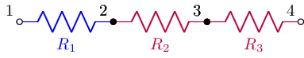

- `annotate_node_voltages(nodes)` Produces a new netlist with drawing
  commands to annotate node voltages for specified nodes (see :ref:`annotated_node_voltages`)

- `annotate_voltages(cpts)` Produces a new netlist with drawing
  commands to annotate component voltages for specified components (see :ref:`annotated_voltages`)

- `annotate_currents(cpts)` Produces a new netlist with drawing
  commands to annotate component currents for specified components (see :ref:`annotated_currents`)

- `apply_test_current_source(Np, Nm)` Copies the netlist, kills all
   the sources, and applies a Dirac delta test current source across
   the specified nodes.  If the netlist is not connected to ground,
   the negative specified node is connected to ground.  The new
   netlist is returned.

- `apply_test_voltage_source(Np, Nm)` Copies the netlist, kills all
   the sources, and applies a Dirac delta test voltage source across
   the specified nodes.  If the netlist is not connected to ground,
   the negative specified node is connected to ground.  The new
   netlist is returned.

- `convert_IVP(t)` Returns a new circuit suitable for solving as an
  initial value problem.  Any switches in the circuit are evaluated at
  the specified time `t`.  Note, when solving the IVP, time is
  referred to when the last switch activated prior to the time
  specified for `t`.

- `describe()` Prints message describing how netlist is solved

- `has()` Returns True if component in netlist

- `impedance(Np, Nm)` Returns the driving-point impedance between
  nodes `Np` and `Nm` and `impedance(cpt)` returns the driving-point
  impedance between the nodes of the specified component

- `in_parallel()` Returns a list of sets of component names that are connected in parallel

- `in_series()` Returns a list of sets of component names that are connected in series

- `kill()` Kills specified independent sources (voltage sources
  become short-circuits and current sources become open-circuits)

- `kill_except()` Kills all but the specified independent sources

- `noise_model()` Replaces resistors with a series combination of a
  resistor and a noise voltage source.  For example,

   >>> a = Circuit("""
   ... R1 1 2""")
   >>> a.noise_model()
   NR1 1 _nodeanon1 R1
   VnR1 _nodeanon1 2 noise {sqrt(4 * k_B * T * R1)}

- `initialize(cct, T)` Sets initial values for reactive components
  based on the values computed for the circuit `cct` at time `T`.
  This is useful for switching circuits where the circuit topology
  changes, see :ref:`switching-analysis`.  Alternatively, the
  `initialize()` method can also take a dictionary of initial values
  keyed by component name, for example,

   >>> a = Circuit("""
   ... L1 1 2""")
   >>> a.initialize({'L1': 7})
   L1 1 2 L1 7

   See also `convert_IVP`.

- `open_circuit(cpt)` Applies open circuit in series with the component.  The name of the open circuit component is returned.

- `r_model()` Creates a resistive equivalent model using companion
  circuits (this is used for time-stepping simulation).

- `remove_dangling(select, ignore, passes)` Removes dangling components from the netlist.   See `simplify` for a description of the arguments.

- `remove_dangling_wires(ignore, passes)` Removes dangling wires from the netlist.  See `simplify` for a description of the arguments.

- `remove_disconnected(select, ignore, passes)` Removes disconnected components from the netlist.   See `simplify` for a description of the arguments.

- `replace(name, net)` Replaces the named component.  For example,

   >>> cct = Circuit("""
   ... V1 1 0 Vs}
   ... R1 1 2
   ... L1 2 0""")
   >>> cct2 = cct.replace('L1', 'C1 2 0')
   >>> cct2
   ... V1 1 0 Vs}
   ... R1 1 2
   ... C1 2 0""")

- `replace_switches(t)` Replaces switches with a short-circuit or
  open-circuit circuit by considering whether the specified time `t`
  is at or after the switch activation time.   See also `convert_IVP`.

   >>> cct = Circuit("""
   ... SW1 1 2 no
   ... SW2 2 3 no 1
   ... SW3 3 4 nc 2""")
   >>> cct.replace_switches(1)
   W 1 2
   W 2 3
   W 3 4
   >>> cct.replace_switches(3)
   W 1 2
   W 2 3
   O 3 4

- `replace_switches_before(t)` Replaces switches with a short-circuit
  or open-circuit circuit by considering whether the specified time
  `t` is before the switch activation time.   See also `convert_IVP`.

- `s_model()` Converts sources to the s-domain and represents
  reactive components as impedances.

- `short_circuit(cpt)` Applies short circuit across the component using a 0 V voltage source.  The name of the voltage source is returned.

- `simplify(select, ignore, passes, series, parallel, dangling, explain, modify)` Simplifies netlist by combing components in series and parallel and by removing dangling components.  `select` is a list or set of the component names to consider; if `None` all the netlist components are considered for simplification.  `ignore` is a list or set of components to ignore in the simplification.  `passes` is the number of simplification iterations to perform.  If zero, iterations continue until no more simpliciations are found.   `series` enables series combination (default `True`). `parallel` enables parallel combination (default `True`). `dangling` enables dangling componet removal (default `False`).  If `explain` is `True`, a description of each simplification is printed.  If `modify` is False, the netlist is not modified.

- `simplify_series(select, ignore, passes)` Simplifies netlist with components in series.  See `simplify` for a description of the arguments.

- `simplify_parallel(select, ignore, passes)` Simplifies netlist with components in parallel.  See `simplify` for a description of the arguments.

- `state_space(node_voltages, branch_currents)` Generates a
  state-space representation (see :ref:`state-space-analysis`) where
  `node_voltages` is a list of node names to use as voltage outputs
  (if `None` use all nodes) and `branch_currents` is a list of
  component names to use as branch current outputs (if `None` use all
  the components).  Here's an example:

  >>> cct = Circuit('cct.sch')
  >>> ss = cct.state_space(node_voltages=['1', '3'], branch_currents=['L1', 'L2'])

- `state_space_model()` Creates a state-space model by replacing inductors
  with current sources and capacitors with voltage sources, see :ref:`state-space-analysis`.

- `subs(subs_dict)` Substitutes symbolic values in the netlist using a dictionary of symbols `subs_dict`.  For example,

   >>> cct = Circuit("""
   ... V1 1 0 Vs
   ... R1 1 2
   ... L1 2 0""")
   >>> cct2 = cct.subs({'Vs': 10, 'L1': 3})
   >>> cct2
   V1 1 0 10
   R1 1 2
   L1 2 0 3

- `switching_times(tmax)` Returns sorted list of times when switches become active if they are before `tmax` (default 1e12).  For example,

   >>> cct = Circuit("""
   ... SW1 1 2 no
   ... SW2 2 3 no 1
   ... SW3 3 4 nc 2""")
   >>> cct.switching_times()
   [0.0, 1.0, 2.0]

- `unconnected_nodes` Returns list of names of nodes that are unconnected

Circuit two-port methods
------------------------

Circuits have a number of two-port methods.  The ports are specified
by component name or a tuple of node names.  Note, currents are
defined to be flowing into the positive node of a port:

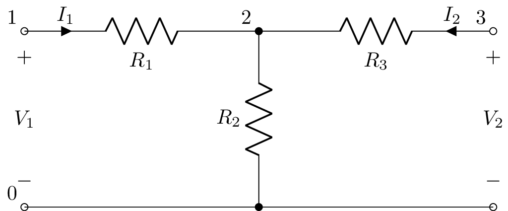

Here's an example::

   >>> a = Circuit("""
   ... P1 1 0
   ... R1 1 2
   ... R2 2 0
   ... R3 2 3
   ... P2 3 0""")
   >>> a.voltage_gain(1, 0, 3, 0)
     R₂
   ───────
   R₁ + R₂
   >>> a.current_gain('P1', 'P2')
    -R₂
   ───────
   R₂ + R₃
   >>> a.transimpedance('P1', (3, 0))
   R₂
   >>> tpz = a.twoport('P1', 'P2', model='Z')
   >>> tpz.voltage_gain
     R₂
   ───────
   R₁ + R₂

Note, the currents are considered to be flowing into the positive
nodes as is the convention with two-ports.  Thus the input and output
currents have opposite directions and so a piece of wire has a current
gain of -1.  Similarly the transadmittance of a resistor of resistance
R is -1 / R.

The methods are:

- `transfer(N1p, N1m, N2p, N2m)` Returns the s-domain transfer
  function `V2(s) / V1(s)`, for the ports defined by nodes `N1p`,
  `N1m`, `N2p`, and `N2m` where `V1 = V[N1p] - V[N1m]` and `V2 =
  V[N2p] - V[N2m]`.  This is an alias for `voltage_gain()`.  The ports
  can also be specified using a component name or a tuple of node
  names, for example,

  >>> H1 = cct.transfer('R1', 'L1')
  >>> H2 = cct.transfer('R1', (2, 0))

- `voltage_gain(N1p, N1m, N2p, N2m)` Returns the s-domain transfer
  function `V2(s) / V1(s)`, for the ports defined by nodes `N1p`,
  `N1m`, `N2p`, and `N2m` where `V1 = V[N1p] - V[N1m]` and `V2 =
  V[N2p] - V[N2m]`.  See also `transfer()`.

- `current_gain(N1p, N1m, N2p, N2m)` Returns the s-domain transfer
  function `I2(s) / I1(s)`, for the ports defined by nodes `N1p`,
  `N1m`, `N2p`, and `N2m`.  `I1(s)` is a test current injected into
  node `N1p` from node `N1m`.  `I2(s)` is the short-circuit current
  flowing into `N2p` from `N1p` as is the convention with two-ports.
  See also `transfer()`.

- `transadmittance(N1p, N1m, N2p, N2m)` Returns the s-domain
  transadmittance function `I2(s) / V1(s)`, for the ports defined by
  nodes `N1p`, `N1m`, `N2p`, and `N2m`.  `V1(s)` is a test voltage
  applied between nodes `N1p` and `N1m`.  `I2(s)` is the short-circuit
  current flowing into `N2p` from `N1p` as is the convention with
  two-ports.  See also `transfer()`.

- `transimpedance(N1p, N1m, N2p, N2m)` Returns the s-domain
  transimpedance function `V2(s) / I1(s)`, for the ports defined by
  nodes `N1p`, `N1m`, `N2p`, and `N2m`.  `I1(s)` is a test current
  injected into node `N1p` from node `N1m`.  `V2(s)` is the
  open-circuit voltage measured between `N2p` and `N1p`.  See also
  `transfer()`.

- `twoport(N1p, N1m, N2p, N2m, model='B')` Returns an s-domain two-port model defined by nodes `N1p`, `N1m`, `N2p`, and `N2m`, where `I1` is the current flowing into `N1p` and out of `N1m`, `I2` is the current flowing into `N2p` and out of `N2m`, `V1 = V[N1p] -  V[N1m]`, and `V2 = V[N2p] - V[N2m]`.  `model` can be `A`, `B`, `G`, `H`, `Y`, or `Z`.

- `Aparams(N1p, N1m, N2p, N2m)` Returns the two-port A-parameters matrix for the two-port defined by nodes `N1p`, `N1m`, `N2p`, and `N2m`, where `I1` is the current flowing into `N1p` and out of `N1m`, `I2` is the current flowing into `N2p` and out of `N2m`, `V1 = V[N1p] - V[N1m]`, and `V2 = V[N2p] - V[N2m]`.  See :ref:`A-parameters` and `twoport()`.

- `Bparams(N1p, N1m, N2p, N2m)` Returns the two-port B-parameters matrix.  See :ref:`B-parameters` and `twoport()`.

- `Gparams(N1p, N1m, N2p, N2m)` Returns the two-port G-parameters matrix.  See :ref:`G-parameters` and `twoport()`.

- `Hparams(N1p, N1m, N2p, N2m)` Returns the two-port H-parameters matrix.  See :ref:`H-parameters` and `twoport()`.

- `Sparams(N1p, N1m, N2p, N2m)` Returns the two-port S-parameters matrix.  See :ref:`S-parameters` and `twoport()`.

- `Tparams(N1p, N1m, N2p, N2m)` Returns the two-port T-parameters matrix.  See :ref:`T-parameters` and `twoport()`.

- `Yparams(N1p, N1m, N2p, N2m)` Returns the two-port Y-parameters matrix.  See :ref:`Y-parameters` and `twoport()`.

- `Zparams(N1p, N1m, N2p, N2m)` Returns the two-port Z-parameters matrix.  See :ref:`Z-parameters` and `twoport()`.

Circuit multi-port methods
--------------------------

- `Yparamsn(N1p, N1m, N2p, N2m, ...)` Returns the n-port Y-parameters matrix.  See :ref:`Y-parameters`.

- `Zparamsn(N1p, N1m, N2p, N2m, ...)` Returns the n-port Z-parameters matrix.  See :ref:`Z-parameters`.

Circuit components
==================

A Component object is obtained from a Circuit object using member notation.  For example,

   >>> cpt = cct.R1

Alternatively, a Component object can be obtained using array notation.  For example,

   >>> cpt = cct['R1']

Component attributes
--------------------

Each Component object has a number of attributes, including:

- `V` transform-domain voltage across component (use `V(t)` to get the time-domain voltage or `V(s)` to get the Laplace domain voltage)

- `I` transform-domain current through component (use `I(t)` to get the time-domain current or `I(s)` to get the Laplace domain current)

- `v` time-domain voltage across component

- `i` time-domain current through component

Lcapy uses the passive sign convention.  Thus for a passive device (R,
L, C), current flows into the positive node, and for a source (V, I),
current flows out of the positive node.

Note, the above attributes are influenced by other components in the
circuit.  The following attributes assume that the component is not in
circuit:

- `Voc` transform-domain open-circuit voltage; it is zero for passive
  components and infinite for current sources

- `Isc` transform-domain short-circuit current (the current flowing
  through the component when it is short-circuited); it is zero for
  passive components and infinite for voltage sources

- `voc` t-domain open-circuit voltage; it is zero for passive
  components and infinite for current sources

- `isc` t-domain short-circuit current (the current flowing through
  the component when it is short-circuited); it is zero for passive
  components and infinite for voltage sources

- `B` susceptance

- `G` conductance

- `R` resistance

- `X` reactance

- `Y` admittance

- `Z` impedance

- `Ys` s-domain generalized admittance

- `Zs` s-domain generalized impedance

- `y` t-domain impulse response of admittance

- `z` t-domain impulse response of impedance

- `is_dc` DC network

- `is_ac` AC network

- `is_IVP` initial value problem (at least one capacitor or inductor has an explicit initial condition)

- `is_causal` causal response

`v` is the time-domain voltage difference across the component, for example:

   >>> cct.R1.v
    -R₁⋅t
    ──────
      L₁
   e      ⋅Heaviside(t)

`i` is the time-domain current through the component, for example:

   >>> cct.R1.i
   ⎛      -R₁⋅t ⎞
   ⎜      ──────⎟
   ⎜        L₁  ⎟
   ⎜1    e      ⎟
   ⎜── - ───────⎟⋅Heaviside(t)
   ⎝R₁      R₁  ⎠

The `V` and `I` attributes provide the voltage and current as a superposition in the transform domains, for example,

   >>> cct.V1.V
   ⎧   1⎫
   ⎨s: ─⎬
   ⎩   s⎭

The `Y` and `Z` attributes provide the generalized s-domain admittance and impedance of the component, for example,

   >>> cct.L1.Z(s)
   L₁⋅s

   >>> cct.R1.Z(s)
   R₁

The generalized s-domain driving point admittance and impedance can be found using `dpY` and `dpZ`, for example,

   >>> cct.L1.dpZ(s)
    R₁⋅s
   ──────
       R₁
   s + ──
       L₁

Note, this is the total impedance across `L1`, not just the impedance of the component as given by `cct.L1.Z(s)`.

Here is the complete list of component attributes:

- `components` dictionary of component lists

- `connected` list of components connected to the component

- `has_ic` initial conditions are specified

- `has_ac` component is a source with an ac component

- `has_dc` component is a source with a dc component

- `has_noisy` component is a source with a noisy component

- `has_s_transient` component is a source with a transient component defined in s-domain

- `has_t_transient` component is a source with a transient component defined in time domain

- `has_transient` component is a source with a transient component

- `is_ac` component is a source that is only ac

- `is_causal`  source or component is causal

- `is_capacitor` component is a capacitor

- `is_current_source` component is a current source

- `is_dangling` component has a node with fewer than 2 connections

- `is_dependent_source` source is dependent

- `is_dc` component is a source that is only dc

- `is_disconnected` component has all nodes with fewer than 2 connections

- `is_inductor` component is an inductor

- `is_independent_source` source is independent

- `is_noisy` component is a source that is only noisy

- `is_open_circuit` component is an open-circuit

- `is_resistor` component is a resistor

- `is_reactance` component is a capacitor or inductor

- `is_source` component is a source

- `is_voltage_source` component is a voltage source

- `is_wire` component is a wire

- `nodes` list of nodes

- `nodenames` list of node names

- `nosim` component is ignored for analysis

Component methods
-----------------

- `norton()` Creates Norton oneport object viewed from nodes of the component.

- `thevenin()` Creates Thevenin oneport object viewed from nodes of the component.

- `oneport()` Creates Thevenin or Norton oneport object as appropriate when viewed from nodes of the component.

- `transfer(cpt)` Creates transfer function for the voltage across `cpt` divided by the voltage across the component.

- `connected()` Returns list of components connected to this component (i.e., components that share a node).

- `is_connected(cpt)` Returns True if connected to specified `cpt` (i.e., the components share a node).

- `in_parallel()` Returns set of names of components in parallel with the component.

- `in_series()` Returns set of names of components in series with the component.

- `noisy(T='T')` Creates noisy model where resistors are replaced with a noiseless resistor and a noise voltage source.

- `noisy_except(resistors, T='T')` Creates noisy model where all but the specified resistors are replaced with a noiseless resistance and a noise voltage source.

- `open_circuit()` Applies open circuit in series with the component.  The name of the open circuit component is returned.

- `short_circuit()` Applies short circuit across the component using a 0 V voltage source.  The name of the voltage source is returned.

Nodes
=====

A Node object is obtained from a Circuit object using indexing
notation.  For example,

   >>> n1 = cct[1]
   >>> n2 = cct['2']

Node objects are also obtained from a Component object using the `nodes` attribute, for example,

   >>> cct.R1.nodes

Node attributes
---------------

Nodes have many attributes including: `name`, `v`, `V`, `dpY`, and `dpZ`.

- `v` is the time-domain voltage (with respect to the ground node 0).

- `V` is a superposition of the node voltage in the different transform domains.

For example,

   >>> cct[2].v
    -R₁⋅t
    ──────
      L₁
   e      ⋅Heaviside(t)

- `dpY` and `dpZ` return the driving-point admittance and impedance for the node with respect to ground, for example,

   >>> cct[2].dpZ
    R₁⋅s
   ──────
       R₁
   s + ──
       L₁

- `connected` returns list of components connected to node

- `count` returns number of components connected to node (excluding
  annotations and open-circuits)

- `is_dangling` returns True if node count less than 2

- `is_ground` returns True if node is a ground (starts with '0')

Node methods
------------

- `is_connected(node)` Returns True if connected to specified node by a single component.

- `is_wired_to(node)` Returns True if wired to specified node, directly or indirectly.

- `norton(node)` Creates Norton oneport object with respect to specified node (default ground).

- `oneport(node)` Creates oneport object with respect to specified node (default ground).

- `thevenin(node)` Creates Thevenin oneport object with respect to specified node (default ground).

- `wired_to()`  Returns list of names of nodes that are wired to this node.

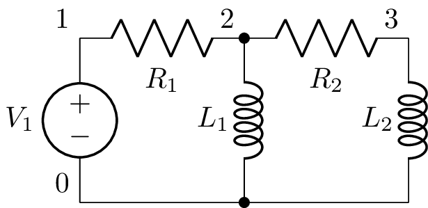

Oneports
========

A Oneport object is defined by a pair of nodes or by a component name.
There are three circuit methods that will create a Oneport object from
a Circuit object:

- `thevenin(Np, Nm)`  Creates a series combination of a voltage source and an impedance.

- `norton(Np, Nm)`  Creates a parallel combination of a current source and an impedance.

- `oneport(Np, Nm)` Creates either a Norton model, Thevenin model, source, or impedance as appropriate.

A Oneport object is a Network object so shares the same attributes and
methods, see :ref:`network_attributes` and :ref:`network_methods`.

Here's an example of creating and using a Oneport object:

   >>> cct = Circuit("""
   >>> R1 3 2
   >>> L 2 1
   >>> C 1 0
   >>> R2 3 0""")
   >>> o = cct.oneport('R1')

Alternatively, a Oneport object can be created using a pair of nodes:

   >>> o = cct.oneport(3, 2)

A third way is from a node object and another node name, for example,

   >>> o = a[3].oneport(2)

Here's an example,

   >>> cct = Circuit("""
   >>> R1 3 2
   >>> L 2 1
   >>> C 1 0
   >>> R2 3 0""")
   >>> cct.oneport('R1').Z(omega)
           ⎛   2   ⅉ⋅R₂⋅ω    1 ⎞
    C⋅L⋅R₁⋅⎜- ω  + ────── + ───⎟
           ⎝         L      C⋅L⎠
   ──────────────────────────────
          2
   - C⋅L⋅ω  + ⅉ⋅C⋅ω⋅(R₁ + R₂) + 1
   >>> cct.oneport('R1').Z(s)
           ⎛ 2   R₂⋅s    1 ⎞
    C⋅L⋅R₁⋅⎜s  + ──── + ───⎟
           ⎝      L     C⋅L⎠
   ──────────────────────────
        2
   C⋅L⋅s  + C⋅s⋅(R₁ + R₂) + 1

Netlist evaluation
==================

The circuit node voltages are determined using Modified Nodal Analysis
(MNA).  This is performed lazily as required with the results cached.

When a circuit has multiple independent sources, the circuit is
decomposed into a number of sub-circuits; one for each source type.
Again, this is performed lazily as required.  Each sub-circuit is
evaluated independently and the results are summed using the principle
of superposition.  For example, consider the circuit

   >>> cct = Circuit("""
   ... V1 1 0 {1 + u(t)}
   ... R1 1 2
   ... L1 2 0""")

In this example, V1 can be considered the superposition of a DC source
and a transient source.  The approach Lcapy uses to solve the circuit
can be found using the `describe` method:

   >>> cct.describe()
   This is solved using superposition.
   DC analysis is used for source V1.
   Laplace analysis is used for source V1.

For the curious, the sub-circuits can be found with the `subcircuits` attribute:

   >>> cct.subcircuits
   {'dc': V1 1 0 dc {1}
          R1 1 2
          L1 2 0 L_1,
   's': V1 1 0 {Heaviside(t)}
        R1 1 2
        L1 2 0 L_1
   }

Here the first sub-circuit is solved using DC analysis and the second
sub-circuit is solved using Laplace analysis in the s-domain.

The properties of each sub-circuit can be found with the `analysis` attribute:

   >>> cct.sub['dc'].analyse()
   {'ac': False,
   'causal': False,
   'control_sources': [],
   'dc': True,
   'dependent_sources': [],
   'has_s': False,
   'has_ic': False,
   'independent_sources': ['V1'],
   'ivp': False,
   'time_domain': False,
   'zeroic': True}

Simplification
==============

Netlists have simplification methods : `remove_dangling()`,
`remove_dangling_wires()`, `remove_disconnected()`, `simplify_series()`,
`simplify_parallel()`, and `simplify()`.  The latter is a generic
method; it repeatedly calls `simplify_series()` and
`simplify_parallel()` until no changes can be made.  The number of
iterations is controlled by the `passes` argument.

Each of the netlist simplification methods have an `explain` argument,
If this is `True`, the simplification steps are printed.  There is
also a `modify` argument.  If this is `False`, the modifications are
not performed.

Here's an example netlist:

   >>> a = Circuit("""
   ... R1 1 2; right
   ... R2 2 3; right
   ... W 3 3a; up=0.5
   ... W 3 3b; down=0.5
   ... R4 3a 4a; right
   ... R5 3b 4b; right
   ... W 4 4a; up=0.5
   ... W 4 4b; down=0.5
   ... R6 4 5; right
   ... ; draw_nodes=connections, label_nodes=none, label_ids=none""")

with a schematic:

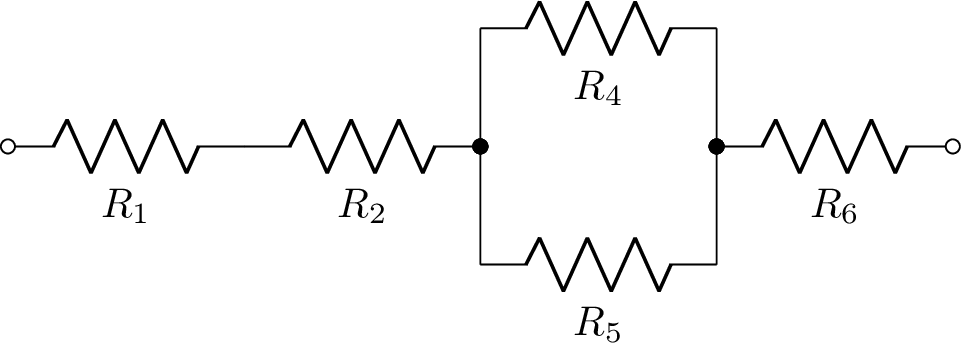

R1 and R2 can be combined in series using:

   >>> b = a.simplify_series()

with a schematic:

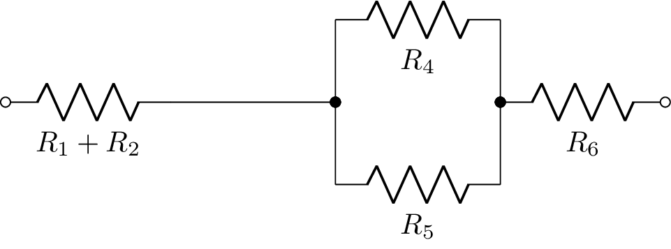

R3 and R4 can be combined in parallel using:

   >>> c = b.simplify_parallel()

with a schematic:

.. image:: examples/netlists/simplify_R1c.png
   :width: 10cm

These operations can be repeatedly executed until no further series or parallel combinations can be found.  Alternatively, the `simplify()` method can be employed:

   >>> d = a.simplify()

with a schematic:

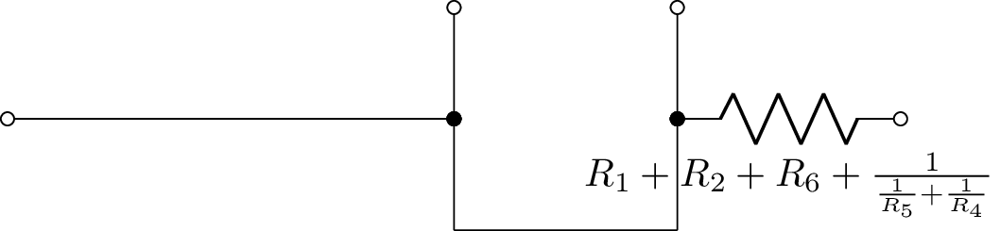

The dangling wires can be removed using the `remove_dangling_wires()` method:

   >>> e = d.remove_dangling_wires()

with a schematic:

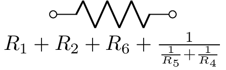

Netlist analysis examples
=========================

V-R-C circuit (1)
-----------------

This example plots the transient voltage across a capacitor in a series R-L circuit:

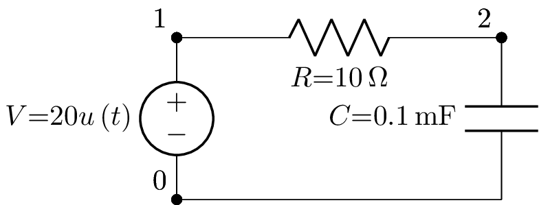

.. literalinclude:: examples/netlists/circuit-VRC1-vc.py

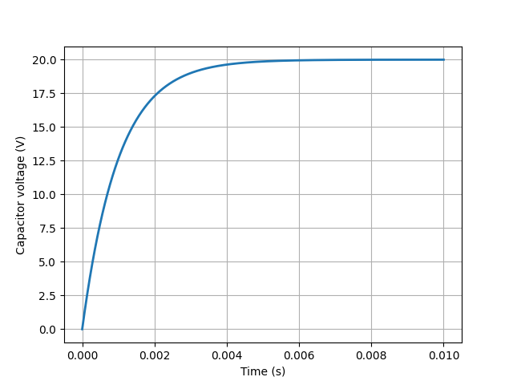

V-R-C circuit (2)
-----------------

This example is the same as the previous example but it uses an
alternative method of plotting.

.. literalinclude:: examples/netlists/circuit-VRC2-vc.py

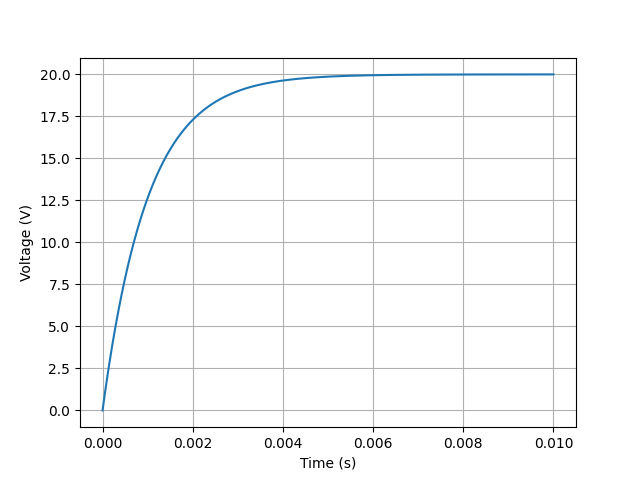

V-R-L-C circuit (1)
-------------------

This example plots the transient voltage across a resistor in a series R-L-C circuit:

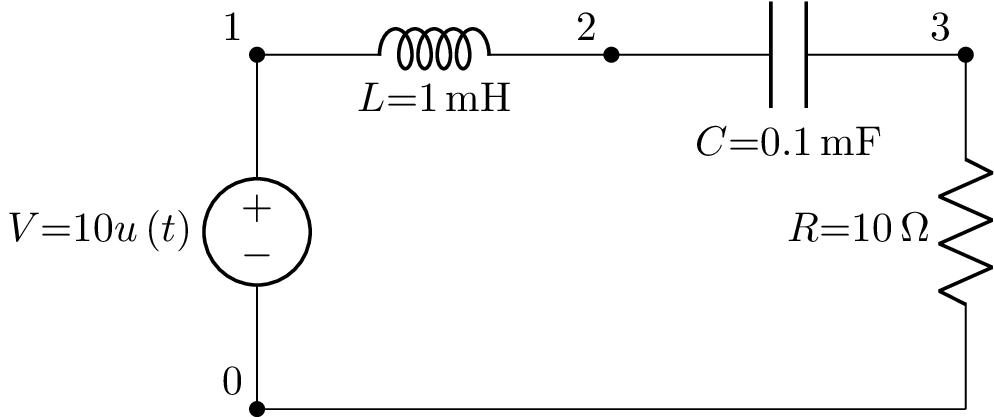

.. literalinclude:: examples/netlists/circuit-VRLC1-vr.py

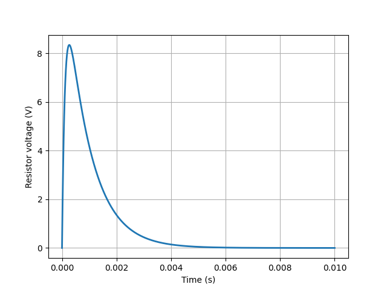

V-R-L-C circuit (2)
-------------------

This is the same as the previous example but with a different resistor value giving an underdamped response:

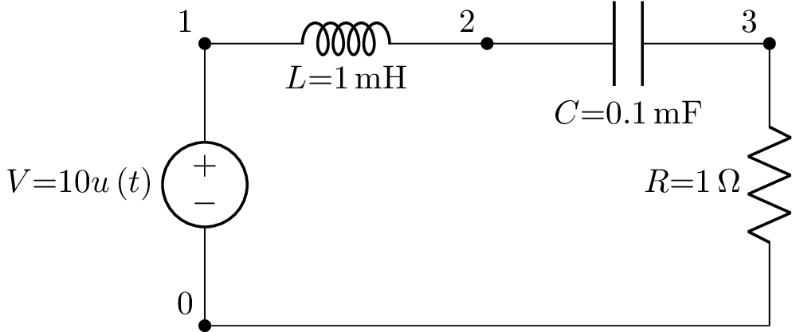

.. literalinclude:: examples/netlists/circuit-VRLC2-vr.py

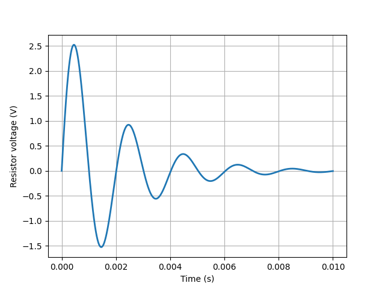

Mechanical netlists
===================

Linear mechanical networks comprising masses, springs, and dampers can
be simulated.  The mechanical analogue II (impedance analogue) is
employed where voltage is equivalent to force and current is
equivalent to speed.  Thus a mass is analogous to an inductor, a
spring is analogous to a capacitor, and a damper is analogous to a
resistor.

For example,
   >>> a = Circuit("""
   k 1 2; right
   r 2 3; right
   m 3 4; right""")
   >>> Z = a.impedance(1, 4)
   >>> Z(s).partfrac()
              1
   m⋅s + r + ───
             k⋅s

With this analogue d'Alemberts law is equivalent to Kirchhoff's voltage law.  Thus every loop in the electrical circuit is analogous to a point in the mechanical system.   This also means that series combinations transform to parallel combinations and vice-versa.
