.. _networks:

========
Networks
========

Lcapy supports one-port and two-port networks.

One-port networks
=================

One-port networks are creating by combining one-port components in
series or parallel, for example, here's an example of resistors in
series

   >>> from lcapy import R
   >>> R1 = R(10)
   >>> R2 = R(5)
   >>> Rtot = R1 + R2
   >>> Rtot
   R(10) + R(5)

Here `R(10)` creates a 10 ohm resistor and this is assigned to the
variable `R1`.  Similarly, `R(5)` creates a 5 ohm resistor and this is
assigned to the variable `R2`.  `Rtot` is the name of the network
formed by connecting `R1` and `R2` in series.

   >>> Rtot.draw()

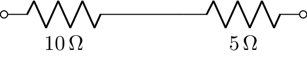

Network components
------------------

- `C` capacitor

- `CPE` constant phase element

- `Damper` mechanical damper

- `FeriteBead` ferrite bead (lossy inductor)

- `G` conductance

- `I` arbitrary current source

- `i` arbitrary time-domain current source

- `Iac` ac current source (default angular frequency :math:`\omega_0`)

- `Idc` dc current source

- `Inoise` noise current source

- `Istep` step current source

- `L` inductor

- `Mass` mass

- `O` open-circuit

- `R` resistor

- `NR` noiseless resistor (this is generated by the `noisy()` method)

- `Spring` spring

- `sV` s-domain voltage source

- `sI` s-domain current source

- `V` arbitrary voltage source

- `v` arbitrary time-domain voltage source

- `Vac` ac voltage source (default angular frequency :math:`\omega_0`)

- `Vdc` dc voltage source

- `Vnoise` noise voltage source

- `Vstep` step voltage source

- `Xtal` crystal

- `W` wire

- `Y` generalized admittance

- `Z` generalized impedance

.. _network_attributes:

Network attributes
------------------

Each network oneport has a number of attributes, including:

- `Voc` transform-domain open-circuit voltage

- `Isc` transform-domain short-circuit current

- `I` transform-domain current through network terminals (zero by definition)

- `voc` t-domain open-circuit voltage

- `isc` t-domain short-circuit current

- `isc` t-domain current through network terminals (zero by definition)

- `B` susceptance

- `G` conductance

- `R` resistance

- `X` reactance

- `Y` admittance

- `Z` impedance

- `Ys` s-domain generalized admittance

- `Zs` s-domain generalized impedance

- `y` t-domain impulse response of admittance

- `z` t-domain impulse response of impedance

- `is_dc` DC network

- `is_ac` AC network

- `is_IVP` initial value problem

- `is_causal` causal response

- `is_series` series network

- `is_parallel` parallel network

Here's an example:

   >>> from lcapy import R, V
   >>> n = V(20) + R(10)
   >>> n.Voc
   20
   ──
    s
   >>> n.voc
   20
   >>> n.Isc
   2
   ─
   s
   >>> n.isc
   2
   >>> n.Z
   10
   >>> n.Y
   1/10

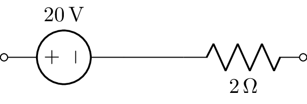

.. _network_methods:

Network methods
---------------

- `circuit()` create a Circuit object from the network.

- `describe()` print a message describing how network is solved.

- `draw()` draw the schematic.

- `netlist()` create an equivalent netlist.

- `subs(subs_dict)` substitutes symbolic values in the network using a dictionary of symbols `subs_dict`.

- `noisy(T='T')` create noisy model where resistors are replaced with a noiseless resistor and a noise voltage source.

Network functions
-----------------

- `series()` connect one-port components in series.  This is similar to `Ser()` but is robust to `None` components and single components in series.

- `parallel()` connect one-port components in parallel.  This is similar to `Par()` but is robust to `None` components and single components in parallel.

- `ladder()` connect one-port components as a one-port ladder network.  This is an alternating sequence of series and parallel connections.   For example,

   >>> ladder(R(1), C(2), R(3))
   R(1) + (C(1) | R(3))

   >>> ladder(None, C(2), R(3), C(3))
   C(2) | (R(3) + C(3))

Network simplification
----------------------

A network can be simplified (if possible) using the `simplify` method.
For example, here's an example of a parallel combination of resistors.
Note that the parallel operator is `|` instead of the usual `||`.

   >>> from lcapy import *
   >>> Rtot = R(10) | R(5)
   >>> Rtot
   R(10) | R(5)
   >>> Rtot.simplify()
   R(10/3)

The result can be performed symbolically, for example,

   >>> from lcapy import *
   >>> Rtot = R('R_1') | R('R_2')
   >>> Rtot
   R(R_1) | R(R_2)
   >>> Rtot.simplify()
   R(R_1*R_2/(R_1 + R_2))
   >>> Rtot.simplify()
   R(R₁) | R(R₂)

Here's another example using inductors in series

   >>> from lcapy import *
   >>> L1 = L(10)
   >>> L2 = L(5)
   >>> Ltot = L1 + L2
   >>> Ltot
   L(10) + L(5)
   >>> Ltot.simplify()
   L(15)

Finally, here's an example of a parallel combination of capacitors

   >>> from lcapy import *
   >>> Ctot = C(10) | C(5)
   >>> Ctot
   C(10) | C(5)
   >>> Ctot.simplify()
   C(15)

Norton and Thevenin transformations
-----------------------------------

A Norton or Thevenin equivalent network can be created using the
`norton` or `thevenin` methods.  For example,

   >>> from lcapy import Vdc, R
   >>> a = Vdc(1) + R(2)
   >>> a.norton()
   G(1/2) | Idc(1/2)

Network schematics
==================

Networks are drawn with the `draw()` method.  Here's an example:

   >>> from lcapy import R, C, L
   >>> ((R(1) + L(2)) | C(3)).draw()

Here's the result:

.. image:: examples/networks/pickup.png
   :width: 5cm

By default, one port networks are drawn with a horizontal layout.
This can be changed to a vertical layout or as a ladder layout using the
`form` argument to the `draw()` method.

Here's an example of a vertical layout,

   >>> from lcapy import R, C, L
   >>> ((R(1) + L(2)) | C(3)).draw(form='vertical')

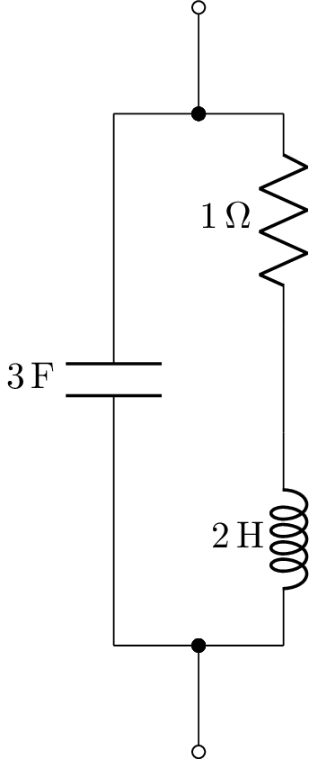

Here's an example of a network drawn with ladder layout,

   >>> from lcapy import R, C
   >>> n = C('C1') | (R('R1') + (C('C2') | (R('R2') + (C('C3') | (R('R3') + C('C4'))))))
   >>> n.draw(form='ladder')

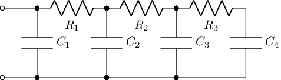

The s-domain model can be drawn using:

   >>> from lcapy import R, C, L
   >>> ((R(1) + L(2)) | C(3)).s_model().draw()

This produces:

.. image:: examples/networks/pickup-s.png
   :width: 5cm

Internally, Lcapy converts the network to a netlist and then draws the
netlist.  The netlist can be found using the netlist method, for example,

   >>> from lcapy import R, C, L
   >>> print(((R(1) + L(2)) | C(3)).netlist())

yields::

   W 1 2; right=0.5
   W 2 4; up=0.4
   W 3 5; up=0.4
   R1 4 6 1; right
   W 6 7; right=0.5
   L1 7 5 2; right
   W 2 8; down=0.4
   W 3 9; down=0.4
   C1 8 9 3; right
   W 3 0; right=0.5

To create a schematic with multiple components in parallel, use `Par`.
For example,

.. literalinclude:: examples/networks/par3.py

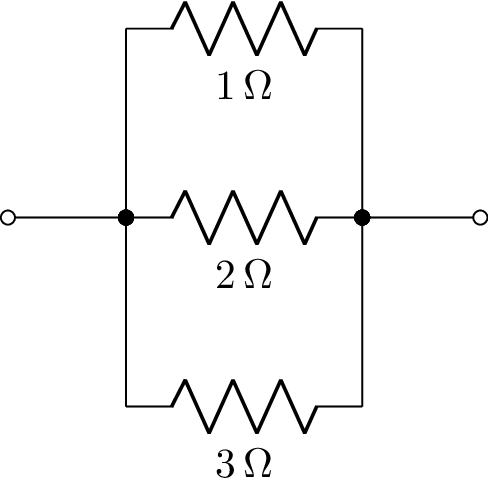

The network components have optional keyword arguments (kwargs) that specify schematic attributes, for example,

   >>> (R(2, color='blue') + C(3, color='green')).draw()

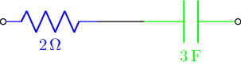

Network synthesis
=================

Networks can be created using network synthesis techniques given an impedance or admittance expression, for example,

    >>> Z = impedance(4*s**2 + 3 * s + 1 / 6) / (s**2 + 2 * s / 3)
    >>> Z.network()
    ((C(1) + R(2)) | C(3)) + R(4)
    >>> Z.network().Z(s).canonical()

    :math:`\frac{4 s^{2} + 3 s + \frac{1}{6}}{s^{2} + \frac{2 s}{3}}`

For more details, see :ref:`network-synthesis`.

Random networks
===============

Networks can be randomly generated with the `random_network` function.  This is useful for automated exam question generation.   Here's an example:

   >>> from lcapy import random_network
   >>> net = random_network(num_resistors=4, num_capacitors=0, num_inductors=0, num_voltage_sources=2, kind='dc')

This example generates a DC network with four resistors, two-voltage sources, and no capacitors or inductors.   The `kind` argument can be `ac`, `dc`, or `transient`.   The number of parallel connections can be specified with the `num_parallel` argument.

Network analysis examples
=========================

Series R-C network
------------------

.. literalinclude:: examples/networks/series-RC1-Z.py

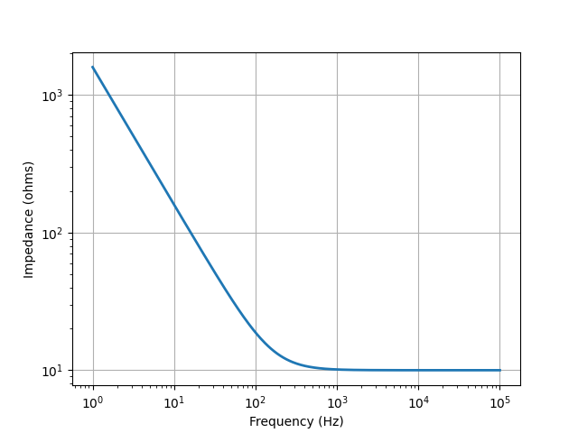

.. literalinclude:: examples/networks/series-VRC1-isc.py

.. image:: examples/networks/series-VRC1-isc.png
   :width: 15cm

Series R-L network
------------------

.. literalinclude:: examples/networks/series-RL1-Z.py

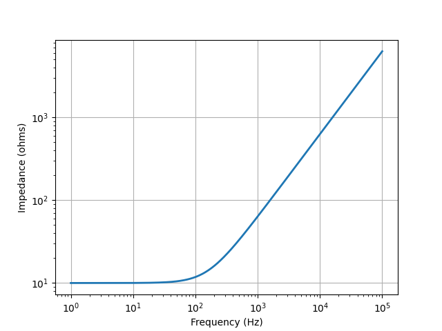

.. literalinclude:: examples/networks/series-VRL1-isc.py

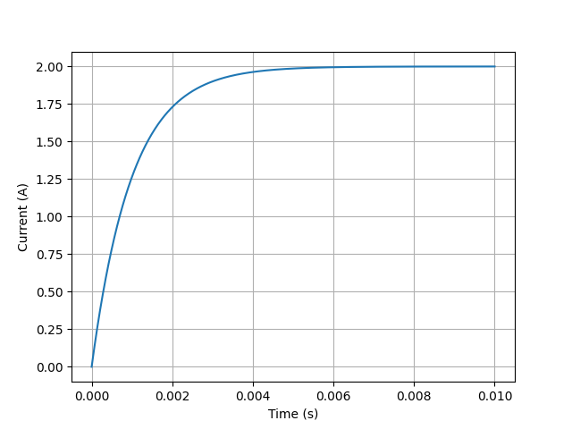

Series R-L-C network
--------------------

.. literalinclude:: examples/networks/series-RLC3-Z.py

.. image:: examples/networks/series-RLC3-Z.png
   :width: 15cm

.. literalinclude:: examples/networks/series-VRLC1-isc.py

.. image:: examples/networks/series-VRLC1-isc.png
   :width: 15cm

Parallel R-L-C network
----------------------

.. literalinclude:: examples/networks/parallel-RLC3-Z.py

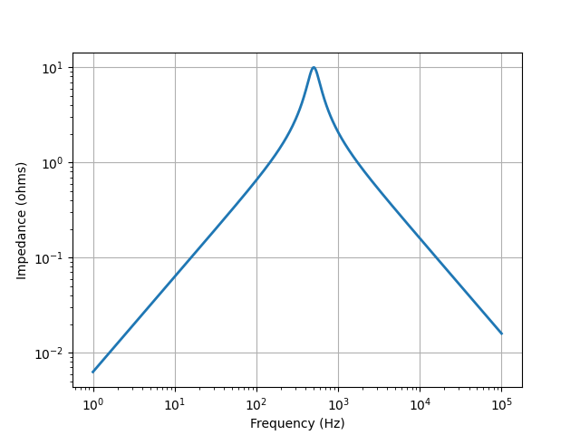

.. literalinclude:: examples/networks/parallel-IRLC1-voc.py

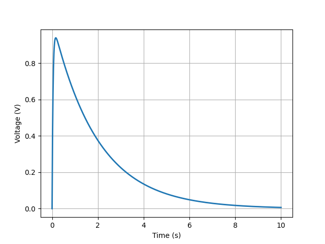

Two-port networks
=================

Two-port networks are represented in the Laplace domain.   Basic two-ports networks can be combined to produce more complicated two-port networks.

A two-port is an electrical black-box with two pairs of terminals.  A pair of terminals is considered a port if the port condition is satisfied, i.e., the flow of current into one terminal is the same as the current flowing out of the other terminal.

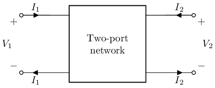

Two-port networks are usually considered to be free of independent sources, however,
Lcapy uses a generalized form that has two optional independent sources.  For lack of a better term, these are currently called two-port models.   They consist of a 2x2 matrix describing the network parameters and a 2x1 vector describing the independent sources (see :ref:`two-port-models`).  For example, consider the network::

   >>> tp = Shunt(R('R1')).chain(Series(R('R2') + V('V1')))

This can be drawn using::

   >>> tp.draw()

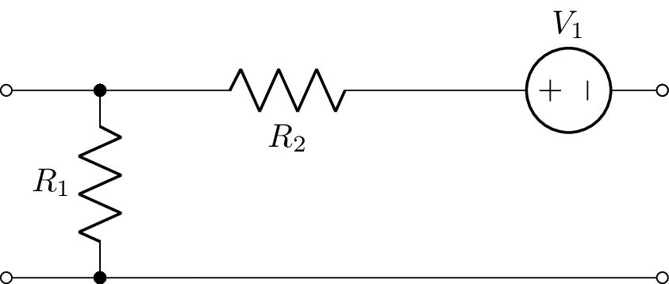

This network is represented by B-parameters but can be converted to a Z-parameter model using the `Zmodel` attribute::

   >>> ztp = tp.Zmodel

The Z-parameters are obtained with the `params` attribute::

   >>> ztp.params

   ⎡R₁       R₁      ⎤
   ⎢                 ⎥
   ⎢        ⎛     R₂⎞⎥
   ⎢R₁  -R₁⋅⎜-1 - ──⎟⎥
   ⎣        ⎝     R₁⎠⎦

The sources are obtained with the `sources` attribute::

   >>> ztp.sources

   ⎡0 ⎤
   ⎢  ⎥
   ⎢V₁⎥
   ⎢──⎥
   ⎣s ⎦

The system of equations can be obtained using the `equation()` method, for example::

   >>> ztp.equation()

          ⎡R₁       R₁      ⎤        ⎡0 ⎤
   ⎡V₁⎤   ⎢                 ⎥ ⎡I₁⎤   ⎢  ⎥
   ⎢  ⎥ = ⎢        ⎛     R₂⎞⎥⋅⎢  ⎥ + ⎢V₁⎥
   ⎣V₂⎦   ⎢R₁  -R₁⋅⎜-1 - ──⎟⎥ ⎣I₂⎦   ⎢──⎥
          ⎣        ⎝     R₁⎠⎦        ⎣s ⎦

Basic two-port networks
=======================

A-parameter two-port
--------------------

An A-parameter two-port model is created with:

   >>> n = TPA(A11, A12, A21, A22, V1a, I1a)

By default `V1a=0` and `I1a=0`.

There are optional keyword arguments (kwargs) to specify schematic attributes,
for example,

   >>> n = TP(l='Two-port', fill='blue')

B-parameter two-port
--------------------

A B-parameter two-port model is created with:

   >>> n = TPB(B11, B12, B21, B22, V2b, I2b)

By default `V2b=0` and `I2b=0`.

G-parameter two-port
--------------------

A G-parameter two-port model is created with:

   >>> n = TPG(G11, G12, G21, G22, I1g, V2g)

By default `I1g=0` and `V2g=0`.

H-parameter two-port
--------------------

A H-parameter two-port model is created with:

   >>> n = TPH(H11, H12, H21, H22, V1h, I2h)

By default `V1h=0` and `I2h=0`.

Y-parameter two-port
--------------------

A Y-parameter two-port model is created with:

   >>> n = TPY(Y11, Y12, Y21, Y22, I1y, I2y)

By default `I1y=0` and `I2y=0`.

Z-parameter two-port
--------------------

A Z-parameter two-port model is created with:

   >>> n = TPZ(Z11, Z12, Z21, Z22, V1z, V2z)

By default `V1z=0` and `V2z=0`.

Shunt two-port
--------------

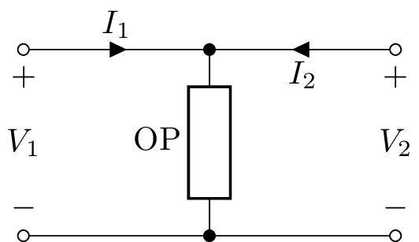

A shunt two-port has a single one-port argument, `Shunt(OP)`, for example,

   >>> n = Shunt(R('R1'))

The A-parameters can be found using::

   >>> n.Amodel.params
   ⎡1   0⎤
   ⎢     ⎥
   ⎢1    ⎥
   ⎢──  1⎥
   ⎣R₁   ⎦

The Y-parameters do not exist for a `Shunt` two-port.

Series two-port
---------------

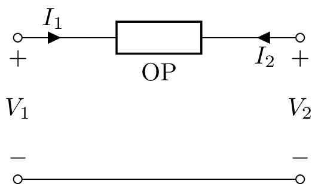

A series two-port has a single one-port argument, `Series(OP)`, for
example

   >>> n = Series(L('L1'))

The A-parameters can be found using::

   >>> n.Amodel.params
   ⎡1  L₁⋅s⎤
   ⎢       ⎥
   ⎣0   1  ⎦

The Z-parameters do not exist for a `Series` two-port.

L-section two-port
------------------

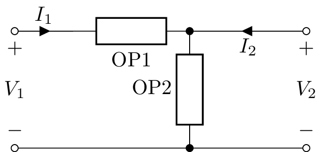

An L-section two-port has two one-port arguments, `LSection(OP1, OP2)`, for example,

   >>> n = LSection(L('L1'), R('R1'))

This is equivalent to chaining a shunt two-port to a series two-port:

   >>> n = Series(L('L1').chain(Shunt(R('R1')))

T-section two-port
------------------

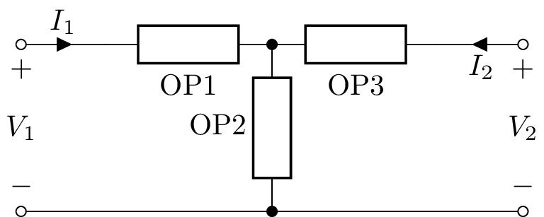

A T-section (also known as a Y-section) two-port has three one-port arguments, `TSection(OP1, OP2, OP3)`, for example

   >>> n = TSection(L('L1'), R('R1'), C('C1'))

Pi-section two-port
-------------------

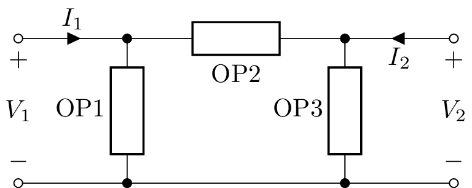

A pi-section two-port has three one-port arguments, `PiSection(OP1, OP2, OP3)`, for example

   >>> n = PiSection(L('L1'), R('R1'), C('C1'))

Transmission lines
------------------

There are three transmission line two-port classes: `TransmissionLine`,
`LosslessTransmissionLine` and `GeneralTransmissionLine`.  Here's an example of use::

   >>> a = GeneralTransmissionLine()
   >>> a.equation()
          ⎡ cosh(l⋅γ(s))   -Z₀(s)⋅sinh(l⋅γ(s))⎤
   ⎡V₂⎤   ⎢                                   ⎥ ⎡V₁ ⎤
   ⎢  ⎥ = ⎢-sinh(l⋅γ(s))                      ⎥⋅⎢   ⎥
   ⎣I₂⎦   ⎢──────────────     cosh(l⋅γ(s))    ⎥ ⎣-I₁⎦
          ⎣    Z₀(s)                          ⎦

Here :math:`Z_0` is the characteristic impedance, :math:`\gamma` is
the propagation constant, and :math:`l` is the transmission line
length.  These can be specified when `GeneralTransmissionLine` is constructed.

The input impedance to the transmission line can be found from the
`Z11` parameter::

   >>> a.Z11
       Z₀
   ─────────
   tanh(γ⋅l)

List of two-ports
-----------------

- `Shunt`
- `Series`
- `LSection`
- `TSection`
- `PiSection`
- `GenericTwoPort`
- `IdealTransformer`
- `IdealGyrator`
- `VoltageFollower`
- `VoltageAmplifier`
- `IdealVoltageAmplifier`
- `IdealDelay`
- `IdealVoltageDifferentiator`
- `IdealVoltageIntegrator`
- `CurrentFollower`
- `IdealCurrentAmplifier`
- `IdealCurrentDifferentiator`
- `IdealCurrentIntegrator`
- `OpampInverter`
- `OpampIntegrator`
- `OpampDifferentiator`
- `TwinTSection`
- `BridgedTSection`
- `Ladder`
- `GeneralTransmissionLine`
- `LosslessTransmissionLine`
- `TransmissionLine`
- `TPA`
- `TPB`
- `TPG`
- `TPH`
- `TPY`
- `TPZ`

Two-port network attributes
---------------------------

Here are some of the two-port network attributes:

- `is_bilateral`: True if the two-port is bilateral

- `is_buffered`: True if the two-port is buffered, i.e., any load on the output has no affect on the input

- `is_reciprocal`: True if the  two-port is reciprocal

- `is_series`: True if the two-port is a series network

- `is_shunt`: True if the two-port is a shunt network

- `is_symmetrical`: True if the two-port is symmetrical

- `Voc`: voltage vector with both ports open-circuit

- `V1oc`: open-circuit input voltage

- `V2oc`: open-circuit output voltage

- `Isc`: current vector with both ports short-circuit

- `I1sc`: short-circuit input current

- `I2sc`: short-circuit output current

- `Zoc`: impedance vector with both ports open-circuit

- `Z1oc`: input impedance with output port open-circuit

- `Z2oc`: output impedance with input port open-circuit

- `Ysc`: admittance vector with both ports short-circuit

- `Y1sc`: input admittance with output port short-circuit

- `Y2sc`: output admittance with input port short-circuit

- `Amodel`: the equivalent A-parameters model (ABCD)

- `Bmodel`: the equivalent B-parameters model (inverse ABCD)

- `Gmodel`: the equivalent G-parameters model (inverse hybrid / parallel-series)

- `Hmodel`: the equivalent H-parameters model (hybrid / series-parallel)

- `Ymodel`: the equivalent Y-parameters model (admittance)

- `Zmodel`: the equivalent Z-parameters model (impedance)

- `Aparams`: the A-parameters (ABCD)

- `Bparams`: the A-parameters (inverse ABCD)

- `Gparams`: the G-parameters (inverse hybrid / parallel-series)

- `Hparams`: the H-parameters (hybrid / series-parallel)

- `Sparams`: the S-parameters (scattering)

- `Tparams`: the T-parameters (scattering transmission)

- `Yparams`: the Y-parameters (admittance)

- `Zparams`: the Z-parameters (impedance)

- `params`: the 2x2 matrix of parameters

- `sources`: the 2x1 vector of sources

The individual elements of a parameter matrix for a two-port `n` can be accessed using `n.A11`, `n.S21`, `n.Z22` etc.

Two-port network methods
------------------------

Here are some of the two-port network methods:

- `chain(TP)`: chain (cascade) two two-port networks together

- `series(TP)`: combine two two-port networks in series

- `parallel(TP)`: combine two two-port networks in parallel

- `hybrid(TP)`: combine two two-port networks in series-parallel

- `inverse_hybrid(TP)`: combine two two-port networks in parallel-series

- `bridge(OP)`: bridge a two-port network with a one-port network

- `load(OP)`: apply a one-port network load and return a one-port network

- `source(OP)`: apply a one-port network source and return a one-port network

- `draw()`: draw a two-port network

- `circuit()`: convert a two-port network to a `Circuit` object

- `equation()`: return the system of equations in matrix form

Two-port combinations
=====================

Two-port networks can be combined in series, parallel, series at the
input with parallel at the output (hybrid), parallel at the input with
series at the output (inverse hybrid), but the most common is the
chain or cascade.  This connects the output of the first two-port to
the input of the second two-port.

For example, an L section can be created by chaining a shunt to a
series one-port::

   >>> from lcapy import *
   >>> n = Series(R('R_1')).chain(Shunt(R('R_2')))
   >>> n.Vtransfer
   R_2/(R_1 + R_2)

Chain
-----

   >>> from lcapy import TP
   >>> tp1 = TP(l='Two-port 1', fill='blue')
   >>> tp2 = TP(l='Two-port 2', fill='blue')
   >>> tp = tp1.chain(tp2)

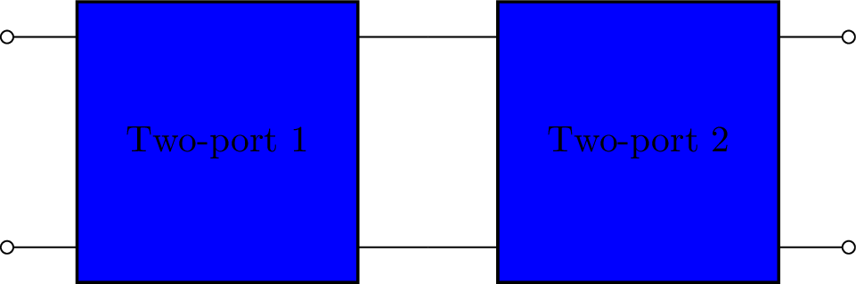

Parallel
--------

   >>> from lcapy import TP
   >>> tp1 = TP(l='Two-port 1', fill='blue')
   >>> tp2 = TP(l='Two-port 2', fill='blue')
   >>> tp = tp1.parallel(tp2)

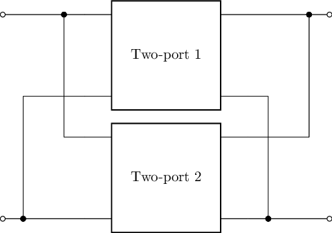

Series
------

Warning, a series combination of two-ports can break the port condition.

   >>> from lcapy import TP
   >>> tp1 = TP(l='Two-port 1', fill='blue')
   >>> tp2 = TP(l='Two-port 2', fill='blue')
   >>> tp = tp1.series(tp2)

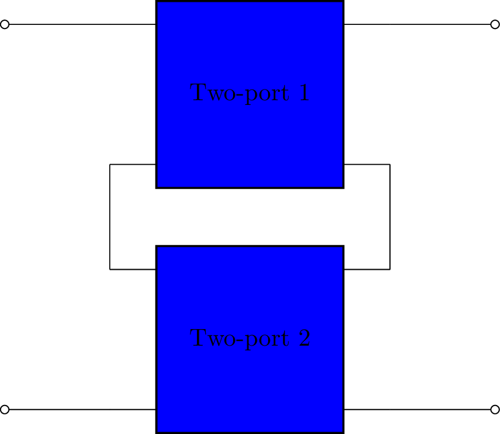

Hybrid (series-parallel)
------------------------

   >>> from lcapy import TP
   >>> tp1 = TP(l='Two-port 1', fill='blue')
   >>> tp2 = TP(l='Two-port 2', fill='blue')
   >>> tp = tp1.hybrid(tp2)

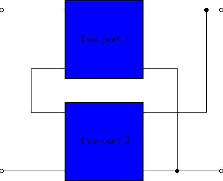

Inverse hybrid (parallel-series)
--------------------------------

   >>> from lcapy import TP
   >>> tp1 = TP(l='Two-port 1', fill='blue')
   >>> tp2 = TP(l='Two-port 2', fill='blue')
   >>> tp = tp1.hybrid(tp2)

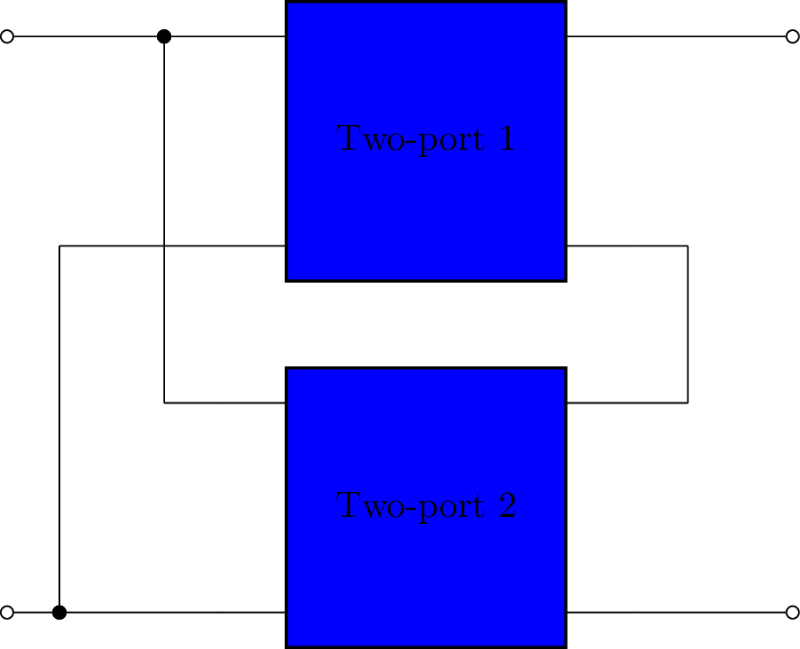

.. _two-port-models:

Two-port network models
=======================

Lcapy describes two-port networks in the Laplace domain using A, B, G,
H, S, T, Y, and Z matrices.  Note, for some network configurations some of these matrices can be singular.

Each model can be converted to the other parameterisations, for example,

>>> A = TPA()
>>> TPA.params

.. math::

    \left[\begin{matrix}A_{11} & A_{12}\\A_{21} & A_{22}\end{matrix}\right]

>>> A.Zmodel.params

.. math::

    \left[\begin{matrix}\frac{A_{11}}{A_{21}} & \frac{A_{11} A_{22} - A_{12} A_{21}}{A_{21}}\\\frac{1}{A_{21}} & \frac{A_{22}}{A_{21}}\end{matrix}\right]

The elements of the parameter matrix can be accessed by name, for example:

>>> A.S11

.. math::

   \frac{A_{12} - A_{21} Z_{0}^{2} + Z_{0} \left(A_{11} - A_{22}\right)}{A_{12} + A_{21} Z_{0}^{2} + Z_{0} \left(A_{11} + A_{22}\right)}

Note, in this example, the A-parameters are converted to S-parameters.

.. _A-parameters:

A-parameters (ABCD)
-------------------

.. math::

    \left[\begin{matrix}V_{1}\\I_{1}\end{matrix}\right] = \left[\begin{matrix}A_{11} & A_{12}\\A_{21} & A_{22}\end{matrix}\right] \left[\begin{matrix}V_{2}\\- I_{2}\end{matrix}\right] + \left[\begin{matrix}V_{1a}\\I_{1a}\end{matrix}\right]

The A matrix is the inverse of the B matrix.

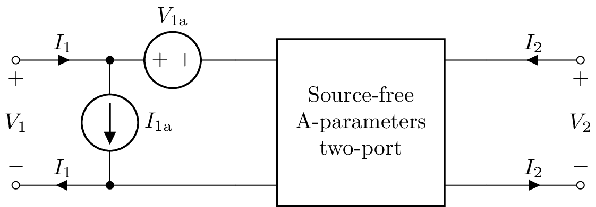

.. _B-parameters:

B-parameters (inverse ABCD)
---------------------------

.. math::

    \left[\begin{matrix}V_{2}\\-I_{2}\end{matrix}\right] = \left[\begin{matrix}B_{11} & B_{12}\\B_{21} & B_{22}\end{matrix}\right] \left[\begin{matrix}V_{1}\\I_{1}\end{matrix}\right]  + \left[\begin{matrix}V_{2b}\\I_{2b}\end{matrix}\right]

The B matrix is the inverse of the A matrix.

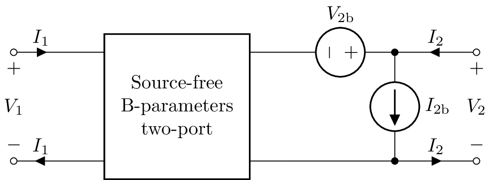

.. _G-parameters:

G-parameters (inverse hybrid)
-----------------------------

.. math::

    \left[\begin{matrix}I_{1}\\V_{2}\end{matrix}\right] = \left[\begin{matrix}G_{11} & G_{12}\\G_{21} & G_{22}\end{matrix}\right] \left[\begin{matrix}V_{1}\\I_{2}\end{matrix}\right]  + \left[\begin{matrix}I_{1g}\\V_{2g}\end{matrix}\right]

The G matrix is the inverse of the H matrix.

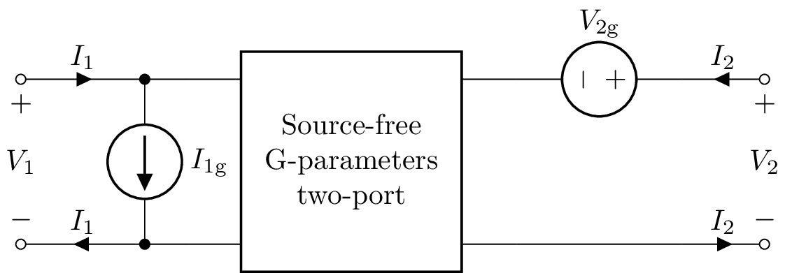

.. _H-parameters:

H-parameters (hybrid)
---------------------

.. math::

    \left[\begin{matrix}V_{1}\\I_{2}\end{matrix}\right] = \left[\begin{matrix}H_{11} & H_{12}\\H_{21} & H_{22}\end{matrix}\right] \left[\begin{matrix}I_{1}\\V_{2}\end{matrix}\right]  + \left[\begin{matrix}V_{1h}\\I_{2h}\end{matrix}\right]

The H matrix is the inverse of the G matrix.

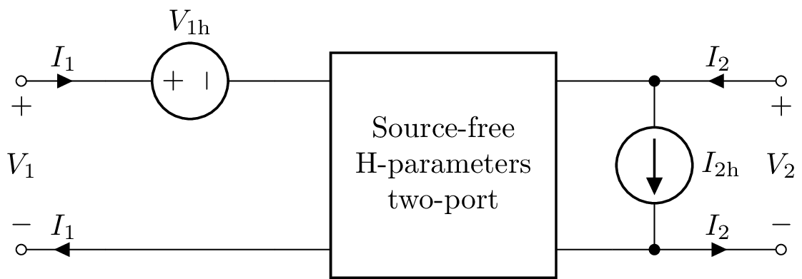

.. _S-parameters:

S-parameters (scattering)
-------------------------

.. math::

    \left[\begin{matrix}b_{1}\\b_{2}\end{matrix}\right] = \left[\begin{matrix}S_{11} & S_{12}\\S_{21} & S_{22}\end{matrix}\right] \left[\begin{matrix}a_{1}\\a_{2}\end{matrix}\right]

.. _T-parameters:

T-parameters (scattering transfer)
----------------------------------

.. math::

    \left[\begin{matrix}b_{1}\\a_{1}\end{matrix}\right] = \left[\begin{matrix}T_{11} & T_{12}\\T_{21} & T_{22}\end{matrix}\right] \left[\begin{matrix}a_{2}\\b_{2}\end{matrix}\right]

.. _Y-parameters:

Y-parameters (admittance)
-------------------------

.. math::

    \left[\begin{matrix}I_{1}\\I_{2}\end{matrix}\right] = \left[\begin{matrix}Y_{11} & Y_{12}\\Y_{21} & Y_{22}\end{matrix}\right] \left[\begin{matrix}V_{1}\\V_{2}\end{matrix}\right]  + \left[\begin{matrix}I_{1y}\\I_{2y}\end{matrix}\right]

The Y matrix is the inverse of the Z matrix.

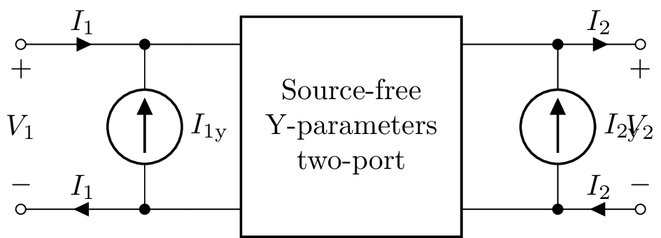

.. _Z-parameters:

Z-parameters (impedance)
------------------------

.. math::

   \left[\begin{matrix}V_{1}\\V_{2}\end{matrix}\right] = \left[\begin{matrix}Z_{11} & Z_{12}\\Z_{21} & Z_{22}\end{matrix}\right] \left[\begin{matrix}I_{1}\\I_{2}\end{matrix}\right] + \left[\begin{matrix}V_{1z}\\V_{2z}\end{matrix}\right]

The Z matrix is the inverse of the Y matrix.

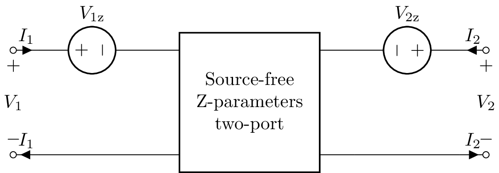
