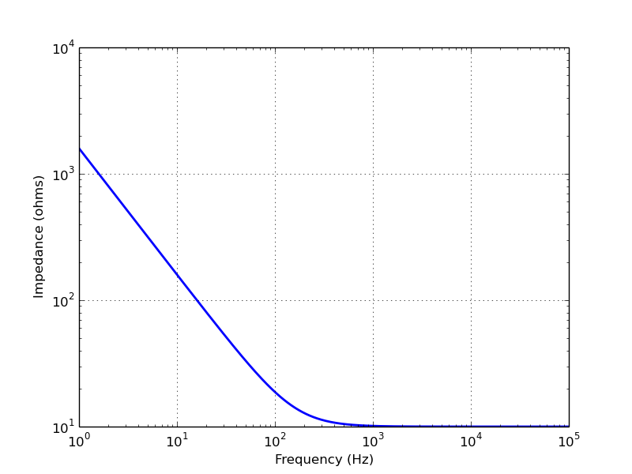
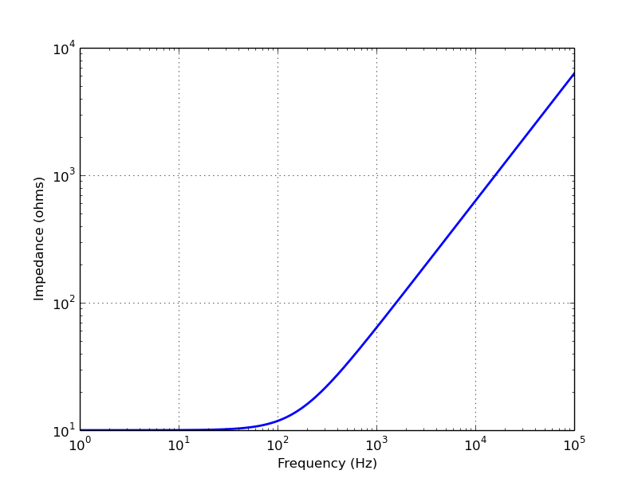
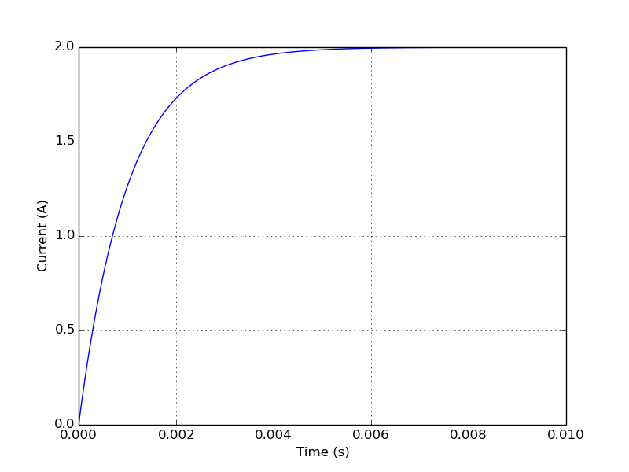
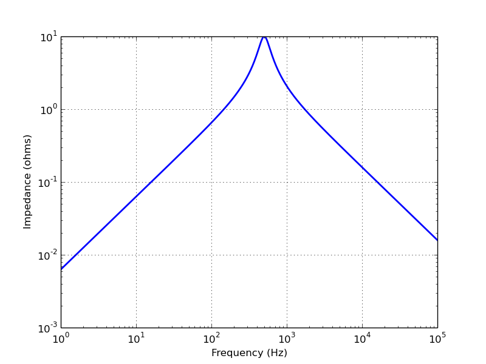

===============
Simple networks
===============

Series R-C network
==================

.. literalinclude:: examples/series-RC1-Z.py

.. literalinclude:: examples/series-VRC1-isc.py

.. image:: examples/series-VRC1-isc.png
   :width: 15cm

Series R-L network
==================

.. literalinclude:: examples/series-RL1-Z.py

.. literalinclude:: examples/series-VRL1-isc.py

Series R-L-C network
====================

.. literalinclude:: examples/series-RLC3-Z.py

.. image:: examples/series-RLC3-Z.png
   :width: 15cm

.. literalinclude:: examples/series-VRLC1-isc.py

.. image:: examples/series-VRLC1-isc.png
   :width: 15cm

Parallel R-L-C network
======================

.. literalinclude:: examples/parallel-RLC3-Z.py

.. literalinclude:: examples/parallel-IRLC1-voc.py

.. image:: examples/parallel-IRLC1-voc.png
   :width: 15cm

