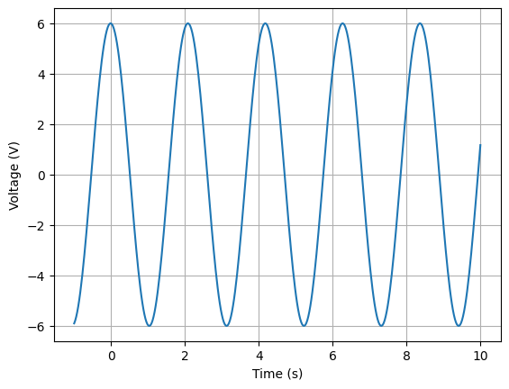
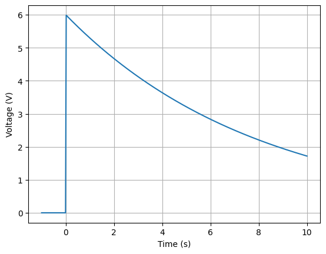

.. _novices:

============================
Circuit analysis for novices
============================

This section is for those who want to analyse a circuit using a minimum of circuit theory!

DC voltage divider
==================

To analyse a voltage divider with Lcapy, it is necessary to create a netlist.  For example::
  
    >>> from lcapy import Circuit
    >>> a = Circuit("""
    ... V 1 0 6; down=1.5
    ... R1 1 2 2; right=1.5
    ... R2 2 0_2 4; down
    ... W 0 0_2; right""")
    >>> a.draw()
                    
Each line of the netlist specifies a component.  It has a name and
nodes.  The latter are usually numbers but can be alphanumeric.  The
first node is the more positive node.  The options after a semicolon
are optional but are useful for customising the schematic.

.. image:: examples/tutorials/basic/VRR1.png
   :width: 6cm   

The voltage at each node (with respect to the ground node 0) can be found using::

    >>> a[1].v
    6
    >>> a[2].v
    4

The voltage across each component can be found using::

    >>> a.V.v
    6
    >>> a.R1.v
    2
    >>> a.R2.v
    4

Similarly, the current through each component can be found using::

    >>> a.V.i
    1
    >>> a.R1.i
    1
    >>> a.R2.i
    1

The units can be printed once this feature is enabled, for example::

    >>> state.show_units=True
    >>> state.abbreviate_units=True
    >>> a.R1.i
    1.A
    >>> a.R1.v
    2.V
    >>> state.abbreviate_units=False
    >>> a.R1.v
    2.volt

AC voltage divider steady state response
========================================

An AC source can be created using the `ac` keyword when defining a
voltage source.  This has a default angular frequency :math:`\omega_0`.
  
    >>> from lcapy import Circuit
    >>> a = Circuit("""
    ... V 1 0 ac 6; down=1.5
    ... R 1 2 2; right=1.5
    ... C 2 0_2 4; down
    ... W 0 0_2; right""")
    >>> a.draw()

Here, `V 1 0 ac 6` is shorthand for `V 1 0 {6 * cos(omega_0 * t)}`.

The response to AC sources is gnarlier compared to DC sources::
    
    >>> a.V.v
    6⋅cos(ω₀⋅t)
    >>> a.R.v
         2                            
    384⋅ω₀ ⋅cos(ω₀⋅t)   48⋅ω₀⋅sin(ω₀⋅t)
    ───────────────── - ───────────────
             2                  2      
        64⋅ω₀  + 1         64⋅ω₀  + 1

    >>> a.R.v.simplify_sin_cos()
       _______________                         
      ╱        2                               
    ╲╱  2304⋅ω₀  + 36 ⋅cos(ω₀⋅t - atan(8⋅ω₀))  
    ─────────────────────────────────────────
                         2                     
                    64⋅ω₀  + 1     

The interpretation is much easier using the concept of phasors.

The voltage across R can be plotted, however, it needs a specific value for :math:`\omega_0`.  For example::

   >>> a.R.v.subs(omega0, 3).plot((-1, 10))

  

AC voltage divider step response
================================

A change in amplitude (frequency or phase) of a signal produces a transient response.   Here is a netlist with a voltage source that has a step change.

    >>> from lcapy import Circuit
    >>> a = Circuit("""
    ... V 1 0 step 6; down=1.5
    ... R 1 2 2; right=1.5
    ... C 2 0_2 4; down
    ... W 0 0_2; right""")
    >>> a.draw()

Here, `V 1 0 step 6` is shorthand for `V 1 0 {6 * u(t)}` where `u(t)` is Heaviside's unit step. 

The transient voltages are::

    >>> a.V.v
    6⋅u(t)
    >>> a.R.v
       -t      
       ───     
        8      
    6⋅ℯ   ⋅u(t)
    >>> a.C.v
      ⎛       -t ⎞     
      ⎜       ───⎟     
      ⎜        8 ⎟     
    3⋅⎝8 - 8⋅ℯ   ⎠⋅u(t)
    ───────────────────
             4         

The voltage across R can be plotted using::             
             
   >>> a.R.v.plot((-1, 10))
             

