========
Overview
========

This document provides an overview of Lcapy's capabilities.   It assumes you know something about circuit theory.   If you know nothing about circuit theory, see :ref:`novices`.   If you want some complete examples, see :ref:`tutorials`.

Introduction
============

Lcapy is a Python package for linear circuit analysis.  Its primary
purpose is for symbolic circuit analysis but it can also simulate
circuits using numerical integration.  Lcapy can only symbolically
analyse linear, time invariant networks.  In other words, networks
comprised of basic circuit components (R, L, C, etc.) that do not vary
with time.  However, changes in circuit topology can be analysed as a
sequence of initial value problems.

Networks and circuits can be described using netlists or combinations
of network elements.  These can be drawn semi-automatically (see :ref:`schematics`).

As well as performing circuit analysis, Lcapy can output the systems
of equations for mesh analysis, nodal analysis, modified nodal
analysis, and state-space analysis (see :ref:`mesh-analysis`,
:ref:`nodal-analysis`, :ref:`modified-nodal-analysis`, and
:ref:`state-space-analysis`).

Lcapy cannot directly analyse non-linear devices such as diodes or
transistors although it does support simple opamps without saturation.
Nevertheless, it can draw them!  Lcapy can generate text-book quality schematics using vector graphics (unlike the bit-mapped graphics used in this document). 

Lcapy uses SymPy (symbolic Python) for its values and expressions
and thus the circuit analysis can be performed symbolically.  See http://docs.sympy.org/latest/tutorial/index.html for the SymPy tutorial.

Lcapy can perform many other linear circuit analysis operations, including:

1. Two-port parameters (A, B, G, H, S, T, Y, and Z)

2. Norton/Thevenin transforms

3. Wye-delta transforms

4. Polyphase transforms

5. Laplace transforms

6. Fourier transforms   
   
7. Discrete Fourier transforms

8. z-transforms

9. Time-stepping simulation (see :ref:`simulation`)

If you need to model a non-linear circuit numerically using Python, see PySpice (https://pypi.org/project/PySpice/).

Preliminaries
=============

- Before you can use Lcapy you need to install the Lcapy package (see :ref:`installation`) or set `PYTHONPATH` to find the Lcapy source files.

- Then fire up your favourite python interpreter, for example, ipython::

  >>> ipython --pylab

- Alternatively, you can use a Jupyter notebook.
  

Conventions
===========

Lcapy uses the passive sign convention.  Thus for a passive device (R,
L, C), current flows into the positive node, and for a source (V, I),
current flows out of the positive node.

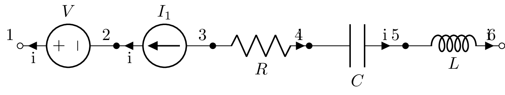

  
Expressions
===========

Lcapy defines a number of symbols corresponding to different domains (see :ref:`domainvariables`):

- `t` -- time domain

- `f` -- Fourier (frequency) domain

- `s` -- Laplace (complex frequency) domain

- `omega` -- angular Fourier domain

- `jomega` (or `jw`) -- phasor domain  

- `n` -- discrete-time domain

- `k` -- discrete-frequency domain

- `z` -- z-domain  

Expressions (see :ref:`expressions`) can be formed using these symbols.  For example, a
time-domain expression can be created using::

   >>> from lcapy import t, delta, u
   >>> v = 2 * t * u(t) + 3 + delta(t)
   >>> i = 0 * t + 3

and a s-domain expression can be created using::

   >>> from lcapy import s, j, omega
   >>> H = (s + 3) / (s - 4)
   >>> H
   s + 3
   ─────
   s - 4

For steady-state causal signals, the s-domain can be converted to the phasor
domain by substituting :math:`\mathrm{j} \omega` for :math:`s`

   >>> from lcapy import s, j, omega
   >>> H = (s + 3) / (s - 4)
   >>> A = H(j * omega)
   >>> A
   j⋅ω + 3
   ───────
   j⋅ω - 4

Lcapy expressions have an associated domain (such a time domain or
Laplace domain), an associated quantity (such as voltage or
impedance), and units.  For more details see :ref:`domains`,
:ref:`quantities`, and :ref:`units`.  Here is an example::

   >>> V = voltage(3 * s)
   >>> V.domain
   'laplace'
   >>> V.quantity
   'voltage'
   >>> V.units
   V 

By default, the units are not printed (for more details see :ref:`units`).

   
Lcapy expressions have a number of other attributes  (see :ref:`expressionsattributes`) including:

- `numerator`, `N` --  numerator of rational function

- `denominator`, `D` --  denominator of rational function

- `magnitude` -- magnitude

- `angle` -- angle

- `real` -- real part

- `imag` -- imaginary part

- `conjugate` -- complex conjugate

- `expr` -- the underlying SymPy expression

- `val` -- the expression as evaluated as a floating point value (if possible)

and a number of generic methods (see :ref:`expressionsmethods`) including:

- `simplify()` -- attempt simple simplification of the expression

- `rationalize_denominator()` -- multiply numerator and denominator by complex conjugate of denominator

- `divide_top_and_bottom(expr)` -- divides numerator and denominator by `expr`.

- `multiply_top_and_bottom(expr)` -- multiplies numerator and denominator by `expr`.    

- `evaluate()` -- evaluate at specified vector and return floating point vector

Here's an example of using these attributes and methods::

   >>> from lcapy import s, j, omega
   >>> H = (s + 3) / (s - 4)
   >>> A = H(j * omega)
   >>> A
   j⋅ω + 3
   ───────
   j⋅ω - 4
   >>> A.rationalize_denominator()
    2             
   ω  - 7⋅j⋅ω - 12
   ───────────────
        2         
       ω  + 16  
   >>> A.real
    2     
   ω  - 12
   ───────
    2     
   ω  + 16
   >>> A.imag
    -7⋅ω  
   ───────
    2     
   ω  + 16
   >>> A.N
   j⋅ω + 3
   >>> A.D
   j⋅ω - 4
   >>> A.phase
        ⎛       2     ⎞
   atan2⎝-7⋅ω, ω  - 12⎠
   >>> A.magnitude
      __________________
     ╱  4       2       
   ╲╱  ω  + 25⋅ω  + 144 
   ─────────────────────
           2            
          ω  + 16       

Each domain has specific methods, including:

- `as_fourier()`   -- Convert to Fourier domain

- `as_laplace()`   -- Convert to Laplace (s) domain

- `as_time()`      -- Convert to time domain

- `as_phasor()`    -- Convert to phasor domain  

Lcapy defines a number of functions (see :ref:`expressionsfunctions`) that can be used in expressions, including:

- `u()` --  Heaviside's unit step

- `H()` -- Heaviside's unit step

- `delta()` -- Dirac delta

- `cos()` -- cosine

- `sin()` -- sine

- `sqrt()` -- square root

- `exp()` -- exponential

- `log10()` -- logarithm base 10

- `log()` -- natural logarithm

  
Expression formatting
---------------------

Lcapy can format expressions in many ways (see
:ref:`expressionsprinting`).  For example, it can represent
expressions in partial fraction form::

   >>> from lcapy import *
   >>> G = 1 / (s**2 + 5 * s + 6)
   >>> G.partfrac()
      1       1  
   - ───── + ─────
     s + 3   s + 2

Here's an example of partial fraction expansion for a not strictly proper rational function::

   >>> from lcapy import *
   >>> H = 5 * (s + 5) * (s - 4) / (s**2 + 5 * s + 6)
   >>> H.partfrac()
         70      90 
   5 + ───── - ─────
       s + 3   s + 2

The rational function can also be printed in ZPK (zero-pole-gain) form::

   >>> H.ZPK()
   5⋅(s - 4)⋅(s + 5)
   ─────────────────
    (s + 2)⋅(s + 3) 

Here it is obvious that the poles are -2 and -3.  These can also be found using the poles function::

   >>> H.poles()
   {-3: 1, -2: 1}

Here the number after the colon indicates how many times the pole is repeated.

Similarly, the zeros can be found using the zeros function::

   >>> H.zeros()
   {-5: 1, 4: 1}

Lcapy can also handle rational functions with a delay.

Inverse Laplace transforms
--------------------------

Lcapy can perform inverse Laplace transforms.  Here's an example for
a strictly proper rational function::

   >>> from lcapy import s
   >>> H = 5 * (s - 4) / (s**2 + 5 * s + 6)
   >>> H.partfrac()
     35      30 
   ───── - ─────
   s + 3   s + 2

   >>> H.inverse_laplace()
         -2⋅t       -3⋅t           
   - 30⋅e     + 35⋅e      for t ≥ 0
   

or alternatively
   
   >>> H(t)
         -2⋅t       -3⋅t           
   - 30⋅e     + 35⋅e      for t ≥ 0
                                   

Note that the unilateral inverse Laplace transform can only determine
the result for :math:`t \ge 0`.  If you know that the system is
causal, then use::

   >>> H(t, causal=True)
   ⎛      -2⋅t       -3⋅t⎞
   ⎝- 30⋅e     + 35⋅e    ⎠⋅Heaviside(t)

The Heaviside function is also known as the unit step.  Alternatively,
you can force the result to be causal::

   >>> H(t).force_causal()
   ⎛      -2⋅t       -3⋅t⎞
   ⎝- 30⋅e     + 35⋅e    ⎠⋅Heaviside(t)

or remove the condition that :math:`t \ge 0`,

   >>> H(t).remove_condition()
         -2⋅t       -3⋅t
   - 30⋅e     + 35⋅e    
   

When the rational function is not strictly proper, the inverse Laplace
transform has Dirac deltas (and derivatives of Dirac deltas)::

   >>> from lcapy import s
   >>> H = 5 * (s - 4) / (s**2 + 5 * s + 6)
   >>> H.partfrac()
        70      90 
   5 + ───── - ─────
       s + 3   s + 2
   >>> H.inverse_laplace(causal=True)
   ⎛      -2⋅t       -3⋅t⎞                               
   ⎝- 90⋅e     + 70⋅e    ⎠⋅Heaviside(t) + 5⋅DiracDelta(t)

Here's another example of a strictly proper rational function with a
repeated pole::

   >>> from lcapy import s
   >>> H = 5 * (s + 5) / ((s + 3) * (s + 3))
   >>> H.ZPK()
   5⋅(s + 5)
   ─────────
           2
    (s + 3) 
   >>> H.partfrac()
     5        10   
   ───── + ────────
   s + 3          2
           (s + 3) 
   >>> H.inverse_laplace(causal=True)
   ⎛      -3⋅t      -3⋅t⎞             
   ⎝10⋅t⋅e     + 5⋅e    ⎠⋅Heaviside(t)

Rational functions with delays can also be handled::

   >>> from lcapy import s
   >>> import sympy as sym
   >>> T = sym.symbols('T')
   >>> H = 5 * (s + 5) * (s - 4) / (s**2 + 5 * s + 6) * sym.exp(-s * T)
   >>> H.partfrac()
   ⎛      70      90 ⎞  -T⋅s
   ⎜5 + ───── - ─────⎟⋅e    
   ⎝    s + 3   s + 2⎠      
   >>> H.inverse_laplace(causal=True)
   ⎛      2⋅T - 2⋅t       3⋅T - 3⋅t⎞                                         
   ⎝- 90⋅e          + 70⋅e         ⎠⋅Heaviside(-T + t) + 5⋅DiracDelta(-T + t)

Lcapy can convert s-domain products to time domain convolutions, for example::

   >>> from lcapy import expr
   >>> expr('V(s) * Y(s)')(t, causal=True)
   t                 
   ⌠                 
   ⎮ v(t - τ)⋅y(τ) dτ
   ⌡                 
   0                 

Here the function expr converts a string argument to an Lcapy expression.

It can also recognise integrations and differentiations of arbitrary
functions, for example::

   >>> from lcapy import s, t
   >>> (s * 'V(s)')(t, causal=True)
   d       
   ──(v(t))
   dt      

   >>> ('V(s)' / s)(t, causal=True)   
   t        
   ⌠        
   ⎮ v(τ) dτ
   ⌡        
   0        

These expressions also be written as::
   
   >>> from lcapy import expr, t
   >>> expr('s * V(s)')(t, causal=True)
   >>> expr('V(s) / s')(t, causal=True)

or more explicitly::

   >>> from lcapy import expr
   >>> expr('s * V(s)').inverse_laplace(causal=True)
   >>> expr('V(s) / s').inverse_laplace(causal=True)
   

Laplace transforms
------------------

Lcapy can also perform Laplace transforms.   Here's an example::

   >>> from lcapy import s, t
   >>> v = 10 * t ** 2 + 3 * t
   >>> v.laplace()
   3⋅s + 20
   ────────
       3   
      s   

There is a short-hand notation for the Laplace transform::
      
   >>> v(s)
   3⋅s + 20
   ────────
       3   
      s         

Note, Lcapy uses the :math:`\mathcal{L}_{-}` unilateral Laplace transform
whereas SymPy which uses the :math:`\mathcal{L}` unilateral Laplace
transform, see :ref:`laplace_transforms`.  The key difference is for Dirac deltas (and their derivatives).  Lcapy gives::

  >>> delta(t)(s)
  1

However, SymPy gives 0.5.
  

Networks
========

Networks can be constructed using series and parallel combination of one-port network elements and other networks, see :ref:`networks`.

Network elements
----------------

The basic circuit components are two-terminal (one-port) devices are:

- `I` -- current source

- `V` -- voltage source

- `R` -- resistor

- `G` -- conductor

- `C` -- capacitor

- `L` -- inductor

These are augmented by generic s-domain components:

- `Y` -- generic admittance

- `Z` -- generic impedance

Here are some examples of their creation::

   >>> from lcapy import *
   >>> R1 = R(10)
   >>> C1 = C(10e-6)
   >>> L1 = L('L_1')

Network element combination
---------------------------

Here's an example of resistors in series::

   >>> from lcapy import *
   >>> R1 = R(10)
   >>> R2 = R(5)
   >>> Rtot = R1 + R2
   >>> Rtot
   R(10) + R(5)
   >>> Rtot.simplify()
   R(15)

Here `R(10)` creates a 10 ohm resistor and this is assigned to the
variable `R1`.  Similarly, `R(5)` creates a 5 ohm resistor and this is
assigned to the variable `R2`.  `Rtot` is the name of the network
formed by connecting `R1` and `R2` in series.  Calling the `simplify`
method will simplify the network and combine the resistors into a
single resistor equivalent.

Here's an example of a parallel combination of resistors.  Note that
the parallel operator is `|` instead of the usual `||`.

   >>> from lcapy import *
   >>> Rtot = R(10) | R(5)
   >>> Rtot
   R(10) | R(5)
   >>> Rtot.simplify()
   R(10/3)

The result can be performed symbolically, for example::

   >>> from lcapy import *
   >>> Rtot = R('R_1') | R('R_2')
   >>> Rtot
   R(R_1) | R(R_2)
   >>> Rtot.simplify()
   R(R_1*R_2/(R_1 + R_2))
   >>> Rtot.simplify()
   R(R₁) | R(R₂)

Here's another example using inductors in series::

   >>> from lcapy import *
   >>> L1 = L(10)
   >>> L2 = L(5)
   >>> Ltot = L1 + L2
   >>> Ltot
   L(10) + L(5)
   >>> Ltot.simplify()
   L(15)

Finally, here's an example of a parallel combination of capacitors::

   >>> from lcapy import *
   >>> Ctot = C(10) | C(5)
   >>> Ctot
   C(10) | C(5)
   >>> Ctot.simplify()
   C(15)

Impedances
----------

Impedance is a frequency domain generalization of resistance, see :ref:`Immittances`.

Let's consider a series R-L-C network::

   >>> from lcapy import *
   >>> n = R(4) + L(10) + C(20)
   >>> n
   R(4) + L(10) + C(20)

The phasor impedance can be determined as a function of angular frequency using::
   
   >>> n.Z(jomega)
                 ⅉ  
   10⋅ⅉ⋅ω + 4 - ────
                20⋅ω

Similarly, the generalized (s-domain) impedance can be determined using::
                
   >>> n.Z(s)
       2         1 
   10⋅s  + 4⋅s + ──
                 20
   ────────────────
          s        

Impedance expressions are rational functions (of :math:`\omega` or :math:`s`) and can be formatted in a number of different ways, for example::

   >>> n.Z(s).ZPK()
      ⎛      ____    ⎞ ⎛      ____    ⎞
      ⎜    ╲╱ 14    1⎟ ⎜    ╲╱ 14    1⎟
   10⋅⎜s - ────── + ─⎟⋅⎜s + ────── + ─⎟
      ⎝      20     5⎠ ⎝      20     5⎠
   ────────────────────────────────────
                    s                 

   >>> n.Z(s).standard()
               1  
   10⋅s + 4 + ────
              20⋅s

Here `ZPK()` prints the impedance in ZPK (zero-pole-gain) form while
`standard()` prints the rational function as the sum of a polynomial
and a strictly proper rational function.

The corresponding parallel R-L-C network yields::

   >>> from lcapy import *
   >>> n = R(5) | L(20) | C(10)
   >>> n
   R(5) | L(20) | C(10)
   >>> n.Z(s)
           s         
   ──────────────────
      ⎛ 2   s     1 ⎞
   10⋅⎜s  + ── + ───⎟
      ⎝     50   200⎠

   >>> n.Z(s).ZPK()
                   s                 
   ──────────────────────────────────
      ⎛     1    7⋅j⎞ ⎛     1    7⋅j⎞
   10⋅⎜s + ─── - ───⎟⋅⎜s + ─── + ───⎟
      ⎝    100   100⎠ ⎝    100   100⎠
   >>> n.Z(s).canonical()
           s         
   ──────────────────
      ⎛ 2   s     1 ⎞
   10⋅⎜s  + ── + ───⎟
      ⎝     50   200⎠
   >>> n.Y(s)
        2          
   200⋅s  + 4⋅s + 1
   ────────────────
         20⋅s      

Notice how `n.Y(s)` returns the s-domain admittance of the network, the reciprocal of the impedance `n.Z(s)`.

The frequency response can be evaluated numerically by specifying a
vector of frequency values.  For example::

   >>> from lcapy import *
   >>> from numpy import linspace
   >>> n = Vstep(20) + R(5) + C(10)
   >>> vf = linspace(0, 4, 400)
   >>> Isc = n.Isc(f).evaluate(vf)

Then the frequency response can be plotted.  For example::

   >>> from matplotlib.pyplot import figure, show
   >>> fig = figure()
   >>> ax = fig.add_subplot(111)
   >>> ax.loglog(f, abs(Isc), linewidth=2)
   >>> ax.set_xlabel('Frequency (Hz)')
   >>> ax.set_ylabel('Current (A/Hz)')
   >>> ax.grid(True)
   >>> show()

A simpler approach is to use the `plot()` method::

   >>> from lcapy import *
   >>> from numpy import linspace
   >>> n = Vstep(20) + R(5) + C(10)
   >>> vf = linspace(0, 4, 400)
   >>> n.Isc(f).plot(vf, log_scale=True)

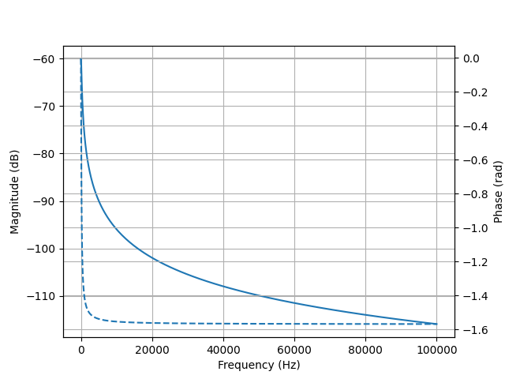

Here's a complete example Python script to plot the impedance of a
series R-L-C network:

.. literalinclude:: examples/networks/series-RLC3-Z.py

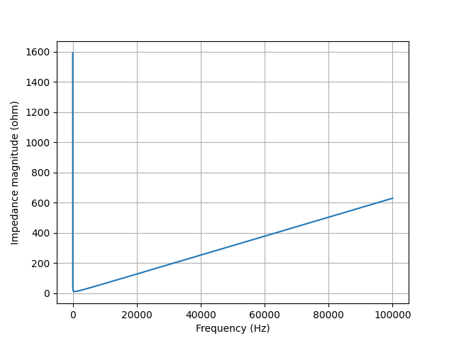

Simple transient analysis
-------------------------

Let's consider a series R-C network in series with a DC voltage source

   >>> from lcapy import *
   >>> n = Vstep(20) + R(5) + C(10, 0)
   >>> n
   Vstep(20) + R(5) + C(10, 0)
   >>> Voc = n.Voc(s)
   >>> Voc
   20
   ──
   s 
   >>> n.Isc(s)
      4   
   ────────
   s + 1/50
   >>> isc = n.Isc(t)
      -t      
      ───     
       50     
   4⋅ℯ   ⋅u(t)

Here `n` is network formed by the components in series, and `n.Voc(s)`
is the open-circuit s-domain voltage across the network.  Note, this
is the same as the s-domain value of the voltage source.  `n.Isc(s)`
is the short-circuit s-domain voltage through the network and
`n.Isc(t)` is the the time-domain response.  

Of course, the previous example can be performed symbolically,

   >>> from lcapy import *
   >>> n = Vstep('V_1') + R('R_1') + C('C_1')
   >>> n
   Vstep(V₁) + R(R₁) + C(C)
   >>> Voc = n.Voc(s)
   >>> Voc
   V₁
   ──
   s 
   >>> n.Isc(s)
         V₁      
   ──────────────
      ⎛      1  ⎞
   R₁⋅⎜s + ─────⎟
      ⎝    C₁⋅R₁⎠
   >>> isc = n.Isc(t)
   >>> isc
        -t       
       ─────     
       C₁⋅R₁     
   V₁⋅ℯ     ⋅u(t)
   ──────────────
         R₁      

The transient response can be evaluated numerically by specifying a
vector of time values to the `evaluate()` method::

   >>> from lcapy import *
   >>> from numpy import linspace
   >>> n = Vstep(20) + R(5) + C(10, 0)
   >>> tv = linspace(0, 100, 400)
   >>> isc = n.Isc(t).evaluate(tv)

Then the transient response can be plotted.  Alternatively, the `plot()`
method can be used.

.. literalinclude:: examples/networks/series-VRC1-isc.py

This produces:

.. image:: examples/networks/series-VRC1-isc.png
   :width: 15cm

Here's a complete example Python script of the short-circuit current
through an underdamped series RLC network:

.. literalinclude:: examples/networks/series-VRLC1-isc.py

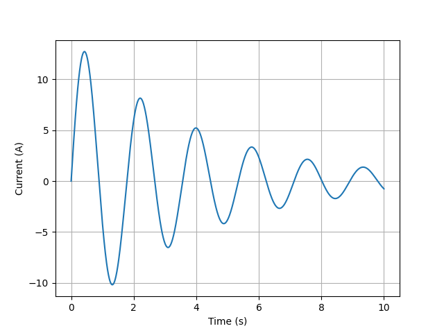

Transformations
---------------

A one-port network can be represented as a Thevenin network (a series
combination of a voltage source and an impedance) or as a Norton
network (a parallel combination of a current source and an
admittance).

Here's an example of a Thevenin to Norton transformation::

   >>> from lcapy import *
   >>> T = Vdc(10) + R(5)
   >>> n = T.norton()
   >>> n
   G(1/5) | Idc(2)

Similarly, here's an example of a Norton to Thevenin transformation::

   >>> from lcapy import *
   >>> n = Idc(10) | R(5)
   >>> T = n.thevenin()
   >>> T
   R(5) + Vdc(50)

Two-port networks
=================

The basic circuit components are one-port networks.  They can be
combined to create a two-port network.  The simplest two-port is a
shunt::

         -----+----
              |    
            +-+-+  
            |   |  
            |OP |  
            |   |  
            +-+-+  
              |    
         -----+----

A more interesting two-port network is an L section (voltage divider)::

           +---------+       
         --+   OP1   +---+----
           +---------+   |   
                       +-+-+ 
                       |   | 
                       |OP2| 
                       |   | 
                       +-+-+ 
                         |   
         ----------------+----

This is comprised from any two one-port networks.  For example::
  
   >>> from lcapy import *
   >>> R1 = R('R_1')
   >>> R2 = R('R_2')
   >>> n = LSection(R1, R2)
   >>> n.Vtransfer
   R_2/(R_1 + R_2)

Here `n.Vtransfer` determines the forward voltage transfer function
`V_2(s) / V_1(s)`.

The open-circuit input impedance can be found using::
  
   >>> n.Z1oc
   R₁ + R₂

The open-circuit output impedance can be found using::
  
   >>> n.Z2oc
   R₂

The short-circuit input admittance can be found using::
  
   >>> n.Y1sc
   1 
   ──
   R₁

The short-circuit output admittance can be found using::
  
   >>> n.Y2sc
   R₁ + R₂
   ───────
    R₁⋅R₂ 

Two-port combinations
---------------------

Two-port networks can be combined in series, parallel, series at the
input with parallel at the output (hybrid), parallel at the input with
series at the output (inverse hybrid), but the most common is the
chain or cascade.  This connects the output of the first two-port to
the input of the second two-port.

For example, an L section can be created by chaining a shunt to a
series one-port::

   >>> from lcapy import *
   >>> n = Series(R('R_1')).chain(Shunt(R('R_2')))
   >>> n.Vtransfer
   R_2/(R_1 + R_2)

Two-port matrices
-----------------

Two-port networks can be parameterised by eight different two by two
matrices, A, B, G, H, S, T, Y, Z.  Each has their own merits (see
http://en.wikipedia.org/wiki/Two-port_network).

Consider an L section comprised of two resistors::
  
   >>> from lcapy import *
   >>> n = LSection(R('R_1'), R('R_2'))

The different matrix representations can be shown using::
  
   >>> n.Aparams
   ⎡R₁ + R₂    ⎤
   ⎢───────  R₁⎥
   ⎢   R₂      ⎥
   ⎢           ⎥
   ⎢  1        ⎥
   ⎢  ──     1 ⎥
   ⎣  R₂       ⎦
   >>> n.Bparams
   ⎡ 1    -R₁  ⎤
   ⎢           ⎥
   ⎢-1   R₁    ⎥
   ⎢───  ── + 1⎥
   ⎣ R₂  R₂    ⎦
   >>> n.Gparams
   ⎡   1       -R₂  ⎤
   ⎢───────  ───────⎥
   ⎢R₁ + R₂  R₁ + R₂⎥
   ⎢                ⎥
   ⎢   R₂     R₁⋅R₂ ⎥
   ⎢───────  ───────⎥
   ⎣R₁ + R₂  R₁ + R₂⎦
   >>> n.Hparams
   ⎡R₁  1 ⎤
   ⎢      ⎥
   ⎢    1 ⎥
   ⎢-1  ──⎥
   ⎣    R₂⎦
   >>> n.Yparams
   ⎡1      -1   ⎤
   ⎢──     ───  ⎥
   ⎢R₁      R₁  ⎥
   ⎢            ⎥
   ⎢-1   R₁ + R₂⎥
   ⎢───  ───────⎥
   ⎣ R₁   R₁⋅R₂ ⎦
   >>> n.Zparams
   ⎡R₁ + R₂  R₂⎤
   ⎢           ⎥
   ⎣  R₂     R₂⎦

Note, some of the two-port matrices cannot represent a network.  For
example, a series impedance has a non specified Z matrix and a shunt
impedance has a non specified Y matrix.

Netlists
========

Creating complicated networks by combining network elements soon
becomes tedious.  A simpler way is to describe the network (or
circuit) using a netlist, see :ref:`netlists`.  Here's an example of a
resistor in series with a capacitor::

   >>> cct = Circuit("""
   ... R 1 2
   ... C 2 0""")

Here the numbers represent node names although these can be alphanumeric as well.
   

Transfer functions
------------------

Transfer functions can be created from netlists using the `transfer()` method.  Here's an example for an RC low-pass filter::

   >>> cct = Circuit("""
   ... R 1 2
   ... C 2 0""")
   >>> H = cct.transfer(1, 0, 2, 0)
   >>> H(s)
         1      
   ─────────────
       ⎛     1 ⎞
   C⋅R⋅⎜s + ───⎟
       ⎝    C⋅R⎠

Transfer functions can also be created in a similar manner to Matlab,
either using lists of numerator and denominator coefficients::

   >>> from lcapy import *
   >>> H1 = tf(0.001, [1, 0.05, 0])
   >>> H1
       0.001     
   ───────────────
        2         
   1.0⋅s  + 0.05⋅s

from lists of poles and zeros (and optional gain)::

   >>> from lcapy import *
   >>> H2 = zp2tf([], [0, -0.05])
   >>> H2
        0.001     
   ───────────────
        2         
   1.0⋅s  + 0.05⋅s

or symbolically::

   >>> from lcapy import *
   >>> H3 = 0.001 / (s**2 + 0.05 * s)
   >>> H3
        0.001     
   ───────────────
        2         
   1.0⋅s  + 0.05⋅s

In each case, parameters can be expressed numerically or symbolically,
for example::

   >>> from lcapy import *
   >>> H4 = zp2tf(['z_1'], ['p_1', 'p_2'])
   >>> H4
          s - z₁      
   ───────────────────
   (-p₁ + s)⋅(-p₂ + s)

Circuit analysis
----------------

The nodal voltages for a linear circuit can be found using Modified
Nodal Analysis (MNA).  This requires the circuit topology be entered
as a netlist (see :ref:`netlists`).  This describes each component, its
name, value, and the nodes it is connected to.  This netlist can be
read from a file or created dynamically, for example::

   >>> from lcapy import Circuit
   >>> cct = Circuit()
   >>> cct.add('V1 1 0 step 10') 
   >>> cct.add('Ra 1 2 3e3') 
   >>> cct.add('Rb 2 0 1e3') 

This creates a circuit comprised of a 10 V step voltage source
connected to two resistors in series.  The node named 0 denotes the
ground which the other voltages are referenced to.  Here's a more
compact way to specify the netlist::

   >>> from lcapy import Circuit
   >>> cct = Circuit("""
   ... V1 1 0 step 10
   ... Ra 1 2 3e3
   ... Rb 2 0 1e3""")

The circuit has an attribute for each circuit element (and for each
node starting with an alphabetical character).  These can be
interrogated to find the voltage drop across an element or the current
through an element, for example::

   >>> cct.V1.V
   10⋅u(t)
   >>> cct.Rb.V
   5⋅u(t)
   ──────
     2

The returned result is a superposition of expressions in the different
transform domains.  In this example, there is only a single
time-domain component.  If there are multiple components, they are
displayed as a dictionary, keyed by the transform domains.

The superposition can be converted into a Laplace domain expression using::

  >>> cct.V1.V(s)
   10
   ──
   s

or into a time domain expression using::   

   >>> cct.V1.V(t)
   10

The current through a component is obtained with the `I` attribute.  For a source the current is assumed to flow out of the positive node, however, for a passive device (R, L, C) it is assumed to flow into the positive node.

   
The voltage between a node and ground can be determined with the node
name as an index, for example::

   >>> cct[1].V(t)
   10
   >>> cct[2].V(t)
   5
   ─
   2

Since Lcapy uses SymPy, circuit analysis can be performed
symbolically.  This can be achieved by using symbolic arguments or by
not specifying a component value.  In the latter case, Lcapy will
use the component name for its value.  For example::

   >>> cct = Circuit("""
   ... V1 1 0 step Vs
   ... R1 1 2
   ... C1 2 0""")
   >>> cct[2].V(s)
           V_s        
    ──────────────────
          ⎛ 2     s  ⎞
    C₁⋅R₁⋅⎜s  + ─────⎟
          ⎝     C₁⋅R₁⎠

   >>> : cct[2].V(t)
   ⎛            -t  ⎞             
   ⎜           ─────⎟             
   ⎜           C₁⋅R₁⎟             
   ⎝V_s - V_s⋅e     ⎠⋅Heaviside(t)

   
Transform domains
-----------------

Lcapy analyses a linear circuit using a number of transform domains
and the principle of superposition.  Voltage and current signals are
decomposed into a DC component, one or more AC components (one for
each angular frequency), a transient component, and noise components
(one for each noise source).

For example, consider::

   >>> Voc = (Vdc(10) + Vac(20) + Vstep(30) + Vnoise(40)).Voc
   >>> Voc
   ⎧                   30        ⎫
   ⎨dc: 10, n1: 40, s: ──, ω₀: 20⎬
   ⎩                   s         ⎭

Here the open-circuit voltage is decomposed into four parts (stored in
a dictionary).  The DC component is keyed by 'dc', the transient
component is keyed by 's' (since this is analysed in the Laplace or
s-domain), the noise components are keyed by noise identifiers of the
form 'nx' (where x is an integer), and the ac components are keyed by
the angular frequency.  The different parts of a decomposition can
also be accessed using attributes, for example::

   >>> Voc.s
   30
   ──
   s    

Note, this only returns the Laplace transform of the transient
component of the decomposition.  The full Laplace transform of the
open-circuit voltage (ignoring the noise component) can be obtained using::

   >>> from lcapy import s
   >>> Voc(s)
      ⎛    2      2⎞
   20⋅⎝2⋅ω₀  + 3⋅s ⎠
   ─────────────────
        ⎛  2    2⎞  
      s⋅⎝ω₀  + s ⎠

Similarly, the time-domain representation (ignoring the noise component) can be determined using::

   >>> from lcapy import t
   >>> Voc(t)
   20⋅cos(ω₀⋅t) + 30⋅u(t) + 10

Initial value problems
----------------------

The initial voltage difference across a capacitor or the initial
current through an inductor can be specified as an additional argument.
For example::

   >>> cct = Circuit("""
   ... V1 1 0 step Vs
   ... C1 2 1 C1 v0 
   ... L1 2 0 L1 i0""")
   >>> cct[2].V(s)
              ⎛        i₀          ⎞
   (V_s + v₀)⋅⎜- ────────────── + s⎟
              ⎝  C₁⋅V_s + C₁⋅v₀    ⎠
   ─────────────────────────────────
                2     1             
               s  + ─────           
                    C₁⋅L₁  

Note, the component values need to be specified as well as the initial
value; thus `C1 2 1 C1 v0` and not `C1 2 1 v0` since the latter
specifies the capacitance to be `v0`.
                    
When an initial condition is detected, the circuit is analysed in the
s-domain as an initial value problem.  The values of sources are
ignored for :math:`t<0` and the result is only defined for :math:`t\ge 0`.

                    
Transfer functions
------------------

Transfer functions can be found from the ratio of two s-domain
quantities such as voltage or current with zero initial conditions.
Here's an example using an arbitrary input voltage `V(s)`::

   >>> from lcapy import Circuit
   >>> cct = Circuit("""
   ... V1 1 0 {V(s)}
   ... R1 1 2
   ... C1 2 0 C1 0""")
   >>> cct[2].V(s)
       V(s)   
   ───────────
   C₁⋅R₁⋅s + 1

   >>> H = cct[2].V(s) / cct[1].V(s)
   >>> H
        1     
   ───────────
   C₁⋅R₁⋅s + 1

The corresponding impulse response can found from an inverse Laplace transform::

   >>> H.inverse_laplace(causal=True)
     -t               
    ─────             
    C₁⋅R₁             
   e     ⋅Heaviside(t)
   ───────────────────
          C₁⋅R₁ 

or more simply using::

   >>> H(t, causal=True)
     -t               
    ─────             
    C₁⋅R₁             
   e     ⋅Heaviside(t)
   ───────────────────
          C₁⋅R₁           
          
Transfer functions can also be created using the `transfer()` method of a
circuit.  For example::

   >>> from lcapy import Circuit
   >>> cct = Circuit("""
   ... R1 1 2 
   ... C1 2 0""")
   >>> H = cct.transfer(1, 0, 2, 0)
   >>> H
        1     
   ───────────
   C₁⋅R₁⋅s + 1

In this example, the `transfer()` method computes `(V[1] - V[0]) / (V[2] -
V[0])`.  In general, all independent sources are killed and so the
response is causal.

   >>> H(t)
     -t               
    ─────             
    C₁⋅R₁             
   e     ⋅Heaviside(t)
   ───────────────────
          C₁⋅R₁       

Mesh analysis
-------------

Lcapy can generate a system of equations using mesh analysis, see :ref:`mesh-analysis`.

Nodal analysis
--------------

Lcapy can generate a system of equations using nodal analysis, see :ref:`nodal-analysis`.

Modified nodal analysis
-----------------------

Lcapy uses modified nodal analysis for its calculations.  For reactive circuits it does this independently for the DC, AC, and transient components and uses superposition to combine the results.  For resistive circuits, it can perform this in the time-domain.   For more details see :ref:`modified-nodal-analysis`.

          
State-space analysis
--------------------

Lcapy can identify state variables and generate the state and output
equations for state-space analysis.  The state-space analysis is
performed using the `ss` method of a circuit, e.g.,

   >>> from lcapy import Circuit
   >>> a = Circuit("""
   ... V 1 0 {v(t)}; down
   ... R1 1 2; right
   ... L 2 3; right=1.5, i={i_L}
   ... R2 3 0_3; down=1.5, i={i_{R2}}, v={v_{R2}}
   ... W 0 0_3; right
   ... W 3 3_a; right
   ... C 3_a 0_4; down, i={i_C}, v={v_C}
   ... W 0_3 0_4; right""")
   >>> ss = a.ss

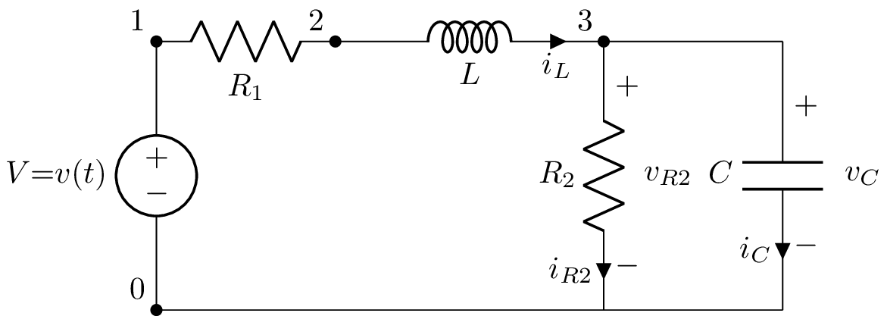

This circuit has two reactive components and thus there are two state
variables; the current through `L` and the voltage across `C`.

The state equations are shown using the `state_equations()` method::

   >>> ss.state_equations()
   ⎡d         ⎤   ⎡-R₁  -1  ⎤                      
   ⎢──(i_L(t))⎥   ⎢───  ─── ⎥            ⎡1⎤       
   ⎢dt        ⎥   ⎢ L    L  ⎥ ⎡i_L(t)⎤   ⎢─⎥       
   ⎢          ⎥ = ⎢         ⎥⋅⎢      ⎥ + ⎢L⎥⋅[v(t)]
   ⎢d         ⎥   ⎢-1   -1  ⎥ ⎣v_C(t)⎦   ⎢ ⎥       
   ⎢──(v_C(t))⎥   ⎢───  ────⎥            ⎣0⎦       
   ⎣dt        ⎦   ⎣ C   C⋅R₂⎦                      

The output equations are shown using the `output_equations()` method::

   >>> ss.output_equations()
   ⎡v₁(t)⎤   ⎡0    0⎤            ⎡1⎤       
   ⎢     ⎥   ⎢      ⎥ ⎡i_L(t)⎤   ⎢ ⎥       
   ⎢v₂(t)⎥ = ⎢-R₁  0⎥⋅⎢      ⎥ + ⎢1⎥⋅[v(t)]
   ⎢     ⎥   ⎢      ⎥ ⎣v_C(t)⎦   ⎢ ⎥       
   ⎣v₃(t)⎦   ⎣0    1⎦            ⎣0⎦       

For further details see :ref:`state-space-analysis`.

Other circuit methods
---------------------     

- `Isc(Np, Nm)`      Short-circuit current between nodes Np and Nm.

- `Voc(Np, Nm)`      Open-circuit voltage between nodes Np and Nm.

- `isc(Np, Nm)`      Short-circuit t-domain current between nodes Np and Nm.

- `voc(Np, Nm)`      Open-circuit t-domain voltage between nodes Np and Nm.
   
- `admittance(Np, Nm)`        s-domain admittance between nodes Np and Nm.
  
- `impedance(Np, Nm)`         s-domain impedance between nodes Np and Nm.

- `kill()`           Remove independent sources.

- `kill_except(sources)`      Remove independent sources except ones specified.

- `transfer(N1p, N1m, N2p, N2m)` Voltage transfer function V2/V1, where V1 = V[N1p] - V[N1m], V2 = V[N2p] - V[N2m].

- `thevenin(Np, Nm)`  Thevenin model between nodes Np and Nm.

- `norton(Np, Nm)`    Norton model between nodes Np and Nm.

- `twoport(self, N1p, N1m, N2p, N2m)` Create two-port component where I1 is the current flowing into N1p and out of N1m, I2 is the current flowing into N2p and out of N2m, V1 = V[N1p] - V[N1m], V2 = V[N2p] - V[N2m].

- `add(component)` Add component from net list.
        
- `remove(component)` Remove component from net list.

- `netfile_add(filename)` Add netlist from file.

- `s_model()`         Convert circuit to s-domain model.

- `pre_initial_model()`   Convert circuit to pre-initial model.

- `ac()`           Create subnetlist for AC components of independent sources.

- `dc()`           Create subnetlist for DC components of independent sources.

- `transient()`    Create subnetlist for transient components of independent sources.

- `laplace()`      Create subnetlist with Laplace representations of independent source values.

Plotting
========

Lcapy expressions have a `plot()` method; this differs depending on the
domain (see :ref:`plotting`).  For example, the `plot()` method for Laplace-domain expressions
produces a pole-zero plot.  Here's an example:

.. literalinclude:: examples/netlists/tf1-pole-zero-plot.py

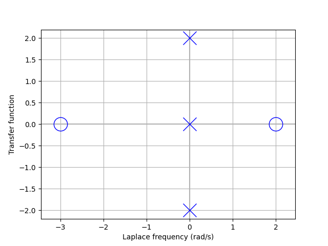

The `plot()` method for f-domain and :math:`\omega`-domain expressions
produce spectral plots, for example, 

.. literalinclude:: examples/netlists/tf1-bode-plot.py

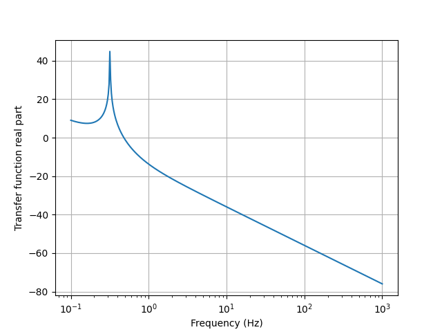

Schematics
==========

Schematics can be generated from a netlist and from one-port networks.
In both cases the drawing is performed using the LaTeX Circuitikz
package.  The schematic can be displayed interactively or saved to a
pdf, png, or pgf file.

Netlist schematics
------------------

Hints are required to designate component orientation and explicit
wires are required to link nodes of the same potential but with
different coordinates.  For more details see :ref:`schematics`.

Here's an example::
  
   >>> from lcapy import Circuit
   >>> cct = Circuit("""
   ... V1 1 0 {V(s)}; down
   ... R1 1 2; right
   ... C1 2 0_2; down
   ... W1 0 0_2; right""")
   >>> cct.draw('schematic.pdf')

Note, the orientation hints are appended to the netlist strings with a
semicolon delimiter.  The drawing direction is with respect to the
first node.  The component W1 is a wire.  Nodes with an underscore in
their name are not drawn with a closed blob.

Here's another example, this time loading the netlist from a file::

   >>> from lcapy import Circuit
   >>> cct = Circuit('voltage-divider.sch')
   >>> cct.draw('voltage-divider.pdf')

Here are the contents of the file 'voltage-divider.sch'::

   V1 1 0_1 dc V; down
   R1 1 2 R1; right
   R2 2 0 R2; down
   P1 2_2 0_2; down
   W1 2 2_2; right
   W2 0_1 0; right
   W3 0 0_2; right

Here, P1 defines a port.  This is shown as a pair of open blobs.

Here's the resulting schematic:

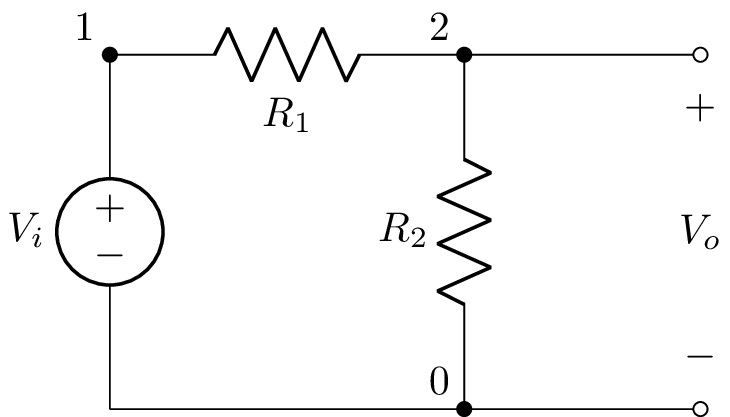

Many other components can be drawn than can be simulated.  This
includes non-linear devices such as transistors and diodes and time
varying components such as switches.  For example, here's a common
base amplifier,

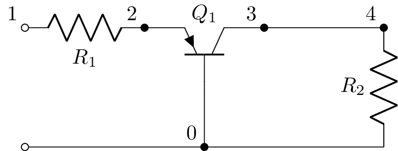

This is described by the netlist::

    Q1 3 0 2 pnp; up
    R1 1 2;right
    R2 4 0_4;down
    P1 1 0_1;down
    W 0_1 0;right
    W 0 0_4;right
    W 3 4;right

Network schematics
------------------

One-port networks can be drawn with a horizontal layout.  Here's an example:

   >>> from lcapy import R, C, L
   >>> ((R(1) + L(2)) | C(3)).draw()

Here's the result:

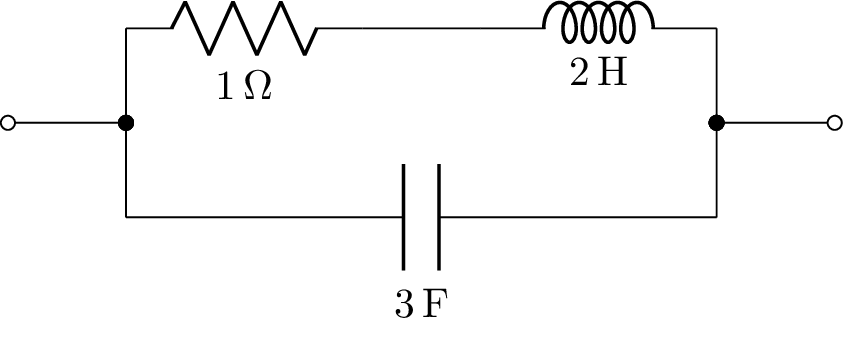

The s-domain model can be drawn using::

   >>> from lcapy import R, C, L
   >>> ((R(1) + L(2)) | C(3)).s_model().draw()

This produces:

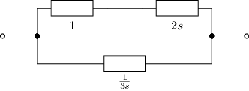

Internally, Lcapy converts the network to a netlist and then draws the
netlist.  The netlist can be found using the `netlist()` method, for example::

   >>> from lcapy import R, C, L
   >>> print(((R(1) + L(2)) | C(3)).netlist())

yields::

   W 1 3; right, size=0.5
   W 3 4; up, size=0.4
   W 3 5; down, size=0.4
   W 6 2; right, size=0.5
   W 6 7; up, size=0.4
   W 6 8; down, size=0.4
   R 4 9 1; right
   W 9 10; right, size=0.5
   L 10 7 2 0; right
   C 5 8 3 0; right

Note, the components have anonymous identifiers.

Bells and whistles
==================

Parameterization
----------------
   
Transfer functions (or any s-domain expression) can be parameterized with the `parameterize()` method (see :ref:`parameterization`).  This returns a tuple.  The first element is the parameterized expression and the second element is a dictionary of substitutions.

Here's a second order example::

   >>> H2 = 3 / (s**2 + 2*s + 4)
   >>> H2
        3      
   ────────────
    2          
   s  + 2⋅s + 4
   >>> H2p, defs = H2.parameterize()
   >>> H2p
              K         
   ───────────────────
     2               2
   ω₀  + 2⋅ω₀⋅s⋅ζ + s 
 
   >>> defs
   {K: 3, omega_0: 2, zeta: 1/2}

Network synthesis
-----------------

Network synthesis creates a network from an impedance (or admittance),
see :ref:`network-synthesis`.

Jupyter (IPython) notebooks
===========================

Jupyter notebooks allow interactive markup of python code and text.  A
number of examples are provided in the `lcapy/doc/examples/notebooks`
directory.  Before these notebooks can be viewed in a browser you need to start a Jupyter notebook server.

.. code-block:: console
                
   $ cd lcapy/doc/examples/notebooks
   $ jupyter notebook

Alternatively, they can be viewed online at
https://github.com/mph-/lcapy/tree/master/doc/examples/notebooks.
