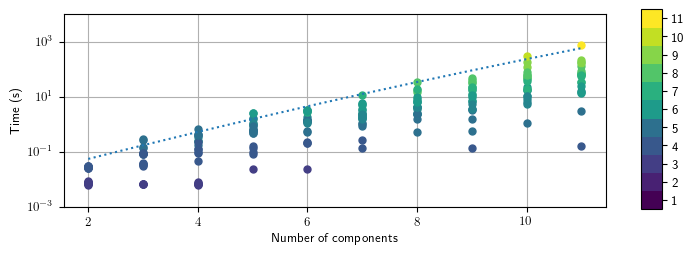

===============
Troubleshooting
===============

Most Lcapy problems are due to symbol assumptions and approximation of floating point values as rational numbers.  If you want to report a bug, see :ref:`issues`.  If you would like to debug the problem, see :ref:`debugging`.

Common problems
===============

Variable names
--------------

SymPy does not allow symbol names that are Python keywords.  For example, `expr('is(t)')` fails.  A workaround is to use an underscore in the name, for example, `expr('i_s(t)')`.

.. _floating-point:

Floating point values
---------------------

Floating point numbers are an extremely poor approximation of real numbers; rational numbers are slightly better and this is what Lcapy uses to help with expression simplification.  However, there is a loss of precision when converting a floating point number to a rational number.  For example, consider::

   >>> 2 / 3
   3333333333333333
   ────────────────
   5000000000000000

In this case, Python evaluates 2 / 3 as a floating point number which is then converted to a rational number.  Unfortunately, this is not quite the same as 2 / 3.   The approximation can be avoided by bypassing the conversion of 2 / 3 to 0.666666666666, say by using:

   >>> expr('2 / 3')
   2/3

Another approach is to use:
 
   >>> one * 2 / 3
   2/3

Here `one` is a SymPy object representing the number 1.

    
.. _equality:
    

Equality
--------

For equality Lcapy requires expressions to have the same domain and quantity.  There are some exceptions to the domain requirement when comparing constants.  However, a voltage expression is not equal to a current expression.   For example::

    >>> V = voltage(7)
    >>> I = current(7)
    >>> V == I
    False
    >>> V.quantity
    'voltage'
    >>> I.quantity
    'current'    

The quantity can be removed using the `as_expr()` method.  For example::
 
   >>> V.as_expr() == I.as_expr()
   True

Even when expressions have the same domain and quantity a test for equality can fail.  This is because SymPy comparison uses structural equality, see https://docs.sympy.org/latest/gotchas.html

One way to test for equality is to subtract the expressions, simplify, and test for 0.  For example,
   >>> (x - y).simplify() == 0

However, there is no gaurantee that SymPy simplification will return 0 for equal expressions.

Symbol aliases
--------------

SymPy treats symbols with different assumptions as different symbols
even if they have the same name.  To reduce this confusion, Lcapy
assumes that symbol names are not aliased.  It achieves this by
maintaining a dictionary of defined symbols for each circuit.  However, it
is unaware of symbols created by SymPy.

Here's an example of how to access the symbols:

    >>> from lcapy import symbol
    >>> x = symbol('x')
    >>> state.context.symbols
    {'s': s,
    't': t,
    'f': f,
    'omega': omega,
    'omega_0': omega_0,
    'tau': tau,
    'x': x}

This shows the pre-defined symbols and the newly defined symbol.   Each directory entry is a SymPy symbol.    

Symbol assumptions
------------------

There can be difficulties with symbol assumptions when working with SymPy.  By default SymPy creates symbols with few assumptions, for example,

   >>> from sympy import Symbol
   >>> R1 = Symbol('R')
   >>> R1.assumptions0
   {'commutative': True}

On the other hand, by default, Lcapy assumes that symbols are positive (unless explicitly defined otherwise).  For example,

   >>> from lcapy import symbol
   >>> R2 = symbol('R')
   >>> R2.assumptions0
   {'commutative': True,
   'complex': True,
   'hermitian': True,
   'imaginary': False,
   'negative': False,
   'nonnegative': True,
   'nonpositive': False,
   'nonzero': True,
   'positive': True,
   'real': True,
   'zero': False}

Since `R1` and `R2` have different assumptions, SymPy considers them different symbols even though they are both defined with the same name `R`.

Note, every real symbol is also considered complex although with no imaginary part.  The proper way to test assumptions is to use the attributes `is_complex`, `is_real`, etc.  For example,

   >>> t.is_real
   True
   >>> t.is_complex
   False

Zero substitution
-----------------

Be careful with zero substitutions.  For example, consider
    >>> x = symbol('x')
    >>> (x * (s + 1 / x)).subs(x, 0)
    0

In general it is safer (but slower) to evaluate a limit at zero.  

    >>> x = symbol('x')
    >>> (x * (s + 1 / x)).limit(x, 0)
    1
    
Another approach is expand the expression to avoid the division:

    >>> x = symbol('x')
    >>> (x * (s + 1 / x)).expand().subs(x, 0)
    1

Computation speed
-----------------

Lcapy can be slow for large problems due to the computational complexity of the algorithms (see :ref:`performance`).  If speed is important, it is better to substitute symbolic values with numerical values.

The results from slow computations are cached to improve the speed.

Some SymPy operations can take an unexpectedly long time, for example, `limit()`.   With some versions of SymPy, matrix inversions are really slow.

Working with SymPy
------------------

Lcapy wraps many of SymPy's methods but if you know how to use SymPy, you can extract the underlying SymPy expression using the `expr` attribute of an Lcapy expression.

SymPy differences
-----------------

- SymPy defines :math:`sinc(x)` as :math:`sin(x)/x` but Lcapy (and
NumPy) defines :math:`sinc(x)` as :math:`sin(\pi x)/(\pi x)`, see
:ref:`expressionsfunctions`.

- SymPy uses 0 for the lower limit of Laplace transforms, Lcapy uses
  :math:`0^{-}`, see :ref:`laplace_transforms`.

.. _performance:   

Performance
===========

The performance of Lcapy depends on Sympy's matrix inversion and root
finding routines.  The following figure shows the time taken to
determine the open circuit voltage for twenty randomly generated
networks with a specified number of components.  Each network has a
single voltage source and a number of resistors.  The colour of the
plot denotes the matrix size; this depends how the components are
connected.  In general, symbolic matrix inversion is of order :ref:`N^3` for a matrix of size :ref:`N \times N`.

These results are for the ADJ matrix inversion algorithm.  This is
currently the default used by Lcapy since the Gaussian elimination
(GE) algorithm currently has a severe performance problem for some
matrices generated by Lcapy.  The algorithm can be selected by setting
the `matrix_inverse_method` variable, for example,

    >>> from lcapy import config
    >>> config.matrix_inverse_method = 'GE'

The ADJ, LU, LDL, and CH methods all take a similar time.  There is a
promising domain matrix approach in the development version of Sympy
that shows an order of magnitude improvement for MNA matrices
comprised of fewer than 11 components.

.. _debugging:   

Debugging
=========

schtex
------

If `schtex` crashes, rerun it with the `--pdb` option.  This will enter the Python debugger when an unhandled exception is raised.

pdb method
----------

The Python debugger (pdb) can be entered using the `pdb()` method for many Lcapy classes.   For example, the inverse Laplace transform can be debugged for the expression `1 / (s + 2)` using:

   >>> (1 / (s + 2)).pdb().ILT()

debug method
------------

Expressions have a `debug()` method that prints the representation of the expresison, including symbol assumptions.  For example,

   >>> (1 / (s + 'a')).debug()
   sExpr(Pow(Add(s: {'nonpositive': False, 'nonzero': False, 'composite': False, 'real': False, 'negative': False, 'even': False, 'odd': False, 'prime': False, 'positive': False, 'nonnegative': False, 'integer': False, 'commutative': True, 'rational': False, 'zero': False, 'irrational': False}, a: {'nonpositive': False, 'extended_nonpositive': False, 'hermitian': True, 'extended_positive': True, 'real': True, 'imaginary': False, 'negative': False, 'extended_real': True, 'infinite': False, 'extended_negative': False, 'extended_nonnegative': True, 'positive': True, 'nonnegative': True, 'extended_nonzero': True, 'finite': True, 'commutative': True, 'zero': False, 'complex': True, 'nonzero': True}), -1)

Testing
=======

If you fix a problem, please add a test in `lcapy/lcapy/tests`.  These use the nose format, see https://pythontesting.net/framework/nose/nose-introduction/  The tests can be run using:

.. code-block:: console
                
    $ make check

Specific tests can be run using:

.. code-block:: console

    $ nosetests3 --pdb lcapy/tests/test_laplace.py 

With the --pdb option, the Python debugger is entered on failure:
    

To check for coverage use:

.. code-block:: console

    $ make cover

and then view cover/index.html in a web browser.
    

.. _issues:

Issue reporting
===============

If Lcapy crashes or returns an incorrect value please create an issue at https://github.com/mph-/lcapy/issues.

Please attach the output from running::

    >>> from lcapy import show_versions
    >>> show_versions()
    
   
