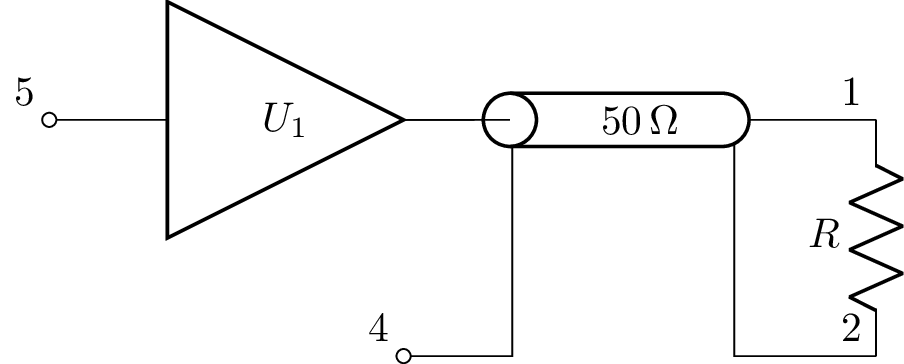
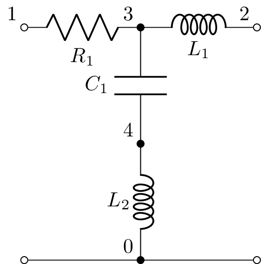
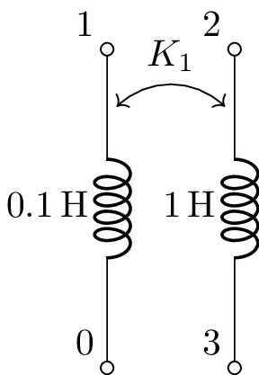

.. _schematics:

==========
Schematics
==========

Introduction
============

High quality schematics can be generated from a netlist using
Circuitikz for LaTeX diagrams.  This is much easier than writing
Circuitikz commands directly in LaTeX.

A semi-automatic component placement is used with hints required to
designate component orientation and explicit wires to link nodes of
the same potential but with different coordinates.

Here's an example:
   >>> from lcapy import Circuit
   >>> cct = Circuit()
   >>> cct.add('V 1 0 {V(s)}; down') 
   >>> cct.add('R 1 2; right') 
   >>> cct.add('C 2 0_2; down') 
   >>> cct.add('W 0 0_2; right') 
   >>> cct.draw('schematic.pdf')

Note, the orientation hints are appended to the netlist strings with a
semicolon delimiter.  The drawing direction is with respect to the
first node.  The component W is a wire.  Nodes with an underscore in
their name are not drawn with a closed blob.

The image generated by this netlist is:

.. image:: examples/schematics/schematic.png
   :width: 4cm

Here's another example, this time loading the netlist from a file:
   >>> from lcapy import Circuit
   >>> cct = Circuit('voltage-divider.sch')
   >>> cct.draw('voltage-divider.pdf')

Here are the contents of the file 'voltage-divider.sch'::

   Vi 1 0_1; down
   R1 1 2; right, size=1.5
   R2 2 0; down
   P1 2_2 0_2; down, v=V_o
   W 2 2_2; right
   W 0_1 0; right
   W 0 0_2; right

Here, P1 defines a port.  This is shown as a pair of open blobs.  The
wires do not need unique names.

.. image:: examples/schematics/voltage-divider.png
   :width: 5cm

File formats
============

Lcapy uses the filename extension to determine the file format to
produce.  This must be one of tex, pytes, png, svg, or pdf.  The pytex
format is useful for including schematics into LaTeX documents.  The
tex format generates a standalone LaTeX file.  If no filename is
specified, the schematic is displayed on the screen.

Component orientation
=====================

Lcapy uses a semi-automated component layout.  Each component requires
a specified orientation: up, down, left, or right.  In addition,
attributes can be added to override color, size, etc.

The drawing direction provides a constraint.  For example, the nodes
of components with a vertical orientation have the same x coordinate,
whereas nodes of horizontal components have the same y coordinate.

The component orientation is specified by a rotation angle.  This
angle is degrees anticlockwise with zero degrees being along the
positive x axis.  For example,

   >>> cct.add('D1 1 2; rotate=45')

The component orientation can also be specified by a direction keyword: 

- right (0 degrees)

- left  (180 degrees)

- up    (90 degrees)

- down  (-90 degrees)

For example:

.. literalinclude:: examples/schematics/Dright.sch

.. image:: examples/schematics/Dright.png
   :width: 2.5cm

.. literalinclude:: examples/schematics/Ddown.sch

.. image:: examples/schematics/Ddown.png
   :width: 1.5cm

Note, the drawing direction is from the positive node to the negative
node.

Here's an example of how to draw a diode bridge:

.. literalinclude:: examples/schematics/Dbridge.sch

.. image:: examples/schematics/Dbridge.png
   :width: 4cm

Components can be mirrored about the x-axis using the mirror
attribute.  For example, to switch the order of the inverting and
non-inverting inputs of an opamp use:

   >>> cct.add('E1 1 2 opamp 3 0; right, mirror')

Component size
==============

By default each component has a minimum size of 1. This can be
stretched to satisfy a node constraint.  The minimum size is specified
using the size keyword, for example:

   >>> cct.add('R1 1 2; right, size=2')

The size argument is used as a scale factor for the component node
spacing.

.. literalinclude:: examples/schematics/resistors1.sch

.. image:: examples/schematics/resistors1.png
   :width: 12cm

By default, a component with size 1 has its nodes spaced by 2 units.
This can be changed using the `node_spacing` option of the schematic.
For example,

.. literalinclude:: examples/schematics/resistors2.sch

.. image:: examples/schematics/resistors2.png
   :width: 12cm

Be default, a component has a length of 1.5 units.  This can be
changed using the `cpt_size` option of the schematic.  For example,

.. literalinclude:: examples/schematics/resistors3.sch

.. image:: examples/schematics/resistors3.png
   :width: 12cm

.. literalinclude:: examples/schematics/resistors4.sch

.. image:: examples/schematics/resistors4.png
   :width: 12cm

The overall schematic can be scaled with the `scale` option of the schematic:

.. literalinclude:: examples/schematics/resistors5.sch

.. image:: examples/schematics/resistors5.png
   :width: 5cm

Colors
======

By default the components are drawn in black.  This can be overridden
with the color attribute, for example:

   >>> cct.add('R1 1 2; right, color=blue')

Labels
======

Each component has a component identifier label and a value label.
These can be augmented by explicit voltage and current labels.

- i=label -- annotate current through component with label
 
- v=label -- annotate voltage across component with label

- l=label -- component label

The label name is displayed using LaTeX math mode, so superscripts and
subscripts can be employed.  For example,

>>> cct.add('R1 1 2; right, i=$I_1$, v=$V_{R_1}$')

The label position, current and voltage direction can be controlled
with attributes _ ^ < and >, for example i^<=I_1.  See the Circuitikz
manual for details.

By default, if a component has a value label it is displayed,
otherwise the component identifier is displayed.  Both can be
displayed using:

    >>> cct.draw(label_ids=True, label_values=True)

Schematic options are separated using a comma.  If you need a comma,
say in a label, enclose the field in braces.  For example:

    >>> C1 1 0 100e-12;down, size=1.5, v={5\,kV}

Math-mode labels need to be enclosed in `$...$`.  There is an
experimental feature that is activated when the label starts with a
single `$`.  In this case, Lcapy tries to generate a nice LaTeX label.
For example, words in sub- and superscripts are converted into a roman
font using `mathrm`.  This feature is also activated if the label is
not enclosed in `$...$` but includes an `^` or `_`.

Nodes
=====

Nodes are shown by a blob.  By default, only the primary nodes (those
without an underscore in them) are shown by default.  This is
equivalent to:

    >>> cct.draw(draw_nodes='primary')

All nodes can be drawn using:

    >>> cct.draw(draw_nodes='all')

Only the nodes where there are more than two branches can be drawn using:

    >>> cct.draw(draw_nodes='connections')

No nodes can be drawn using:

    >>> cct.draw(draw_nodes=False)

By default, only the primary nodes are labelled.  All nodes can be
labelled (this is useful for debugging) using:

    >>> cct.draw(label_nodes='all')

No nodes can be labelled using:

    >>> cct.draw(label_nodes=False)

Only nodes starting with a letter can be labelled using:

    >>> cct.draw(label_nodes='alpha')

In this case nodes with names such as `in` and `out` will be displayed
but not numeric node names.

These options can be stored with the schematic netlist, for example,::

  C1 1 0 100e-12; down, size=1.5, v={5\,kV}
  R1 1 6 1500; right
  R2 2 4 1e12; down
  C2 3 5 5e-9; down
  W 2 3; right
  W 0 4; right
  W 4 5; right
  SW 6 2 no; right, l=, size=1.5
  ; draw_nodes=connections, label_nodes=False, label_ids=False

Diodes and transistors
======================

Non-linear components such as diodes and transistors can be drawn (but
not analyzed).  A standard diode is described using:

     Dname Np Nm

Other diodes are specified with an additional argument:

     Dname Np Nm schottky|led|zener|tunnel|photo 

Here's an example:

.. literalinclude:: examples/schematics/diodes.sch

.. image:: examples/schematics/diodes.png
   :width: 10cm

Transistors (BJT, JFET, and MOSFET) can also be drawn but not analyzed.  Both
are added to the netlist using a syntax similar to that of SPICE.  A BJT
is described using:
    
     Qname NC NB NE npn|pnp

where NC, NB, and NE denote the collector, base, and emitter nodes.
A MOSFET is described using:

     Mname ND NG NS nmos|pmos

where ND, NG, and NS denote the drain, gate, and source nodes.

A JFET is described using:

     Jname ND NG NS njf|pjf

where ND, NG, and NS denote the drain, gate, and source nodes.

Here's an example:

.. literalinclude:: examples/schematics/transistors.sch

.. image:: examples/schematics/transistors.png
   :width: 16cm

Switches
========

Switches can be drawn but they are ignored for analysis since they
make the circuit time-varying.

The general format is:

     SWname Np Nm nc|no|push

Here's an example:

.. literalinclude:: examples/schematics/switches.sch

.. image:: examples/schematics/switches.png
   :width: 8cm

Opamps
======

Opamps can be drawn using the `opamp` argument to a VCCS.   For example:

.. literalinclude:: examples/schematics/opamp1.sch

.. image:: examples/schematics/opamp1.png
   :width: 5cm

The size can be controlled with the `scale` and `size` options.  The
positions of the inverting and non-inverting inputs can be flipped
with the `mirror` option.

.. literalinclude:: examples/schematics/opamp2.sch

.. image:: examples/schematics/opamp2.png
   :width: 5cm

.. literalinclude:: examples/schematics/opamp3.sch

.. image:: examples/schematics/opamp3.png
   :width: 5cm

.. literalinclude:: examples/schematics/opamp4.sch

.. image:: examples/schematics/opamp4.png
   :width: 5cm

Fully differential opamps can be drawn in a similar manner using the
fdopamp argument to a VCCS.  For example:

.. literalinclude:: examples/schematics/fdopamp1.sch

.. image:: examples/schematics/fdopamp1.png
   :width: 5cm

Transmission lines
==================

A transmission line is a two-port device.  Here's an example:

.. literalinclude:: examples/schematics/tline2.sch

Annotation
==========

Schematics can be annotated using additional tikz commands in the
netlist.  These are delimited by a line starting with two semicolons,
for example:

.. literalinclude:: examples/schematics/fit1.sch

This example draws dashed boxes around the nodes 0, 1, and 6 and 2, 3,
4, and 5:

.. image:: examples/schematics/fit1.png
   :width: 7cm

Alternatively, the boxes can be fit around named components, for
example::

    ;;\node[blue,draw,dashed,inner sep=5mm, fit=(R2) (C2), label=CMOS input model]{};

Examples
========

.. literalinclude:: examples/schematics/opamp-inverting-amplifier.sch

.. image:: examples/schematics/opamp-inverting-amplifier.png
   :width: 7cm

.. literalinclude:: examples/schematics/opamp-noninverting-amplifier.sch

.. image:: examples/schematics/opamp-noninverting-amplifier.png
   :width: 7cm

.. literalinclude:: examples/schematics/opamp-inverting-integrator.sch

.. image:: examples/schematics/opamp-inverting-integrator.png
   :width: 7cm

.. literalinclude:: examples/schematics/cmos1.sch

.. image:: examples/schematics/cmos1.png
   :width: 7cm

.. literalinclude:: examples/schematics/D4.sch

.. image:: examples/schematics/D4.png
   :width: 5cm

.. literalinclude:: examples/schematics/pic6.sch

.. literalinclude:: examples/schematics/K1.sch

.. literalinclude:: examples/schematics/VRL2.sch

.. image:: examples/schematics/VRL2.png
   :width: 8cm

.. literalinclude:: examples/schematics/lpf1-buffer-loaded2.sch

.. image:: examples/schematics/lpf1-buffer-loaded2.png
   :width: 14cm

.. literalinclude:: examples/schematics/sallen-key-lpf1.sch

.. image:: examples/schematics/sallen-key-lpf1.png
   :width: 14cm

schtex.py
=========

`schtex.py` is a Python script that will generate a schematic from a
netlist file.  For example, here's how a PNG file can be generated:

   >>> schtex.py Dbridge.sch Dbridge.png

The generated stand-alone LaTeX file can be obtained using:

   >>> schtex.py Dbridge.sch Dbridge.tex

If you wish to include the schematic into a LaTeX file use:

   >>> schtex.py Dbridge.sch Dbridge.pytex

and then include the file with `\\input{Dbridge.pytex}`.

`schtex.py` has many command line options to configure the drawing.
These override the options specified in the netlist file.

Drawing tips
============

Lcapy uses a semi-automated approach to component layout.  For each
component it needs its orientation and size.  By default the size
is 1.  This is the minimum distance between its nodes (for a one-port
device).  Lcapy will increase but never decrease this distance.  

The x and y positions of nodes are computed independently using a
graph.  An error can occur if components have the wrong orientation
since this makes the graph inconsistent.  Unfortunately, it is not
trivial to find the offending component so it is best to draw a
schematic incrementally and to test it as you go.  A sketch on a piece
of paper showing the nodes is useful.

Problems occasionally occur when drawing circuits with operational
amplifiers.  This can be fixed by reducing the size of interconnect
wires and allowing Lcapy to stetch them.  Alternatively, explicitly
add short interconnecting wires that can be adjusted by Lcapy.

Grid lines can be added to a schematic using some Tikz markup.  For
example,::

   ;;\draw[help lines] (0,0) grid [xstep=0.1, ystep=0.1] (10,5);  
  
