.. _schematics:

==========
Schematics
==========

Introduction
============

Lcapy can generate high quality schematics from a netlist using the
Circuitikz LaTeX package.  This is much easier than writing Circuitikz
commands directly in LaTeX.  For the fastest way to generate a
schematic from a netlist, see :ref:`schtex`.  For a graphical user
interface, see https://github.com/mph-/lcapy-gui.

A semi-automatic component placement is used with hints required to
designate component orientation and explicit wires to link nodes of
the same potential but with different coordinates.

Here's an example:

   >>> cct = Circuit("""
   ... V 1 0 {v(t)}; down
   ... R 1 2; right=2, i=i(t)
   ... C 2 0_2; down, v=v_C(t)
   ... W 0 0_2; right
   ... ; draw_nodes=connections, label_ids=false, label_nodes=none""")
   >>> cct.draw()

Note, the orientation hints are appended to the netlist strings with a
semicolon delimiter.  The drawing direction is with respect to the
first node.  The component `W` is a wire.  Node names starting with an underscore are not shown.

The image generated by this netlist is:

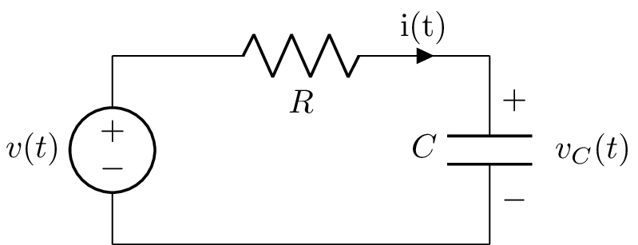

Here's an example with implicit ground connections added automatically:

   >>> cct = Circuit("""
   ... V 1 0 {v(t)}; down
   ... R 1 2; right=1.5
   ... C 2 0; down
   ... ; autoground=true, label_ids=false, draw_nodes=connections""")
   >>> cct.draw()

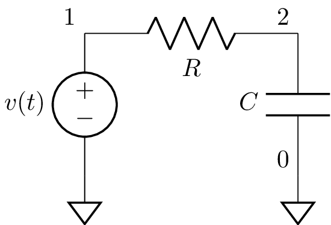

Here's another example, this time loading the netlist from a file and saving the created schematic as a PDF file:

   >>> from lcapy import Circuit
   >>> cct = Circuit('voltage-divider.sch')
   >>> cct.draw('voltage-divider.pdf')

Here are the contents of the file 'voltage-divider.sch'::

   Vi 1 0_1; down
   R1 1 2; right=1.5
   R2 2 0; down
   P1 2_2 0_2; down, v=V_o
   W 2 2_2; right
   W 0_1 0; right
   W 0 0_2; right

Here, P1 defines a port.  This is shown as a pair of open blobs.  The
wires do not need unique names.

.. image:: examples/schematics/voltage-divider.png
   :width: 6cm

Most aspects of the schematic are configurable, such as the component style,
size, spacing, and color.  Compare the following schematic with the one above.

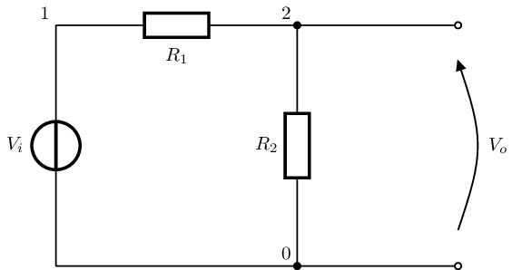

These two schematics use the same netlist but the second one has the following configuration line::

    ; draw_nodes=connections, node_spacing=3, scale=0.5, style=european, bipole label style={color=blue}

Netlists
--------

Schematics are described using the same netlist syntax as used for circuit analysis.  See :ref:`component-specification` for a list of known components.  The drawing attributes (see :ref:`attributes`) are specified after a semicolon delimiter.  For example::

    R1 1 2; right=2, color=blue

This defines a resistor between nodes 1 and 2 drawn in blue to the right with length 2.

Component orientation
---------------------

Lcapy uses a semi-automated component layout.  Each component requires
a specified orientation: up, down, left, right.  In addition,
attributes can be added to override color, size, etc.

The drawing direction provides a constraint.  For example, the nodes
of components with a vertical orientation have the same x coordinate,
whereas nodes of horizontal components have the same y coordinate.

The component orientation can be specified by a direction attribute.  Note, this rotates the component:

- right (0 degrees)

- left  (180 degrees)

- up    (90 degrees)

- down  (-90 degrees)

For example:

.. literalinclude:: examples/schematics/Dright.sch

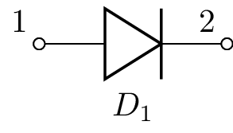

.. literalinclude:: examples/schematics/Ddown.sch

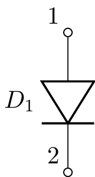

Note, the drawing direction is from the positive node to the negative
node.  For example,

.. literalinclude:: examples/schematics/voltage_sources.sch

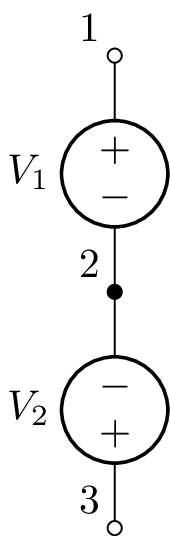

The component orientation is also specified by a rotation angle.  This
angle is degrees anticlockwise with zero degrees being along the
positive x axis.  For example,

   >>> cct.add('D1 1 2; rotate=45')

Here's an example of how to draw a diode bridge:

.. literalinclude:: examples/schematics/Dbridge.sch

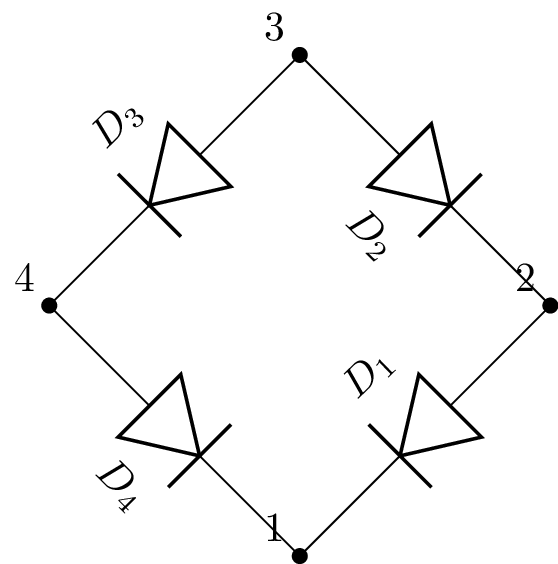

Most components can be mirrored about the x-axis using the `mirror` or
`flipud` attributes and mirrored about the y axis with the `invert` or
`fliplr` attribute.  For example, to switch the order of the inverting
and non-inverting inputs of an opamp use:

   >>> cct.add('E1 1 2 opamp 3 0; right, mirror')

Note, the mirroring is performed before rotations are applied.  Opamps also have a `mirrorinputs` option that switches the inverting and non-inverting inputs without mirroring the entire component.

Here's an example of using `invert` to mirror a D flip-flop in the y-axis, compared to rotating the flip-flop:

.. literalinclude:: examples/schematics/fliplr1.sch

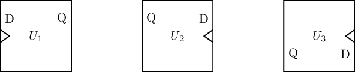

Component size
--------------

By default each component has a minimum size of 1. This can be
stretched to satisfy a node constraint.  The minimum size is specified
using the size attribute, for example:

   >>> cct.add('R1 1 2; right, size=2')

The size argument is used as a scale factor for the component node
spacing.  The size can also be specified by adding a value to the
`left`, `right`, `up`, or `down` arguments.  For example:

   >>> cct.add('R1 1 2; right=2')

Here's a comparison of resistors of different sizes.

.. literalinclude:: examples/schematics/resistors1.sch

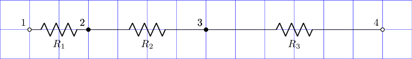

By default, a component with size 1 has its nodes spaced by 2 units.
This can be changed using the `node_spacing` option of the schematic.
For example,

.. literalinclude:: examples/schematics/resistors2.sch

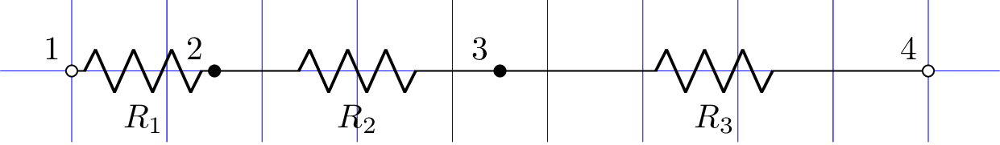

Be default, a component has a length of 1.5 units.  This can be
changed using the `cpt_size` option of the schematic.  For example,

.. literalinclude:: examples/schematics/resistors3.sch

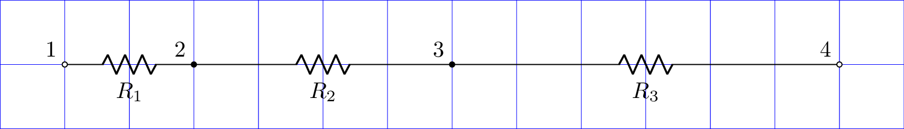

.. literalinclude:: examples/schematics/resistors4.sch

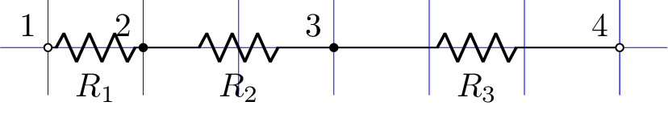

The size of components can scaled with the `scale` attribute:

.. literalinclude:: examples/schematics/resistors6.sch

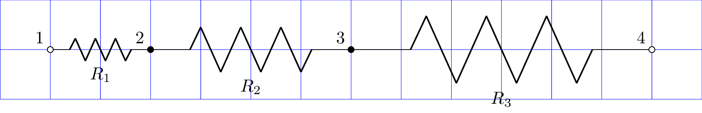

The overall schematic can be scaled with the `scale` option of the schematic:

.. literalinclude:: examples/schematics/resistors5.sch

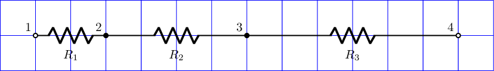

Nodes
-----

Nodes are shown by a blob.  By default, only the primary nodes (those
not starting with an underscore) are shown by default.  This is
equivalent to:

    >>> cct.draw(draw_nodes='primary')

All nodes can be drawn using:

    >>> cct.draw(draw_nodes='all')

Only the nodes where there are more than two branches can be drawn using:

    >>> cct.draw(draw_nodes='connections')

No nodes can be drawn using:

    >>> cct.draw(draw_nodes=False)

By default, only the primary nodes are labelled.  All nodes can be
labelled (this is useful for debugging) using:

    >>> cct.draw(label_nodes='all')

No nodes can be labelled using:

    >>> cct.draw(label_nodes=False)

Only nodes starting with a letter can be labelled using:

    >>> cct.draw(label_nodes='alpha')

In this case nodes with names such as `in` and `out` will be displayed
but not numeric node names.

These options can be stored with the schematic netlist, for example::

  C1 1 0 100e-12; down, size=1.5, v={5\,kV}
  R1 1 6 1500; right
  R2 2 4 1e12; down
  C2 3 5 5e-9; down
  W 2 3; right
  W 0 4; right
  W 4 5; right
  SW 6 2 no; right=1.5, l=
  ; draw_nodes=connections, label_nodes=False, label_ids=False

Node names
----------

Circuit nodes are usually identified by a number.  They can be given arbitrary names provided they do not contain a period (.).  By default, nodes with names starting with an underscore are not drawn.  The name can contain an underscore to denote a subscript or a caret to denote a superscript.  For example, `T_123`.

Node names starting with a period are a short-hand notation.  For
example::

  R1 1 .2; right
  C1 R1.2 3; right

is short-hand for::

  R1 1 R1.2; right
  C1 R1.2 3; right

Node names not starting with an underscore are considered primary nodes.
Node names starting with an underscore are considered secondary nodes (usually they are at the same potential as a primary node and do not need to be
labelled).  For backward compatibility, nodes with names that contain an underscore and start with a digit are considered secondary.

Node names can also refer to pins of shape and chip components.  For example::

  U1 regulator; right
  W  1 U1.in; right
  W  U1.gnd 0; down

.. _schematic-components:

Components
==========

Only linear, time-invariant, components can be analyzed by Lcapy.  For a list of these, see :ref:`component-specification`.  However, many others can be drawn.

Antennas
--------

.. literalinclude:: examples/schematics/antennas.sch

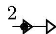

Batteries
---------

.. literalinclude:: examples/schematics/batteries.sch

.. image:: examples/schematics/batteries.png
   :width: 4cm

.. _blocks:

Blocks
------

.. literalinclude:: examples/schematics/blocks.sch

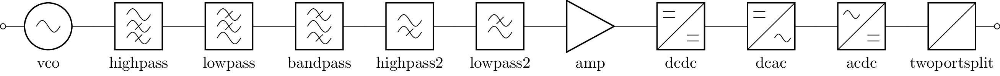

.. literalinclude:: examples/schematics/blocks2.sch

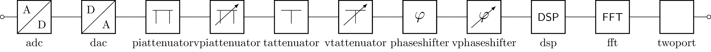

Note, the block names match those used by Circuitikz.

Capacitors
----------

.. literalinclude:: examples/schematics/capacitors.sch

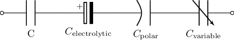

Constant phase elements (CPE)
-----------------------------

.. literalinclude:: examples/schematics/CPE1.sch

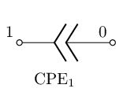

Crystals
--------

.. literalinclude:: examples/schematics/XT1.sch

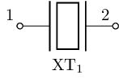

Diodes
------

Diodes can be drawn but not simulated.   A standard diode is described using:

     Dname Np Nm

Different kinds of diodes can be specified by the `kind` option, for example,

.. literalinclude:: examples/schematics/diodes.sch

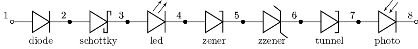

The drawn style is controlled by the style option, for example,

.. literalinclude:: examples/schematics/diodes2.sch

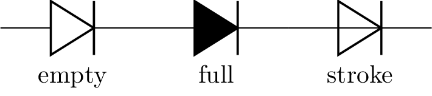

Ferrite beads
-------------

.. literalinclude:: examples/schematics/FB1.sch

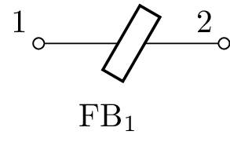

Gyrators
--------

.. literalinclude:: examples/schematics/GY1.sch

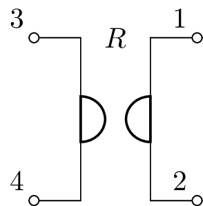

Inductors and chokes
--------------------

.. literalinclude:: examples/schematics/inductors.sch

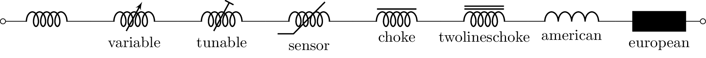

.. _chips:
.. _integrated_circuits:

Integrated circuits
-------------------

ICs can be drawn but not simulated.  Here's an example:

.. literalinclude:: examples/schematics/ic1.sch

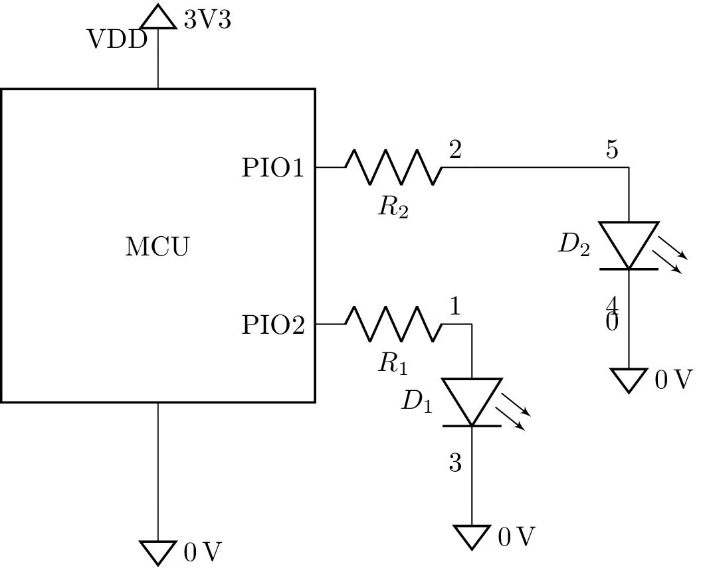

In this example, the `chip2121` keyword specifies a block with two
pins on the left, one on the bottom, two on the right, and one at the
top.  The component has pre-defined pinnames, `l1`, `l2`, `vss`, `r2`,
`r1`, and `vdd`; these can be modified.  Since the pin names start
with a dot the associated node names are prefixed by the name of the
chip, for example, `U1.out1`.

The supported chips are:
 - `chip1313`
 - `chip2121`
 - `chip2222`
 - `chip3131`
 - `chip3333`
 - `chip4141`
 - `buffer`
 - `inverter`
 - `regulator`
 - `adc`
 - `dac`
 - `dff`
 - `jkff`
 - `rslatch`
 - `fdopamp`
 - `inamp`
 - `isoamp`
 - `opamp`
 - `mux21`
 - `mux41`
 - `mux42`
 - `diffdriver`
 - `diffamp`

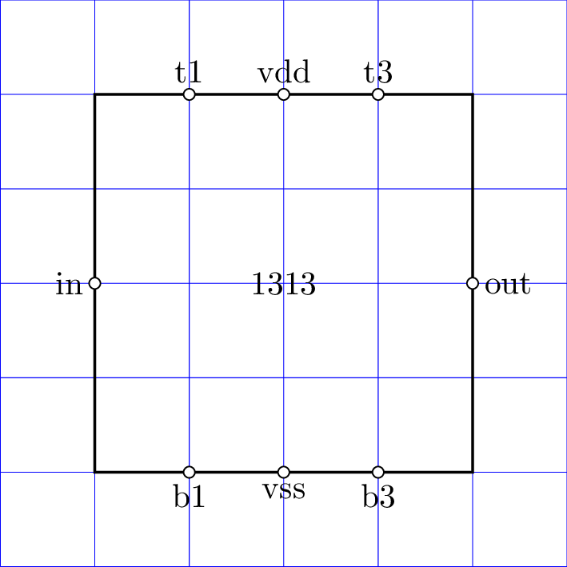

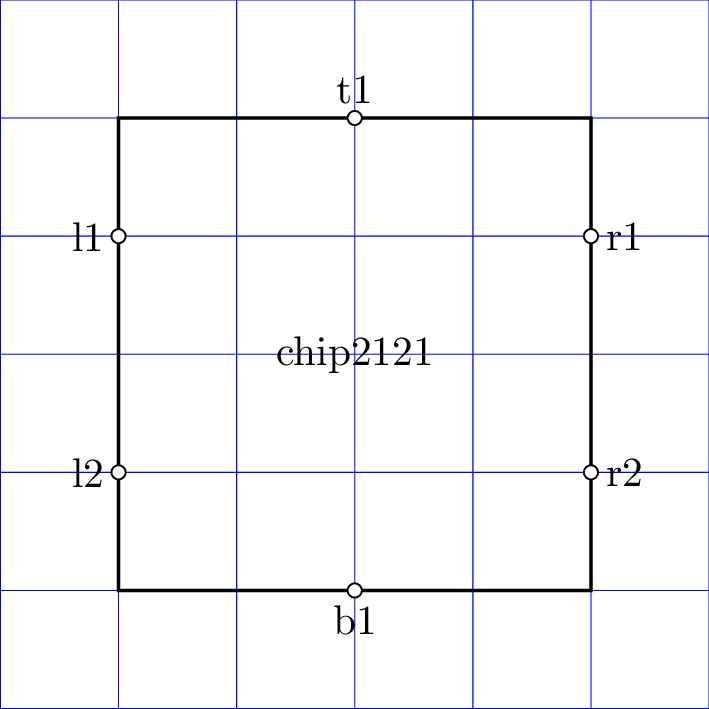

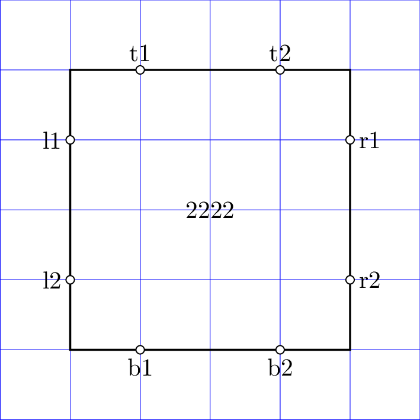

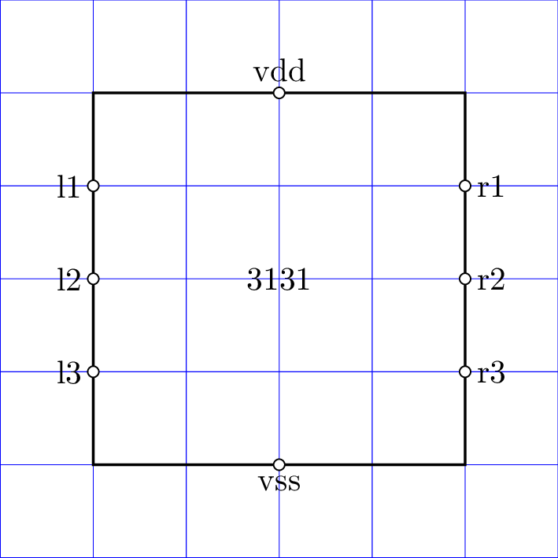

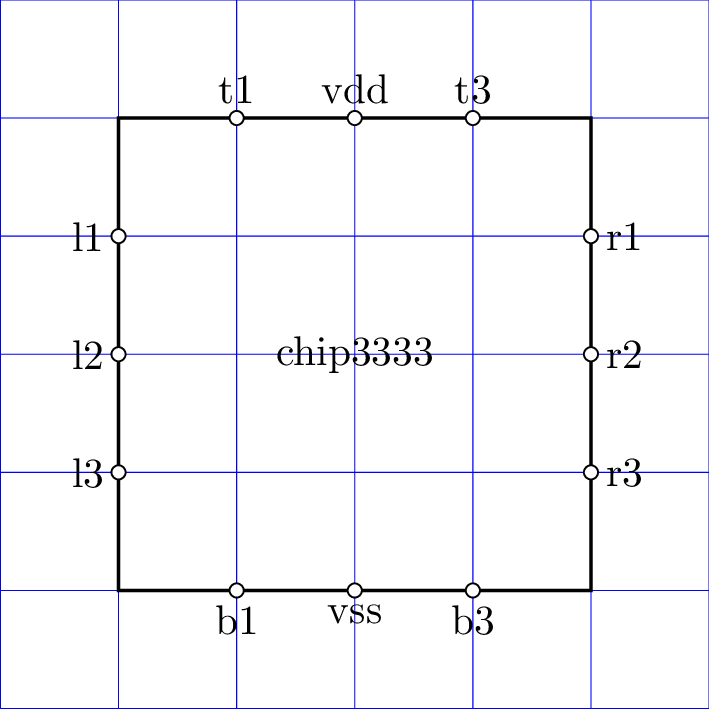

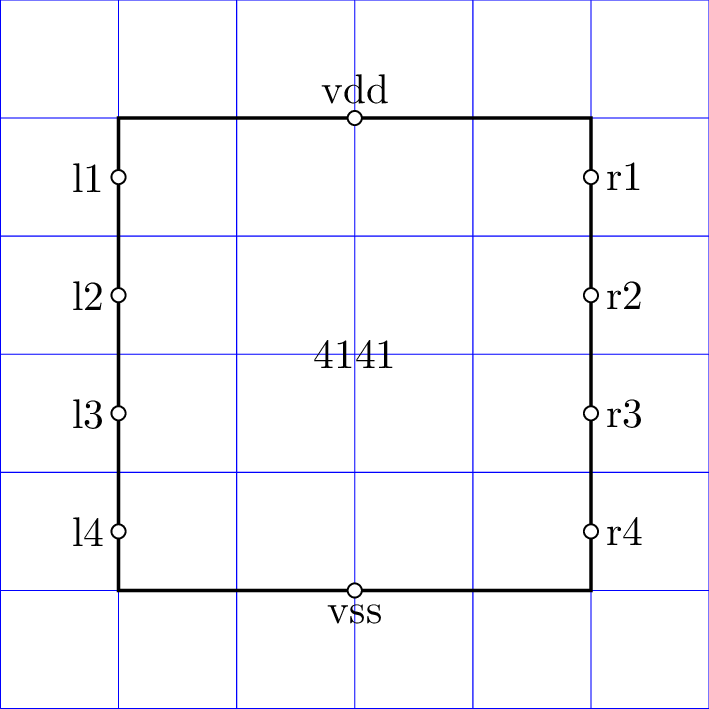

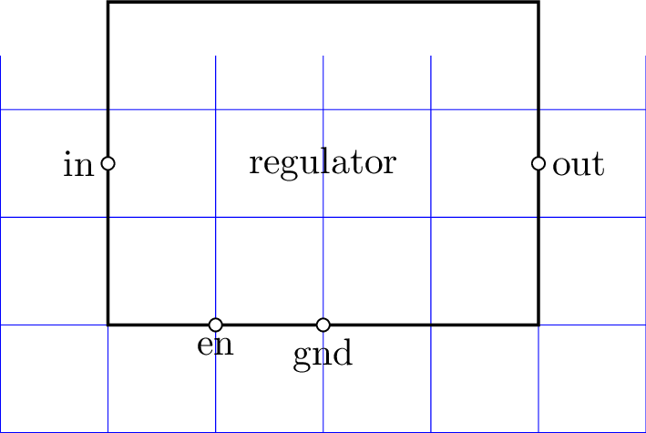

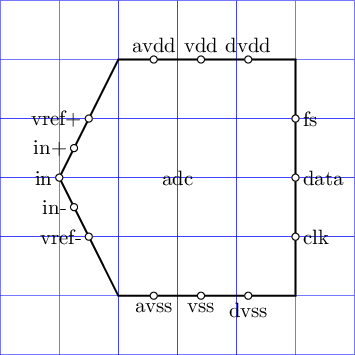

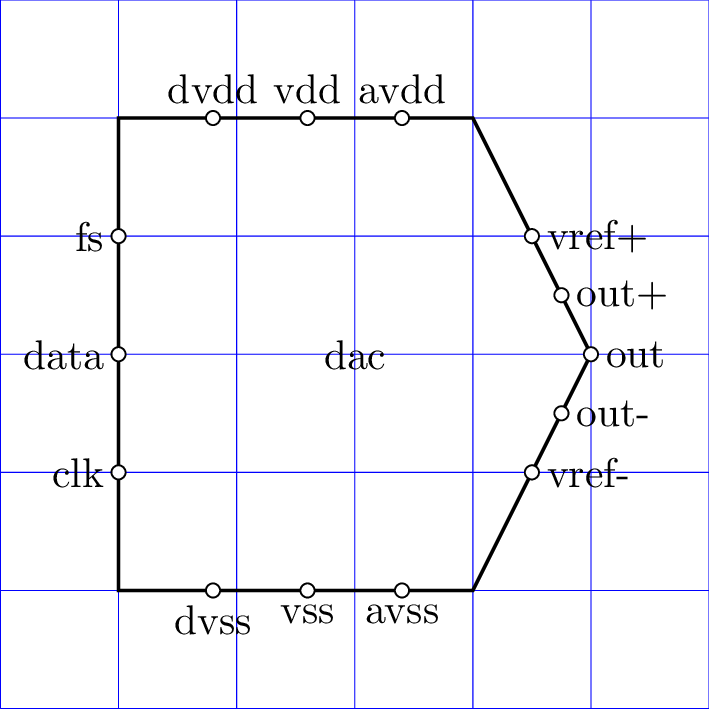

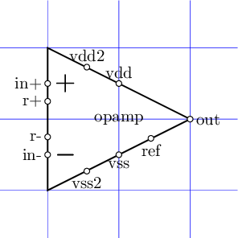

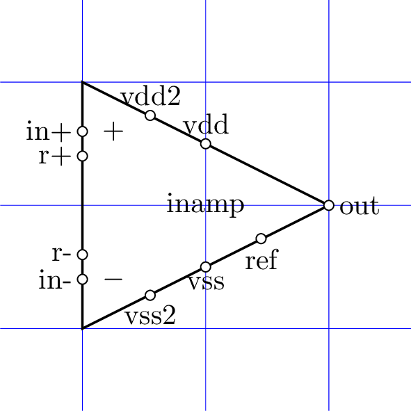

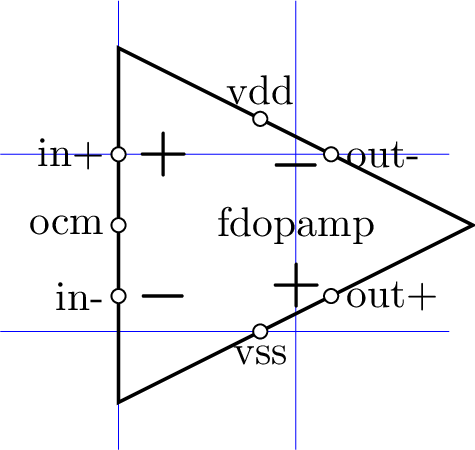

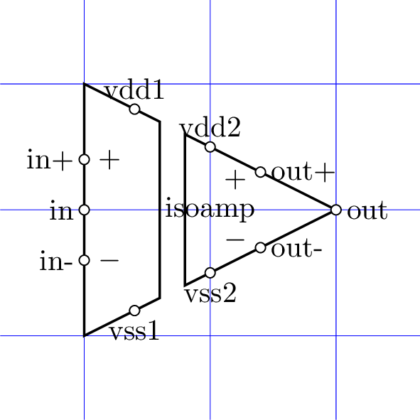

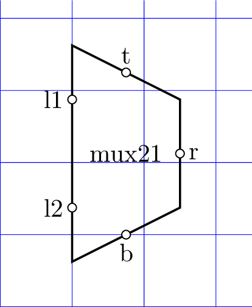

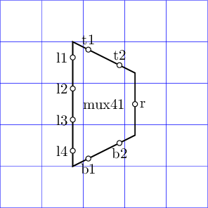

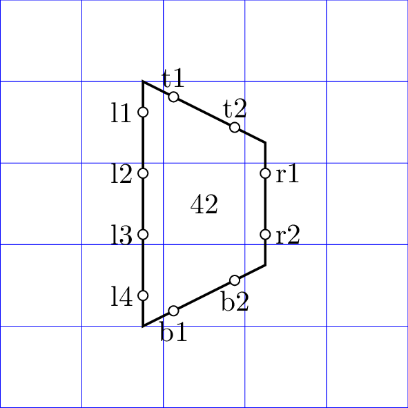

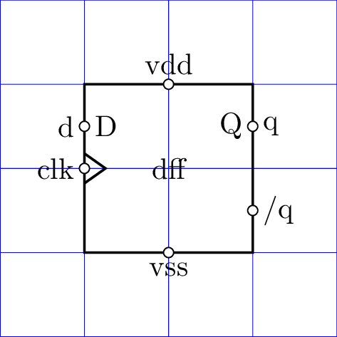

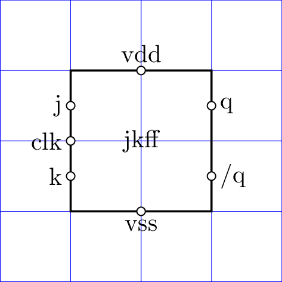

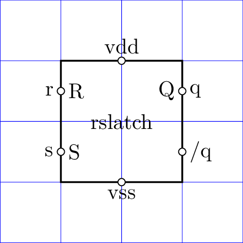

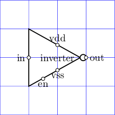

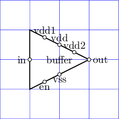

Chips are subclassed from the shape class and thus the pins can be
labelled, renamed, etc.  For example:

.. literalinclude:: examples/schematics/pindefs1.sch

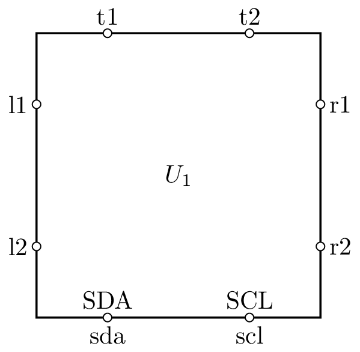

Meters
------

Here's an example using a voltmeter and an ammeter:

.. literalinclude:: examples/schematics/meters2.sch

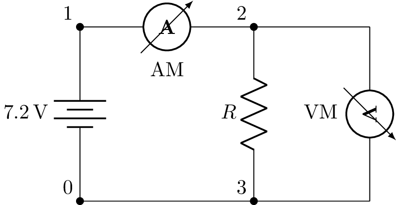

Miscellaneous components
------------------------

Miscellaneous Circuitikz bipole components can be drawn using a `MISC`
component.  For example,

.. literalinclude:: examples/schematics/misc.sch

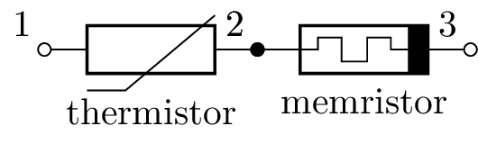

See the `Circuitikz manual <https://texdoc.org/serve/circuitikz/0>`_ for bipole components that can be drawn.

Opamps
------

Opamps can be drawn using the `opamp` argument to a VCCS.   For example:

.. literalinclude:: examples/schematics/opamp1.sch


The size can be controlled with the `scale` and `size` options.  The
positions of the inverting and non-inverting inputs can be flipped
with the `mirror` option.

.. literalinclude:: examples/schematics/opamp2.sch


.. literalinclude:: examples/schematics/opamp3.sch


.. literalinclude:: examples/schematics/opamp4.sch


Fully differential opamps and instrumentation amplifiers can be drawn
in a similar manner using the fdopamp or inamp argument to a VCCS.  For
example:

.. literalinclude:: examples/schematics/fdopamp1.sch


.. literalinclude:: examples/schematics/inamp1.sch


Opamps and fully differential opamps have additional pins that can be connected:


Opamps, fully differential opamps, and instrumentation amplifiers can
also be drawn without the wires using the integrated circuit syntax.
However, these cannot be analysed electrically.  For example:

.. literalinclude:: examples/schematics/Uopamp1.sch


Here are the named connections:


Potentiometers
--------------

.. literalinclude:: examples/schematics/RV1.sch


Alternatively, a variable resistor can be defined using:

.. literalinclude:: examples/schematics/RV2.sch


Reluctances
-----------

.. literalinclude:: examples/schematics/reluctance.sch


Resistors
----------

.. literalinclude:: examples/schematics/resistors.sch


Switches
--------

Switches can be drawn but they are ignored for analysis since they
make the circuit time-varying.

The general format is:

     SWname Np Nm nc|no|push

Here's an example:

.. literalinclude:: examples/schematics/switches.sch


Switches can be mirrored and inverted, for example:

.. literalinclude:: examples/schematics/switches2.sch


Transformers
------------

.. literalinclude:: examples/schematics/TF1.sch


.. literalinclude:: examples/schematics/TFcore1.sch


.. literalinclude:: examples/schematics/TFtap1.sch


.. literalinclude:: examples/schematics/TFtapcore1.sch


Transistors
-----------

Transistors (BJT, JFET, and MOSFET) can be drawn but not analyzed.  Both
are added to the netlist using a syntax similar to that of SPICE.  A BJT
is described using:

     Qname NC NB NE npn|pnp

where NC, NB, and NE denote the collector, base, and emitter nodes.
A MOSFET is described using:

     Mname ND NG NS nmos|pmos

where ND, NG, and NS denote the drain, gate, and source nodes.

A JFET is described using:

     Jname ND NG NS njf|pjf

where ND, NG, and NS denote the drain, gate, and source nodes.

Here's an example:

.. literalinclude:: examples/schematics/transistors.sch


The transistors can be flipped up-down with the `mirror` attribute and left-right with the `invert` attribute, for example:

.. literalinclude:: examples/schematics/transistors2.sch


There are many variants of transistor that can be selected with the `kind` attribute.  For example,

.. literalinclude:: examples/schematics/transistors3.sch


There are several kinds of bipolar transistor:

- `nigbt`, `pigbt` n- and p-type L-shaped insulated gate bipolar transistor

- `Lnigbt`, `Lpigbt` n- and p-type L-shaped insulated gate bipolar transistor

There are many kinds of MOSFET:

- `nmos`, `pmos` simplified form of n- and p-channel enhancement mode MOSFETS

- `nmosd`, `pmosd` simplified form of n- and p-channel depletion mode MOSFETS

- `nfet`, `pfet` n- and p-channel enhancement mode MOSFETS

- `nfetd`, `pfetd`  n- and p-channel depletion mode MOSFETS

- `nigfete`, `pigfete` n- and p-channel enhancement mode MOSFETS with insulated gate

- `nigfetd`, `pigfetd`  n- and p-channel depletion mode MOSFETS with insulated gate

- `nigfetbulk`, `pigfetbulk`

- `hemt` high-electron mobility transistor

Bipolar transistors have the following attributes:

- `bodydiode`

- `schottky base`

MOSFET transistors have the following attributes:

- `bodydiode`

- `arrow`

- `ferroel gate` ferroelectric gate

See the `Circuitikz manual <https://texdoc.org/serve/circuitikz/0>`_ for the various attributes that can be applied to transistors.

Transmission lines
------------------

A transmission line is a two-port device.  Here's an example:

.. literalinclude:: examples/schematics/tline3.sch


The ground wires can be removed using the `nowires` attribute:

.. literalinclude:: examples/schematics/tline5.sch


For more generic transmission lines see :ref:`cables`.

Mechanical components
---------------------

Springs, dampers (dashpots), and masses are oneport components for modelling mechanical systems, for example,

.. literalinclude:: examples/schematics/massspringdamper1.sch


Wires
=====

Wires are useful for schematic formatting, for example,

   W 1 2; right

Here an anonymous wire is created since it has no identifier.

The line style of wires can be changed, such as dashed or dotted (see
:ref:`linestyles`).

Wires can be implicitly added using the `offset` attribute.  Here's an
example to draw two parallel resistors:

.. literalinclude:: examples/schematics/parallel.sch


Stepped wires
-------------

Stepped wires can be drawn using the `steps` attribute.  For example:

.. literalinclude:: examples/schematics/steppedwire1.sch


.. literalinclude:: examples/schematics/steppedwire2.sch


In these examples, the `free` attribute is used so that the wire places no constraints on the node positions.   Thus the `size` and `rotate` attributes are ignored.   The open-circuit component is used to fix the node locations.

The `-` character represents a horizontal step and the `|` character represents a vertical step.   The shape of the line is controlled by the step pattern.  For example `--|-` represents two steps horizontally, one step vertically, and then one step horizontally.  A number before the `-` or `|` symbol specifies the number of repeats of the step.  For example, `steps=-4|-` is equivalent to `steps=-||||-`.

If the step pattern is not specified, a default step pattern `-|` is chosen if the horizontal extent is longer than the vertical extent and `|-` is chosen otherwise.  For example,

.. literalinclude:: examples/schematics/steppedwire0.sch


Arrows
------

Arrows can be drawn on wires using the `startarrow` and `endarrow` attributes.
There are many arrow styles, see the `Tikz manual <https://pgf-tikz.github.io/pgf/pgfmanual.pdf>`_.  For example,

.. literalinclude:: examples/schematics/arrows.sch


.. _autoground:

Autoground
----------

If `autoground` set to `True` then implicit ground connections are
automatically added for all the ground, `0`, nodes.  The type of
ground connection can be specified, for example:

.. literalinclude:: examples/schematics/autoground1.sch


.. _implicit_connections:

Implicit connections
--------------------

Implicit connections are commonly employed for power supply and ground
connections.  They have one of the following attributes:

- `implicit` equivalent to signal ground
- `sground`  signal ground
- `ground`   earth ground
- `cground`  chassis ground
- `nground`  noiseless ground
- `pground`  protected ground
- `rground`  reference ground
- `0V`       ground
- `vcc`      positive power supply (voltage to collectors)
- `vdd`      positive power supply (voltage to drains ;-)
- `vee`      negative power supply (voltage to emitters)
- `vss`      negative power supply (voltage to sources)

Implicit connections can be added to any oneport netlist component (resistor,
capacitor, wire, etc.), for example:

.. literalinclude:: examples/schematics/implicit2.sch


The first node is considered the implicit wire for `vcc` and `vdd` otherwise it is the last node.  The node can also be specified, for example:

.. literalinclude:: examples/schematics/implicit3.sch


In this example, the MOSFET has three nodes: `d` (drain), `g` (gate),
and `s` (source).  The resistor has two nodes: `p` (positive) and `n`
(negative).

Here are some ground examples:

.. literalinclude:: examples/schematics/grounds.sch


Here are some power supply examples:

.. literalinclude:: examples/schematics/supplies.sch


.. _signal_connections:

Signal connections
------------------

These are similar to implicit power connections but are useful for denoting an off-sheet connection or an IC pin.   They have one of the attributes:

- `input`   input connection
- `output`  output connection
- `bidir`   bidirectional connection
- `pad`     generic connection

For example:

.. literalinclude:: examples/schematics/connections1.sch


The sizes of the pads can be controlled with the `width` and `aspect`
attributes.

For example:

.. literalinclude:: examples/schematics/connections2.sch


.. _cables:

Cables
======

The kind of cable is specified with the `kind` attribute.  This can be
`coax`, `twinax`, `twistedpair`, `shieldedtwistedpair`, or `tline`
(transmission line).  The default is `coax`.  Note, this component is
experimental and the syntax may change.


Here are some examples:

.. literalinclude:: examples/schematics/cable-coax.sch


.. literalinclude:: examples/schematics/cable-twinax.sch


.. literalinclude:: examples/schematics/cable-tp.sch


.. literalinclude:: examples/schematics/cable-utp.sch


.. literalinclude:: examples/schematics/cable-tline.sch


.. literalinclude:: examples/schematics/guard1.sch


Block diagrams
==============

Block diagrams can be constructed with the following components:
 - `BL` -- block (see :ref:`blocks`)
 - `TF` -- transfer function
 - `SPpp`, `SPpm`, `SPppp`, `SPpmm`, `SPppm` -- summing points
 - `MX` -- mixer
 - `box` -- rectangular box
 - `circle` -- circle (or ellipse)

Here's an example showing negative feedback:

.. literalinclude:: examples/schematics/negative-feedback3.sch


Here's a more complicated example for a causal system:

.. literalinclude:: examples/schematics/LTFT.sch


Summing points
--------------

There are a number of summing point varieties: `SPpp`, `SPpm`,
`SPppp`, `SPpmm`, `SPppm`.  The `p` suffix stands for plus, the `m`
suffix stands for minus.  The other variations can be generated using
the `mirror` attribute.

Here's an example:

.. literalinclude:: examples/schematics/SP4.sch


Mixers
------

Here's a example of a mixer:

.. literalinclude:: examples/schematics/MX1.sch


Shapes
------

Shapes include `box`, `circle`, `ellipse`, and `triangle`.

`box`, `circle`, `ellipse`, and `triangle` shapes have connection pins
based on the centre (`c`) and sixteen directions of the compass:
`n`, `nne`, `ne`, `ene`, `e`, `ese`, `se`, `sse`, `s`, `ssw`, `sw`,
`wsw`, `w`, `wnw`, `nw`, `nww`.   For other rectangular shapes see :ref:`chips`.


.. image:: examples/schematics/Scircle2.png
   :width: 5cm


The aspect ratio of `box`, `circle`, and `triangle` can be controlled
with the `aspect` attribute.

Here's an example of their use:

.. literalinclude:: examples/schematics/fir5.sch


`triangle` is an equilateral triangle.  Its shape can be changed with the `aspect` attribute.   It has connection pins `n`, `e`, `s`, `w`, `c`, `c1`, `c2`, `c3`.

The label of a shape can be replaced by an image, using the `image` attribute.  For example,

.. literalinclude:: examples/schematics/image1.sch

The image file can be of any format supported by the LaTeX `\\includegraphics` macro (such as .pdf, .png, .jpg, etc) or a file that can be processed by LaTeX with the `\\input` macro (such as .pgf, .tex, .schtex).

Each shape or chip have the following connection pins:

`tl` (top left)

`tr` (top right)

`bl` (bottom left)

`br` (bottom right)

`mid` (middle)

In addition, there are component specific connection pins.  Associated
with each pin is an optional label.

The `pinlabels` option can be specified as:
 - `all` : the labels for all the pins are shown
 - `connected` : the labels for all the connected pins are shown
 - `default` : the default labels are shown (default)
 - `none` : none of the labels are shown
 - `{pin1:label1, pin2:label2, ...}`: the labels are specified for the named pins.

The names of the pins can be drawn using the `pinnames` option.  This has a syntax:
 - `all` : the pin names for all the pins are shown
 - `connected` : the pin names for all the connected pins are shown
 - `none` : none of the pin names are shown (default)
 - `{pin1, pin2, ...}` : the specified pin names are shown.

The nodes of the pins can be drawn using the `pinnodes` option.  This has a syntax:
 - `all` : the pin nodes for all the pins are shown
 - `connected` : the pin nodes for all the connected pins are shown
 - `none` : none of the pin nodes are shown (default)
 - `{pin1, pin2, ...}` : the specified pin nodes are shown.

The pin names can be redefined by the `pindefs` option.  This has a syntax:
  - `pindefs={new1=old1, new2=old2, ...}`

Styles
======

Three component styles are supported: `american` (default), `british`, and
`european`.  The style is set by a style argument to the `draw` method.  For example::

  >>> cct.draw(style='european')

Alternatively the style can specified by a schematic option.  For example:

.. literalinclude:: examples/schematics/lpf1-buffer-loaded3.sch


Colors
------

By default the components are drawn in black.  This can be overridden
with the color attribute, for example:

   >>> cct.add('R1 1 2; right, color=blue')

Colors can be specified many ways, see https://en.wikibooks.org/wiki/LaTeX/Colors and https://latexcolor.com/.

Here are some examples using the `fill` attribute:


Shading can be performed using the `top color` and `bottom color`
attributes, see the `Tikz manual <https://pgf-tikz.github.io/pgf/pgfmanual.pdf>`_.

.. _linestyles:

Line styles
-----------

The line style of wires can be changed using the Tikz attributes, `dashed`, `dotted`, `thick`, `ultra thick`, `line width`, `densely dotted`, `loosely dashed` and many others.  For example,

.. literalinclude:: examples/schematics/wirestyles.sch

.. image:: examples/schematics/wirestyles.png
   :width: 12cm

.. _attribute_definitions:

Attribute definitions
---------------------

New attributes can be created with the `def` attribute.  For example::

    ; def highlight={color=blue, thick}

This defines a new attribute called `highlight`.  Any following occurrences of this in the netlist is replaced by `color=blue, thick`.  For example::

    R1 1 2; right, highlight

is equivalent to::

    R1 1 2; right, color=blue, thick

.. _labels_and_annotations:

Labels and annotations
======================

Both components and nodes can be labelled and and annotated.  In addition, arbitrary Circuitikz/Tikz macros can be applied to embellish a schematic.

Component labels and annotations
--------------------------------

Each component has a component identifier label and a value label.
These can be augmented by explicit voltage, current, and flow labels.  One-port components (bipoles) also have an optional annotation that is similar to a label.  Some components have an inner label.

- l=label -- component label

- a=label -- annotation

- t=label -- inner label

- i=label -- current label

- v=label -- voltage label

- f=label -- flow label

The label can be displayed using LaTeX math-mode by enclosing the
label between dollar signs.  Thus superscripts and subscripts can be
employed.  For example,

>>> cct.add('R1 1 2; right, i=$I_1$, v=$V_{R_1}$')

Lcapy will try to automatically switch to math-mode if it detects a
math-mode command.  Use `\mathrm{}` to ensure text is kept in a Roman text font rather than an italic math font.

The component label and annotation positions are controlled with the
`^` and `_` attributes.  The `^` attribute positions the label above
the component and the `_` attribute positions the label below the
component.  For example,

.. literalinclude:: examples/schematics/labels1.sch


Component annotations are similar to a component label but use the `a` attribute instead of the `l` attribute, for example,

.. literalinclude:: examples/schematics/Rlabels.sch


The style of the labels can be changed with the `bipole label style`
attribute.  Similarly, the style of the annotation, voltage, current,
and flow labels can be changed with the `bipole annotation style`,
`bipole voltage style`, `bipole current style`, and `bipole flow
style` attributes.  For example,

.. literalinclude:: examples/schematics/voltage_labels2.sch


These styles can be applied to the entire schematic, for example,

.. literalinclude:: examples/schematics/voltage_labels3.sch


Voltage labels
--------------

Voltage label positions are controlled with the `^` and `_`
modifiers.  The `^` modifier positions the label above the component
and the `_` modifier positions the label below the component.  For
example,

.. literalinclude:: examples/schematics/voltage_labels1.sch


The direction of the voltage labels depends on the `voltage dir`
attribute.  This can be `RP` for rising potential or `EF` for electric
field.  `RP` is the default.

Current and flow labels
-----------------------

The current and flow labels have additional `<` and `>` modifiers to
specify the flow direction.  If these come before the `^` and `_`
modifiers, the label is positioned at the start of the component
otherwise it is positioned at the end of the component.

Here are some examples of current and flow label positioning:

.. literalinclude:: examples/schematics/current_labels1.sch


.. literalinclude:: examples/schematics/current_labels2.sch


.. literalinclude:: examples/schematics/flow_labels1.sch


By default, if a component has a value label it is displayed,
otherwise the component identifier is displayed.  Both can be
displayed using:

    >>> cct.draw(label_ids=True, label_values=True)

Schematic options are separated using a comma.  If you need a comma,
say in a label, enclose the field in braces.  For example:

    >>> C1 1 0 100e-12; down, size=1.5, v={5\,kV}

Math-mode labels need to be enclosed in `$...$`.  There is an
experimental feature that is activated when the label starts with a
single un-matched `$`.  In this case, Lcapy tries to generate a nice LaTeX label.
For example, words in sub- and superscripts are converted into a roman
font using `mathrm`.  This feature is also activated if the label is
not enclosed in `$...$` but includes an `^` or `_`.

Voltage labels can be annotated between pairs of nodes using an
open-circuit component.   For example,

    >>> O1 1 0; down, v=V_1

.. _node_annotations:

Node annotations
----------------

Nodes can be annotated using the `A` net.   For example,

.. literalinclude:: examples/schematics/annotate1.sch

The annotation is positioned with respect to the node using the anchor attribute.  This can be `north`, `north east`, `east`, `south east`, `south`, `south west`, `west`, and `north west` or the abbreviations `n`, `ne`, `e`, `se`, `s`, `sw`, `w` and `nw`.   The annotation point can be shifted with the `xoffset` and `yoffset` attributes and rotated with the `rotate` attribute.  For example,

.. literalinclude:: examples/schematics/annotate2.sch


Another way to label a node is using a node label attribute (see
:ref:`node_attributes`).  For example, `R 1 2; right .+.l=foo`.  This
labels the positive node with `foo`.  The position can be adjusted
using an anchor: `R 1 2; right .+.l=foo .+.anchor=south`.

Miscellaneous annotation
------------------------

Schematics can be also annotated using additional Tikz commands in the
netlist.  These are delimited by a line starting with two semicolons.
A common use is for box fitting.

Box fitting
-----------

Boxes can be drawn around components and groups of components using Tikz macros defined in the netlist.  For example:

.. literalinclude:: examples/schematics/fit1.sch

This example draws dashed boxes around the nodes 0, 1, and 6 and 2, 3,
4, and 5:


Alternatively, the boxes can be fit around named components, for
example::

    ;;\node[blue,draw,dashed,inner sep=5mm, fit=(R2) (C2), label=CMOS input model]{};

With this example, the netlist must be stored in a file or as a raw string to avoid the `\\n` being interpreted as a new line.  For example,

    >>> a = Circuit(r"""
    ;;\node[blue,draw,dashed,inner sep=5mm, fit=(R2) (C2), label=CMOS input model]{};
    """)

Boxes can be fitted around pin connections of components.  When referring to a pin connection of a component it is necessary to use `@` instead of `.`, for example, `U1@tl` instead of `U1.tl`.  Here's an example:

.. literalinclude:: examples/schematics/fit3.sch


In this example, the node annotation entries  (see :ref:`node_annotations`) make references to the top left (tl) and bottom right (br) coordinates of the `U1` component.  These references are required for the fit command.

.. _attributes:

Attributes
==========

There are component attributes, node attributes, and schematic attributes.  The precedence (highest to lowest) is:

1. node attributes
2. attributes specified as keyword arguments to the `draw()` method that are not `None`
3. component attributes
4. schematic attributes
5. default attributes

Component attributes
--------------------

- `a`: annotation (a second label) (also `a^` and `a_`)

- `anchors`: specify which anchors to show

- `aspect`: aspect ratio for boxes

- `color`: component color

- `f`: flow label  (also `f`, `f_`, `f^`, `f_>`,  `f_<`, `f^>`, `f^<`, `f>_`, `f<_`, `f>^`, `f<^`, `f>`, `f<`)

- `fill`: component fill color

- `fliplr`: flip left/right (horizontally)

- `flipud`: flip up/down (vertically)

- `free`: place no constraints on the node positions; this is useful for stepped wires.  With this attribute the `size` and `rotate` attributes are ignored.

- `i`: current label (also `i`, `i_`, `i^`, `i_>`, `i_<`, `i^>`, `i^<`, `i>_`, `i<_`, `i>^`, `i<^`, `i>`, `i<`, `ir`)

- `ignore`: do not connect to the other components and do not draw (this is useful for simulating multiple mutual inductances but where it is too hard to show them on a schematic, see also `nodraw` and `invisible`)

- `invert`: invert component vertically

- `invisible`: connect to the other components but do not draw (see also `nodraw` and `ignore`)

- `fixed`: do not stretch

- `kind`: `electrolytic`, `polar`, or `variable` for capacitors; `variable`, `choke`, `twolineschoke` for inductors

- `l`: label

- `mirror`: mirror component in x-axis (opamps, transistors)

- `mirrorinputs`: mirror inputs for opamps

- `nodraw`: connect to the other components, generate the CircuiTikz macros, but do not include the draw argument (see also `invisible` and `ignore`)

- `nosim`: this is ignored for schematics (it is used to ignore electrical simulation of the component)

- `offset`: distance to orthogonally offset component (useful for parallel components)

- `pins`: define pin labels for ICs

- `rotate`: angle in degrees to rotate component anti-clockwise

- `size`: scale factor for distance between component's nodes

- `scale`: scale factor for length of component

- `t`: inner label

- `v`: voltage label (also `v`, `v_`, `v^`, `v_>`, `v_<`, `v^>`, `v^<`, `v<`, `v>`)

- `variable`: for variable resistors, inductors, and capacitors

- `width`: specify component width

Here's an example using the variable attribute:

.. literalinclude:: examples/schematics/variable1.sch

.. image:: examples/schematics/variable1.png
   :width: 5cm

See also the `Circuitikz manual <https://texdoc.org/serve/circuitikz/0>`_ for other component attributes.

.. _node_attributes:

Node attributes
---------------

Node attributes are prefixed by a dot followed by the node name.  For
example, `.p.vdd`, `.s.vss`, `.drain.output`.

Oneport components such as resistors, voltage sources, capacitors,
inductors, wires, etc., have two nodes: the first node (the positive
node) is called `p` or `+` and the second node (the negative node) is
called `n` or `-`.  BJTs have `c` or `collector`, `b` or `base`, and
`e` or `emitter` nodes.  JFETs and MOSFETs have `d` or `drain`, `g` or
`gate`, and `s` or `source` nodes.  For chip node names, see
:ref:`integrated_circuits`.

Here's an example where the positive (+) node of a resistor is an implicit connection to +24 V and the negative (-) node of the resistor is an implicit connection to -24 V.

.. literalinclude:: examples/schematics/nodes1.sch


Here's another example using :ref:`signal_connections`:

.. literalinclude:: examples/schematics/connections3.sch


Schematic attributes
--------------------

Schematic attributes apply to the whole schematic.  They can be specified by starting a netlist entry with a semicolon, for example,

    ; help_lines=1, draw_nodes=connections, color=blue

For historical reasons, schematic attributes specified in the last entry of the netlist are considered first.  These attributes override default attributes.  Schematic attributes can be defined anywhere in the netlist and apply to the following netlist entries.  They can be overridden by component attributes.

For example, consider the following netlist:

.. literalinclude:: examples/schematics/attr1.sch

This draws R1 in blue, R2 and R3 in green, R4 and R6 pin red, and R5 in purple.   In this example, R5 has a component color attribute.


Note, nodes are drawn and labelled using the attributes current at
their first definition.

The schematic attributes can be overridden using arguments to the `draw` method.  For example,

    >>> sch.draw(color='black')

Here is a list of the schematic attributes:

- `autoground`: enables automatically drawing of implicit ground connections.  Its argument can specify the type of connection (`ground`, `sground`, `rground`, etc).    If the argument is `False` this feature is disable.  If the argument is `True`, this feature is enabled using the the default symbol `sground`.

- `color`: component colour (default black)

- `cpt_size`: length of component (default 1.5).

- `dpi`: dots per inch (default 150) when converting to a PNG file (as used for displaying Jupyter notebooks).  This will change the displayed size of the schematic on the screen.

- `draw_nodes`: specifies which nodes to draw (default `primary`). Its argument can either be `all`, `connections` (nodes that connect at least two components), `none`, or `primary` (node names not starting with an underscore).

- `help_lines`: spacing between help lines (default 0 to disable).

- `label_nodes`: specifies which nodes to label (default `primary`).  Its argument can either be `all`, `alpha` (node names starting with a letter), `none`, or `primary` (node names not starting with an underscore).

- `label_ids`: specifies whether component ids are drawn (default `true`).

- `label_values`: specifies whether component values are drawn (default `true`).

- `node_label_anchor`: specifies where the node is relative to the node label (default `south east`).

- `node_spacing`: scale factor for distance between component nodes (default 2).

- `scale`: scale factor (default 1).

- `style`: specifies the component style.  This is either `american`,  `british`, or `european` (default `american`).

Includes
========

Large schematics can be composed by including smaller schematics using the `.include` directive, for example::

   .include part1.sch
   .include part2.sch

Each of the smaller schematics can be included into their own namespace to avoid conflicts, for example::

   .include LC1.sch as s1
   .include LC1.sch as s2
   W s1.2 s2.1; right=0.1
   W s1.3 s2.0; right=0.1

Macros
======

LaTeX macro definitions can be embedded in the netlist using the `;;` prefix.   For example::

  ;; \newcommand{\ud}{\mathrm{d}}
  S1 box; right=1, l=$\int f(\tau) h(t-\tau) \ud \tau$

Namespaces
==========

Hierarchical namespaces are supported, for example::

   a.R1 1 2; right
   b.R1 1 2; right

This creates two resistors: `a.R1` with nodes `a.1` and `a.2` and `b.R1` with nodes `b.1` and `a.2`.   They can be joined using::

   W a.2 b.1; right

When node names start with a dot, they are defined relative to the
name of the component, for example::

   R1 .p .m; right
   W 1 R1.p; right
   W R1.m 2; right

Examples
========

Inverting opamp amplifier
-------------------------

.. literalinclude:: examples/schematics/opamp-inverting-amplifier.sch


Non-inverting opamp amplifier
-----------------------------

.. literalinclude:: examples/schematics/opamp-noninverting-amplifier.sch


Inverting opamp integrator
--------------------------

.. literalinclude:: examples/schematics/opamp-inverting-integrator.sch


CMOS inverter
-------------

.. literalinclude:: examples/schematics/cmos1.sch


Diode bridge
------------

.. literalinclude:: examples/schematics/D4.sch


Labelled circuit
----------------

.. literalinclude:: examples/schematics/VRL2.sch


Loaded opamp model
------------------

.. literalinclude:: examples/schematics/lpf1-buffer-loaded2.sch

.. image:: examples/schematics/lpf1-buffer-loaded2.png
   :width: 10.5cm

Sallen Key filter
-----------------

.. literalinclude:: examples/schematics/sallen-key-lpf1.sch


CMOS back-drive
---------------

.. literalinclude:: examples/schematics/cmos-backdrive2.sch


Pierce oscillator
-----------------

.. literalinclude:: examples/schematics/pierce-oscillator.sch


Accelerometer
-------------

In this example, a dashed wire connects the electrical and mechanical grounds for simulation.

.. literalinclude:: examples/schematics/accelerometer1.sch


Customisation
=============

Circuitikz commands (indeed any TikZ/PGF macros) can be embedded in a netlist.  Here's an example that embeds a Circuitikz command to change the inductor style:

.. literalinclude:: examples/schematics/L1.sch


File formats
============

Lcapy uses the filename extension to determine the file format to
produce.  This must be one of tex, schtex, pgf, png, svg, or pdf.  The
pgf format is useful for including schematics into LaTeX documents.
The tex, schtex, and pgf extension generates a standalone LaTeX file.
If no filename is specified, the schematic is displayed on the screen.

By default, the png format is used for interactive drawing.  However,
being a bit-mapped image, the quality is poor.  First, LaTeX is used to
create a temporary pdf file; this is then converted to png format.
Several strategies are tried to do the conversion:

 1. `ghostscript`

 2. ImageMagick `convert` (By default pdf conversions are disabled.  On a Linux system edit `/etc/ImageMagick-6/policy.xml` to enable this conversion.)

 3. `pdftoppm` (this does a poor job with thin lines)

When using a Jupyter notebook, the svg format can be used with
`draw(svg=True`).  However, Jupyter has problems loading multiple svg files.

Use `cct.draw(debug=2)` to determine which conversion program Lcapy selects.

.. _schtex:

schtex
======

`schtex` is a Python script that will generate a schematic from a
netlist file.  For example, here's how a png file can be generated:

.. code:: bash

   $ schtex circuit.sch circuit.png

Similarly, a pdf file is created using:

.. code:: bash

   $ schtex circuit.sch circuit.pdf

A stand-alone LaTeX file can be obtained using:

.. code:: bash

   $ schtex circuit.sch circuit.tex

This can be converted to a pdf file using pdflatex.

If you wish to include the schematic into a LaTeX file use:

.. code:: bash

   $ schtex circuit.sch circuit.pgf

and then include the file with `\\input{circuit.pgf}`.  The pgf format is a vector graphics format using LaTeX macros.  Its advantage is that the schematic fonts match the rest of the document.  To match the fonts for a pdf or png format requires some customisation.   You will need to include the Circuitikz package, see :ref:`latex_schematics`.

`schtex` has many command line options to configure the drawing.  These override the options specified in the netlist file.  For example:

.. code:: bash

   $ schtex --draw_nodes=connections --label_nodes=false --cpt-size=1 --help_lines=1 circuit.sch circuit.pdf

Installation
------------

Note, you will need `schtex` to be on your path.  If installing Lcapy with `pip`, `schtex` is usually installed in `~/.local/bin` or `/usr/local/bin`.

Customisation
-------------

The drawing can be customised using the following options:

- `autoground`: enables automatically drawing of implicit ground connections.  Its argument can specify the type of connection (`ground`, `sground`, `rground`, etc).    If the argument is `False` this feature is disable.  If the argument is `True`, this feature is enabled using the the default symbol `sground`.

- `draw-nodes` enables node drawing.  The argument can be 'none', 'connections', 'primary', 'all'.

- `font` specifies the font (e.g., '\\small', '\\sffamily\\tiny').

- `include` inserts a string at the start of the document (this is useful to switch to different fonts).

- `includefile` inserts the contents of a file at the start of the document (this is useful to switch to different fonts).

- `label-ids` controls whether the component names are shown.

- `label-nodes` controls whether the node names are shown.  The argument can be 'none', 'alpha', 'pins', 'primary', 'all', or a list of comma separated node names in braces.

- `label-values` controls whether the component values are shown.

- `node-label-anchor`: specifies where the node is relative to the node label (default `south east`).

- `postamble` inserts a command at the end of the drawing commands.

- `preamble` inserts a command at the start of the drawing commands.

- `style` controls the schematic style.  The argument can be 'american', 'british', or 'european'.

- `voltage-dir` specifies how voltage sources are annotated.  The argument  can be `RP` (for rising potential) or `EF` (for electric field).

The `include` and `includefile` option are only used for creating a stand-alone file.  They are useful for customising the fonts to match the document they are to be embedded in.

Node renumbering
----------------

One useful schtex option is to renumber the nodes in a netlist.  For example,

.. code:: bash

   $ schtex --renumber='10:1, 11:2' infile.sch outfile.sch

In this case node 10 is converted to node 1 and node 11 is converted to node 2.

All the nodes can be automatically renumbered using:

.. code:: bash

   $ schtex --renumber='all' infile.sch outfile.sch

This will choose small integers for the node numbers, honoring the provided mapping.  Equipotential nodes will be distinguished using enumerated subscripts, e.g., 1_1, 1_2, 1_3 etc.

.. _latex_schematics:

Schematics in LaTeX
-------------------

Here's an example of how to include an Lcapy schematic in a LaTeX document.

.. literalinclude:: examples/schematics/pic4-demo.tex

If this file is called `pic4-demo.tex`, a PDF file can be produced using:

.. code:: bash

          $ schtex pic4.sch pic4.pgf
          $ pdflatex pic4-demo

Drawing tips
============

The fastest way to generate a schematic is to draw a rough sketch,
enumerate the nodes, and then enter a netlist.  To reduce confusion if
this is an error, test it as you go, say using the `schtex` program.

Lcapy uses a semi-automated approach to component layout.  For each
component it needs its orientation and size.  By default the size
is 1.  This is the minimum distance between its nodes (for a one-port
device). If the component can be stretched, Lcapy will increase but
never decrease this distance.

The x and y positions of nodes are computed independently using a
graph algorithm.  An error can occur if components have the wrong orientation
since this makes the graph inconsistent.  Unfortunately, it is not
trivial to find the offending component so it is best to draw a
schematic incrementally and to test it as you go.

Problems can occur using components, such as integrated circuits and
opamps, that cannot be stretched.  Usually this is due to a conflict
between constraints.  A solution is to reduce the size of the
component if it can be stretched, such as a wire or resistor.
Sometimes it is necessary to add a short interconnecting wire.

The stretching of components can be prevented by specifying the
`fixed` attribute.

Additional constraints can be supplied by using an open-circuit to
align components.

Grid lines can be added to a schematic using some Tikz markup.  For
example::

   ;;\draw[help lines] (0,0) grid [xstep=0.1, ystep=0.1] (10,5);

By default, for circuit analysis, the primary circuit nodes are shown
and labelled.  However, for a schematic it is best to only show the
nodes where components are connected; this can be achieved with::

  ;;draw_nodes=connections

The node labels can be removed with::

  ;;label_nodes=none

The drawing quality depends on the installed version of Circuitikz due
to slight tweakings of component sizes.

Problems
========

- Circuitikz is a moving target and the components are often tweaked.   This causes slight alignment problems.  Please submit an issue (see :ref:`issues`).

- Circuitikz does not correctly determine the bounding box for transistor text labels.  A workaround is to draw a dummy component to extend the bounding box.

- If the circuit is not drawn, use `cct.draw(debug=2)` to see what fails.

- To determine the version of Circuitikz, use `cct.draw(debug=1)`.
