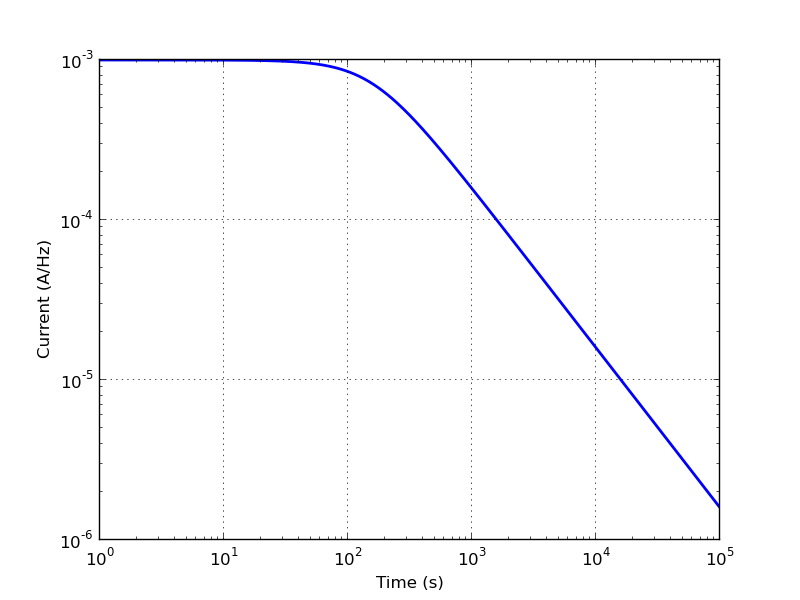
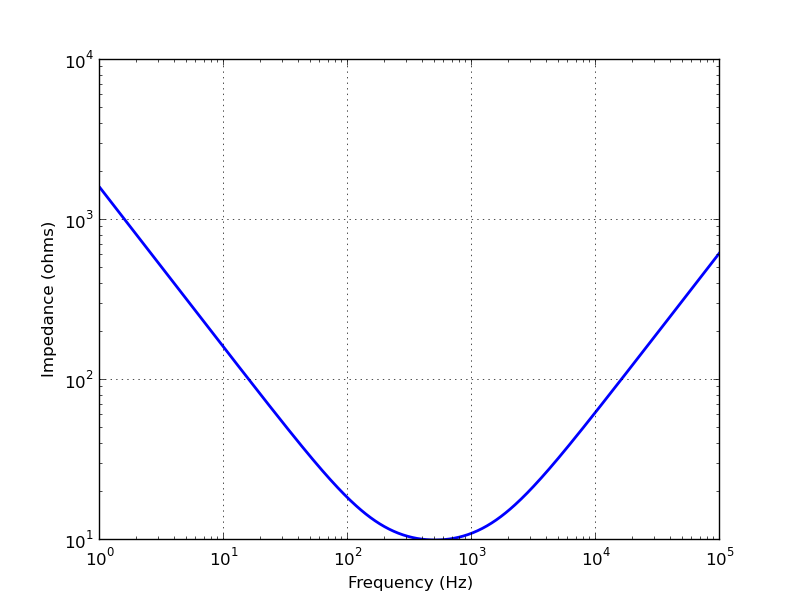
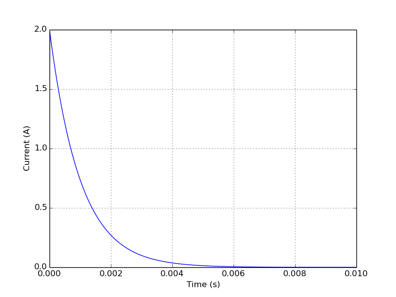
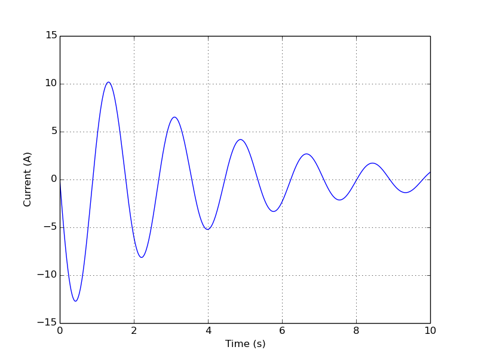

========
Tutorial
========

Introduction
============

mcircuit is a set of circuit analysis classes for Python.  It will
only solve linear, time invariant networks.  In other words, networks
comprised of basic circuit elements (R, L, C, etc.) that do not vary
with time.

It does not support non-linear devices such as diodes or transistors
although it does support simple opamps without saturation.

Mcircuit uses Sympy (symbolic Python) for its values and expressions
and thus the circuit analysis can be performed symbolically.  See http://docs.sympy.org/latest/tutorial/index.html for the SymPy tutorial.

Internally, the circuit components are stored using their s-domain
equivalents, such as impedances and admittances.  This is convenient
for frequency response analysis but requires an inverse Laplace
transform for transient response analysis.

Preliminaries
=============

- You will need to install mcircuit.  Currently, this a single Python
  file so you just need to copy it to your working directory or set
  your `PYTHON_PATH` environment variable to find its directory.

- You will also need to install SymPy, see http://docs.sympy.org/latest/install.html.

- For plotting you will need to install matplotlib.

- Then fire up your favourite python interpreter, for example, ipython:

  >>> ipython --pylab

Simple circuit element combinations
===================================

Here's an example of resistors in series

   >>> from mcircuit import *
   >>> R1 = R(10)
   >>> R2 = R(5)
   >>> Rtot = R1 + R2
   >>> print(Rtot)
   R(10) + R(5)
   >>> print(Rtot.simplify())
   R(15)

Here `R(10)` creates a 10 ohm resistor and this is assigned to the
variable `R1`.  Similarly, `R(5)` creates a 5 ohm resistor and this is
assigned to the variable `R2`.  `Rtot` is the name of the network
formed by connecting `R1` and `R2` in series.  Calling the `simplify`
method will simplify the netwrok and combine the resistors into a
single resistor equivalent.

Here's an example of a parallel combination of resistors.  Note that
the parallel operator is `|` instead of the usual `||`.

   >>> from mcircuit import *
   >>> Rtot = R(10) | R(5)
   >>> print(Rtot)
   R(10) | R(5)
   >>> print(Rtot.simplify())
   R(10/3)

The result can be performed symbolically, for example,

   >>> from mcircuit import *
   >>> Rtot = R('R_1') | R('R_2')
   >>> print(Rtot)
   R(R_1) | R(R_2)
   >>> print(Rtot.simplify())
   R(R_1*R_2/(R_1 + R_2))
   >>> pprint(Rtot.simplify())
   R(R₁) | R(R₂)

Notice the difference between `print` and `pprint` (pretty print).

Here's another example using inductors in series

   >>> from mcircuit import *
   >>> L1 = L(10)
   >>> L2 = L(5)
   >>> Ltot = L1 + L2
   >>> pprint(Ltot)
   L(10) + L(5)
   >>> pprint(Ltot.simplify())
   L(15)

Finally, here's an example of a parallel combination of capacitors

   >>> from mcircuit import *
   >>> Ctot = C(10) | C(5)
   >>> pprint(Ctot)
   C(10) | C(5)
   >>> pprint(Ctot.simplify())
   C(15)

Impedances
==========

Let's consider a series R-L-C network

   >>> from mcircuit import *
   >>> N = R(5) + L(20) + C(10)
   >>> pprint(N)
   R(5) + L(20) + C(10)
   >>> pprint(N.Z)
        2           
   200⋅s  + 80⋅s + 1
   ─────────────────
          20⋅s    

Notice the result is a rational function of `s`.  Remember impedance
is a frequency domain concept.  A rational function can be formatted
in a number of different ways, for example,

   >>> pprint(N.Z.ZPK())
      ⎛      ____    ⎞ ⎛      ____    ⎞
      ⎜    ╲╱ 14    1⎟ ⎜    ╲╱ 14    1⎟
   10⋅⎜s - ────── + ─⎟⋅⎜s + ────── + ─⎟
      ⎝      20     5⎠ ⎝      20     5⎠
   ────────────────────────────────────
                    s                 
   >>> pprint(N.Z.canonical())
      ⎛ 2   2⋅s    1 ⎞
   10⋅⎜s  + ─── + ───⎟
      ⎝      5    200⎠
   ───────────────────
            s         

Here `ZPK()` prints the impedance in ZPK (zero-pole-gain) form while
`canonical()` prints the numerator and denominator of the rational
function in monic form (with unity leading coefficient).

The corresponding parallel R-L-C network yields

   >>> from mcircuit import *
   >>> N = R(5) | L(20) | C(10)
   >>> pprint(N)
   R(5) | L(20) | C(10)
   >>> pprint(N.Z)
         20⋅s      
   ────────────────
        2          
   200⋅s  + 4⋅s + 1

   >>> pprint(N.Z.ZPK())
                   s                 
   ──────────────────────────────────
      ⎛     1    7⋅ⅈ⎞ ⎛     1    7⋅ⅈ⎞
   10⋅⎜s + ─── - ───⎟⋅⎜s + ─── + ───⎟
      ⎝    100   100⎠ ⎝    100   100⎠
   >>> pprint(N.Z.canonical())
           s         
   ──────────────────
      ⎛ 2   s     1 ⎞
   10⋅⎜s  + ── + ───⎟
      ⎝     50   200⎠
   >>> pprint(N.Y)
        2          
   200⋅s  + 4⋅s + 1
   ────────────────
         20⋅s      

Notice how `N.Y` returns the admittance of the network, the reciprocal
of the impedance `N.Z`.

The frequency response can be evaluated numerically by specifying a
vector of time values.

   >>> from mcircuit import *
   >>> from numpy import logspace
   >>> N = V(20) + R(5) + C(10)
   >>> f = linspace(0, 4, 400)
   >>> Isc = N.Isc.frequency_response(f)

Then the frequency response can be plotted.  For example,

   >>> from matplotlib.pyplot import figure, show
   >>> fig = figure()
   >>> ax = fig.add_subplot(111)
   >>> ax.loglog(f, abs(Isc), linewidth=2)
   >>> ax.set_xlabel('Frequency (Hz)')
   >>> ax.set_ylabel('Current (A/Hz)')
   >>> ax.grid(True)
   >>> show()

Here's a complete example Python script:

.. literalinclude:: examples/series-RLC3-Z.py

Simple transient analysis
=========================

Let's consider a series R-C network in series with a voltage source

   >>> from mcircuit import *
   >>> N = V(20) + R(5) + C(10)
   >>> pprint(N)
   V(20) + R(5) + C(10)
   >>> Voc = N.Voc
   >>> pprint(Voc)
   20
   ──
   s 
   >>> pprint(N.Isc)
   200   
   ────────
   50⋅s + 1
   >>> isc = N.Isc.transient_response()
   >>> pprint(isc)
      -t              
      ───             
       50             
   4⋅ℯ   ⋅Heaviside(t)

Here `N` is network formed by the components in series, and `N.Voc` is
the open-circuit voltage across the network.  Note, this is the same
as the s-domain value of the voltage source.  `N.Isc` is the
short-circuit s-domain voltage through the network.  The method
`transient_response` converts this to the time-domain, a damped
exponential response multiplied by the ubiquitous unit step.

Of course, this could have been done symbolically,

   >>> from mcircuit import *
   >>> N = V('V_1') + R('R_1') + C('C_1')
   >>> pprint(N)
   V(V₁) + R(R₁) + C(C₁)
   >>> Voc = N.Voc
   >>> pprint(Voc)
   V₁
   ──
   s 
   >>> pprint(N.Isc)
   C₁⋅V₁   
   ───────────
   C₁⋅R₁⋅s + 1
   >>> isc = N.Isc.transient_response()
   >>> pprint(isc)
         -t               
        ─────             
        C₁⋅R₁             
    V₁⋅ℯ     ⋅Heaviside(t)
    ──────────────────────
          R₁          

The transient response can be evaluated numerically by specifying a
vector of time values.

   >>> from mcircuit import *
   >>> from numpy import linspace
   >>> N = V(20) + R(5) + C(10)
   >>> t = linspace(0, 100, 400)
   >>> isc = N.Isc.transient_response(t)

Then the transient response can be plotted.  For example,

   >>> from matplotlib.pyplot import figure, show
   >>> fig = figure()
   >>> ax = fig.add_subplot(111)
   >>> ax.plot(t, isc, linewidth=2)
   >>> ax.set_xlabel('Time (s)')
   >>> ax.set_ylabel('Current (A)')
   >>> ax.grid(True)
   >>> show()

Here's a complete example Python script of the short-circuit current
through underdamped series RLC network:

.. literalinclude:: examples/series-VRLC1-isc.py

