.. _tutorials:

=========
Tutorials
=========

Expression manipulation
=======================

Second order system
-------------------

Consider a continuous-time signal of the form :math:`A \exp\left(-\alpha t\right) \cos\left(\omega_0 t + \theta\right)`.  This can be represented in Lcapy as::

  >>> from lcapy import *
  >>> x = expr('A * exp(-alpha * t) * cos(omega_0 * t + theta)')

This creates three four symbols in addition to the pre-defined time-domain variable `t`:

  >>> list(x.symbols)
  ['theta', 't', 'omega_0', 'alpha', 'A']

The expression assigned to `x` can be printed as::

   >>> x
      -α⋅t
   A⋅ℯ    ⋅cos(ω₀⋅t + θ)

For inclusion in a LaTeX document, the expression can be printed with the `latex()` method::

   >>> print(x.latex())
   A e^{- \alpha t} \cos{\left(\omega_{0} t + \theta \right)}

The Laplace transform of the expression is obtained using the notation::

   >>> X = x(s)
   >>> X
   A⋅(-ω₀⋅sin(θ) + (α + s)⋅cos(θ))
   ───────────────────────────────
              2          2
            ω₀  + (α + s)

This can be converted into many different forms.  For example, the partial fraction expansion is found with the `partfrac()` method::

   >>> X.partfrac()
      ⅉ⋅A⋅sin(θ)   A⋅cos(θ)   ⅉ⋅A⋅sin(θ)   A⋅cos(θ)
   - ────────── + ────────   ────────── + ────────
          2           2           2           2
   ─────────────────────── + ─────────────────────
          s + α + ⅉ⋅ω₀             s + α - ⅉ⋅ω₀

In principle, this can be simplified by the `simplify()` method.  However, this is too aggressive and collapses the partial fraction expansion!  For example::

   >>> X.partfrac().simplify()
     A⋅(α⋅cos(θ) - ω₀⋅sin(θ) + s⋅cos(θ))
     ───────────────────────────────────
             2     2    2
       s  + ω₀  + α  + 2⋅s⋅α

Instead, the `simplify_terms()` method simplifies each term separately::

   >>> X.partfrac().simplify_terms()
          -ⅉ⋅θ                ⅉ⋅θ
       A⋅ℯ                 A⋅ℯ
   ──────────────── + ────────────────
   2⋅(s + α + ⅉ⋅ω₀)   2⋅(s + α - ⅉ⋅ω₀)

Another representation is zero-pole-gain (ZPK) form::

   >>> X.ZPK()
    A⋅cos(θ)⋅(α - ω₀⋅tan(θ) + s)
   ─────────────────────────────
   (s + α - ⅉ⋅ω₀)⋅(s + α + ⅉ⋅ω₀)

Alternatively, the expression can be parameterized into ZPK form::

   >>> X1, defs = X.parameterize_ZPK()
   >>> X1
            s - z₁
   K⋅─────────────────
     (s - p₁)⋅(s - p₂)
   >>> defs
   {K: A⋅cos(θ), p1: -α - ⅉ⋅ω₀, p2: -α + ⅉ⋅ω₀, z1: -α + ω₀⋅tan(θ)}

Basic circuit theory
====================

When learning circuit theory, the key initial concepts are:

1. Ohm's law
2. Kirchhoff's current law (KCL)
3. Kirchhoff's voltage law (KVL)
4. Superposition
5. Norton and Thevenin transformations

DC voltage divider
------------------

Consider the DC voltage divider circuit defined by::

    >>> from lcapy import Circuit
    >>> a = Circuit("""
    ... V 1 0 6; down=1.5
    ... R1 1 2 2; right=1.5
    ... R2 2 0_2 4; down
    ... W 0 0_2; right""")
    >>> a.draw()

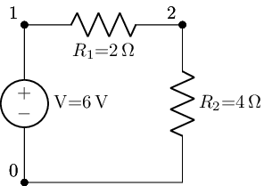

The voltage at node 1 (with respect to the ground node 0) is defined by the voltage source::

   >>> a.V.V
   6

The total resistance is::

   >>> a.R1.R + a.R2.R
   6

and thus using Ohm's law the current through R1 and R2 is::

   >>> I = a.V.V / (a.R1.R + a.R2.R)
   >>> I
   1

Thus again using Ohm's law, the voltage across R2 is::

   >>> I * a1.R2.R
   4

Of course, these values can be automatically calculated using Lcapy.  For example,
the voltage at node 2 (with respect to the ground node 0) is::

   >>> a[2].V
   4

This is equivalent to the voltage across R2::

   >>> a.R2.V
   4

The current through R1 is::

   >>> a.R1.I
   1

From Kirchhoff's current law, this is equivalent to the current though R2 and V::

   >>> a.R2.I
   1

   >>> a.V.I
   1

The general result can be obtained by evaluating this circuit symbolically::

    >>> from lcapy import Circuit
    >>> a = Circuit("""
    ... V 1 0 dc
    ... R1 1 2
    ... R2 2 0_2
    ... W 0 0_2""")
    >>> a.R2.V
     R₂⋅V
    ───────
    R₁ + R₂

Note, the keyword dc is required here for the voltage source otherwise an arbitrary voltage source is assumed.

AC (phasor) analysis of RC circuit
----------------------------------

Consider the circuit defined by::

    >>> from lcapy import Circuit
    >>> a = Circuit("""
    ... V 1 0 ac 6; down=1.5
    ... R 1 2 2; right=1.5
    ... C 2 0_2 4; down
    ... W 0 0_2; right""")
    >>> a.draw()

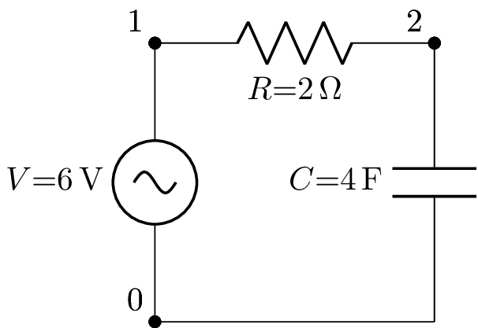

Here the ac keyword specifies that the voltage source is a phasor of angular frequency :math:`\omega_0`.

The voltage across the voltage source is given using::

    >>> a.V.V
    {ω₀: 6}

This indicates a superposition result (see :ref:`superpositions`)
containing a single phasor of angular frequency :math:`\omega_0` with
an amplitude 6 V.  The time domain representation is::

    >>> a.V.V(t)
    6⋅cos(ω₀⋅t)

The phasor can be extracted from the superposition by specifying the angular frequency::

  >>> a.V.V[omega0]
  6

In cases where the superposition consists of a single phasor it can be extracted with the `phasor()` method::

  >>> a.V.V.phasor()
  6

The voltage across the capacitor is also a superposition result containing a single phasor::

    >>> a.C.V
   ⎧    ⎛-3⋅ⅉ ⎞⎫
   ⎪    ⎜─────⎟⎪
   ⎪    ⎝  4  ⎠⎪
   ⎨ω₀: ───────⎬
   ⎪          ⅉ⎪
   ⎪     ω₀ - ─⎪
   ⎩          8⎭

This can be simplified::

    >>> a.C.V.simplify()
   ⎧     -6⋅ⅉ   ⎫
   ⎨ω₀: ────────⎬
   ⎩    8⋅ω₀ - ⅉ⎭

The magnitude of the phasor voltage is::

    >>> a.C.V.magnitude
       ___________________
      ╱          2
    ╲╱  589824⋅ω₀  + 9216
    ──────────────────────
               2
        1024⋅ω₀  + 16

and the phase is::

    >>> a.C.V.phase
    -atan(8⋅ω₀)

Finally, the time-domain voltage across the capacitor is::

    >>> a.C.V(t)
    48⋅ω₀⋅sin(ω₀⋅t)   6⋅cos(ω₀⋅t)
    ─────────────── + ───────────
           2               2
       64⋅ω₀  + 1      64⋅ω₀  + 1

Laplace analysis of RC low-pass filter
--------------------------------------

The following netlist describes a first-order RC low-pass filter (the
`P` components define the input and output ports)::

    >>> from lcapy import Circuit
    >>> a = Circuit("""
    ... P1 1 0; down=1.5, v_=v_i(t)
    ... R 1 2 2; right=1.5
    ... C 2 0_2 {1/4}; down
    ... W 0 0_2; right
    ... W 2 3; right
    ... W 0_2 0_3; right
    ... P2 3 0_3; down, v^=v_o(t)"""
    >>> a.draw()

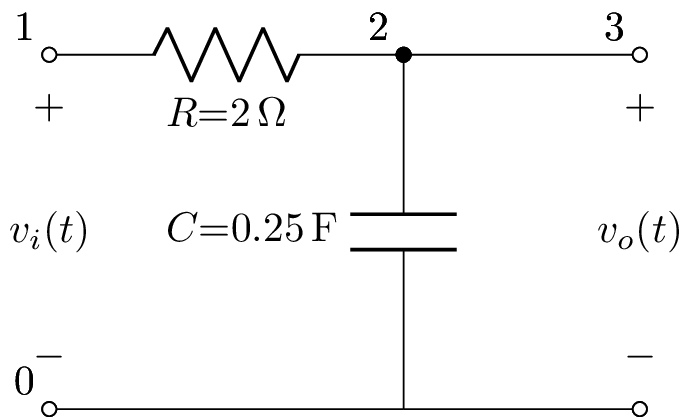

Here :math:`v_i(t)` is the input voltage and :math:`v_o(t)` is the output voltage.  The Laplace domain transfer function of the filter can be found by specifying nodes:

   >>> H = a.transfer(1, 0, 3, 0)

or components:

   >>> H = a.P1.transfer('P2')

In both cases, the transfer function is::

   >>> H
      s
   ───────
   (s + 2)

For the input signal, let's consider a sinewave of angular frequency 3 rad/s that switches 'on' at :math:`t=0`::

   >>> v_i = voltage(sin(3 * t) * u(t))

The output voltage can be found by connecting a voltage source with
this signal to the circuit and using Lcapy to find the result.
However, let's use Laplace transforms to find the result.  For this signal, its Laplace transform is::

   >>> V_i = v_i(s)
   >>> V_i
      3
    ──────
     2
    s  + 9

The Laplace transform of the output voltage is found by multiplying this with the transfer function::

   >>> V_o = V_i * H
   >>> V_o
             6
   ────────────────────
    3      2
   s  + 2⋅s  + 9⋅s + 18

This has three poles: two from the input signal and one from the transfer function of the filter.  This can be seen from the zero-pole-gain form of the response:

   >>> V_o.ZPK()
                   6
   ───────────────────────────
   (s + 2)⋅(s - 3⋅ⅉ)⋅(s + 3⋅ⅉ)

Using an inverse Laplace transform, the output voltage signal in the time-domain is::

   >>> v_o = V_o(t)
   >>> v_o
     ⎛                                               -2⋅t⎞
     ⎜2⋅sin(3⋅t)   cos(3⋅t)   (-2 - 3⋅ⅉ)⋅(-2 + 3⋅ⅉ)⋅ℯ     ⎟
   6⋅⎜────────── - ──────── + ───────────────────────────⎟⋅u(t)
     ⎝    39          13                  169            ⎠

This can be simplified, however, SymPy has trouble with this as a whole.  Instead it is better to simplify the expression term by term::

  >>> v_o.simplify_terms()
                                          -2⋅t
   4⋅sin(3⋅t)⋅u(t)   6⋅cos(3⋅t)⋅u(t)   6⋅ℯ    ⋅u(t)
   ─────────────── - ─────────────── + ────────────
          13                13              13

The first two terms represent the steady-state response and the third
term represents the transient response due to the sinewave switching
'on' at :math:`t=0`.  The steady-state response is the sum of a
sinewave and cosinewave of the same frequency; this is equivalent to a
phase-shifted sinewave.  This can be seen using the `simplify_sin_cos`
method::

   >>> v_o.simplify_sin_cos(as_sin=True)

            ⎛      π            ⎞
   2⋅√13⋅sin⎜3⋅t - ─ + atan(2/3)⎟⋅u(t)      -2⋅t
            ⎝      2            ⎠        6⋅ℯ    ⋅u(t)
   ─────────────────────────────────── + ────────────
                    13                        13

Here the phase delay is `-pi/2 + atan(2/3)` or about -56 degrees::

  >>> ((-pi/2 + atan(2/3)) / pi * 180).fval
  -56.3

The input and output signals can be plotted using::

   >>> ax = v_i.plot((-1, 10), label='input')
   >>> ax = v_o.plot((-1, 10), axes=as, label='output')
   >>> ax.legend()

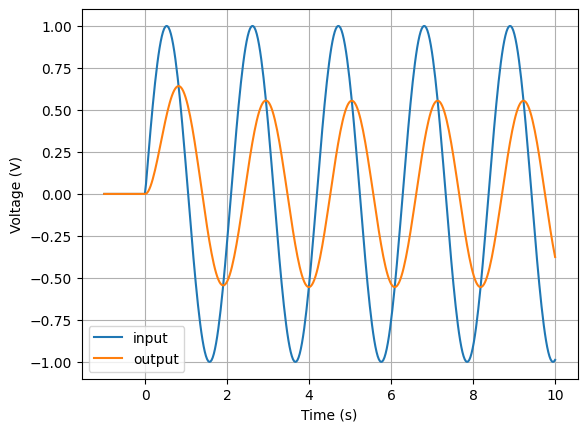

Notice the effect of the transient at the start before the response tends to the steady state response.

The phase response of the filter can be plotted as follows::

  >>> H(jw).phase_degrees.plot((0, 10))

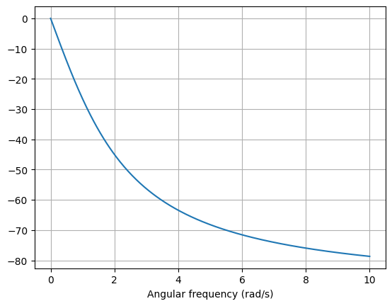

Notice that the phase shift is -56 degrees at an angular frequency of 3 rad/s.

The amplitude response of the filter can be plotted as follows::

  >>> H(jw).magnitude.plot((0, 10))

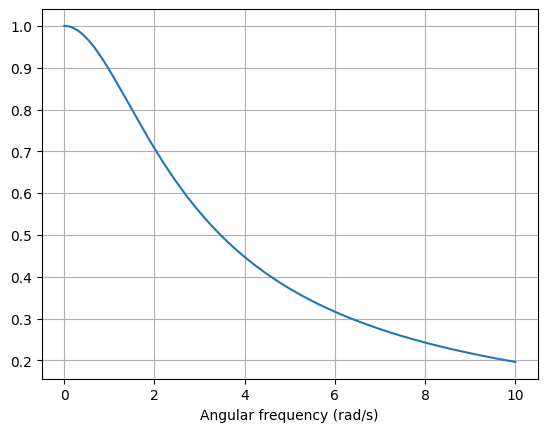

For a Bode plot, the angular frequency is plotted on a logarithmic
scale and the amplitude response is plotted in dB::

  >>> H(jw).dB.plot((0, 10), log_frequency=True)

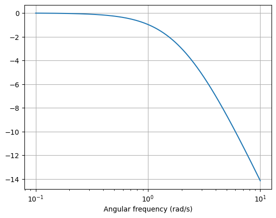

Superposition of AC and DC
--------------------------

Here's an example circuit comprised of two AC sources and a DC source:
    >>> from lcapy import Circuit
    >>> a = Circuit("""
    ... V1 1 0 {2 * sin(3*t)}; down=1.5
    ... V2 1 2 {3 * cos(4*t)}; right=1.5
    ... V3 3 2 4; left=1.5
    ... R 3 0_3; down
    ... W 0 0_3; right""")
    >>> a.draw()

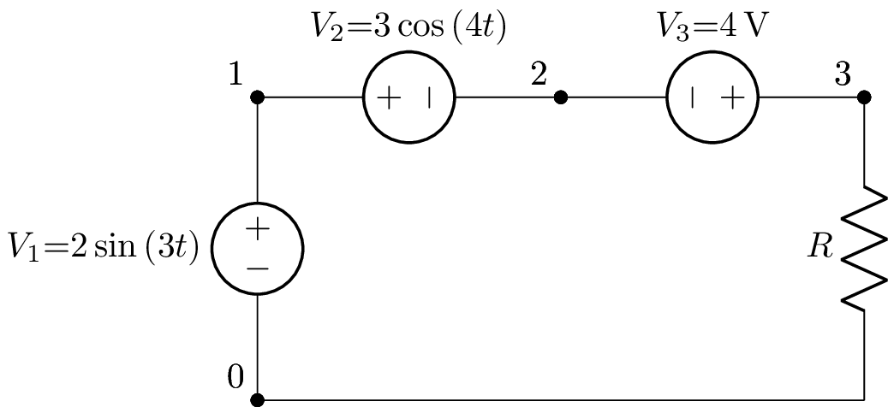

The voltage across the resistor is the sum of the three voltage
sources.  This is shown as a superposition::

    >>> a.R.V
    {dc: 4, 3: -2⋅ⅉ, 4: -3}

This shows that there is a DC component of 4 V added to two phasors;
one with an angular frequency of 3 rad/s and the other with angular
frequency of 4 rad/s.

There are a number of ways in which the signal components can be extracted.
For example, the phase of the 3 rad/s phasor can be found using::

    >>> a.R.V[3].phase
    -π
    ───
     2

Similarly, the magnitude of of the 4 rad/s phasor can be found using::

    >>> a.R.V[4].magnitude
    3

The DC component can be extracted using::

    >>> a.R.V.dc
    4

Alternatively, since DC is a phasor of angular frequency 0 rad/s::

   >>> a.R.V[0]
   4

The overall time varying voltage can be found using::

   >>> a.R.V(t)
   2⋅sin(3⋅t) - 3⋅cos(4⋅t) + 4

Initial value problem
=====================

Consider the series R-L-C circuit described by the netlist:

.. literalinclude:: examples/tutorials/ivp/circuit-RLC-ivp1.sch

Note, to specify the initial conditions, the capacitance and
inductance values must be explicitly defined.

This can be loaded by Lcapy and drawn using:

    >>> from lcapy import Circuit, s, t
    >>> a = Circuit("circuit-RLC-ivp1.sch")
    >>> a.draw()

This circuit has a specified initial voltage for the capacitor and a
specified initial current for the inductor.  Thus, it is solved as an
initial value problem.  This will give the transient response for
:math:`t \ge 0`.  Note, the initial values usually arise for switching
problems where the circuit topology changes.

The s-domain voltage across the resistor can be found using::

   >>> c.R.V(s)
   ⎛R⋅(L⋅i₀⋅s - v₀)⎞
   ⎜───────────────⎟
   ⎝       L       ⎠
   ─────────────────
      2   R⋅s    1
     s  + ─── + ───
           L    C⋅L

This can be split into terms, one for each initial value, using::

   >>> a.R.V(s).expandcanonical()
        R⋅i₀⋅s              R⋅v₀
   ────────────── - ──────────────────
    2   R⋅s    1      ⎛ 2   R⋅s    1 ⎞
   s  + ─── + ───   L⋅⎜s  + ─── + ───⎟
         L    C⋅L     ⎝      L    C⋅L⎠

Lcapy can convert this expression into the time-domain but the result
is complicated.  This is because SymPy does not know how to simplify
the expression since it cannot tell if the poles are complex
conjugates, distinct real, or repeated real.  Let's have a look at the
poles::

  >>> a.R.V(s).poles()
  ⎧           ____________                ____________   ⎫
  ⎪          ╱    2                      ╱    2          ⎪
  ⎨   R    ╲╱  C⋅R  - 4⋅L         R    ╲╱  C⋅R  - 4⋅L    ⎬
  ⎪- ─── + ───────────────: 1, - ─── - ───────────────: 1⎪
  ⎩  2⋅L        2⋅√C⋅L           2⋅L        2⋅√C⋅L       ⎭

Thus it can be seen that if :math:`C R^2 \ge 4 L` then the poles are
real otherwise they are complex.

To get a simpler result that does not depend on the unknown component
values, let's parameterize the expression for the voltage across the
resistor::

   >>> VR, defs = a.R.V(s).parameterize()
   >>> VR
         K⋅(L⋅i₀⋅s - v₀)
   ──────────────────────────
        ⎛  2               2⎞
   L⋅i₀⋅⎝ω₀  + 2⋅ω₀⋅s⋅ζ + s ⎠
   >>> defs
   ⎧                    1          √C⋅R⎫
   ⎨K: R⋅i₀, omega_0: ─────, zeta: ────⎬
   ⎩                  √C⋅√L        2⋅√L⎭

Unfortunately, converting VR into the time-domain also results in a
complicated expression that SymPy cannot simplify.  Instead, it is
better to use an alternative parameterization::

   >>> VR, defs = a.R.V(s).parameterize(zeta=False)
   >>> VR
          K⋅(L⋅i₀⋅s - v₀)
   ──────────────────────────────
        ⎛  2    2              2⎞
   L⋅i₀⋅⎝ω₁  + s  + 2⋅s⋅σ₁ + σ₁ ⎠

   >>> defs
   ⎧                     ______________              ⎫
   ⎪                    ╱      2                     ⎪
   ⎨                  ╲╱  - C⋅R  + 4⋅L             R ⎬
   ⎪K: R⋅i₀, omega_1: ─────────────────, sigma_1: ───⎪
   ⎩                        2⋅√C⋅L                2⋅L⎭

The time-domain response can now be found::

   >>> VR(t)
     ⎛     ⎛                       -σ₁⋅t          ⎞       -σ₁⋅t          ⎞
     ⎜     ⎜ -σ₁⋅t             σ₁⋅ℯ     ⋅sin(ω₁⋅t)⎟   v₀⋅ℯ     ⋅sin(ω₁⋅t)⎟
   K⋅⎜L⋅i₀⋅⎜ℯ     ⋅cos(ω₁⋅t) - ───────────────────⎟ - ───────────────────⎟
     ⎝     ⎝                            ω₁        ⎠            ω₁        ⎠
   ───────────────────────────────────────────────────────────────────────  for t ≥ 0
                                     L⋅i₀

Finally, the result in terms of R, L, and C can be found by substituting the parameter definitions::

   >>> VR(t).subs(defs)

However, the result is too long to show here.

The resultant expression can be approximated (see :ref:`Approximation`) to achieve a simpler form.  The `approximate_dominant()` method requires some ball park values for some (or all) of the components.  It will then neglect terms in a sum that contribute little.  For example::

   >>> VR.subs(defs).approximate_dominant({'C':1e-6,'R':100,'L':1e-6})(t)
     ⎛                       -R⋅t ⎞
     ⎜                       ─────⎟
     ⎜                         L  ⎟
     ⎜L⋅v₀   L⋅(-R⋅i₀ + v₀)⋅ℯ     ⎟
   R⋅⎜──── - ─────────────────────⎟
     ⎝ R               R          ⎠
   ────────────────────────────────  for t ≥ 0
                  L

.. _switchingcircuits:

Switching circuits
==================

Lcapy can solve circuits with switches by converting them to an
initial value problem (IVP) with the `convert_IVP()` method.  This has
a time argument that is used to determine the states of the switches.
The circuit is solved prior to the moment when the last switch
activates and this is used to provide initial values for the moment
when the last switch activates.  If there are multiple switches with
different activation times, the initial values are evaluated
recursively.

Be careful with switching circuits since it easy to produce a circuit
that cannot be analysed; for example, an inductor may be
open-circuited when a switch opens.

Internally, the `convert_IVP()` method uses the `replace_switches()`
method to replace switches with open-circuit or short-circuit
components.  The switch activation times are then found with the
`switching_times()` method; this returns a sorted list of activation
times.  Finally, the `initialize()` method is used to set the initial
values.

RC circuit
----------

The following netlist

   >>> from lcapy import *
   >>> a = Circuit("""
   ... V 1 0; down
   ... W 1 5; right
   ... SW 2 5 4 spdt; right, mirror, invert
   ... R 2 3; right
   ... W 4 0_2; down
   ... C 3 0_3; down
   ... W 0 0_2; right=0.5
   ... W 0_2 0_3; right
   ... ; draw_nodes=connections""")
   >>> a.draw()

produces this schematic:

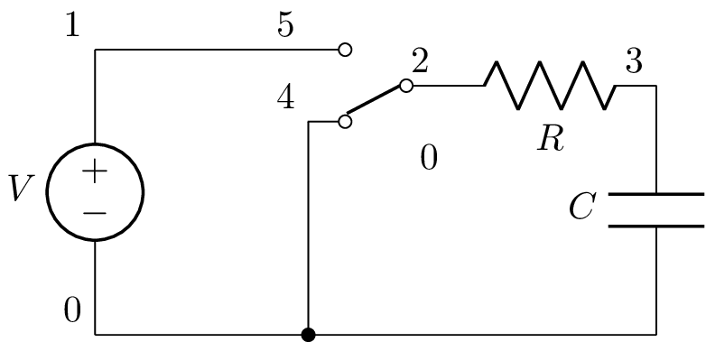

The netlist can be converted to an initial value problem using:

   >>> cct_ivp = cct.convert_IVP(0)

The 0 argument to the `convert_IVP()` method says to analyse the
circuit just after the switch has been activated at :math:`t=0`.  The new
netlist is::

   V 1 0; down
   W 1 5; right
   SW 2 5 4 spdt 0; right, mirror, invert, nosim, l
   W 2 4; right, mirror, invert, ignore
   R 2 3; right
   W 4 0_2; down
   C 3 0_3 C 0; down
   W 0 0_2; right=0.5
   W 0_2 0_3; right
   ; draw_nodes=connections

Notes:

1. The switch component is retained for drawing purposes but has
the `nosim` attribute so it is not considered in analysis.
2. A wire is added across the switch but this has the `ignore`
attribute to prevent drawing.
3. The capacitor has an initial value added.

The new netlist has a schematic:

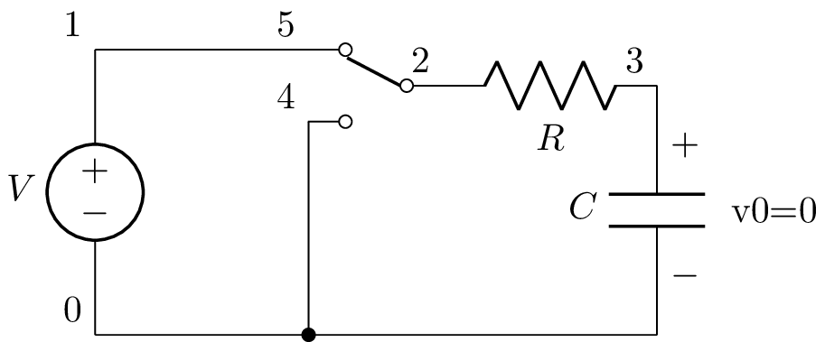

The time-domain voltage across the capacitor can now be found using:

   >>> cct_ivp.C.V(t)
     ⎛           -t ⎞
     ⎜           ───⎟
     ⎜           C⋅R⎟
   V⋅⎝C⋅R - C⋅R⋅ℯ   ⎠
   ──────────────────  for t ≥ 0
          C⋅R

Note, time `t` is relative to the when the initial values were
evaluated.  If the circuit was evaluated at `t=2`, the correction can
be made using something like:

   >>> after.C.V(t).subs(t, t - 2)
     ⎛           -(t - 2) ⎞
     ⎜           ─────────⎟
     ⎜              C⋅R   ⎟
   V⋅⎝C⋅R - C⋅R⋅ℯ         ⎠
   ────────────────────────  for t ≥ 2
             C⋅R

RL circuit
----------

The following netlist

   >>> from lcapy import *
   >>> a = Circuit("""
   ... V 1 0; down
   ... SW 1 2 no; right
   ... R 2 3; right
   ... L 3 0_3; down
   ... W 0 0_3; right
   ... ; draw_nodes=connections""")
   >>> a.draw()

produces this schematic:

.. image:: examples/netlists/SWRL.png
   :width: 6cm

The netlist can be converted to an initial value problem using:

   >>> cct_ivp = cct.convert_IVP(0)

The 0 argument to the `convert_IVP()` method says to analyse the
circuit just after the switch has been activated at :math:`t=0`.  The new
netlist is::

  V 1 0; down
  W 1 2; right
  R 2 3; right
  L 3 0_3 L 0; down
  W 0 0_3; right
  ; draw_nodes=connections

The new netlist has a schematic:

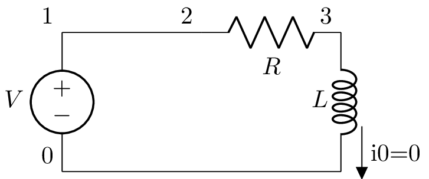

The time-domain voltage across the inductor can now be found using:

   >>> cct_ivp.L.V(t)
      -R⋅t
      ─────
        L
   V⋅ℯ       for t ≥ 0

RC circuit2
-----------

The following netlist

   >>> from lcapy import *
   >>> a = Circuit("""
   ... V1 1 0; down
   ... W 1 5; right
   ... SW 2 5 4 spdt; right, mirror, invert
   ... R 2 3; right
   ... V2 4 0_2; down
   ... C 3 0_3; down
   ... W 0 0_2; right=0.5
   ... W 0_2 0_3; right
   ... ; draw_nodes=connections""")
   >>> a.draw()

produces this schematic:

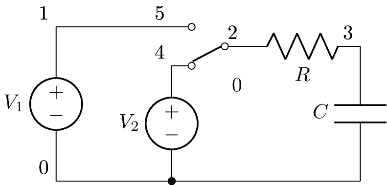

The netlist can be converted to an initial value problem using:

   >>> cct_ivp = cct.convert_IVP(0)

The 0 argument to the `convert_IVP()` method says to analyse the
circuit just after the switch has been activated at :math:`t=0`.  The new
netlist is::

   V1 1 0; down
   W 1 5; right
   SW 2 5 4 spdt 0; right, invert, nosim, l
   W 2 5; right, mirror, invert, ignore
   R 2 3; right
   V2 4 0_2; down
   C 3 0_3 C V2; down
   W 0 0_2; right=0.5
   W 0_2 0_3; right
   ; draw_nodes=connections

The new netlist has a schematic:

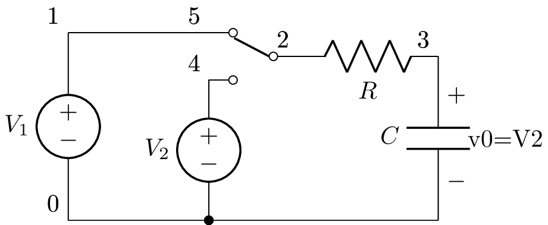

The time-domain voltage across the capacitor can now be found using:

   >>> cct_ivp.C.V(t)
                    -t
                    ───
                    C⋅R
   V₁ + (-V₁ + V₂)⋅ℯ     for t ≥ 0

RC circuit3
-----------

The following netlist

   >>> from lcapy import *
   >>> a = Circuit("""
   ... V 1 0; down
   ... SW 1 2 no; right
   ... R 2 3; right
   ... C 3 0_3; down
   ... W 0 0_3; right
   ... ; draw_nodes=connections""")
   >>> a.draw()

produces this schematic:

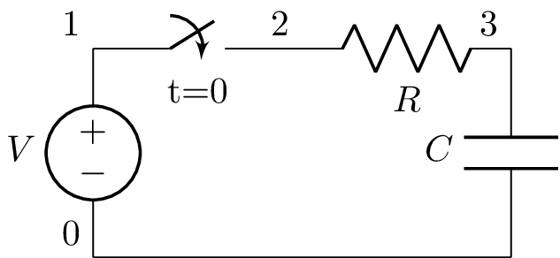

The netlist can be converted to an initial value problem using:

   >>> cct_ivp = cct.convert_IVP(0)

The 0 argument to the `convert_IVP()` method says to analyse the
circuit just after the switch has been activated at :math:`t=0`.  The new
netlist is::

   V 1 0; down
   W 1 2; right
   R 2 3; right
   C 3 0_3 C 0; down
   W 0 0_3; right
   ; draw_nodes=connections

Note, Lcapy assumes that the capacitor is initially uncharged.

The new netlist has a schematic:

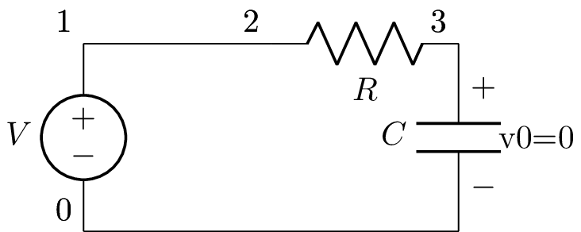

The time-domain voltage across the capacitor can now be found using:

   >>> cct_ivp.C.V(t)
     ⎛           -t ⎞
     ⎜           ───⎟
     ⎜           C⋅R⎟
   V⋅⎝C⋅R - C⋅R⋅ℯ   ⎠
   ──────────────────  for t ≥ 0
          C⋅R

Switch replacement
------------------

Switches can be replaced with open-circuits or short-circuits using
the `replace_switches()` method.   For example:

   >>> from lcapy import *
   >>> a = Circuit("""
   ... V 1 0; down
   ... W 1 5; right
   ... SW 2 5 4 spdt; right, mirror, invert
   ... R 2 3; right
   ... W 4 0_2; down
   ... C 3 0_3; down
   ... W 0 0_2; right=0.5
   ... W 0_2 0_3; right
   ... ; draw_nodes=connections""")
   >>> a.draw()

produces the schematic:

From this two new circuits can be created: one before the switch opening:

   >>> before = a.replace_switches_before(0)

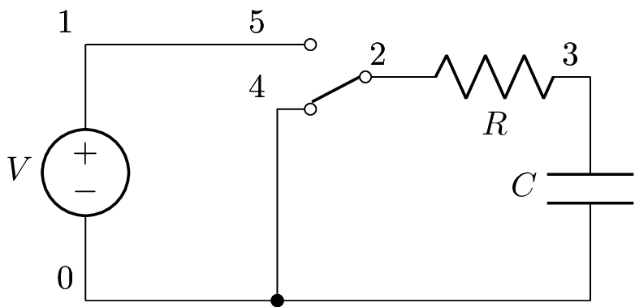

and the other after the switch opening:

   >>> after = a.replace_switches(0).initialize(before, 0)

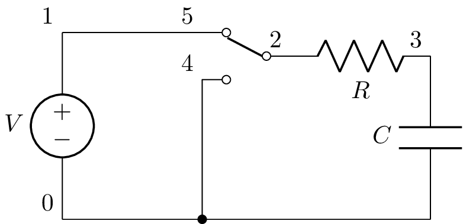

Setting initial values
----------------------

The initial values can be set by analyzing a related circuit.  This is
performed by the `initialize()` method.  For example:

   >>> from lcapy import *
   >>> a1 = Circuit("""
   ... V 1 0 dc; down
   ... R 1 2; right
   ... C 2 0_2; down
   ... W 0 0_2; right
   ... """)
   >>> a2 = Circuit("""
   ... V 1 0 step; down
   ... R 1 2; right
   ... C 2 0_2 C; down
   ... W 0 0_2; right
   ... W 2 3; right
   ... L 3 0_3; down
   ... W 0_2 0_3; right
   ... """)
   >>> t1 = expr('t1', positive=True)
   >>> a2i = a2.initialize(a1, t1)
   >>> a2i
   V 1 0 dc; down
   R 1 2; right
   C 2 0_2 C {V*(C*R - C*R*exp(-t1/(C*R)))/(C*R)}; down
   W 0 0_2; right
   W 2 3; right
   L 3 0_3; down
   W 0_2 0_3; right

In this example, the circuit defined as `a1` changes to the circuit
defined as `a2` at the instant `t1`.  The `initialize()` method adds
the initial values for `a2` based on the values from `a1` at `t1`.  In
this case the capacitor `C` is initialized with the corresponding
capacitor voltage for the circuit `a1` at time `t1`.  Note, it is
assumed that `t1` is a valid time for the results of circuit `a1`.

The `initialize()` method can be applied to update the initial values
of a circuit.  For example:

   >>> from lcapy import *
   >>> a1 = Circuit("""
   ... V 1 0 dc; down
   ... R 1 2; right
   ... C 2 0_2; down
   ... W 0 0_2; right
   ... """)
   >>> a1.initialize(a1, 3)
   V 1 0 dc; down
   R 1 2; right
   C 2 0_2 C V; down
   W 0 0_2; right

This is a trivial case where the capacitor voltage is set to the DC
voltage of the source.  Note, the `initialize()` method can also take
a dictionary of initial values keyed by component name.

Opamps
======

An ideal opamp is represented by a voltage controlled voltage source.  The netlist has the form::

   E out gnd opamp in+ in-  Ad Ac

Here `Ad` is the open-loop differential gain and `Ac` is the open-loop common-mode gain (zero default).  Assuming no saturation, the output voltage is

:math:`V_o = A_d (V_{\mathrm{in+}} - V_{\mathrm{in-}}) + A_c \frac{1}{2} (V_{\mathrm{in+}} + V_{\mathrm{in-}})`.

Non-inverting amplifier
-----------------------

   >>> from lcapy import Circuit, t, oo
   >>> a = Circuit("""
   ... E 1 0 opamp 3 2 Ad; right
   ... W 2 2_1; down
   ... R1 2_1 0_2 R1; down
   ... R2 2_1 1_1 R2; right
   ... W 1 1_1; down
   ... W 3_1 3_2; down
   ... Vs 3_2 0_3 Vs; down
   ... W 0_3 0_1; down
   ... W 3_1 3_3; right
   ... W 3_3 3; right
   ... W 1 1_2; right
   ... P 1_2 0; down
   ... W 0_1 0_2; right
   ... W 0_2 0; right
   ... ; draw_nodes=connections, label_ids=none, label_nodes=primary
   ... """)
   >>> a.draw()

.. image:: examples/tutorials/opamps/opamp-noninverting-amplifier1.png
   :width: 12cm

The output voltage (at node 1) is found using::

   >>> Vo = a[1].V(t)
   >>> Vo
   Vₛ⋅(A_d⋅R₁ + A_d⋅R₂)
   ────────────────────
      A_d⋅R₁ + R₁ + R₂

When the open-loop differential gain is infinite, the gain just depends on the resistor values::

   >>> Vo.limit('Ad', oo)
   Vₛ⋅(R₁ + R₂)
   ────────────
        R₁

Let's now add some common-mode gain to the opamp by overriding the `E` component::

   >>> b = a.copy()
   >>> b.add('E 1 0 opamp 3 2 Ad Ac; right')

The output voltage (at node 1) is now::

   >>> Vo = b[1].V(t)
   >>> Vo
   Vₛ⋅(A_c⋅R₁ + A_c⋅R₂ + 2⋅A_d⋅R₁ + 2⋅A_d⋅R₂)
   ──────────────────────────────────────────
        -A_c⋅R₁ + 2⋅A_d⋅R₁ + 2⋅R₁ + 2⋅R₂

Setting the open-loop common-mode gain to zero gives the same result as before::

   >>> Vo.limit('Ac', 0)
   A_d⋅R₁⋅Vₛ + A_d⋅R₂⋅Vₛ
   ─────────────────────
      A_d⋅R₁ + R₁ + R₂

When the open-loop differential gain is infinite, the common-mode gain
of the opamp is insignificant and the gain of the amplifier just
depends on the resistor values::

   >>> Vo.limit('Ad', oo)
   Vₛ⋅(R₁ + R₂)
   ────────────
        R₁

Let's now consider the input impedance of the amplifier::

   >>> a.impedance(3, 0)
   0

This is not the desired answer since node 3 is shorted to node 0 by the voltage source `Vs`.  If we try to remove this, we get::

   >>> c = a.copy()
   >>> c.remove('Vs')
   >>> c.impedance(3, 0)
   ValueError: The MNA A matrix is not invertible for time analysis because:
   1. there may be capacitors in series;
   2. a voltage source might be short-circuited;
   3. a current source might be open-circuited;
   4. a dc current source is connected to a capacitor (use step current source).
   5. part of the circuit is not referenced to ground

In this case it is reason 3.  This is because Lcapy connects a 1 A current source across nodes 3 and 0 and tries to measure the voltage to determine the impedance.   However, node 3 is floating since an ideal opamp has infinite input impedance.  To keep Lcapy happy, we can explicitly add a resistor between nodes 3 and 0,

   >>> c.add('Rin 3 0')
   >>> c.impedance(3, 0)

Now, not surprisingly,

   >>> c.impedance(3, 0)
   Rᵢₙ

Inverting amplifier
-------------------

   >>> from lcapy import Circuit, t, oo
   >>> a = Circuit("""
   ... E 1 0 opamp 3 2 Ad; right, flipud
   ... R1 4 2; right
   ... R2 2_2 1_1; right
   ... W 2 2_2; up
   ... W 1 1_1; up
   ... W 4 4_2; down=0.5
   ... Vs 4_2 0_3; down
   ... W 0_3 0_1; down=0.5
   ... W 3 0_2; down
   ... W 1 1_2; right
   ... P 1_2 0; down
   ... W 0_1 0_2; right
   ... W 0_2 0; right
   ... ; draw_nodes=connections, label_ids=none, label_nodes=primary
   ... """)
   >>> a.draw()

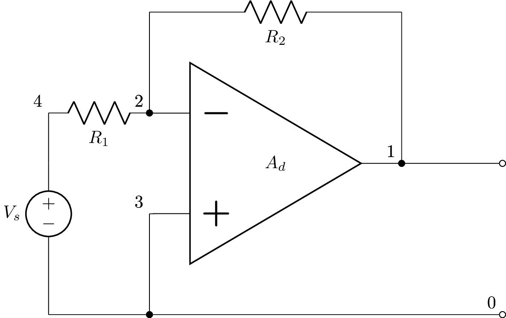

The output voltage (at node 1) is found using::

  >>> Vo = a[1].V(t)
  >>> Vo
    -A_d⋅R₂⋅vₛ(t)
   ────────────────
   A_d⋅R₁ + R₁ + R₂

In the limit when the open-loop differential gain is infinite, the gain of
the amplifier just depends on the resistor values::

   >>> Vo.limit('Ad', oo)
   -R₂⋅vₛ(t)
   ──────────
       R₁

Note, the output voltage is inverted compared to the source voltage.

The input impedance can be found by removing `Vs` (since it has zero resistance)::

   >>> a.remove('Vs')
   >>> a.impedance(4, 0)
   A_d⋅R₁ + R₁ + R₂
   ────────────────
       A_d + 1

In the limit with infinite open-loop differential gain::

   >>> a.impedance(4,0).limit('Ad', oo)
   R₁

However, in practice, the open-loop gain decreases with frequency and so at high frequencies,

   >>> a.impedance(4,0).limit('Ad', 0)
   R₁ + R₂

Transimpedance amplifier
------------------------

   >>> from lcapy import Circuit, t, oo
   >>> a = Circuit("""
   ... E 1 0 opamp 3 2 Ad; right, flipud
   ... W 4 2; right
   ... R 2_2 1_1; right
   ... W 2 2_2; up
   ... W 1 1_1; up
   ... W 4 4_2; down=0.5
   ... Is 4_2 0_3; down
   ... W 0_3 0_1; down=0.5
   ... W 3 0_2; down
   ... W 1 1_2; right
   ... P 1_2 0; down
   ... W 0_1 0_2; right
   ... W 0_2 0; right
   ... ; draw_nodes=connections, label_ids=none, label_nodes=primary
   ... """)
   >>> a.draw()

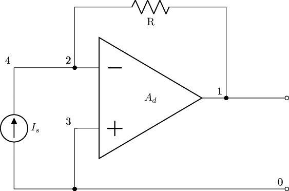

The output voltage (at node 1) is found using::

  >>> Vo = a[1].V(t)
  >>> Vo
  -A_d⋅R⋅iₛ(t)
  ─────────────
     A_d + 1

In the limit when the open-loop differential gain is infinite gain, the gain of
the amplifier just depends on the resistor value::

   >>> Vo.limit('Ad', oo)
   -R⋅iₛ(t)

Note, the output voltage is inverted compared to the source current.

The input impedance can be found using (the ideal current source has infinite resistance and does not need removing)::

   >>> a.impedance(4, 0)
      R
   ───────
   A_d + 1

In the limit with infinite open-loop differential gain::

   >>> a.impedance(4,0).limit('Ad', oo)                                            0

However, in practice, the open-loop gain decreases with frequency and so at high frequencies,

   >>> a.impedance(4,0).limit('Ad', 0)
   R

To obtain a high transimpedance the resistor value `R` needs to be large.  However, this can be impractically large.  An alternative is to use a transimpedance amplifier with voltage gain as shown below::

   >>> from lcapy import Circuit, t, oo
   >>> a = Circuit("""
   ... E 1 0 opamp 3 2 Ad; right
   ... W 2_1 2; right
   ... W 2 2_2; down
   ... R1 2_2 4; right
   ... R2 1 4; down
   ... R3 4 0; down, implicit
   ... W 1 1_1; right
   ... W 3 0; down=0.25, implicit
   ... ; draw_nodes=connections, label_ids=none, label_nodes=primary
   ... ; draw_nodes=connections, label_ids=none, label_nodes=primary
   ... """)
   >>> a.draw()

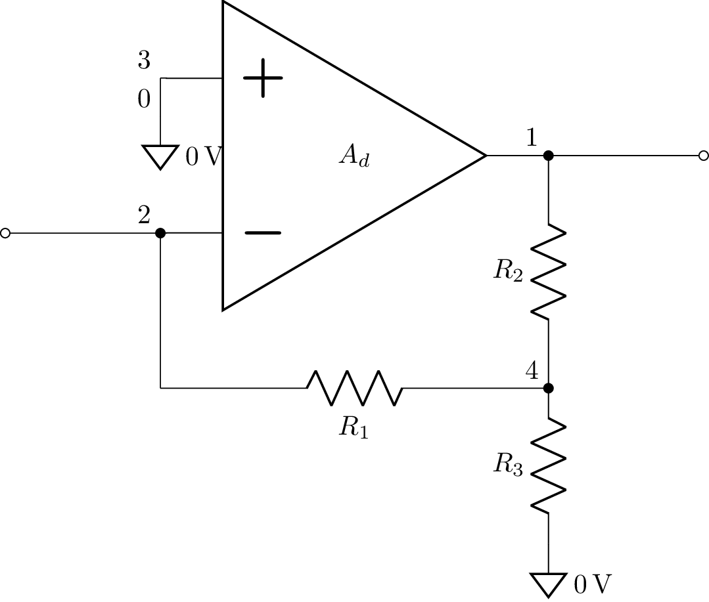

The transimpedance for this circuit can be found using the `transimpedance()` method::

   >>> a.transimpedance(2, 0, 1, 0).limit('Ad', oo).simplify()
     R₁⋅R₂
   - ───── - R₁ - R₂
       R₃

Displacement current sensor
---------------------------

This example looks at a displacement current sensor with an opamp
configured as a transimpedance amplifier.  In this example, the opamp
is configured as an inverting differentiator, Cs models the source
capacitance, Vs models the AC source voltage, R is the feedback
resistor, and A is the open-loop gain of the opamp.  The displacement
current flows through Cs.

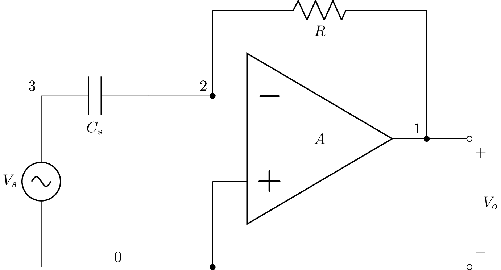

This circuit is described by:

   >>> from lcapy import Circuit, t, oo
   >>> a = Circuit("""
   ... Vs 3 0_3 ac; down=2
   ... Cs 3 2_1; right
   ... W 0_3 0; right
   ... E1 1 0 opamp 0_4 2 A; right, mirror
   ... W 1 1_2; right=0.5
   ... P 1_2 0_1; down, v=V_o
   ... W 2_1 2; right=0.5
   ... W 0_4 0_2; down
   ... W 0 0_2; right
   ... W 0_2 0_1; right=0.5
   ... W 2 2_2; up
   ... R 2_2 1_1; right
   ... W 1_1 1; down
   ... ; draw_nodes=connections, label_nodes=primary
   ... """)

The output voltage (at node 1) is found using::

   >>> a[1].V
   ⎧     -A⋅Vₛ⋅ω₀   ⎫
   ⎪ω₀: ────────────⎪
   ⎨         ⅉ⋅A + ⅉ ⎬
   ⎪    ω₀ - ───────⎪
   ⎩           Cₛ⋅R ⎭

This indicates a single AC component with angular frequency
:math:`\omega_0` (this is the default frequency of an AC source).

The AC component is extracted using:

   >>> Vo = a[1].V[omega0]
   >>> Vo
    -A⋅Vₛ⋅ω₀
   ────────────
        ⅉ⋅A + ⅉ
   ω₀ - ───────
          Cₛ⋅R

This expression can be simplified:

   >>> Vo.simplify()
      A⋅Cₛ⋅R⋅Vₛ⋅ω₀
   ─────────────────
   ⅉ⋅A - Cₛ⋅R⋅ω₀ + ⅉ

With an ideal opamp having infinite open-loop gain, the expression
further simplifies:

   >>> Vo.limit('A', oo)
   -ⅉ⋅Cₛ⋅R⋅Vₛ⋅ω₀

The AC gain is found by dividing by the source voltage:

   >>> Vo.limit('A', oo) / voltage('Vs')
   -ⅉ⋅Cₛ⋅R⋅ω₀

Lcapy can create a noise model from a netlist (using the `noise_model()` method) but this only works for resistors; the noise components for an opamp need to be explicitly modelled.

Here's an example netlist where Vn models the opamp's noise voltage,
In models the opamp's noise current (note the other opamp noise source
has no contribution since it is shorted), and VnR models the Johnson
noise of the feedback resistor R where :math:`k_b=1.38\times 10^{-23}`
is Boltzmann's constant and :math:`T` is the temperature in Kelvin.

   >>> from lcapy import Circuit, t, oo
   >>> a = Circuit("""
   ... Vs 6 0_3 ac; down=2
   ... Cs 6 4; right
   ... W 0_3 0; right
   ... E1 1 0 opamp 0_4 2_1 A; right, mirror
   ... W 1 1_2; right=0.5
   ... P 1_2 0_6; down
   ... Ci 4_3 0_5; down
   ... W 4_1 4; right
   ... W 4 4_3; right
   ... Vn 4_3 2 noise; right
   ... W 2 2_1; right=0.5
   ... In 2 0_1 noise; down
   ... W 0_4 0_2; down
   ... W 0 0_5; right
   ... W 0_5 0_1; right
   ... W 0_1 0_2; right
   ... W 0_2 0_6; right=0.5
   ... W 4 4_2; up
   ... VnR 4_2 3 noise; right
   ... R 3 1_1; right
   ... W 1_1 1; down
   ... ; draw_nodes=connections
   ... """)

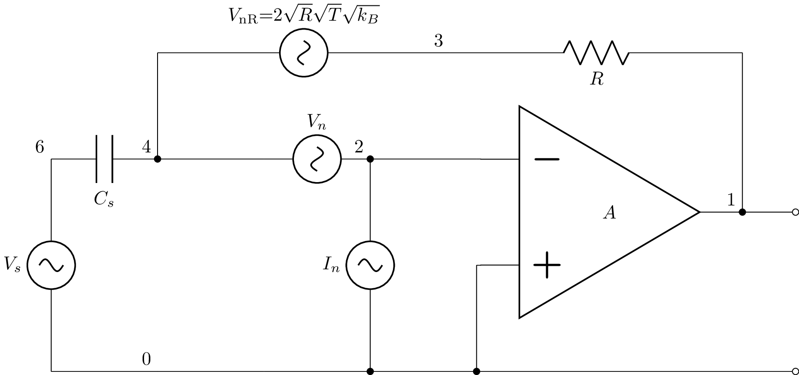

The output voltage (at node 1) is found using::

   >>> a[1].V

This time there are four components: an AC component due to Vs and three noise
components, one for each noise source.

The total noise at the output can be found using::

   >>> Vneq = a[1].V.n
   >>> Vneq
        __________________________________________
       ╱   2  2                 2 ⎛  2  2  2    ⎞
   A⋅╲╱  Iₙ ⋅R  + 4⋅R⋅T⋅k_b + Vₙ ⋅⎝Cₛ ⋅R ⋅ω  + 1⎠
   ───────────────────────────────────────────────
               __________________________
              ╱  2           2  2  2
            ╲╱  A  + 2⋅A + Cₛ ⋅R ⋅ω  + 1

With an ideal opamp having infinite open-loop gain, the expression
simplifies::

   >>> Vneq.limit('A', oo)
      __________________________________________
     ╱   2  2   2  2     2  2                 2
   ╲╱  Cₛ ⋅R ⋅Vₙ ⋅ω  + Iₙ ⋅R  + 4⋅R⋅T⋅k_b + Vₙ

Note, there is a contribution due to the Johnson noise of the feedback
resistor, the voltage noise of the opamp filtered by the RC network,
and the current noise of the opamp flowing through the feedback
resistor, R.  For low frequencies it is best to choose an opamp with a
low current noise and to use the largest feedback resistor as
possible.  In this case the noise is dominated by Johnson noise of R.
While the noise increases with the square root of R, the gain of the
circuit increases with R.

Piezo transducer amplifier
--------------------------

Consider the opamp noise model for a piezo transducer amplifier (note,
the thermal noise of the resistors is ignored):

   >>> from lcapy import Circuit, t, oo
   >>> a = Circuit("""
   ... Cs 1 0; down=4
   ... W 1 1_1; right
   ... Rs 1_1 0_1; down=4
   ... W 0 0_1; right
   ... W 1_1 1_2; right=2
   ... Vn 1_2 2 noise; right
   ... E 5_1 0 opamp 2 3_2 A; right
   ... W 3 3_1; right
   ... W 3_1 3_2; right
   ... W 3 3_3; down
   ... R1 3_3 4; down
   ... C 4 0_2; down
   ... W 0_1 0_2; right
   ... W 3_1 3_4; down=1.5
   ... Inn 3_4 0_3 noise; down
   ... W 0_2 0_3; right
   ... W 2 2_1; down=2
   ... Inp 2_1 0_4 noise; down
   ... W 0_3 0_4; right
   ... W 3_3 3_5; right=3
   ... R2 3_5 5_2; right
   ... W 5_1 5_2; down=2
   ... W 5_1 5; right
   ... Po 5 0_5; down, v=v_o
   ... W 0_4 0_5; right
   ... ; draw_nodes=connections, label_ids=none, label_nodes=primary
   ... """)
   >>> a.draw()

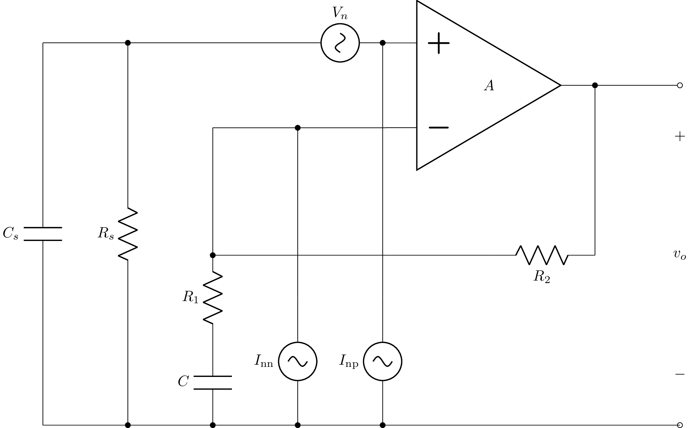

This circuit is a non-inverting amplifier where Cs represents the piezo transducer.  The AC voltage gain is set by 1 + R2/R1, for frequencies above the pole created by R1 and C::

   >>> H = a.transfer('Cs', 'Po').limit('A', oo)
   >>> H
   C⋅s⋅(R₁ + R₂) + 1
   ─────────────────
       C⋅R₁⋅s + 1
   >>> H.ZPK()
             ⎛         1     ⎞
   (R₁ + R₂)⋅⎜s + ───────────⎟
             ⎝    C⋅(R₁ + R₂)⎠
   ───────────────────────────
             ⎛     1  ⎞
          R₁⋅⎜s + ────⎟
             ⎝    C⋅R₁⎠

The output noise voltage amplitude spectral density (ASD) can be found using::

  >>> Von = a.Po.V.n(f)

This can be simplified by assuming an opamp with infinite open-loop gain::

  >>> Von = Von.limit('A', oo)

This expression is still too complicated to print.  This amplifier circuit has zero gain at DC where the noise ASD is::

   >>> Von.limit(f, 0)
      ___________________________
     ╱    2   2      2   2     2
   ╲╱  Iₙₙ ⋅R₂  + Iₙₚ ⋅Rₛ  + Vₙ

In comparison, the noise ASD at high frequencies is::

   >>> Von.limit(f, oo)
      ________________________________________________
     ╱    2   2   2     2   2             2     2   2
   ╲╱  Iₙₙ ⋅R₁ ⋅R₂  + R₁ ⋅Vₙ  + 2⋅R₁⋅R₂⋅Vₙ  + R₂ ⋅Vₙ
   ───────────────────────────────────────────────────
                            R₁

Note that this expression does not depend on Rs due to the capacitance, Cs, of the piezo transducer.

Let's choose some values, R1=100 ohm, R2=900 ohm, Cs=1 nF, Rs=100 Mohm, C=100 nF, Vn=2 nV :math:`/\sqrt{\mathrm{Hz}}`, In=5 fA :math:`/\sqrt{\mathrm{Hz}}` (in practice, the current and voltage noise ASD will vary with frequency due to 1/f noise)::

  b = a.subs({'R1':100, 'R2':900, 'Cs':1e-9, 'Rs':100e6, 'C':100e-9, 'Vn':2e-9, 'Inp':5e-15, 'Inn':0.5e-15})

The high frequency noise ASD is::

  >>> b.Po.V.n(f).limit('A', oo).limit(f, oo).evalf(3)
  2.00e-8

This is the opamp noise voltage scaled by the gain of the amplifier (10).  The noise at DC is larger::

  >>> b.Po.V.n(f).limit('A', oo).limit(f, 0).evalf(3)
  5.00e-7

This is due to the current noise of the opamp flowing through Rs.   The noise ASD would be larger if not for C limiting the low-frequency gain of the amplifier.  For example::

   >>> c = b.replace('C', 'W 4 0_2')
   >>> c.Po.V.n(f).limit('A', oo).limit(f, 0).evalf(3)
   5.00e-6

In this case, the DC gain is 10, whereas with C it is 1.

The amplifier output voltage noise ASD and gain can be plotted using::

  >>> from numpy import logspace
  >>> vf = logspace(0, 5, 201)
  >>> Vo = b.Po.V.n(f).limit('A', oo)
  >>> Vo.plot(vf, log_frequency=True, yscale=1e9, ylabel='Voltage noise ASD (nV/rtHz)')
  >>> H = b.transfer('Cs', 'Po')(f).limit('A', oo)
  >>> H.plot(vf, log_frequency=True, ylabel='Gain (dB)')
  >>> from matplotlib.pyplot import show
  >>> show()

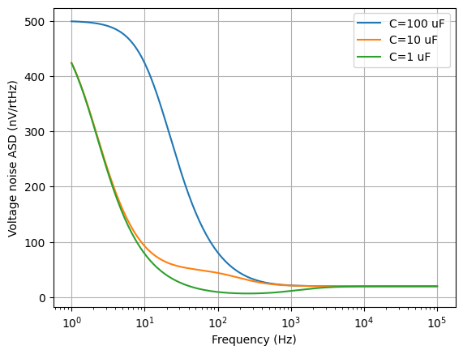

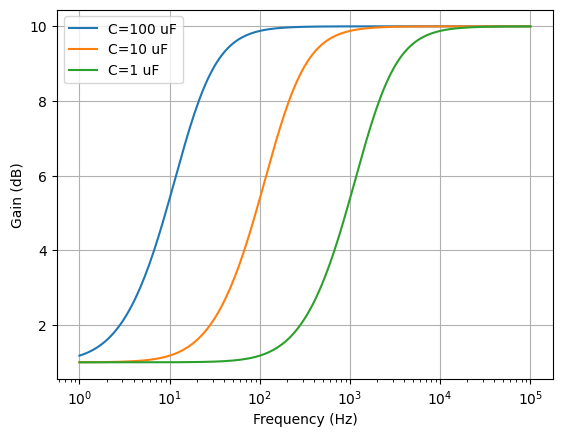

So far the thermal noise generated by the resistors has been ignored.
This can be remedied using the `noise_model()` method that adds a noise voltage source in
series with each resistor.  For example,

   >>> r = b.noise_model().subs({'T':293,'k_B':1.38e-23})

Here, a temperature of 293 K (20 C) is assumed and Boltzmann's constant has been substituted.  The high-frequency noise
is increased slightly by the resistors::

   >>> r.Po.V.n(f).limit('A', oo).limit(f, oo).evalf(3)
   2.34e-8

Multiple feedback low-pass filter
---------------------------------

   >>> from lcapy import Circuit, t, oo
   >>> a = Circuit("""
   ... R2 1 2 R2; right
   ... R3 2 3 R3; right
   ... C2 2 0_3 C2; down=1.15
   ... E1 6 0_3 opamp 0 3 A; mirror, scale=0.5, size=0.5, l=A
   ... W 0 0_2; down
   ... W 3 3_1; up=0.75
   ... C3 3_1 6_1 C3; right
   ... W 6_1 6; down
   ... W 2 2_1; up=1
   ... R4 2_1 6_2 R4; right
   ... W 6_2 6_1; down
   ... W 6 7; right
   ... W 0_3 0_2; right
   ... W 0_2 0_7; right
   ... W 0_3 0_1; left=1
   ... P1 1 0_1; down
   ... P2 7 0_7; down
   ... ; draw_nodes=connections, label_ids=none, label_nodes=primary
   ... """)
   >>> a.draw()

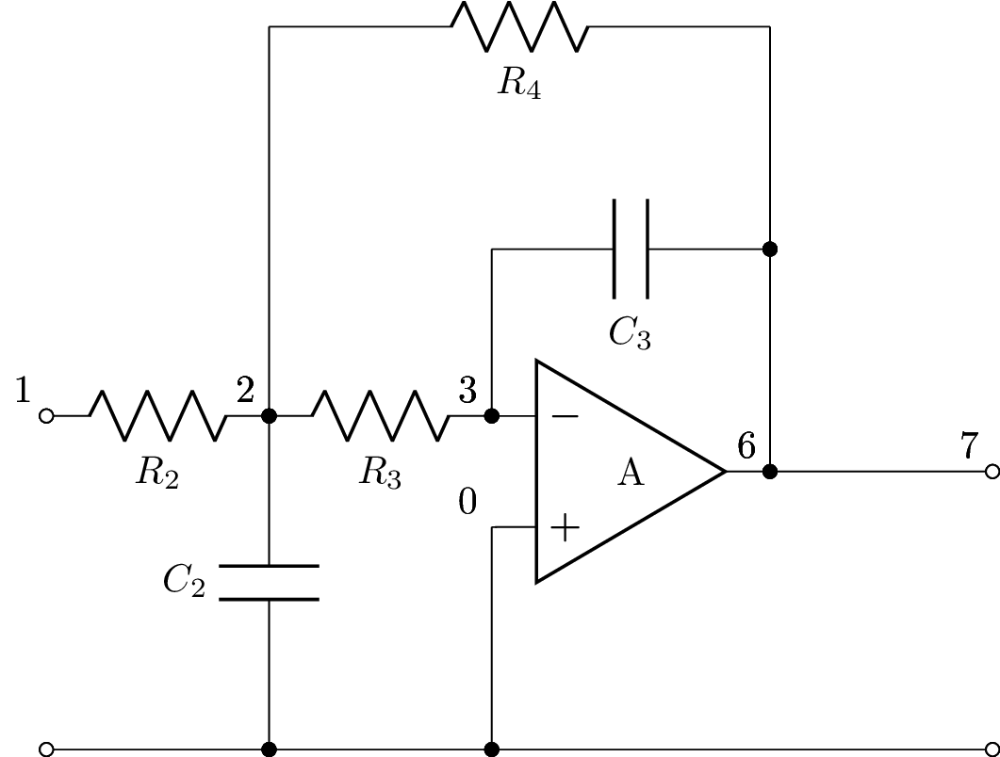

The transfer function of the filter (assuming an ideal opamp with infinite differential open loop gain) can be found using::

  >>> H = a.transfer(1, 0, 7, 0).limit('A', oo)
                                   -R₄
   ─────────────────────────────────────────────────────────────
                2
   C₂⋅C₃⋅R₂⋅R₃⋅R₄⋅s  + C₃⋅R₂⋅R₃⋅s + C₃⋅R₂⋅R₄⋅s + C₃⋅R₃⋅R₄⋅s + R₂

The angular frequency response of the filter is::

  >>> Hf = H(jw)
                                    -R₄
   ─────────────────────────────────────────────────────────────────────
                     2
   - C₂⋅C₃⋅R₂⋅R₃⋅R₄⋅ω  + ⅉ⋅C₃⋅R₂⋅R₃⋅ω + ⅉ⋅C₃⋅R₂⋅R₄⋅ω + ⅉ⋅C₃⋅R₃⋅R₄⋅ω + R₂

The DC gain of the filter is::

  >>> Hf(0)
    -R₄
   ────
    R₂

The second-order response of the transfer function of the filter can
be parameterized::

  >>> Hp, defs = H.parameterize()
  >>> Hp
              K
   ───────────────────
     2               2
   ω₀  + 2⋅ω₀⋅s⋅ζ + s

where::

   >>> defs['K']
       -1
   ───────────
   C₂⋅C₃⋅R₂⋅R₃
   >>> defs['omega_0']
                1
   ───────────────────────────
     ____   ____   ____   ____
   ╲╱ C₂ ⋅╲╱ C₃ ⋅╲╱ R₃ ⋅╲╱ R₄

   >>> defs['zeta']
     ____   ____   ____   ____ ⎛  1       1       1  ⎞
   ╲╱ C₂ ⋅╲╱ C₃ ⋅╲╱ R₃ ⋅╲╱ R₄ ⋅⎜───── + ───── + ─────⎟
                               ⎝C₂⋅R₄   C₂⋅R₃   C₂⋅R₂⎠
   ───────────────────────────────────────────────────
                            2

The Q of the filter is found using::

  >>> Q = 1 / (defs['zeta'] * 2)
  >>> Q.simplify()
        ____      ____   ____
      ╲╱ C₂ ⋅R₂⋅╲╱ R₃ ⋅╲╱ R₄
   ──────────────────────────────
     ____
   ╲╱ C₃ ⋅(R₂⋅R₃ + R₂⋅R₄ + R₃⋅R₄)

Shield guard
------------

Electrostatic shields are important to avoid capacitive coupling of interference into signals.  However, the capacitance between the signal and cable shields lowers the input impedance of an amplifier.  Consider the circuit described by the following netlist::

   >>> from lcapy import Circuit, t, oo
   >>> a = Circuit("""
   ... Vs 14 12 ac; down
   ... Rs 14 1; right
   ... Cable1; right=4, dashed, kind=coax, l=
   ... W 1 Cable1.in; right=0.5
   ... W Cable1.out 2; right=0.5
   ... W Cable1.ognd 10; down=0.5
   ... Cc Cable1.mid Cable1.b; down=0.2, dashed, scale=0.6
   ... W 2 11; right=0.75
   ... W 7 10; up=0.5
   ... E2 15 0 opamp 11 17 A_1; right, scale=0.5
   ... W 17 18; down
   ... W 12 7; right
   ... W 7 18; right
   ... W 18 0; down=0.2, sground
   ... Rin 11 17; down
   ... ; label_nodes=none, draw_nodes=connections
   ... ; label_ids=none, label_nodes=primary""")
   >>> a.draw()

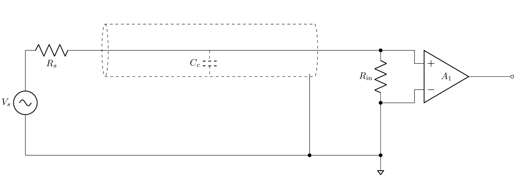

To find the input impedance it is first necessary to disconnect the
source, for example,

    >>> a.remove(('Vs', 'Rs'))

The impedance seen across `Rin` can be then found using:

    >>> Z = a.impedance('Rin')
    >>> Z
        1
    ─────────────────
        ⎛       1   ⎞
    C_c⋅⎜s + ───────⎟
        ⎝    C_c⋅Rᵢₙ⎠

This impedance is the parallel combination of the input resistance Rin and the impedance of the cable capacitance.   Thus at high frequencies the impedance drops.

Shield guard circuits are used to mitigate the capacitance between a cable signal and the cable shield.  For example:

   >>> from lcapy import Circuit, t, oo
   >>> b = Circuit("""
   ... Vs 14 12 ac; down
   ... Rs 14 1; right
   ... Cable1; right=4, dashed, kind=coax, l=
   ... W 1 Cable1.in; right=0.5
   ... W Cable1.out 2; right=0.5
   ... W Cable1.ognd 10; down=0.5
   ... Cc Cable1.mid Cable1.b; down=0.2, dashed, scale=0.6
   ... W 2 3; right=1.5
   ... W 3 11; right=0.75
   ... W 3 4; down=0.5
   ... W 5 6; down=0.5
   ... W 6 7; left
   ... W 7 10; up=0.5
   ... R 10 8; right
   ... E1 8 0 opamp 4 5 A_2; left=0.5, mirror, scale=0.5
   ... E2 15 0 opamp 11 17 A_1; right, scale=0.5
   ... W 17 18; down
   ... W 12 18; right
   ... W 18 0; down=0.2, sground
   ... Rin 11 17; down
   ... ; draw_nodes=connections, label_ids=none, label_nodes=primary
   ... """)
   >>> a.draw()

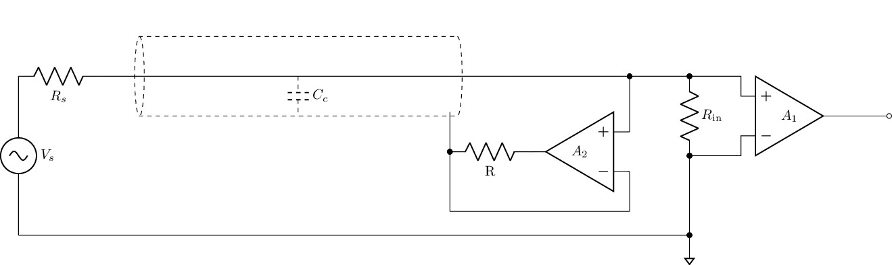

Again, to find the input impedance it is first necessary to disconnect the
source, for example,

    >>> b.remove(('Vs', 'Rs'))

The impedance seen across `Rin` can be then found using:

    >>> Z = b.impedance('Rin')
    ⎛Rᵢₙ⋅(A₂ + C_c⋅R⋅s + 1)⎞
    ⎜──────────────────────⎟
    ⎝    C_c⋅(R + Rᵢₙ)     ⎠
    ────────────────────────
               A₂ + 1
      s + ───────────────
          C_c⋅R + C_c⋅Rᵢₙ

However, when the open-loop gain, A2, of the shield-guard amplifier is large then

    >>> Z.limit('A_2', oo)
    Rᵢₙ

Thus the input impedance does not depend on Cc.  In practice, the open-loop gain is not infinite and reduces with frequency and so the guarding does not help at very high frequencies.

.. _fdopamps:

Fully-differential opamps
=========================

Fully differential opamps are useful for converting differential
signals to single ended signals and vice-versa.  They are also useful
for amplifying differential signals and changing the common-mode
voltage.

In Lcapy a fully differential opamp is defined using the notation of a
voltage controlled voltage source (although it is functionally
equivalent to two VCVSs).  The netlist has the form::

   E out+ out- fdopamp in+ in- ocm Ad Ac

Here `Ad` is the open-loop differential gain and `Ac` is the open-loop common-mode gain (zero default).  The node `ocm` sets the common-mode output voltage.  Internally it expands to::

   Ep out+ ocm opamp in+ in- Ad Ac
   Em ocm out- opamp in+ in- Ad Ac

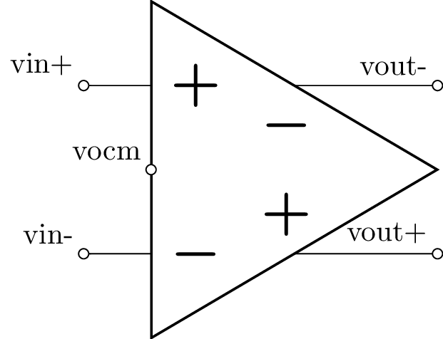

Fully-differential amplifier
----------------------------

   >>> from lcapy import Circuit, t, oo
   >>> a = Circuit("""
   ... Vsp 1 0_1 ; down
   ... W 0_1 0; down=0.1, implicit, l={0\,\mathrm{V}}
   ... W 1 1_1; right
   ... R1 1_1 6; right
   ... Vsm 2 0_3 ; down
   ... W 0_3 0; down=0.1, implicit, l={0\,\mathrm{V}}
   ... R3 2 3; right
   ... E1 5_2 4_2 fdopamp 3 6 0_4 Ad; right, mirror, l
   ... W 5_2 5; right
   ... W 4_2 4; right
   ... P2 5 4; down
   ... W 5_1 5_2; down
   ... W 6_1 6; down
   ... W 3 3_1; down
   ... R2 6_1 5_1; right
   ... W 4_2 4_1; down
   ... R4 3_1 4_1; right
   ... W 0 0_4; right=0.4
   ... W 0 0_2; down=0.1, implicit, l={0\,\mathrm{V}}
   ... ; draw_nodes=connections, label_ids=none, label_nodes=primary
   ... """)
   >>> a.draw()

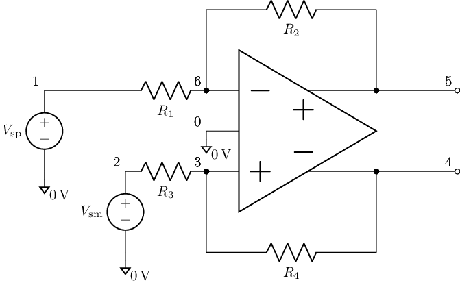

Let's modify the circuit values so it is symmetrical with `R4 = R2`
and `R3 = R1`::

   >>> b = a.subs({'R4': 'R2', 'R3': 'R1'})

The differential output voltage is found using::

   >>> Vod = (b[5].V(t) - b[4].V(t)).simplify()
   >>> Vod
   A⋅R₂⋅(Vₛₘ - Vₛₚ)
   ────────────────
    A⋅R₁ + R₁ + R₂

Assuming infinite open-loop differential gain this simplifies to::

   >>> Vod.limit('Ad', oo)
   R₂⋅(Vₛₘ - Vₛₚ)
   ──────────────
         R₁

Thus this is an inverting amplifier with gain :math:`R_2 / R_1`.

The common-mode output voltage is found using::

   >>> Voc = ((b[5].V(t) + b[4].V(t)) / 2).simplify()
   0

As expected, this is zero since the common-mode output voltage pin of the fully differential amplifier is connected to ground and the amplifier is assumed to have zero common-mode gain.

.. _inamps:

Instrumentation amplifiers
==========================

Instrumentation amplifiers have a large input impedance and a high
common-mode rejection ratio (CMRR).

In Lcapy an instrumentation amplifier is defined using the notation of a
voltage controlled voltage source (although it is functionally
equivalent to two or three VCVSs).  The netlist has the form::

   E out ref inamp in+ in- rin+ rin- Ad Ac Rf

Here `Ad` is the open-loop differential gain, `Ac` is the open-loop common-mode gain (zero default), and `Rf` is the internal feedback resistance.   Internally it expands to::

   Ep int+ 0 opamp in+ in- Ad 0
   Em int- 0 opamp in+ in- Ad 0
   Ed out ref opamp int+ int- 1 Ac
   Rfp rin+ int+ Rf
   Rfm rin- int- Rf

where `int+` and `int-` are internal nodes.

Here's an example netlist and the resulting schematic::

   >>> from lcapy import Circuit, t, oo
   >>> a = Circuit("""
   ... E 1 2 inamp 3 4 5 6 Ad Ac Rf; right, l=
   ... W 5_1 5; right=0.5
   ... W 6_1 6; right=0.5
   ... Rg 5_1 6_1; down=0.5, scale=0.5
   ... W 2 0; down=0.1, implicit, l={0\,\mathrm{V}}
   ... Vs1 3_2 0_3; down
   ... W 0_3 0; down=0.1, implicit, l={0\,\mathrm{V}}
   ... W 3_2 3; right
   ... Vs2 4 0_4; down
   ... W 0_4 0; down=0.1, implicit, l={0\,\mathrm{V}}
   ; draw_nodes=connected""")

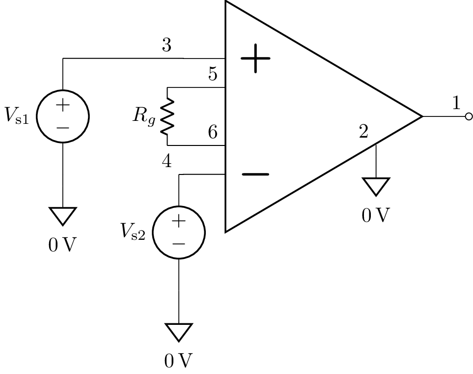

The output voltage can be found using::

   >>> Vo = a[1].V(t)

Assuming infinite open-loop differential gain,

   >>> Vo.limit('Ad', oo)
   A_c⋅R_g⋅Vₛ₁ + A_c⋅R_g⋅Vₛ₂ + 4⋅R_f⋅Vₛ₁ - 4⋅R_f⋅Vₛ₂ + 2⋅R_g⋅Vₛ₁ - 2⋅R_g⋅Vₛ₂
   ─────────────────────────────────────────────────────────────────────────
                                     2⋅R_g

Let's now express the input voltages in terms of the input
differential and common-mode voltages :math:`V_{s1} = V_{ic} - V_{id}
/ 2` and :math:`V_{s2} = V_{ic} + V_{id} / 2`::

   >>> Vo1 = Vo.subs({'Vs2':'Vic + Vid / 2', 'Vs1':'Vic - Vid / 2'}).simplify()
   >>> Vo1
              2⋅R_f⋅V_id
   A_c⋅V_ic - ────────── - V_id
                 R_g

The differential gain can be found by setting :math:`V_{ic}` to zero::

   >>> Gd = (Vo1.subs('Vic', 0) / voltage('Vid')).simplify()
   >>> Gd
   -(2⋅R_f + R_g)
   ───────────────
         R_g

Similarly, the common-mode gain can be found by setting :math:`V_{id}` to zero::

   >>> Gc = (Vo1.subs('Vid', 0) / voltage('Vic')).simplify()
   >>> Gc
   A_c

Noise analysis
==============

RC network
----------

Let's consider the thermal noise produced by a resistor in parallel
with a capacitor.  Now only the resistor produces thermal noise (white
Gaussian noise) but the capacitor and resistor form a filter so the
resultant noise is no longer white.  The interesting thing is that the
resultant noise voltage only depends on the capacitor value.  This can
be demonstrated using Lcapy.   Let's start by creating the circuit:

   >>> from lcapy import *
   >>> a = Circuit("""
   ... R 1 0; down
   ... W 1 2; right
   ... C 2 0_2; down
   ... W 0 0_2; right""")
   >>> a.draw()

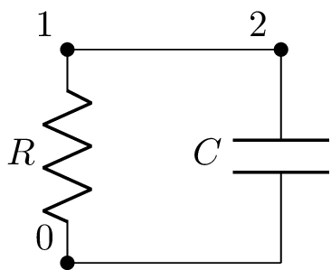

A noisy circuit model can be created with the `noisy()` method of the circuit object.   For every resistor in the circuit, a noisy voltage source is added in series.  For example,

   >>> b = a.noisy()
   >>> b.draw()

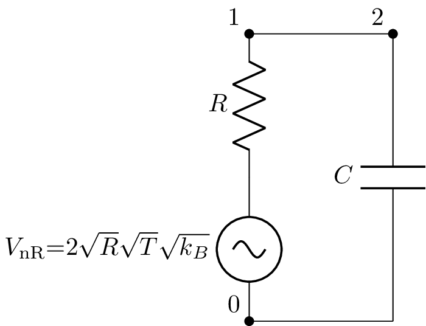

The noise voltage across the capacitor can be found using:

   >>> Vn = b.C.V.n
   >>> Vn
    2⋅√R⋅√T⋅╲╱ k_B
   ─────────────────
      ______________
     ╱  2  2  2
   ╲╱  C ⋅R ⋅ω  + 1

Note, this is the (one-sided) amplitude spectral density with units of volts per root hertz.  Here `T` is the absolute temperature in degrees kelvin, `k_B` is Boltzmann's constant, and :math:`\omega` is the angular frequency.  The expression can be made a function of linear frequency using:

   >>> Vn(f)
   2⋅√R⋅√T⋅╲╱ k_B
   ──────────────────────
      ___________________
     ╱    2  2  2  2
   ╲╱  4⋅π ⋅C ⋅R ⋅f  + 1

This expression can be plotted if we substitute the symbols with numbers.  Let's choose :math:`T = 293` K, :math:`R = 10` kohm, and :math:`C = 100` nF.

   >>> Vns = Vn.subs({'R':10e3, 'C':100e-9, 'T':293, 'k_B':1.38e-23})
   >>> Vns(f)
              √101085
   ─────────────────────────────
                    ____________
                   ╱  2  2
                  ╱  π ⋅f
   25000000000⋅  ╱   ────── + 1
               ╲╱    250000

Note, Lcapy tries to approximate real numbers with rationals.  A floating-point representation can be found with the `evalf()` method:

   >>> Vns(f).evalf()
                                                     -0.5
                       ⎛                     2      ⎞
   1.27175469332729e-8⋅⎝3.94784176043574e-5⋅f  + 1.0⎠

The amplitude spectral density of the noise can be plotted by defining a vector of frequency samples:

   >>> from numpy import linspace
   >>> vf = linspace(0, 10e3, 200)
   >>> (Vns(f) * 1e9).plot(vf, plot_type='mag', ylabel='ASD (nV/rootHz'))

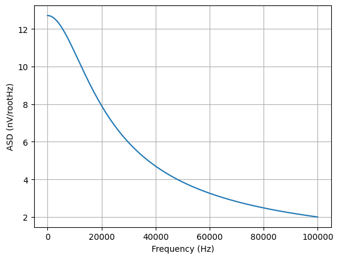

Finally, the rms noise voltage can be found using the `rms()` method.  This integrates the square of the ASD (the power spectral density) over all frequencies and takes the square root.  For this example, the rms value does not depend on R.

   >>> Vn.rms()
   √T⋅√k_B
   ───────
     √C

Opamp noise
-----------

The noise introduced by an opamp is characterised by its noise voltage amplitude spectral density (ASD) and it noise current ASD.  At low frequencies the opamp noise is dominated by 1/f noise, also known as flicker noise.   A model for the noise voltage (ASD) is:

.. math::
   \mathcal{V}(f) =  \mathcal{V}_w \sqrt{\frac{f_c}{f} + 1},

where :math:`\mathcal{V}_w` is the noise ASD in the `white` region and
:math:`f_c` is the corner frequency.  For example, a low noise opamp
with a white noise ASD of 1 nV :math:`/\sqrt{\mathrm{Hz}}` and a corner
frequency of 3.5 Hz can be modelled with::

   >>> from lcapy import f, sqrt
   >>> Vn = 1e-9 * sqrt(3.5 / f + 1)
   >>> ax = (Vn * 1e9).plot((-1, 4), loglog=True)
   >>> ax.grid(True, 'both')
   >>> ax.set_ylabel('Noise voltage density nV$/sqrt{\mathrm{Hz}}$')
   >>> ax.set_ylim(0.1, 10)

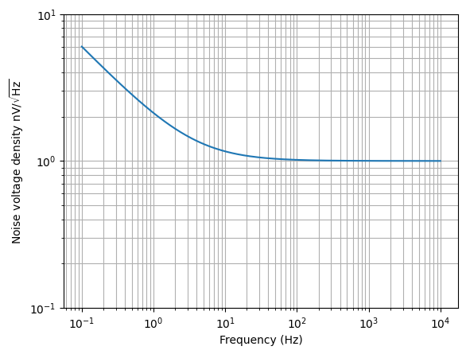

The opamp noise current ASD also has flicker noise.  For example::

   >>> from lcapy import f, sqrt
   >>> In = 1e-12 * sqrt(250 / f + 1)
   >>> ax = (In * 1e12).plot((-1, 4), loglog=True)
   >>> ax.grid(True, 'both')
   >>> ax.set_ylabel('Noise voltage density pA$/sqrt{\mathrm{Hz}}$')
   >>> ax.set_ylim(0.1, 10)

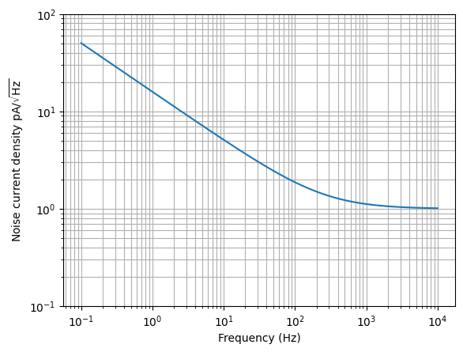

Opamp non-inverting amplifier
-----------------------------

This tutorial looks at the noise from an opamp non-inverting
amplifier.  It uses an ideal opamp with open-loop gain `A` augmented
with a voltage source representing the input-referred opamp voltage
noise, and current sources representing the input-referred opamp
current noise.

   >>> from lcapy import *
   >>> a = Circuit("""
   ... Rs 1 0; down
   ... Vn 1 2 noise; right
   ... W 2 3; right
   ... In1 2 0_2 noise; down, l=I_{n+}
   ... W 0 0_2; right
   ... In2 5 0_5 noise; down, l=I_{n-}
   ... W 5 4; right
   ... W 0_2 0_5; right
   ... W 4 6; down
   ... R1 6 0_6; down
   ... W 0_5 0_6; right
   ... R2 6 7; right
   ... W 8 7; down
   ... E 8 0 opamp 3 4 A; right
   ... W 8 9; right
   ... W 0_6 0_9; right
   ... P 9 0_9; down
   ... ; draw_nodes=connections, label_nodes=none
   ... """)
   >>> a.draw()

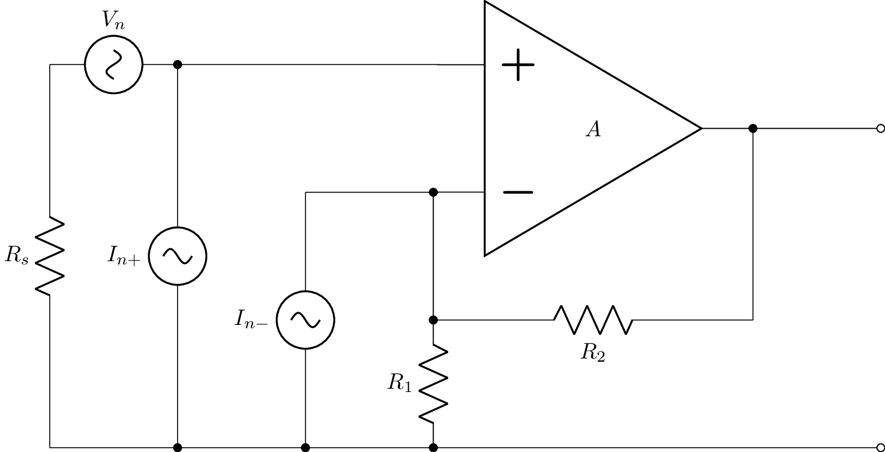

The noise ASD at the input of the opamp is

   >>> a[3].V.n
      ____________________________
     ╱    ⎛   2             ⎞    2
   ╲╱  Rₛ⋅⎝Iₙ₁ ⋅Rₛ + 4⋅T⋅k_B⎠ + Vₙ

This is independent of frequency and thus is white.  In practice, the voltage and current noise of an opamp has a 1/f component that dominates at low frequencies.

The noise at the output of the amplifier is

   >>> a[8].V.n
        _____________________________________________________
       ╱    2   2          2      2   2   2     2          2
   A⋅╲╱  Iₙ₁ ⋅Rₛ ⋅(R₁ + R₂)  + Iₙ₂ ⋅R₁ ⋅R₂  + Vₙ ⋅(R₁ + R₂)
   ──────────────────────────────────────────────────────────
                         A⋅R₁ + R₁ + R₂

Assuming an infinite open-loop gain this simplifies to

   >>> a[8].V.n.limit('A', oo)
      _____________________________________________________
     ╱    2   2          2      2   2   2     2          2
   ╲╱  Iₙ₁ ⋅Rₛ ⋅(R₁ + R₂)  + Iₙ₂ ⋅R₁ ⋅R₂  + Vₙ ⋅(R₁ + R₂)
   ────────────────────────────────────────────────────────
                              R₁

This is simply the input noise scaled by the amplifier gain :math:`1 + R_2/R_1`.

So far the analysis has ignored the noise due to the feedback resistors.   The noise from these resistors can be modelled with the `noisy()` method of the circuit object.

   >>> b = a.noisy()
   >>> b.draw()

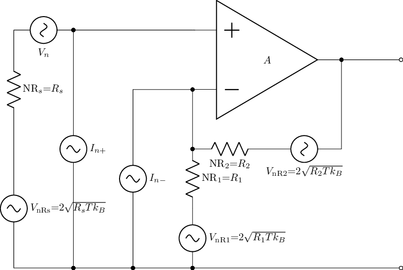

Let's choose :math:`R2 = (G - 1) R_1` where :math:`G` is the closed-loop gain of the amplifier:

   >>> c = b.subs({'R2':'(G - 1) * R1'})
   >>> c[8].V.n.limit('A', oo)

Unfortunately, this becomes unmanageable since SymPy has to assume that :math:`G` may be less than one.   So instead, let's choose :math:`G=10`,

   >>> c = b.subs({'R2':'(10 - 1) * R1'})
   >>> c[8].V.n.limit('A', oo)
      __________________________________________________________________
     ╱        2   2         2   2                                   2
   ╲╱  100⋅Iₙ₁ ⋅Rₛ  + 81⋅Iₙ₂ ⋅R₁  + 360⋅R₁⋅T⋅k_B + 400⋅Rₛ⋅T⋅k_B + 100⋅Vₙ

In practice, both noise current sources have the same ASD.  Thus

   >>> c = b.subs({'R2':'(10 - 1) * R1', 'In2':'In1'})
   >>> c[8].V.n.limit('A', oo)
      _________________________________________________________________
     ╱        2   2        ⎛     2              ⎞                     2
   ╲╱  100⋅Iₙ₁ ⋅Rₛ  + 9⋅R₁⋅⎝9⋅Iₙ₁ ⋅R₁ + 40⋅T⋅k_B⎠ + 400⋅Rₛ⋅T⋅k + 100⋅Vₙ

The noise is minimised by keeping `R1` as small as possible.  However, for high gains, the noise is dominated by the opamp noise.  Ideally, `Rs` needs to be minimised.  However, if it is large, it is imperative to choose a CMOS opamp with a low noise current.   Unfortunately, these amplifiers have a higher noise voltage than bipolar opamps.

Here's an script that shows the noise contributions due to the opamp
voltage and current noise as well as the thermal noise from the source
and amplifier resistances at 20 degrees C.

    >>> from lcapy import Circuit, sqrt, f, oo
    >>> Rs = 30
    >>> G = 1000
    >>> R1 = 100
    >>> R2 = (G - 1) * R1
    >>> Vn = 1e-9 * sqrt(3.5 / f + 1)
    >>> In = 1e-12 * sqrt(250 / f + 1)
    >>> T = 273 + 20
    >>> k_B = 1.38e-23
    >>> a = Circuit('opamp-noninverting-amplifier.sch')
    >>> an = a.noisy()
    >>> Vno = an[8].V.n(f)
    >>> Vno = Vno.limit('A', oo)
    >>> Vnov = Vno.subs({'R1':R1, 'R2':R2, 'In1':0, 'In2':0, 'Vn':Vn, 'Rs':Rs,
    ... 'k_B':k_B, 'T':0})
    >>> Vnoi = Vno.subs({'R1':R1, 'R2':R2, 'In1':In, 'In2':In, 'Vn':0, 'Rs':Rs,
    ... 'k_B':k_B, 'T':0})
    >>> Vnor = Vno.subs({'R1':R1, 'R2':R2, 'In1':0, 'In2':0, 'Vn':0, 'Rs':Rs,
    ... 'k_B':k_B, 'T':T})
    >>> Vnot = Vno.subs({'R1':R1, 'R2':R2, 'In1':In, 'In2':In, 'Vn':Vn, 'Rs':Rs,
    ... 'k_B':k_B, 'T':T})
    >>> flim = (-1, 4)
    >>> ax = (Vnot * 1e9).plot(flim, loglog=True, label='total')
    >>> ax = (Vnov * 1e9).plot(flim, loglog=True, label='Vn', axes=ax)
    >>> ax = (Vnoi * 1e9).plot(flim, loglog=True, label='In', axes=ax)
    >>> ax = (Vnor * 1e9).plot(flim, loglog=True, label='R', axes=ax)
    >>> ax.set_ylabel('Noise voltage density nV/$\sqrt{\mathrm{Hz}}$')
    >>> ax.grid(True, 'both')
    >>> ax.legend()

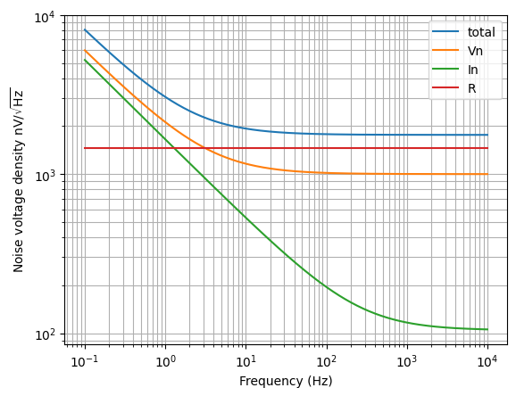

In this plot, the blue line denotes the total noise voltage ASD at the
output of the amplifier, orange shows the noise voltage ASD due to the
opamp voltage noise, green shows the noise voltage ASD due to the
opamp noise current flow the source and amplifier resistances, and the
red curve shows the noise voltage ASD due to thermal noise in the
source and amplifier resistances.  In this example, the total noise is
dominated by the thermal noise and thus lower value amplifier
resistances should be selected.

.. _annotated_schematics:

Annotated schematics
====================

Schematics can be automatically annotated with the node voltages,
component voltages, and component currents.

The following examples use this schematic

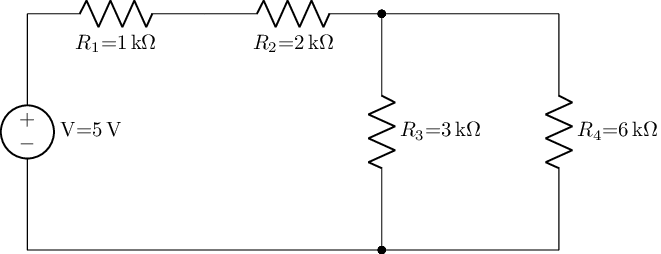

described by the netlist

.. literalinclude:: examples/tutorials/annotations/circuit1.sch

The circuit can be drawn using:

   >>> from lcapy import Circuit
   >>> cct = Circuit('circuit1.sch')
   >>> cct.draw()

.. _annotated_node_voltages:

Annotated node voltages
-----------------------

The node voltages can be annotated using the `annotate_node_voltages()` method:

   >>> cct.annotate_node_voltages().draw(draw_nodes='primary')

which produces:

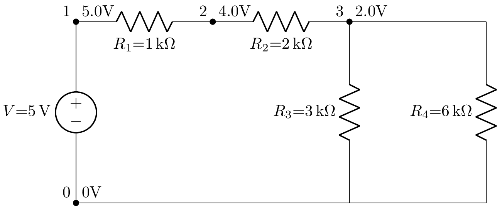

The `annotate_node_voltages()` method has a number of arguments for
selecting the nodes, the number representation, the number of digits,
units, SI prefixes, and labelling of the node voltages.  For example:

   >>> cct.annotate_node_voltages(label_voltages=True, show_units=False).draw(draw_nodes='primary')

which produces:

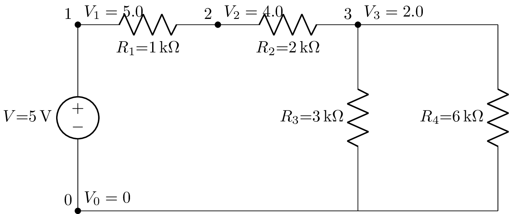

The clutter can be reduced by increasing the schematic node spacing:

   >>> cct.annotate_node_voltages(label_voltages=True, show_units=False).draw(draw_nodes='primary', node_spacing=2.5)

which produces:

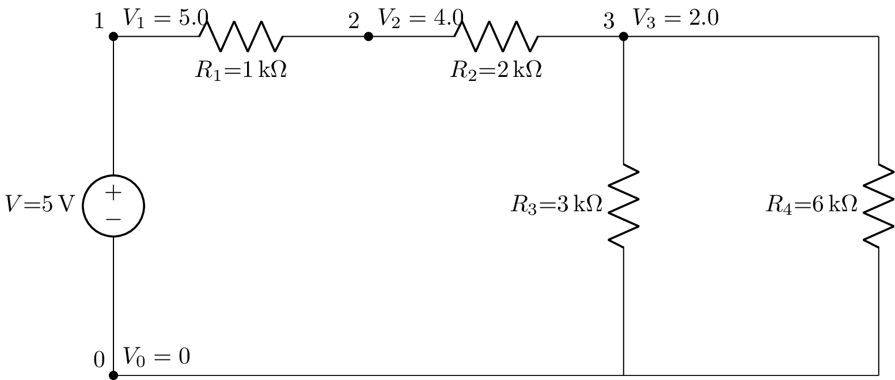

.. _annotated_voltages:

Annotated component voltages
----------------------------

The component voltages can be annotated using the `annotate_voltages()` method:

   >>> cct.annotate_voltages(('R1', 'R2', 'R3', 'R4')).draw(draw_nodes='connections')

which produces:

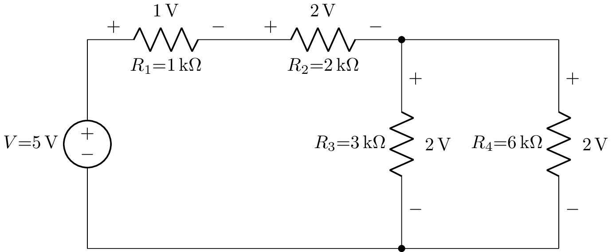

.. _annotated_currents:

Annotated component currents
----------------------------

The component currents can be annotated using the `annotate_currents()` method:

   >>> cct.annotate_currents(('R1', 'R2', 'R3', 'R4')).draw(draw_nodes='connections')

which produces:

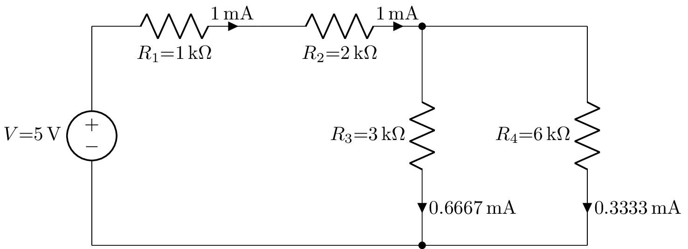

The currents can also be specified as flows using `flow=True`:

   >>> cct.annotate_currents(('R1', 'R2', 'R3', 'R4'), flow=True).draw(draw_nodes='connections')

which produces:

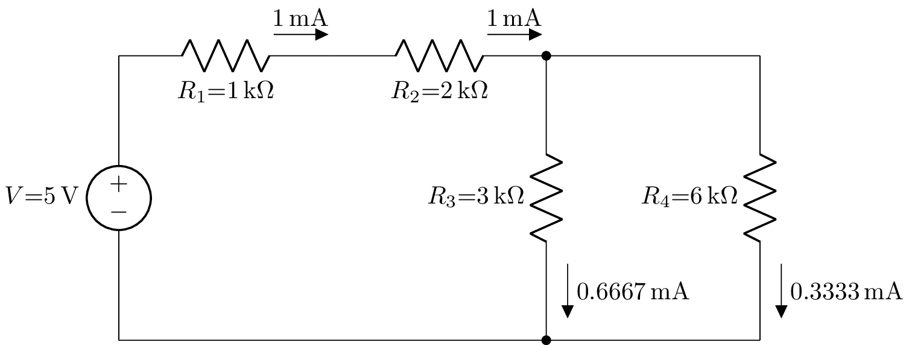

The currents can be shown as rational numbers by setting `evalf=False`.

   >>> cct.annotate_currents(('R1', 'R2', 'R3', 'R4'), evalf=False, flow=True).draw(draw_nodes='connections')

which produces:

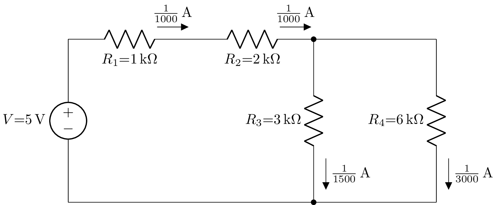

Discrete-time
=============

Simulating an analog filter
---------------------------

Consider the analog filter:

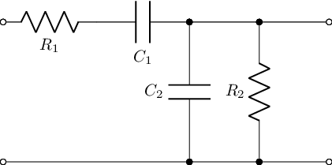

This can be described by the netlist:

.. literalinclude:: examples/tutorials/discretetime/filter1.sch

Here `P1` denotes the input port and `P2` denotes the output port.

The transfer function can be found using:

   >>> a = Circuit('filter.sch')
   >>> H = a.transfer('P1', 'P2')
   >>> H
                     ⎛  s  ⎞
                     ⎜─────⎟
                     ⎝C₂⋅R₁⎠
   ────────────────────────────────────────────
    2   s⋅(C₁⋅R₁ + C₁⋅R₂ + C₂⋅R₂)        1
   s  + ───────────────────────── + ───────────
               C₁⋅C₂⋅R₁⋅R₂          C₁⋅C₂⋅R₁⋅R₂

Let's assume that R1 = 22 ohms, C1 = 100 nF, R2 = 1 Mohm, and C2 = 1nF, thus

   >>> Hv = H.subs({'R1':22, 'C1':100e-9, 'R2':1e6, 'C2':1e-9})
   >>> Hv
                 500000000⋅s
    ──────────────────────────────────
       ⎛ 2   505011000⋅s   5000000000⎞
    11⋅⎜s  + ─────────── + ──────────⎟
       ⎝          11           11    ⎠

Note, Lcapy stores floats as rational numbers.  They can be converted to floats using the `evalf()` method.  For example,

   >>> Hv.evalf(4)
           4.545e+7⋅s
   ──────────────────────────
    2
   s  + 4.591e+7⋅s + 4.545e+8

The frequency response of the filter can be plotted using:

  >>> Hv(f).bode_plot((0, 1e3))

The transfer function can be approximated by a discrete, linear, time-invariant (DLTI) filter using the `dlti_filter()` method.  For example,

   >>> fil = H.dlti_filter()

This creates an instance of a `DLTIFilter` class with two attributes:
`a`, a tuple of the denominator coefficients, and `b`, a tuple of the
numerator coefficients.  For example,

   >>> fil.a[1]
                                          2
                     -8⋅C₁⋅C₂⋅R₁⋅R₂ + 2⋅Δₜ
   ──────────────────────────────────────────────────────────
                                                            2
   4⋅C₁⋅C₂⋅R₁⋅R₂ + 2⋅C₁⋅Δₜ⋅R₁ + 2⋅C₁⋅Δₜ⋅R₂ + 2⋅C₂⋅Δₜ⋅R₂ + Δₜ

Alternatively, using numerical values:

   >>> filv = Hv.dlti_filter()
   >>> filv.a
   ⎛                       2                            2                    ⎞
   ⎜          2500000000⋅Δₜ  - 22          1250000000⋅Δₜ  - 252505500⋅Δₜ + 11⎟
   ⎜1, ──────────────────────────────────, ──────────────────────────────────⎟
   ⎜                2                                   2                    ⎟
   ⎝   1250000000⋅Δₜ  + 252505500⋅Δₜ + 11  1250000000⋅Δₜ  + 252505500⋅Δₜ + 11⎠

Here `Δₜ` is the sampling period, represented by the symbol Lcapy `dt`.   Let's assume a sampling frequency of 1 MHz:

   >>> filv = filv.subs({dt: 1 / 1e6})
   >>> filv.a
   ⎛   -87990   -74309 ⎞
   ⎜1, ───────, ───────⎟
   ⎝   1054027   81079 ⎠
   >>> filv.b
   ⎛1000000000000     -1000000000000 ⎞
   ⎜─────────────, 0, ───────────────⎟
   ⎝   1054027            1054027    ⎠

Note, the coefficients are stored as SymPy rational numbers.  To convert them to Python floats, use the `.fval` attribute.  For example,

   >>> filv.a.fval
   (1.0, -0.08347983495678953, -0.9165011901972151)
   >>> filv.b.fval
   (948742.2997703095, 0.0, -948742.2997703095)

These coefficients can now be used in the SciPy `lfilter()` function.

Note, the symbolic response can also be found using the `response()`
method of a `DLTIFilter` object.  However, the output soon becomes
tedious for this filter.

Opamp stability
===============

Voltage follower with load capacitor
------------------------------------

Let's consider an opamp configured as a voltage follower driving a
capacitive load::

   >>> from lcapy import *
   >>> a = Circuit("""
   ... E1 1 0 opamp 2 3 A; right, mirror
   ... W 1 4; right
   ... C 4 0_1; down
   ... W 3 3_1; up=0.75
   ... W 3_1 3_2; right
   ... W 3_2 1; down
   ... W 2_1 2; right
   ... W 0 0_1; right
   ... P1 2_1 0; down""")
   >>> a.draw()

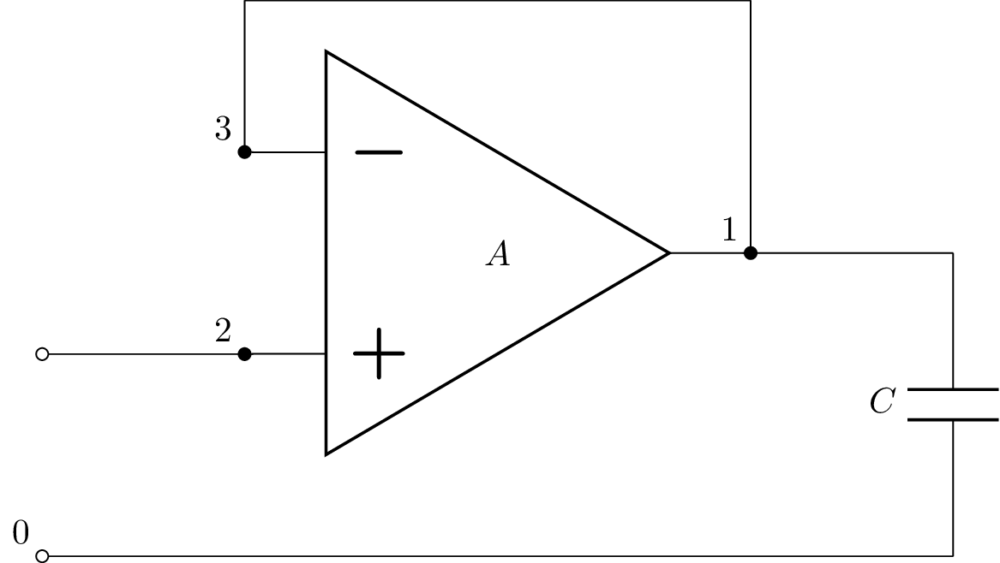

This circuit can be unstable due to the unity feedback ratio and the
pole formed by the load capacitor with the opamp's output resistance.
By default, Lcapy assumes that the opamp's output resistance is zero
but this can be modelled using the `Ro` parameter::

   >>> from lcapy import *
   >>> a = Circuit("""
   ... E1 1 0 opamp 2 3 A Ro=Ro; right, mirror
   ... W 1 4; right
   ... C 4 0_1; down
   ... W 3 3_1; up=0.75
   ... W 3_1 3_2; right
   ... W 3_2 1; down
   ... W 2_1 2; right
   ... W 0 0_1; right
   ... P1 2_1 0; down""")
   >>> a.draw()

The closed-loop transfer function of this circuit is::

  >>> H = a.transfer(2, 0, 1, 0)
  >>> H.general()
         A
   ──────────────
   A + C⋅Rₒ⋅s + 1

The open-loop transfer function can be found by cutting the connection
between the opamp output and inverting input and connecting the
inverting input to ground.  This has a netlist::

   >>> b = Circuit("""
   ... E1 1 0 opamp 2 3 A Ro=Ro; right, mirror
   ... W 1 4; right
   ... C 4 0_1; down
   ... W 3 0; down=0.25, implicit, l={0\,\mathrm{V}}
   ... W 2_1 2; right
   ... W 0 0_1; right
   ... P1 2_1 0; down""")
   >>> b.draw()

.. image:: /examples/tutorials/opamps/opamp-voltage-follower-C-load-open-loop.png
   :width: 11cm

and a transfer function::

   >>> G = b.transfer(2, 0, 4, 0)
   >>> G.general()
        A
   ──────────
   C⋅Rₒ⋅s + 1

The relationship between the closed-loop and open-loop gains for a negative feedback system is

:math:`H(s) = \frac{\beta(s) G(s)}{1 + \beta(s) G(s)}`

With a voltage-follower, :math:`\beta(s) = 1` and thus::

  >>> (G / (1 + G)).general()
         A
   ──────────────
   A + C⋅Rₒ⋅s + 1

as derived for the closed-loop gain.

Let's now assume that the opamp's open-loop response has two poles.  The Bode plot can be obtained as follows::

   >>> from lcapy import j, f, degrees, pi
   >>> f1 = 10
   >>> f2 = 1e6
   >>> A0 = 1e6
   >>> A = A0 * (1 / (1 + j * f / f1)) * (1 / (1 + j * f / f2))
   >>> ax = A.bode_plot((1, 10e6), plot_type='dB-degrees')
   >>> ax[0].set_ylim(-30, 130)
   >>> ax[1].set_ylim(-180, 0)

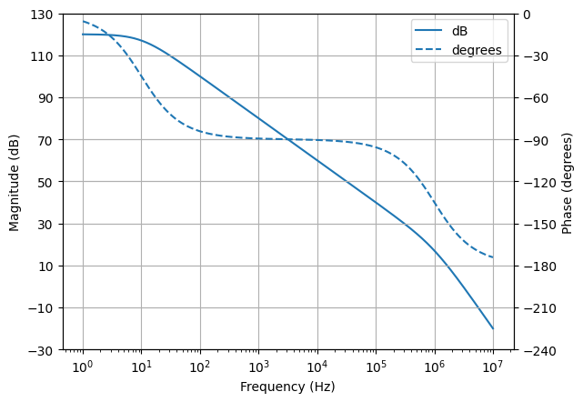

Assuming an opamp output resistance of 40 ohms and a load capacitance of 100 nF,
the overall open-loop response has a Bode plot given by::

   >>> f1 = 10
   >>> f2 = 1e6
   >>> A0 = 1e6
   >>> A = A0 * (1 / (1 + j * f / f1)) * (1 / (1 + j * f / f2))
   >>> Ro = 40
   >>> C = 100e-9
   >>> G = G.subs({'A': A, 'Ro': Ro, 'C': C})
   >>> ax = G.bode_plot((1, 10e6), plot_type='dB-degrees')
   >>> ax[0].set_ylim(-30, 130)
   >>> ax[1].set_ylim(-240, 0)

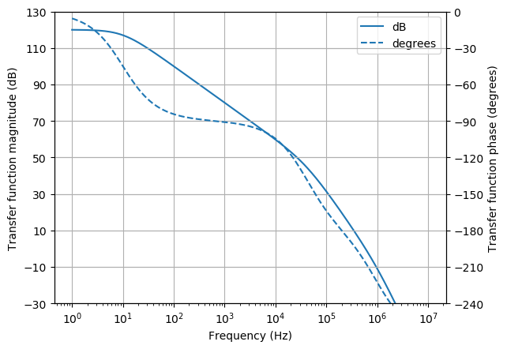

The open-loop response has three poles: two due to the opamp and one
due to the RC circuit formed by the opamp output resistance and the load capacitance::

   >>> G.poles()
   {-250000: 1, -2000000⋅π: 1, -20⋅π: 1}

The gain crossover frequency (the frequency :math:`f_g` where :math:`|L(j 2\pi f_g)|=1` and where :math:`L(j 2\pi f) = \beta(j 2\pi f) G(j 2\pi f)`) can be found using::

   >>> L = 1 * G
   >>> Labs = abs(L.subs(s, j * 2 * pi * f))
   >>> fg = (Labs**2 - 1).canonical().solve().fval[1]
   >>> fg
   585319.4316569561

There are two solutions; the negative frequency can be ignored.  Note,
the solver can be slow and a better approach is to do a numerical search::

   >>> fg = (Labs - 1).nsolve().fval
   >>> fg
   585319.4316569561

Given the gain crossover frequency the phase margin can be found,

:math:`\phi = \arg{\{L(j2\pi f_g)\}} + \pi`.

The tricky aspect here is that the phase may need unwrapping to remove
:math:`2\pi` jumps.  For this example::

   >>> Larg = L.subs(s, j * 2 * pi * f).phase
   >>> degrees(Larg).fval
   137.27909768641712

As can be seen from the Bode plot for the open-loop response, this
requires 360 degrees to be removed to unwrap the phase::

   >>> degrees(Larg).fval - 360
   -222.72090231358288

The phase margin in degrees is thus::

   >>> degrees(Larg).fval - 360 + 180
   -42.72090231358288

Ideally for stability the phase margin should be greater than 30
degrees.  In this case the phase margin is negative and the system is
unstable.

The phase crossover frequency (the frequency :math:`f_p` where :math:`\arg{\{L(j 2\pi f_p)\}}=-\pi`) can be found using::

   >>> fp = (Larg + pi).nsolve().fval
   199497.2021366

The gain margin is defined as

:math:`g = \frac{1}{|L(j 2\pi f_p)|}`

and for this example::

   >>> g = 1 / Labs(fp)
   0.10400604636858898

This corresponds to a gain margin of close to -20 dB.  Again this indicates the system is unstable.

Another approach to assess the stability of the system is to consider
the poles of the closed-loop transfer function `H(s)`.  These can
be plotted using::

   >>> H.plot()

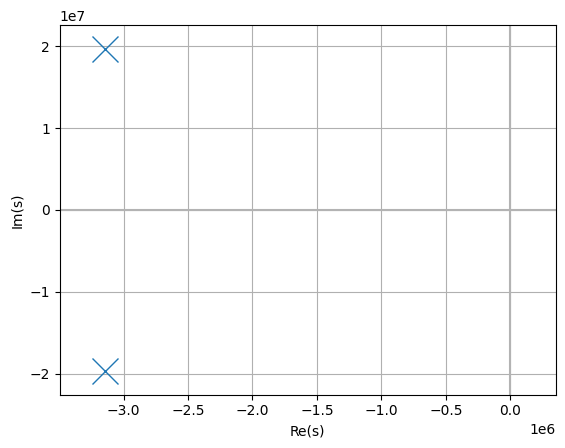

This shows a conjugate pair of poles in the right-hand plane and thus the system is unstable.

   >>> H.poles(aslist=True).cval
   [(-7911479.419503895+0j),
    (689115.6402356182-3464126.854501947j),
    (689115.6402356182+3464126.854501947j)]

   >>> H.is_stable
   False

Voltage follower with load resistor and load capacitor
------------------------------------------------------

The voltage follower with a capacitor load can be made stable by reducing the feedback ratio or adding a load resistor.  Let's consider the latter approach::

   >>> from lcapy import *
   >>> a = Circuit("""
   ... E1 1 0 opamp 2 3 A Ro=Ro; right, mirror
   ... R 1 4; right
   ... C 4 0_1; down
   ... W 3 3_1; up=0.75
   ... W 3_1 3_2; right
   ... W 3_2 1; down
   ... W 2_1 2; right
   ... W 0 0_1; right
   ... P1 2_1 0; down""")
   >>> a.draw()

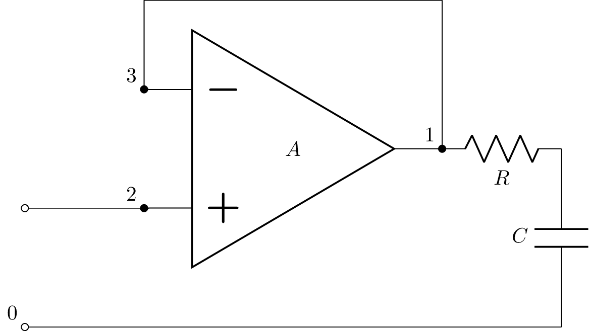

The closed-loop transfer function is::

   >>> H = a.transfer(2, 0, 4, 0)
   >>> H.general()
                A
   ──────────────────────────────
   A + s⋅(A⋅C⋅R + C⋅R + C⋅Rₒ) + 1

Assuming an opamp output resistance of 40 ohms, a load resistor of 20
ohms, and a load capacitance of 100 nF, the closed-loop transfer
function becomes::

   >>> H = H.subs({'A': A, 'Ro': 40, 'R': 20, 'C': 100e-9})
   >>> H.plot()

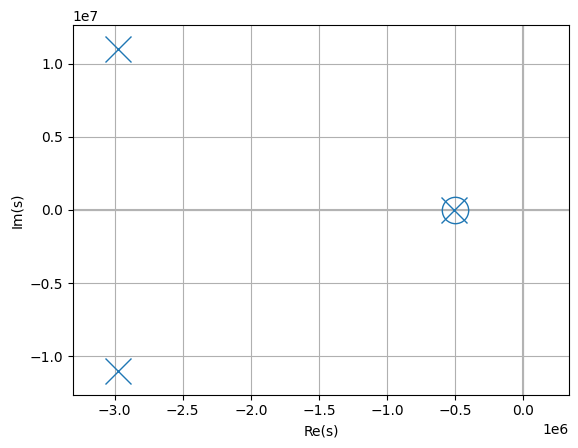

This shows all the poles in the left-hand plane and thus the system is
stable.

   >>> H.poles(aslist=True).cval
   [(-507594.2161786653+0j),
    (-2971160.29476033+10990825.587558284j),
    (-2971160.29476033-10990825.587558284j)]

   >>> H.is_stable
   True

The Bode plot for the open-loop response is:

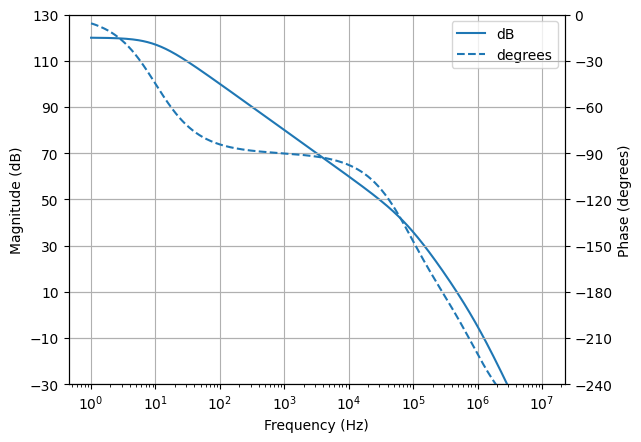

The addition of a load resistor can be seen to have improved the phase and gain margins.
